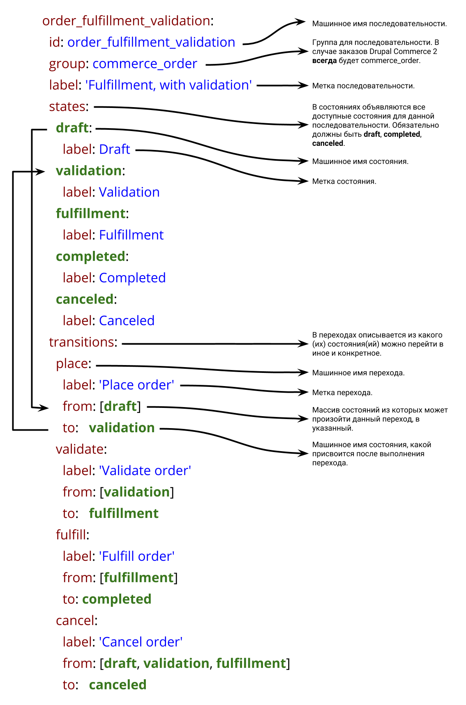
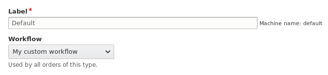
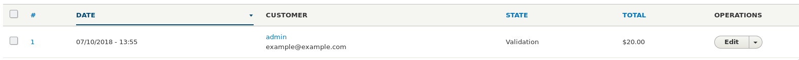
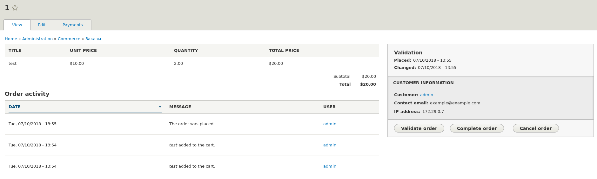
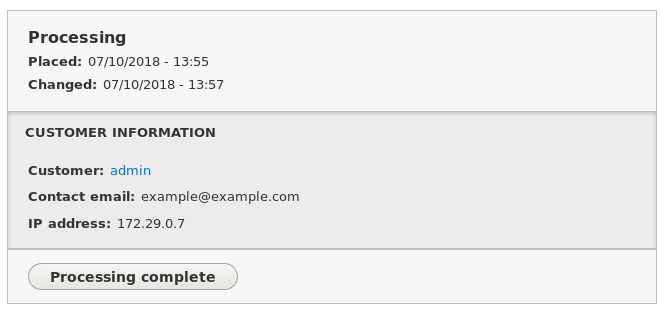
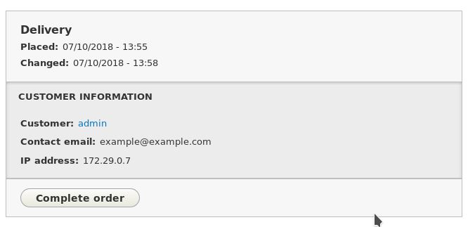
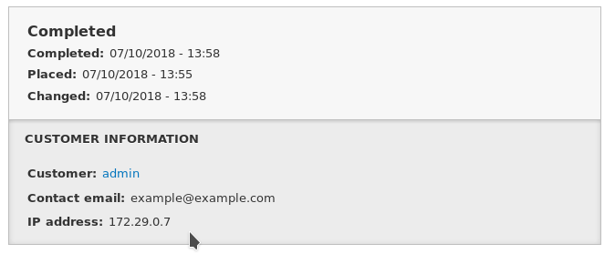
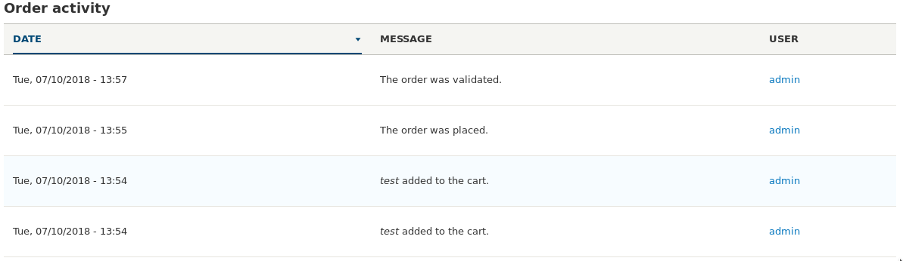
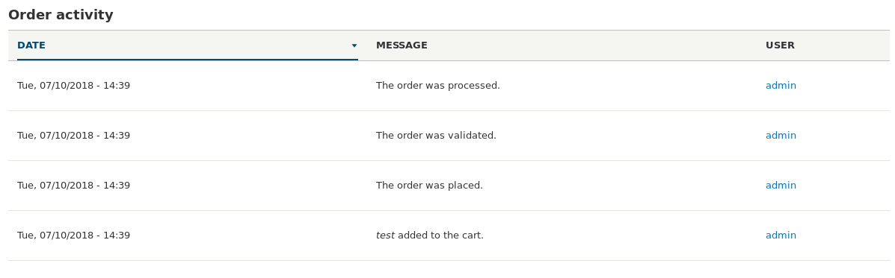

Drupal Commerce 2 позволяет задавать различные этапы жизни заказа, или, говоря
более понятным языком — статусы. В DC2 мы можем создавать различные типы
заказов, и каждый тип заказа имеет свои этапы до завершения.

Из коробки DC2 предоставляет следующие поведения для заказов:

- **Default** (по умолчанию) — соответствует названию, выбран по умолчанию для
  всех типов заказов если не выбрано иное, как и для default order type.
  - Draft (черновой)
  - Completed (завершен)
  - Canceled (отменен)
- **Default with validation** (по умолчанию с проверкой)
  - Draft (черновой)
  - Validation (проверка)
  - Completed (завершен)
  - Canceled (отменен)
- **Fullfilment**
  ([фулфилмент](https://ru.wikipedia.org/wiki/%D0%A4%D1%83%D0%BB%D1%84%D0%B8%D0%BB%D0%BC%D0%B5%D0%BD%D1%82))
  - Draft (черновой)
  - Fulfillment (фулфилмент)
  - Completed (завершен)
  - Canceled (отменен)
- **Fullfilment with validation** (фулфилмент с проверкой)
  - Draft (черновой)
  - Validation (проверка)
  - Fulfillment (фулфилмент)
  - Completed (завершен)
  - Canceled (отменен)

Данные поведения, или статусы заказов, могут покрыть большинство потребностей у
магазинов. Но иногда, могут потребоваться собственные статусы для заказов. Для
этого Drupal Commerce использует модуль State Machine. Каждый этап\статус
является состоянием и вы можете объявлять их в YAML файлике, как и их поведение.
Всё остальное сделает Drupal Commerce за вас.

Мы не будем углубляться в State Machine API, как оно работает и т.д. Возможно, я
об этом сделаю отдельные материалы. Скорее всего данный материал будет
использовать не только разработчиками, поэтому перегружать его лишним кодом не
буду.

## Структура mymodule.workflows.yml

Последовательности заказа описываются в mymodule.workflows.yml файле. У State
Machine есть ещё один файлик, mymodule.workflow_groups.yml, но он нам не нужен.
Он используется для объявления групп последовательностей, и drupal commerce уже
объявил для нас последовательность `commerce_order`, которая используется для
заказов. Всё что нам нужно, ссылаться. на неё.

Давайте для примера разберем описание последовательности заказа для
**Fullfilment with validation**.

```yml
order_fulfillment_validation:
  id: order_fulfillment_validation
  group: commerce_order
  label: 'Fulfillment, with validation'
  states:
    draft:
      label: Draft
    validation:
      label: Validation
    fulfillment:
      label: Fulfillment
    completed:
      label: Completed
    canceled:
      label: Canceled
  transitions:
    place:
      label: 'Place order'
      from: [draft]
      to:   validation
    validate:
      label: 'Validate order'
      from: [validation]
      to:   fulfillment
    fulfill:
      label: 'Fulfill order'
      from: [fulfillment]
      to: completed
    cancel:
      label: 'Cancel order'
      from: [draft, validation, fulfillment]
      to:   canceled
```

Каждый wokflow объявляется как массив, содержащий:

- `id`: Машинное имя последовательности.
- `group`: Машинное имя группы к которой относится последовательность. В нашем
  случае всегда `commerce_order`.
- `label`: Метка, будет отображаться в интерфейсе для выбора.
- `states`: Массив из состояний\статусов заказа для данной последовательности.
  Состоит из машинного имени состояния и метки.
- `transitions`: В данном разделе в виде массива описываются переходы из одного
  состояния в другой.

**states** всегда должен содержать статусы `draft`, `completed`, при возможности
отказа\отмены заказа `canceled`, так как они стандартные и мы должны между ними
и плавать. Когда пользователь положил товары в корзину, у заказа присваивается
статус `draft` (в корзине, черновик). Когда пользователь проходит все этапы
оформления заказа, статус `draft` сменяется на следующий, в соответствии с
последовательностью, которая объявлена в **transitions**. До тех пор пока статус
у заказа не станет либо `complete`, либо `cancel`.

Выходит следующая картинка: `draft` -> ... (любые другие состояния и
статусы) -> `completed` или `canceled`.

И вот между ними мы и можем описывать своё поведение.

В **states** мы задаем все возможные статусы заказа, включая обязательные в
формате массива:

- **machine_name_of_state**
  - `label`: Метка статуса\состояния. Отображается в интерфейсах.

В **transitions** мы описываем то, в какой последовательности данные статусы
должны меняться, и из какого статуса можно перейти в какой. Это также
объявляется массивом:

- **transition_name** Машинное название перехода.
  - `label`: Метка перехода. Отображается на кнопке при редактировании заказа,
    благодаря которой можно сменить статус.
  - `from`: Массив из **названий состояний\статусов** (!!! не переходов, а
    именно состояний, так как они могут называться одинакого, и сбить с толку,
    будьте аккуратны). В нем указываются те состояния из которых может быть
    произведет данный переход.
  - `to`: В какое состояние\статус будет совершено переход. Указывается одно
    значение.

Transitions **всегда должны иметь** `place` переход, из `draft`. Данный переход
вызывается Drupal Commerce когда заказ прошел все этапы оформления. То есть
выходит из `draft` состояния. Он указывает, куда заказ перейдет после завершения
его оформления.

Вот и всё. Описываете состояния, описываете переходы между ними, и всё начнет
работать!

Возвращаясь к примеру из Drupal Commerce **Fullfilment with validation**. Вот
такую "шпаргалку" сделал на его основе:



## Пример

_Далее по тексту, подразумевается что код пишется в модуле dummy._

Давайте в примере создадим свою собственную последовательность выполнения
закаказа.

- Draft (стандартный)
- **Validation** (проверка): Этап проверки заказа администраторами\менеджерами.
  Якобы наши заказы сначала должны быть подтверждены магазином.
- **Processing** (обработка): Этап обработки заказа, иными словами, подготовки.
  Подготовка продукции, упаковка и т.д.
- **Delivery** (доставка): Этап доставки заказа. Будет подразумевать, что заказ
  был передан в курьерскую службу и началось осуществление доставки заказа.
- Complete (стандартный)
- Cancel (стандартный)

Мы добавим 3 новых этапа для заказа и опишем переходы между ними.

Для этого нам потребуется создать всего 1 файл в корне модуля *
*dummy.workflows.yml**.

```yaml {"header":"dummy.workflows.yml"}
my_custom_workflow:
  id: my_custom_workflow
  group: commerce_order
  label: 'My custom workflow'
  states:
    draft:
      label: Draft
    validation:
      label: Validation
    processing:
      label: Processing
    delivery:
      label: Delivery
    completed:
      label: Completed
    canceled:
      label: Canceled
  transitions:
    place:
      label: 'Place order'
      from: [draft]
      to: validation
    validate:
      label: 'Validate order'
      from: [validation]
      to: processing
    processing_complete:
      label: 'Processing complete'
      from: [processing]
      to: delivery
    complete:
      label: 'Complete order'
      from: [draft, validation, delivery]
      to: completed
    cancel:
      label: 'Cancel order'
      from: [draft, validation]
      to: canceled
```

В этом файле мы объявили дополнительные состояния `validation`. `processing`
и `delivery`. В соответствии с нашей поставленной задачей.

В **transitions** мы описали нашу последовательность:

- `place`: Вызывается Drupal Commerce после окончания оформления заказа. Когда
  это произойдет мы устанавливаем статус заказу `validation`.
- `validate`: Этап валидации заказа. После того как заказ проверен, программно
  или менеджером нажата кнопка "Validate order" в интерфейсе, статус заказа
  меняется на `processing`.
- `processing_complete`: Данный переход осуществляется когда обработка заказа
  завершена. После чего заказ переводится в статус `delivery`.
- `complete`: Данный переход может быть осуществлён из
  состояйний `draft`, `validation`, `delivery`. Перевод заказ в статус
  завершенных.
- `cancel`: Данный переход может быть произведен на этапах `draft`
  и `validation`. Если заказа прошел валидацию и оформление заказа, мы не будем
  разрешать отменять заказ. Это значит, что если пошла подготовка заказа или его
  доставка, отменить заказ не получится.

После чего включаем модуль, или сбрасываем кэш если он уже включен и заходим в
настройки необходимого типа заказа (Commerce - Configuration - Order types) и
выбираем наш процесс оформления заказа.



После чего, все новые заказы будут следовать данной логике.

В интерфейсе управления заказом будут появляться соответствующие кнопки на
определенных этапах оформления заказа.



В списке всех заказов уже будут отображаться корректные статусы заказов.



Обратите внимание на кнопки справа под статусом заказа. Эти кнопки генерируются
автоматически исходя из нашего файла.

Как вы можете заметить, из этапа `validation` мы можем сразу подтвердить
проверку заказа, принудительно завершить заказ и отменить заказ. Так как
этап `validation` указан в `from` для
переходов `validate`, `complete`, `cancel`.

После подтверждения заказа "Validate order", его статус переходит
в `processing`.



Отсюда мы можем лишь завершить обработку. Всё в соответствии с
переходом `processing_complete`. Так как у других переходов больше нигде не
указан from `processing`, мы видим одну кнопку. Соответственно завершить заказ
или отменить его из данного состояния невозможно.

После подтверждения завершения обработки, заказ переходит в статус
доставки `delivery`.



По окончанию доставки мы можем завершить заказ.



Вот так всё просто!

## Логирование в активности заказа



Как вы можете заметить у заказов есть активность. И в неё попало что заказ
прошел все этапы оформления и одобрен. Но об остальных наших действиях там нет
никакой информации. Это потому что мы ничего об этом в заказ и не пишем.

Для этого у Drupal Commerce 2 есть модуль commerce_log, который позволяет
добавлять информацию об активности. Он также поддерживает и заказы.

Для того чтобы добавить информацию в активность, нужно
использовать [Events][drupal-8-events]. Так как у меня про это есть статья,
задерживаться на этом не будем и сразу расскажу как подключиться.

Названия событий генерируются автоматически State Machine по следующим шаблонам:

- [group].[transition key].pre_transition — вызывается перед выполнением
  перехода из одного состояния в другое.
- [group].[transition key].post_transition — вызывается после выполнения
  перехода из одного состояния в другое.

В них `[group]` заменятся на название группы, в нашем случае `commerce_order`,
а `[transition key]` на название перехода. Так как у нас названия переходов
place и validate совпали с тем что объявляет сам коммерц, поэтому записи в
активность и попадают, так как на них уже есть события. А вот
на `processing_complete` и `complete` нету. Не знаю почему нету на `complete`,
может забыли, но вот для `processing_complete` мы добавим активность.

Для того чтобы добавить лог в активность, commerce_log использует специальные
темплейты. Они объявляются в файле **mymodule.commerce_log_templates.yml**.
Также можно создавать свои собственные категории темплейтов для логов в *
*mymodule.commerce_log_categories.yml**. Но нам это не интересно. По умолчанию
там добавлны две категории `commerce_cart` и `commerce_order`. Нам нужнн второй.

Сами темплейты описывают массивом:

- название темплейта
  - `category`: Название категории темплейта.
  - `label`: Метка темплейта.
  - `template`: Темплейт. Поддерживает переменные тип `{{ var }}`, которые можно
    заменять, в случае чего. Всё как у `inline_template` рендер элемента.

Давайте добавим наш темплейт.

```yaml {"header":"dummy.commerce_log_templates.yml"}
order_processed:
  category: commerce_order
  label: 'Order processed'
  template: '<p>The order was processed.</p>'
```

После того как объявили свой темплейт, нам нужно подключиться на событие.
Учитывая что описано выше, событие будет иметь
вид `commerce_order.processing_complete.pre_transition`.

Описываем Event Subscriber

```php {"header":"src/EventSubscriber/OrderWorkflowSubscriber.php"}
<?php

namespace Drupal\dummy\EventSubscriber;

use Drupal\Core\Entity\EntityTypeManagerInterface;
use Drupal\state_machine\Event\WorkflowTransitionEvent;
use Symfony\Component\EventDispatcher\EventSubscriberInterface;

/**
 * OrderWorkflowSubscriber event subscriber.
 */
class OrderWorkflowSubscriber implements EventSubscriberInterface {

  /**
   * The log storage.
   *
   * @var \Drupal\commerce_log\LogStorageInterface
   */
  protected $logStorage;

  /**
   * Constructor for OrderWorkflowSubscriber.
   */
  public function __construct(EntityTypeManagerInterface $entity_type_manager) {
    $this->logStorage = $entity_type_manager->getStorage('commerce_log');
  }

  /**
   * {@inheritdoc}
   */
  public static function getSubscribedEvents() {
    $events = [
      'commerce_order.processing_complete.pre_transition' => ['onProcessingCompleteTransition', -100],
    ];
    return $events;
  }

  /**
   * Creates a log when an order is placed.
   */
  public function onProcessingCompleteTransition(WorkflowTransitionEvent $event) {
    /** @var \Drupal\commerce_order\Entity\OrderInterface $order */
    $order = $event->getEntity();
    $this->logStorage->generate($order, 'order_processed')->save();
  }

}
```

В нем мы:

- Получаем сервис `entity_type.manager` в конструкторе и записываем в свойство
  хранилище для сущности `commerce_log`.
- Подписываемся на событие `commerce_order.processing_complete.pre_transition`
  указывая метод `onProcessingCompleteTransition()` в качестве колбека.
- В методе `onProcessingCompleteTransition()` получаем объект события. Из него
  получаем сущность заказа. И генерируем log для полученной сущности, из
  темплейта `order_processed`, после чего сохраняем получившуюся сущность.

Затем объявляем наш Event Subscriber в сервисах, чтобы друпал нашел его.

```yml {"header":"dummy.services.yml"}
services:
  dummy.order_workflow_subscriber:
    class: Drupal\dummy\EventSubscriber\OrderWorkflowSubscriber
    arguments: ['@entity_type.manager']
    tags:
      - { name: event_subscriber }
```

Сбрасываем кэш, выполняем новые заказы. Теперь, после
перехода `processing_complete` у нас добавиться запись в активность заказа из
нашего темплейта `order_processed`.



[drupal-8-events]: ../../../../2018/04/10/drupal-8-events/index.ru.md
