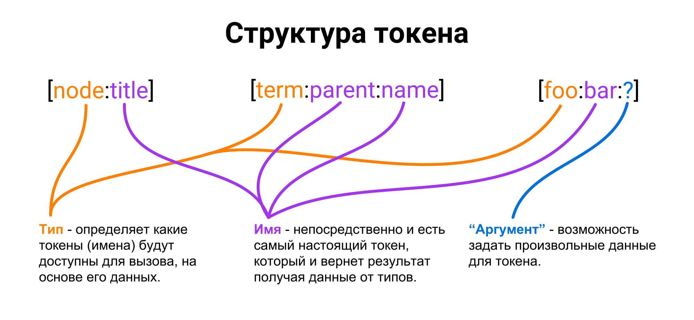

**Токены** — это обычные плейсхолдеры определенного формата внутри строки,
которые заменяются на значения.

**Для чего нужны токены?** Назначений может быть уйма. Как правило, они
используются в тех местах, где нужна какая-то динамика в зависимости от
контекста. Что-то типа переменных в строках. В Drupal они активно используются
для генерации алиасов URL ([pathauto](https://www.drupal.org/project/pathauto)),
мета-тегов ([metatag](https://www.drupal.org/project/metatag)), различных
сообщений для email, в настройках, где нужны динамика и много чего другого.

Область их применения очень широкая. Если в строковом значении нужна динамика,
но писать код там нет возможности (читай админка), например в тексте — это
задача для токенов. Или, например, для описания категории товаров, где токен
будет возвращать минимальную цену товара из категории: "Купить OpenSource код
от [term:lowest-price]", где `[term:lowest-price]` может, например, замениться
вашим кодом на "100 руб.", а на выходе будет "Купить OpenSource код от 100 руб".
СЕОшникам понравится ?.

? **Токены — API ядра**. Данная возможность находится в ядре, и не требует
установки модуля [Token](https://www.drupal.org/project/token). То есть, всё что
будет описано и показано в данной статье с программной стороны, не требует
установки данной зависимости! Данный модуль лишь добавляет собственные токены и
приятный интерфейс для того что реализовано в ядре. Его лучше, конечно,
поставить, но не забывайте, что всё что здесь будет реализовано, его никак не
касается, так как все хуки и сервис из ядра.

**Как выглядят токены?** Токены являются обычными строками, и могут состоять
только из себя, или же находиться внутри других строк и сосчитать столько
токенов, сколько угодно. Выглядят они примерно следующим
образом: `[node:title]`, `[term:name]` или даже `[term:parent:name]`.

Не путайте токены с BBCode и другими конструкциями в квадратных кавычках.


**Как отличить токен?**:

* Токены не парные.
* Токены разделяют свою последовательность двоеточием `:`.
* Токены состоят из двух и более частей.

**Результатом** работы токена всегда (в конечном итоге) будет какая-то строка.
Если токен не смог замениться на значение, он выведется как есть (если это
поведение не переопределено при вызове замены).

## Структура токенов

Токены состоят из последовательности определенных строковых значений,
разделенных двоеточием (`:`). Как минимум, у каждого токена их будет две.

У каждого токена есть тип (группа) и название токена: `[$type:$name]`,
например `[node:name]`. Название токена может содержать в себе
последовательность токенов.
Например `[$type:$name:$name]` => `[term:parent:name]`. Таким образом, токены
позволяют делать цепочку вызова переходя от одного типа токена к другому. Такая
цепочка может быть очень длинной, до тех пор, пока она удовлетворяет требованиям
вызываемых токенов: `[term:parent:parent:parent:name]`.

Также существуют динамические токены `[$type:$name:?]`, где вместо `?`
подставляется какое-то значение, своего рода аргумент токену `$name`,
типа `$type`.

Тип (группа), определяет, какие будут доступны токены `$name`. А имя токена,
определяет, что вернет данный токен.

Я не знаю насколько это корректно, но у меня почему-то проводится **аналогия**:
тип - объект, а имена - его методы. Если абстрагироваться от ООП. "Объект",
может вызвать "метод", который возвращает либо новый "объект" со своими "
методами", либо результат. Но в итоге, все заканчивается на "методе".



## Замена токенов на значения

Замена токенов на значения производится при помощи
сервиса `token` (`\Drupal::token()` для легаси кода).

От данного сервиса вам нужен лишь метод `replace()`, который принимает следующие
аргументы:

* `$text`: Строка, которая содержит (не обязательно) токены, которые необходимо
  заменить.
* `$data`: (опционально) Массив со значениями для токенов. Передавайте туда
  значения, которые у вас имеются и для них возможно есть токены. Например node,
  user и ещё что-то. Значения данного аргумента будут сильно зависеть и
  варьироваться от того, где вызывается `replace()`, какая у него цель, какие
  токены ожидаются и т.д. Не все токены требуют данные, но если не уверены,
  передавайте всё что может оказаться полезным. Некоторые могут заменяться и без
  дополнительной информации. Для полного понимания, лучше изучить как работают
  токены.
* `$options`: (опционально) Массив с настройками для управления заменой токенов.

  * `langcode`: Код языка для которого генерируются значения токенов.
  * `callback`: Колбек функция для постобработки массива токенов полученных из
    строки.
  * `clear`: Если `TRUE`, все токены, которые не получили значения для себя,
    будут удалены из строки. По умолчанию `FALSE` — токены останутся в сыром
    виде.

* `$bubbleable_metadata`: (опционально)
  Экземпляр `\Drupal\Core\Render\BubbleableMetadata` с информацией о кэшировании
  и зависимостях. Токены будут добавлять в него свои зависимости. Если вы как-то
  планируете возвращать результат работы данной замены в render array, то не
  забудьте применить все полученные данные о зависимостях и кэше обратно через
  объект (`BubbleableMetadata::applyTo($render_array)`). Если вы не предоставите
  свой экземпляр, то будет создан внутренний и применен для текущего контекста
  рендера.

```php {"header":"Примеры"}
$token_service = \Drupal::token();

// Example 1.
$string = 'Current URL is [site:url]';
// e.g.: Current URL is https://example.com
$token_service->replace($string);

// Example 2.
$string = 'You are reading [node:title].';
// You are reading [node:title].
$token_service->replace($string);
// You are reading .
$token_service->replace($string, [], ['clear' => TRUE]);
// You are reading Node title.
$token_service->replace($string, ['node' => $node])

// Example 3.
$bubbleable_metadata = new BubbleableMetadata();
$build = [
  '#markup' => $token_service->replace('Tokens: [node:nid] [current-user:uid]', ['node' => $node], [], $bubbleable_metadata);
];
$bubbleable_metadata->applyTo($build);
```

## Создание собственных токенов

Для создания собственных токенов существует два хука:

* `hook_token_info()`: Собирает всю информацию о токенах и их типах.
* `hook_tokens()`: Производит замену токенов на значения.

Также есть два хук альтера: `hook_token_info_alter()` и `hook_tokens_alter()`.
При помощи данных хуков вы можете поменять поведение уже существующих токенов.

Данные хуки могут объявляться в собственном файле `MODULENAME.tokens.inc`,
который должен лежать в корне модуля. И это предпочтительный вариант, чтобы их
код не мешался с остальным.

### hook_token_info()

Данный хук предоставляет информацию о всех токенах и их типах (группах).

В качестве результата он возвращается ассоциативный массив с объявленными
токенами и типами в конкретном хуке. Внешний массив может состоять из двух
компонентов `types` и `tokens`:

* `types`: Ассоциативный массив с описанием типов (групп) токенов, где ключ -
  название группы, а его значение - описание. Каждый тип также является
  ассоциативным массивом состоящим из:

  * `name`: Название группы для людей.
  * `description`: (опционально) Описание группы.
  * `needs-data`: (опционально) Тип данных, который необходимо предоставлять для
    данной группы токенов в `Token::replace()` при помощи `$data` аргумента.
    Например, если `needs-data` = `some_data`, то передается данное значение
    следующим образом: `Token::replace($string, ['some_data' => $data])`.
    Например, если группе требуется объект ноды, то можно указать `node`, как
    это сделано в стандартных группах. Вы можете требовать данные, которые
    требуют и другие группы.

* `tokens`: Ассоциативный массив с описанием токенов, где ключ - название
  группы, к которой принадлежат данные токены, а значение - массив с описанием
  токенов. Каждый токен является ассоциативным массивом со следующими
  значениями:

  * `name`: Название токена для людей.
  * `description`: (опционально) Описание токена.
  * `type`: (опционально) Тип данных (`needs-data`), который отдает данный
    токен. Иными словами, если задано, то данный токен будет возвращать
    указанный тип данных, а для него (его типа) будут вызываться его токены.
    Используется для создания последовательных токенов [type:name:name:name].
    Иными словами, данный токен может принять на себя роль определенного типа (
    группы) и продолжать цепочку.

Пример

```php {"header":"Пример"}
/**
 * Implements hook_token_info().
 */
function hook_token_info() {
  $type = [
    'name' => t('Nodes'),
    'description' => t('Tokens related to individual nodes.'),
    'needs-data' => 'node',
  ];

  // Core tokens for nodes.
  $node['nid'] = [
    'name' => t("Node ID"),
    'description' => t("The unique ID of the node."),
  ];

  // Chained tokens for nodes.
  // This token return token of type `user` and will look
  // for tokens for group user. And e.g. node:author will have
  // tokens from user group, such as node:author:name where is
  // name - token for group user.
  $node['author'] = [
    'name' => t("Author"),
    'type' => 'user',
  ];

  return [
    'types' => ['node' => $type],
    'tokens' => ['node' => $node],
  ];
}
```

### hook_tokens()

Данный хук вызывается в момент вызова `Token::replace()`. Он пытается произвести
замену токена на значение.

Хук принимает следующие аргументы:

* `$type`: Тип (группа) токена, который пытается заменится.
  Например `node`, `user`.
* `$tokens`: Массив токенов, которые необходимо заменить на значения. Ключи буду
  содержать название токена, а значение - его сырую строку с полным токеном.
  Например: `'title' => '[node:title]'`.
* `$data`: Массив с данными (`needs-data`) для токена. Например, для
  типа `node`, там должен находиться объект ноды `$data['node']`.
* `$bubbleable_metadata`: Объект для сбора зависимостей токенов. Для токенов с
  последовательностью `type:type:name`, замена происходит немного иначе, через
  очередной аналог вызова `replace()`, и не забывайте его передавать туда, чтобы
  он и оттуда подцепил все зависимости.

Данный хук должен вернуть массив с заменами для токенов, либо пустой массив,
если замен не произошло.

```php
/**
 * Implements hook_tokens().
 */
function hook_tokens($type, $tokens, array $data, array $options, \Drupal\Core\Render\BubbleableMetadata $bubbleable_metadata) {
  $token_service = \Drupal::token();

  $replacements = [];

  if ($type == 'node' && !empty($data['node'])) {
    /** @var \Drupal\node\NodeInterface $node */
    $node = $data['node'];

    foreach ($tokens as $name => $original) {
      switch ($name) {
        // Simple key values on the node.
        case 'nid':
          $replacements[$original] = $node->nid;
          break;

        // Default values for the chained tokens handled below.
        case 'author':
          $account = $node->getOwner() ? $node->getOwner() : User::load(0);
          $replacements[$original] = $account->label();
          $bubbleable_metadata->addCacheableDependency($account);
          break;
      }
    }

    if ($author_tokens = $token_service->findWithPrefix($tokens, 'author')) {
      $replacements += $token_service->generate('user', $author_tokens, ['user' => $node->getOwner()], $options, $bubbleable_metadata);
    }
  }

  return $replacements;
}
```

Всё очень просто. Вы проверяете, пришел ли нужный вам тип токена, а также, если
он нуждается в данных, на месте ли они.

Если условия проходят, вам достаточно пройтись по циклу и заменить токены на их
значения. Делается это путем вставки в результативный массив нового значение,
где ключ - исходный токен, а его значение - на что токен заменится.

Допустим у нас есть токен `[node:nid]` (см. выше). Мы проверяем условия и всё
ок, в массиве `$tokens` будет `'nid' => '[node:nid]'`. Мы хотим заменить
токен `nid` и поэтому ищем в массиве данный ключ. Когда находим, задаем значение
в результативный массив `$replacements['[node:nid]'] = 'Token value!'`. Как вы
можете заметить выше, удобнее всего это делать через `foreach` и `switch`.

Если у вас там подгружаются какие-то зависимости (сущности, конфигурации), не
забудьте добавить их в `$bubbleable_metadata`, смотрите выше пример
для `[node:author]`.

Если ваш токен имеет значение `type`, то в таком случае, простая замена токена,
например `[node:author]` — будет значением по умолчанию, если цепочку дальше не
используют. Также вам необходимо попытаться вызывать замену для токенов с
цепочкой, например `[node:author:name]`. Поиск таких токенов производится при
помощи `Token::findWithPrefix($tokens, 'author')`, а затем они передаются на
обработку `Token::generate($type, $tokens, $data, $options, $bubbleable_metadata)`.
По сути это цикличный вызов `hook_tokens()`.

### Больше разьяснений про токены с цепочкой

Возьмем в качестве примера следующий токен с цепочкой `[node:author:name]`.
Допустим, ваш токен в нем это `author`, у которого стоит тип `user`.

В случае примера, в `$tokens` придет `author:name`, он не пройдет логику с
циклом и switch для значения по умолчанию, которое ожидает `author`. В данном
случае цикл + свитч будут использоваться, если пользователь
вызовет `[node:author]`, то есть без цепочки, и в массиве будет `author` и
замена легко найдется. Но нам пришел `author:name` и цикл со свитчем прошли
мимо, что же делать?

Для этого мы пробуем определить, является ли данный токен с последовательностью
при помощи `Token::findWithPrefix($tokens, 'author')`. Данный вызов попытается
найти в текущих токенах наш токен `author`, с любым другим токеном. Грубо
говоря, он будет искать его как `[author:name]`, наш токен, в таком случае,
станет чем-то вроде группы токенов, на основе его `type`. А на основе `type`,
друпал сможет найти другие токены для данного типа, например `name`, `uid` и
т.д. То есть, для понимания, друпал превратит `[author:name]` в `[user:name]` (
где `user` = `type` токена `author`).

Если он вам вернул массив с найденными токенами для такой комбинации, вам нужно
передать его
в `Token::generate($type, $tokens, $data, $options, $bubbleable_metadata)`, где
тип токенов к которым он относится. Так как у нас author имеет type user, то мы
точно знаем что и дочерние токены нужны от него, в `$tokens` уже нужно передать
тот массив, что вернул `Token::findWithPrefix()`, а не тот что пришел
в `hook_tokens()`, не забудьте и передать данные, соответствующие данному типу,
далее все аналогично `Token::replace()`.

А теперь вариант объясняющий это пошагово:

1. Вызывается замена для `[node:author:name]`, где `author` - ваш токен для
   группы `node`, которому указан `type` = `user`.
2. Drupal определяет, что тип токена - `node`, а сам токен `author:name`.
3. Вызывает доступные реализации `hook_token()` передавая в `$type` - `node`, а
   в `$tokens` массив со значением `'author:name' => '[node:author:name]'`.
4. Вы, при помощи `$author_tokens = Token::findWithPrefix($tokens, 'author')`
   получаете массив с токенами состоящих из `author:SOMETHING`, в нашем случае
   он найдет `author:name`. В таком случае массив будет
   содержать `'name' => '[node:author:name]'`.
5. После чего вы
   вызываете `Token::generate($type, $author_tokens, $data, $options, $bubbleable_metadata)` (
   обратите внимание на название 2 аргумента), куда передаете `$type` = `user` (
   как и тип вашего токена), массив с найденными токенами в пункте 4, а
   в `$data` вы должны передать объект пользователя, и прочие аргументы с
   аналогичным поведением как у `Token::replace()`.
6. Он заново вызовет все реализации `hook_token()`, только в этот раз `$type`
   уже будет `user` и `$tokens` из пункта 4. Тут уже сработает `hook_tokens()`
   который отвечает за `$type == 'user'`. Он найдет в цикле свой токен `name` и
   заменит `[node:author:name]` на своё значение. Так получится результат. Он
   вернет вам массив со своими значениями, которые нужно добавить в текущий.

## Модуль Token

Как я уже писал, данный модуль не обязателен, но он может вам сильно помочь в
работе с токенами и их созданием.

Я настоятельно рекомендую вам его поставить, а затем перейти на страницу
Справка - Token (/admin/help/token). Там будут показаны все доступные типы и их
токены. Вы сможете наблюдать как ведут себя ваши токены, а также узнать, какие
уже имеются ;)

## Примеры

Пример будет одним, но разбит на несколько частей. По сути, их можно
рассматривать как самобытные примеры, но они в дальнейшем будут связываться с
предыдущими и не работать без реализации предыдущего или корректировки.

Все примеры подразумевают что код пишется в модуле dummy.

**Не пугайтесь** кол-ва кода ниже в примерах. На самом деле его не так много. Я
просто намеренно копирую куски кода с примерами из предыдущих частей, чтобы
подсвечивать то что было вставлено и куда.

## Часть 1

Начнем мы с того, что объявим свой токен `title-reverse` для типа (группы)
токенов `node`. То есть, например, наш токен можно будет вызвать
так `[node:title-reverse]`. Данный токен будет просто переворачивать
заголовок `node` и это и будет результатом.

Первым делом объявим наш токен при помощи `hook_token_info()`.

```php {"header":"dummy.tokens.inc"}
<?php

/**
 * @file
 * File for custom token hooks.
 */

use Drupal\node\NodeInterface;

/**
 * Implements hook_token_info().
 */
function dummy_token_info() {
  $node['title-reverse'] = [
    'name' => t('Title reversed'),
    'description' => t('Reverse title of the node.'),
  ];

  return [
    'tokens' => ['node' => $node],
  ];
}
```

Мы создали массив `$node`, чтобы отличать для какого типа данный токен. Название
токена мы указали в ключе массива, а в его значении название для людей и
описание.

Затем мы возвращаем данный токен в ассоциативном массиве `tokens`, указывая
ключ `node` (тип\группа) и присваивая ему наш массив `$node` с токеном.

Токен объявлен! Теперь нам необходимо сделать так, чтобы он работал и возвращал
результат. В этом деле нам поможет `hook_tokens()`. Давайте опишем:

```php {"header":"dummy.tokens.inc"}
use Drupal\Core\Render\BubbleableMetadata;

...

/**
 * Implements hook_tokens().
 */
function dummy_tokens($type, $tokens, array $data, array $options, BubbleableMetadata $bubbleable_metadata) {
  $replacements = [];

  if ($type == 'node' && !empty($data['node'])) {
    /** @var \Drupal\node\NodeInterface $node */
    $node = $data['node'];

    foreach ($tokens as $name => $original) {
      switch ($name) {
        case 'title-reverse':
          $replacements[$original] = strrev($node->label());
          break;
      }
    }
  }

  return $replacements;
}
```

В хуке мы определяем, что тип хука `node`, так как для него мы и объявляли наш
токен, попутно проверяя, передали ли с ним объект материала. Если нет, мы ничего
делать не будем, так как у нас просто не будет хватать данных.

Далее бежим по циклу `$tokens` и пытаемся найти наш токен `'title-reverse'`, и
если нашли, добавляем значение для него в результативный массив `$replacements`,
где в качестве ключа мы задаем `$original` - то, что заменяем, а значение - то,
на что заменяем.

Сбрасываем кэш.

Если вы зайдете на страницу справки токенов вы увидите что он там появился в
разделе "Материал" (node - тип\группа), куда мы его и добавляли.


Теперь вы сможете его использовать где есть поддержка токенов, либо
самостоятельно вызывать это программно. Например, в модуле Metatag.


## Часть 2

Теперь давайте добавим два похожих токена `next-node` (
пример `[node:next-node]`) и `previous-node` (пример `[node:previous-node]`).

Данные токены будут возвращать следующий и предыдущий материал, если такие
имеются, относительно того, от которого вызвано. Для данных токенов нам уже
потребуется указать `type` равным `node`, так как наш токен также будет
возвращать ноду, и нам пригодятся токены от типа `node`. Данная опция позволит
пользователям использовать токены для `node` после нашего токена. Если бы мы не
указывали тут `type`, то, например `[node:next-node]`, отдавал бы только
заголовок (или то что вы напишите), но указав, что `next-node` содержит
результат `node` и может его передать дальше, пользователи смогут вызывать такие
конструкции `[node:next-node:title]` или даже
такие `[node:next-node:next-node:title]`. То есть токен поймет, что результат
работы нашего токена, может быть обработан как тип `node` и применить на него
токены от данного типа.

Начнем мы нашу работу над этими двумя токенами издалека. Нам потребуются
функции, благодаря которым мы сможем получать предыдущую или следующую ноду. Мы
не будем писать данную логику прямо в `dummy_tokens()` по двум причинам:

1. Это облегчит восприятие и понимание `dummy_tokens()`. А может и пригодится в
   дальнейшем где-то. Но как минимум, наш код станет намного читабельнее.
2. Так как мы объявляем сейчас токен с возможной цепочкой последующих токенов,
   то нам придется задавать значение по умолчанию, если просто
   вызвали `[node:next-node]` или `[node:previous-node]`, если вызвали,
   например `[node:next-node:title]`, то нам придется
   вызывать `Token::findWithPrefix()`. То есть логика для стандартного значения
   и токена с цепочкой будут немного в разных местах. А следовательно, код для
   получения предыдущей и следующей ноды будет дублироваться дважды и будет
   абсолютно идентичным, а это
   уже [WET](https://ru.wikipedia.org/wiki/Don%E2%80%99t_repeat_yourself), что
   не есть хорошо.

Данные функции для получения следующей и предыдущей ноды мы напишем в
dummy.module, для того, чтобы в дальнейшем, для другой логики их также можно
было использовать в любом месте, а не только для токенов. Также мы назовем
функции начиная с нижнего подчеркивания `_name`, это для того, чтобы другие
разработчики понимали, что эти функции являются внутренними для данного модуля,
и не подразумевают их использования за его пределами и могут изменяться для
своих задач.

```php {"header":"dummy.module"}
<?php

use Drupal\node\NodeInterface;

/**
 * @file
 * Main file for custom hooks and functions.
 */

/**
 * Trying to find next node of the same type.
 *
 * @param \Drupal\node\NodeInterface $node
 *   A current node object.
 *
 * @return \Drupal\node\NodeInterface|null
 *   Next node object or NULL if not found.
 */
function _dummy_find_next_node(NodeInterface $node) {
  $result = &drupal_static(__FUNCTION__ . $node->id());

  if (!isset($result)) {
    $result = NULL;
    $node_storage = \Drupal::entityTypeManager()->getStorage('node');

    $next_nid = $node_storage->getQuery()
      ->condition('type', $node->bundle())
      ->condition('created', $node->getCreatedTime(), '>')
      ->range(0, 1)
      ->sort('created', 'ASC')
      ->execute();

    if (count($next_nid) && $next_node = $node_storage->load(reset($next_nid))) {
      $result = $next_node;
    }
  }

  return $result;
}

/**
 * Trying to find previous node of the same type.
 *
 * @param \Drupal\node\NodeInterface $node
 *   A current node object.
 *
 * @return \Drupal\node\NodeInterface|null
 *   Previous node object or NULL if not found.
 */
function _dummy_find_previous_node(NodeInterface $node) {
  $result = &drupal_static(__FUNCTION__ . $node->id());

  if (!isset($result)) {
    $result = NULL;
    $node_storage = \Drupal::entityTypeManager()->getStorage('node');

    $prev_nid = $node_storage->getQuery()
      ->condition('type', $node->bundle())
      ->condition('created', $node->getCreatedTime(), '<')
      ->range(0, 1)
      ->sort('created', 'DESC')
      ->execute();

    if (count($prev_nid) && $prev_node = $node_storage->load(reset($prev_nid))) {
      $result = $prev_node;
    }
  }

  return $result;
}
```

Данные функции возвращают, либо объект ноды, если она нашлась, либо `NULL`, если
ничего не нашлось.

Далее объявим два наших токена в уже существующем `dummy_token_info()`.

```php {"highlighted_lines":"10:20","header":"dummy.tokens.inc"}
/**
 * Implements hook_token_info().
 */
function dummy_token_info() {
  $node['title-reverse'] = [
    'name' => t('Title reversed'),
    'description' => t('Reverse title of the node.'),
  ];

  $node['title-string'] = [
    'name' => t('Title string'),
    'description' => t('Title passed to my_custom_type tokens.'),
    'type' => 'my_custom_type',
  ];

  $node['next-node'] = [
    'name' => t('Next node'),
    'description' => t('Next node of the same type (bundle).'),
    'type' => 'node',
  ];

  return [
    'tokens' => ['node' => $node],
  ];
}
```

После чего займемся установкой значений для наших двух новых токенов, используя
только что созданные две функции.

```php {"highlighted_lines":"5,18:24,26:32,36:42,44:50","header":"dummy.tokens.inc"}
/**
 * Implements hook_tokens().
 */
function dummy_tokens($type, $tokens, array $data, array $options, BubbleableMetadata $bubbleable_metadata) {
  $token_service = \Drupal::token();
  $replacements = [];

  if ($type == 'node' && !empty($data['node'])) {
    /** @var \Drupal\node\NodeInterface $node */
    $node = $data['node'];

    foreach ($tokens as $name => $original) {
      switch ($name) {
        case 'title-reverse':
          $replacements[$original] = strrev($node->label());
          break;

        case 'next-node':
          $next_node = _dummy_find_next_node($node);
          if ($next_node) {
            $replacements[$original] = $next_node->label();
            $bubbleable_metadata->addCacheableDependency($next_node);
          }
          break;

        case 'previous-node':
          $prev_node = _dummy_find_previous_node($node);
          if ($prev_node) {
            $replacements[$original] = $prev_node->label();
            $bubbleable_metadata->addCacheableDependency($prev_node);
          }
          break;
      }
    }

    // [node:next-node] chained token.
    if ($next_node_tokens = $token_service->findWithPrefix($tokens, 'next-node')) {
      if ($next_node = _dummy_find_next_node($node)) {
        $bubbleable_metadata->addCacheableDependency($next_node);
        $replacements += $token_service->generate('node', $next_node_tokens, ['node' => $next_node], $options, $bubbleable_metadata);
      }
    }

    // [node:previous-node] chained token.
    if ($prev_node_tokens = $token_service->findWithPrefix($tokens, 'previous-node')) {
      if ($prev_node = _dummy_find_previous_node($node)) {
        $bubbleable_metadata->addCacheableDependency($prev_node);
        $replacements += $token_service->generate('node', $prev_node_tokens, ['node' => $prev_node], $options, $bubbleable_metadata);
      }
    }
  }

  return $replacements;
}
```

Рассмотрим изменения сверху-вниз:

1. Первым делом мы записали сервис токена в
   переменную `$token_service = \Drupal::token();`. В дальнейшем нам уже
   потребуются его методы, так что сразу и для всех дальнейших.
2. В цикле `foreach` со `switch` мы задаем значения по умолчанию для токенов
   вида `[node:next-node]` и `[node:previous-node]`.

   a. В них мы обращаемся к нашим функциям для получения следующей или
   предыдущей ноды относительно текущей, от группы где вызван токен.

   b. Если нода не найдена, мы просто ничего не делаем, токен останется на
   месте. Но если нода найдена, мы записываем её заголовок в значение и
   добавляем как зависимость для токенов.

3. После циклов мы пишем два идентичных конструкции. Одна для следующей ноды, а
   другая до предыдущей. Отличия у них в названиях функций и токенов, поэтому
   логика одна.

   a. В условии мы сразу пытаемся найти вложенные токены
   типа `[node:previous-node:SOMETHING]` (`previous-node:SOMETHING`) при
   помощи `Token::findWithPrefix()`, передавая ему текущий набор токенов что
   пришел нам на обработку, и интересующая часть токена. Если он их находит, то
   заполнит массив, если нет, то условие не пройдет и пропустится - значит таких
   токенов нет.

   b. Если всё же нашел их, мы пробуем получить следующую или предыдущую ноду,
   соответственно. Если не нашлось - опять, пропускаем, токен остается
   неизменным.

   c. Если нода нашлась, мы добавляем зависимость и
   используем `Token::generate()` для вызова очередных `hook_tokens()`, чтобы
   найденный `previous-node:SOMETHING` обработался как
   токен `[previous-node:SOMETHING]`.

  * Так как мы будем передавать туда ноду, мы указываем что нас интересуют
    токены для типа `node`, передавая это в первом аргументе.
  * Во втором аргументе мы передаем все найденные токены для нашей цепочки, а не
    те что пришли нашему токену. То есть массив с результатом
    работы `Token::findWithPrefix()`.
  * В третьем аргументе мы передаем данные для указанного нами типа в первом
    аргументе. Так как мы указали что нам нужны токены типа `node`, то и
    передаем ему `needs-data` `node`. В нашем случае это найденный объект
    предыдущей или следующей ноды.
  * В опциях можно ничего не менять и передать текущие.
  * Также передаем текущий `$bubbleable_metadata`, чтобы, если токены сработают,
    они также добавили свои зависимости в общий пул зависимостей.

   d. Результат работы `Token::generate()` (массив) мы соединяем с нашим текущим
   результатом.

Вот и всё! Можно пользоваться. Теперь можно писать даже
так `[node:next-node:title-reverse]`.

На странице всех токенов можно будет наблюдать как он срастается с другими
токенами ;)


## Часть 3

Теперь для примера мы сделаем нечто похожее на то что сделали в "Часть 2". Мы
создадим токен `node` для токенов типа `random` — `[random:node]`. То есть, мы
добавим токен уже немного в другую группу, а сам токен будет возвращать
случайную ноду, а следовательно, мы сделаем его таким, чтобы он мог продолжать
цепочку вызова, например `[random:node:next-material:title]`.

Как и во второй части, нам потребуется функция, чтобы облегчить восприятие кода
и не повторять большие куски кода. Для этого мы добавим в dummy.module новую
функцию, которая и будет получать случайную ноду.

```php {"header":"dummy.module"}
/**
 * Load random node.
 *
 * @return \Drupal\node\NodeInterface
 *   A node object of random node.
 */
function _dummy_random_node() {
  $node_storage = \Drupal::entityTypeManager()->getStorage('node');

  $query = \Drupal::database()->select('node_field_data', 'n');
  $query->addField('n', 'nid');
  $query->condition('n.status', NodeInterface::PUBLISHED)
    ->range(0, 1)
    ->orderRandom();

  $nid = $query->execute()->fetchField();

  return $node_storage->load($nid);
}
```

Первым делом объявим токен, не забывая о том, что новый токен будет принадлежать
другому типу токенов.

```php {"highlighted_lines":"22:26,31","header":"dummy.tokens.inc"}
/**
 * Implements hook_token_info().
 */
function dummy_token_info() {
  $node['title-reverse'] = [
    'name' => t('Title reversed'),
    'description' => t('Reverse title of the node.'),
  ];

  $node['next-node'] = [
    'name' => t('Next node'),
    'description' => t('Next node of the same type (bundle).'),
    'type' => 'node',
  ];

  $node['previous-node'] = [
    'name' => t('Previous node'),
    'description' => t('Previous node of the same type (bundle).'),
    'type' => 'node',
  ];

  $random['node'] = [
    'name' => t('Random node'),
    'description' => t('Return random published node.'),
    'type' => 'node',
  ];

  return [
    'tokens' => [
      'node' => $node,
      'random' => $random,
    ],
  ];
}
```

Объявление для вас уже должно быть знакомо, просто обратите внимание на то, что
новый массив с новым токеном мы передаем в соответствующую группу токенов.

Далее, все что нам остается, добавить логику его замены.

```php {"highlighted_lines":"53:72","header":"dummy.tokens.inc"}
/**
 * Implements hook_tokens().
 */
function dummy_tokens($type, $tokens, array $data, array $options, BubbleableMetadata $bubbleable_metadata) {
  $token_service = \Drupal::token();
  $replacements = [];

  if ($type == 'node' && !empty($data['node'])) {
    /** @var \Drupal\node\NodeInterface $node */
    $node = $data['node'];

    foreach ($tokens as $name => $original) {
      switch ($name) {
        case 'title-reverse':
          $replacements[$original] = strrev($node->label());
          break;

        case 'next-node':
          $next_node = _dummy_find_next_node($node);
          if ($next_node) {
            $replacements[$original] = $next_node->label();
            $bubbleable_metadata->addCacheableDependency($next_node);
          }
          break;

        case 'previous-node':
          $prev_node = _dummy_find_previous_node($node);
          if ($prev_node) {
            $replacements[$original] = $prev_node->label();
            $bubbleable_metadata->addCacheableDependency($prev_node);
          }
          break;
      }
    }

    // [node:next-node] chained token.
    if ($next_node_tokens = $token_service->findWithPrefix($tokens, 'next-node')) {
      if ($next_node = _dummy_find_next_node($node)) {
        $bubbleable_metadata->addCacheableDependency($next_node);
        $replacements += $token_service->generate('node', $next_node_tokens, ['node' => $next_node], $options, $bubbleable_metadata);
      }
    }

    // [node:previous-node] chained token.
    if ($prev_node_tokens = $token_service->findWithPrefix($tokens, 'previous-node')) {
      if ($prev_node = _dummy_find_previous_node($node)) {
        $bubbleable_metadata->addCacheableDependency($prev_node);
        $replacements += $token_service->generate('node', $prev_node_tokens, ['node' => $prev_node], $options, $bubbleable_metadata);
      }
    }
  }

  if ($type == 'random') {
    foreach ($tokens as $name => $original) {
      switch ($name) {
        case 'node':
          if ($random_node = _dummy_random_node()) {
            $replacements[$original] = $random_node->label();
            $bubbleable_metadata->addCacheableDependency($random_node);
          }
          break;
      }
    }

    // [random:node] chained token.
    if ($random_node_tokens = $token_service->findWithPrefix($tokens, 'node')) {
      if ($random_node = _dummy_random_node()) {
        $bubbleable_metadata->addCacheableDependency($random_node);
        $replacements += $token_service->generate('node', $random_node_tokens, ['node' => $random_node], $options, $bubbleable_metadata);
      }
    }
  }

  return $replacements;
}
```

Пошли сверху-вниз по вновь добавленным строкам кода:

1. Первым делом, мы проверяем что пришел интересующий нас тип токена `random`.
2. Идем по циклу токенов, ищем наш новый токен `node` в формате
   вызова `[random:node]`. Если нашли, то грузим случайную ноду, устанавливаем
   её заголовок как значение и не забываем про добавление зависимости кэшу.
3. После цикла пытаемся найти вызовы с цепочкой, например `[random:node:nid]`.
   Если нашли, грузим случайную ноду, добавляем зависимость и передаем на
   обработку токенам для типа `node`.

Все уже должно быть знакомо из предыдущих примеров, этот, для закрепления и
напоминания, что токены можно добавлять не только в `node` :) И не обязательно
обработка токенов про ноды должна начинаться с `node`.


## Часть 4

В этой части мы добавим новый тип (группу) токенов.

Для этого, объявим свой массив с типом и на этом всё.

```php {"highlighted_lines":"28:32,35","header":"dummy.tokens.inc"}
/**
 * Implements hook_token_info().
 */
function dummy_token_info() {
  $node['title-reverse'] = [
    'name' => t('Title reversed'),
    'description' => t('Reverse title of the node.'),
  ];

  $node['next-node'] = [
    'name' => t('Next node'),
    'description' => t('Next node of the same type (bundle).'),
    'type' => 'node',
  ];

  $node['previous-node'] = [
    'name' => t('Previous node'),
    'description' => t('Previous node of the same type (bundle).'),
    'type' => 'node',
  ];

  $random['node'] = [
    'name' => t('Random node'),
    'description' => t('Return random published node.'),
    'type' => 'node',
  ];
  
  $my_custom_type = [
    'name' => t('My custom type'),
    'description' => t('Custom token processors.'),
    'needs-data' => 'my_custom_type',
  ];

  return [
    'types' => ['my_custom_type' => $my_custom_type],
    'tokens' => [
      'node' => $node,
      'random' => $random,
    ],
  ];
}
```

Мы назвали нашу группу My custom type, а также указали, что данная группа может
обрабатывать `needs-data`. То есть, если какой-то токен по цепочке укажет, что
он хочет передать свой токен в обработку нашему типу, то все токены из нашего
типа активизируются. Если `needs-data` не указывать, то группу будет
самодостаточной `[my_custom_type:SOMETHING]`, как, например, `site` и `random`.
Мы не можем вызвать `random` токены где-то в цепочке токенов `node`, так как у
них нет `needs-data` и вызвать их там не выйдет. Мы оставим такую возможность
для будущих примеров.


## Часть 5

Теперь мы добавим в нашу только что созданную группу два новых токена `strlen`,
который будет динамическим и считать длину переданной в него строки, а
также `uppercase`, обычный, для синергии и будущего примера, который будет
переводить значение в верхний регистр.

`strlen` будет динамическим, это значит, что он будет вызываться
как `[my_custom_type:strlen:?]`, где вместо знака вопроса можно передавать
значение!

Начнём мы это с уже привычного объявления токенов :)

```php {"highlighted_lines":"34:38,40:43,50","header":"dummy.tokens.inc"}
/**
 * Implements hook_token_info().
 */
function dummy_token_info() {
  $node['title-reverse'] = [
    'name' => t('Title reversed'),
    'description' => t('Reverse title of the node.'),
  ];

  $node['next-node'] = [
    'name' => t('Next node'),
    'description' => t('Next node of the same type (bundle).'),
    'type' => 'node',
  ];

  $node['previous-node'] = [
    'name' => t('Previous node'),
    'description' => t('Previous node of the same type (bundle).'),
    'type' => 'node',
  ];

  $random['node'] = [
    'name' => t('Random node'),
    'description' => t('Return random published node.'),
    'type' => 'node',
  ];

  $my_custom_type = [
    'name' => t('My custom type'),
    'description' => t('Custom token processors.'),
    'needs-data' => 'my_custom_type',
  ];

  $my_custom_type_tokens['strlen'] = [
    'name' => t('String length'),
    'description' => t('Number characters in string.'),
    'dynamic' => TRUE,
  ];

  $my_custom_type_tokens['uppercase'] = [
    'name' => t('Uppercase string'),
    'description' => t('Cast string to uppercase.'),
  ];

  return [
    'types' => ['my_custom_type' => $my_custom_type],
    'tokens' => [
      'node' => $node,
      'random' => $random,
      'my_custom_type' => $my_custom_type_tokens,
    ],
  ];
}
```

Всё знакомо, только мы указали `strlen` токену что он динамический.

Теперь напишем их обработчики:

```php {"highlighted_lines":"74:95","header":"dummy.tokens.inc"}
/**
 * Implements hook_tokens().
 */
function dummy_tokens($type, $tokens, array $data, array $options, BubbleableMetadata $bubbleable_metadata) {
  $token_service = \Drupal::token();
  $replacements = [];

  if ($type == 'node' && !empty($data['node'])) {
    /** @var \Drupal\node\NodeInterface $node */
    $node = $data['node'];

    foreach ($tokens as $name => $original) {
      switch ($name) {
        case 'title-reverse':
          $replacements[$original] = strrev($node->label());
          break;

        case 'next-node':
          $next_node = _dummy_find_next_node($node);
          if ($next_node) {
            $replacements[$original] = $next_node->label();
            $bubbleable_metadata->addCacheableDependency($next_node);
          }
          break;

        case 'previous-node':
          $prev_node = _dummy_find_previous_node($node);
          if ($prev_node) {
            $replacements[$original] = $prev_node->label();
            $bubbleable_metadata->addCacheableDependency($prev_node);
          }
          break;
      }
    }

    // [node:next-node] chained token.
    if ($next_node_tokens = $token_service->findWithPrefix($tokens, 'next-node')) {
      if ($next_node = _dummy_find_next_node($node)) {
        $bubbleable_metadata->addCacheableDependency($next_node);
        $replacements += $token_service->generate('node', $next_node_tokens, ['node' => $next_node], $options, $bubbleable_metadata);
      }
    }

    // [node:previous-node] chained token.
    if ($prev_node_tokens = $token_service->findWithPrefix($tokens, 'previous-node')) {
      if ($prev_node = _dummy_find_previous_node($node)) {
        $bubbleable_metadata->addCacheableDependency($prev_node);
        $replacements += $token_service->generate('node', $prev_node_tokens, ['node' => $prev_node], $options, $bubbleable_metadata);
      }
    }
  }

  if ($type == 'random') {
    foreach ($tokens as $name => $original) {
      switch ($name) {
        case 'node':
          if ($random_node = _dummy_random_node()) {
            $replacements[$original] = $random_node->label();
            $bubbleable_metadata->addCacheableDependency($random_node);
          }
          break;
      }
    }

    // [random:node] chained token.
    if ($random_node_tokens = $token_service->findWithPrefix($tokens, 'node')) {
      if ($random_node = _dummy_random_node()) {
        $bubbleable_metadata->addCacheableDependency($random_node);
        $replacements += $token_service->generate('node', $random_node_tokens, ['node' => $random_node], $options, $bubbleable_metadata);
      }
    }
  }

  if ($type == 'my_custom_type') {
    if (!empty($data['string'])) {
      foreach ($tokens as $name => $original) {
        switch ($name) {
          case 'uppercase':
            $replacements[$original] = strtoupper($data['string']);
            break;
            
          case 'strlen':
            $replacements[$original] = strlen($data['string']);
            break;
        }
      }
    }

    // [my_custom_type:strlen:?].
    if ($strlen_tokens = $token_service->findWithPrefix($tokens, 'strlen')) {
      foreach ($strlen_tokens as $string => $original) {
        $replacements[$original] = strlen($string);
      }
    }
  }

  return $replacements;
}
```

Идем сверху-вниз, по уже знакомым конструкциям:

1. Отлавливаем наш тип токенов.
2. Так как `uppercase` токен самый обычный, мы его пытаемся найти в цикле и
   переводим строку в верхний регистр, если нашлось. Подразумевая что строка в
   него будет передана через `$data['my_custom_type']` (`needs-data`). Если
   данного значения не передали с токеном, он даже не будет заходить в цикл.
3. Мы также в цикле обрабатываем значение по умолчанию для `strlen`, если
   аргумент не передан, а вызван как обычный токен.
4. Далее мы обрабатываем `strlen` с динамическим значением. Динамическое
   значение ищется как и последовательные токены, только результат не передается
   никуда, а прогоняется циклом и обрабатывается. То есть любое значение
   следующее за `strlen` будет переданном нам. Так,
   например `[my_custom_type:strlen:all:other:chains:not:work]` вернет длину
   этой части — `all:other:chains:not:work`.


## Часть 6

Это последний пример, и он для закрепления материала.

Мы добавим токен `title-string` для типа токенов `node`. Но укажем, что данный
токен имеет наш собственный тип `my_custom_type`. Это значит, что через него,
будут доступны токены нашего типа `uppercase` и `strlen`.

Давайте добавлять

```php {"highlighted_lines":"22:26","header":"dummy.tokens.inc"}
/**
 * Implements hook_token_info().
 */
function dummy_token_info() {
  $node['title-reverse'] = [
    'name' => t('Title reversed'),
    'description' => t('Reverse title of the node.'),
  ];

  $node['next-node'] = [
    'name' => t('Next node'),
    'description' => t('Next node of the same type (bundle).'),
    'type' => 'node',
  ];

  $node['previous-node'] = [
    'name' => t('Previous node'),
    'description' => t('Previous node of the same type (bundle).'),
    'type' => 'node',
  ];

  $node['title-string'] = [
    'name' => t('Title string'),
    'description' => t('Title passed to my_custom_type tokens.'),
    'type' => 'my_custom_type',
  ];

  $random['node'] = [
    'name' => t('Random node'),
    'description' => t('Return random published node.'),
    'type' => 'node',
  ];

  $my_custom_type = [
    'name' => t('My custom type'),
    'description' => t('Custom token processors.'),
    'needs-data' => 'my_custom_type',
  ];

  $my_custom_type_tokens['strlen'] = [
    'name' => t('String length'),
    'description' => t('Number characters in string.'),
    'dynamic' => TRUE,
  ];

  $my_custom_type_tokens['uppercase'] = [
    'name' => t('Uppercase string'),
    'description' => t('Cast string to uppercase.'),
  ];

  return [
    'types' => ['my_custom_type' => $my_custom_type],
    'tokens' => [
      'node' => $node,
      'random' => $random,
      'my_custom_type' => $my_custom_type_tokens,
    ],
  ];
}
```

И пишем его обработчик!

```php {"highlighted_lines":"34:36,57:59","header":"dummy.tokens.inc"}
/**
 * Implements hook_tokens().
 */
function dummy_tokens($type, $tokens, array $data, array $options, BubbleableMetadata $bubbleable_metadata) {
  $token_service = \Drupal::token();
  $replacements = [];

  if ($type == 'node' && !empty($data['node'])) {
    /** @var \Drupal\node\NodeInterface $node */
    $node = $data['node'];

    foreach ($tokens as $name => $original) {
      switch ($name) {
        case 'title-reverse':
          $replacements[$original] = strrev($node->label());
          break;

        case 'next-node':
          $next_node = _dummy_find_next_node($node);
          if ($next_node) {
            $replacements[$original] = $next_node->label();
            $bubbleable_metadata->addCacheableDependency($next_node);
          }
          break;

        case 'previous-node':
          $prev_node = _dummy_find_previous_node($node);
          if ($prev_node) {
            $replacements[$original] = $prev_node->label();
            $bubbleable_metadata->addCacheableDependency($prev_node);
          }
          break;

        case 'title-string':
          $replacements[$original] = $node->label();
          break;
      }
    }

    // [node:next-node] chained token.
    if ($next_node_tokens = $token_service->findWithPrefix($tokens, 'next-node')) {
      if ($next_node = _dummy_find_next_node($node)) {
        $bubbleable_metadata->addCacheableDependency($next_node);
        $replacements += $token_service->generate('node', $next_node_tokens, ['node' => $next_node], $options, $bubbleable_metadata);
      }
    }

    // [node:previous-node] chained token.
    if ($prev_node_tokens = $token_service->findWithPrefix($tokens, 'previous-node')) {
      if ($prev_node = _dummy_find_previous_node($node)) {
        $bubbleable_metadata->addCacheableDependency($prev_node);
        $replacements += $token_service->generate('node', $prev_node_tokens, ['node' => $prev_node], $options, $bubbleable_metadata);
      }
    }

    // [node:title-string].
    if ($title_string_tokens = $token_service->findWithPrefix($tokens, 'title-string')) {
      $replacements += $token_service->generate('my_custom_type', $title_string_tokens, ['my_custom_type' => $node->label()], $options, $bubbleable_metadata);
    }
  }

  if ($type == 'random') {
    foreach ($tokens as $name => $original) {
      switch ($name) {
        case 'node':
          if ($random_node = _dummy_random_node()) {
            $replacements[$original] = $random_node->label();
            $bubbleable_metadata->addCacheableDependency($random_node);
          }
          break;
      }
    }

    // [random:node] chained token.
    if ($random_node_tokens = $token_service->findWithPrefix($tokens, 'node')) {
      if ($random_node = _dummy_random_node()) {
        $bubbleable_metadata->addCacheableDependency($random_node);
        $replacements += $token_service->generate('node', $random_node_tokens, ['node' => $random_node], $options, $bubbleable_metadata);
      }
    }
  }

  if ($type == 'my_custom_type') {
    if (!empty($data['my_custom_type'])) {
      foreach ($tokens as $name => $original) {
        switch ($name) {
          case 'uppercase':
            $replacements[$original] = mb_strtoupper($data['my_custom_type']);
            break;

          case 'strlen':
            $replacements[$original] = strlen($data['my_custom_type']);
            break;
        }
      }
    }

    // [my_custom_type:strlen:?].
    if ($strlen_tokens = $token_service->findWithPrefix($tokens, 'strlen')) {
      foreach ($strlen_tokens as $string => $original) {
        $replacements[$original] = strlen($string);
      }
    }
  }

  return $replacements;
}
```

В случае вызова `[node:title-string]`, он вернет значение заголовка, но теперь
нам доступны следующие варианты (включая все те токены что зарегистрировали
раньше):

* `[node:title-string:strlen]`: Вернет длину заголовка.
* `[node:title-string:uppercase]`: Вернет заголовок в верхнем регистре.
* `[random:node:next-node:title-string:strlen]`: Вернет длину заголовка,
  следующего материала, который идет после случайно выбранного материала! ?


Таки всё! Токены не такие страшные, статья длинная, потому что, как вы можете
заметить, код в примерах наращивается, сохраняя предыдущий, так что тут очень
много повторов, но для наглядности как оно наращивается, думаю тут уместно.

## Ссылки

- [Исходный код модуля с примером](example/dummy)
