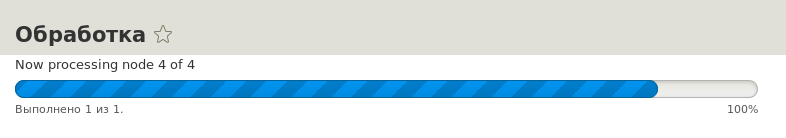
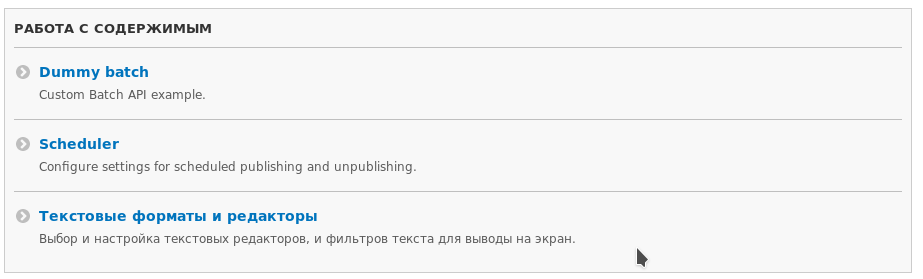
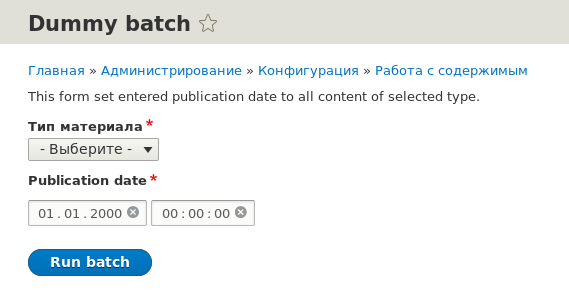

**Batch API** — API для пакетной обработки данных в больших, и не очень,
объемах. А также для неопределенного количества данных, например материалов,
которые со временем растут в количестве.

Batch API построен поверх [Queue API][drupal-8-queue-api], и по сути, является его
полным аналогом, с тем лишь отличием, что предназначен для UI. Если Queue API,
как правило, выполняется в фоне, то Batch API создает свой Queue и выполняет его
после запуска, отображая прогресс выполнения операции.



У меня уже есть материалы ([раз][drupal-8-custom-csv-import],
[два][d8-csv-import-optimization]) с примерами использования Batch API. Если вы
их читали, я рекомендую ознакомиться с материалов все равно. Так как тут описан
более оптимальный и производительный способ обработки большого кол-ва данных.
Даже быстрее того что показан в материале про ускорение импорта ?.

В Drupal 8.6+ Batch API можно объявлять при помощи ООП, для этого был добавлен
объект `\Drupal\Core\Batch\BatchBuilder`. И материал будет опираться именно на
него.

## Как задаются и работают Batch операции

Batch операции задаются при помощи массив и нескольких функций:

* `batch_set($batch)`: В качестве аргумента передается массив `$batch` с
  описанием батч операций. Добавляет конкретный Batch в БД и запускает его
  обработку, если вызван из submit формы. То есть, если вызывается в методе
  успешной отправки любой формы при помощи Form API, то Form API сам
  вызовет `batch_process()`.
* `batch_process()`: Запускает обработку batch операции. Вызывается **только**
  когда запуск батча осуществляется не в момент отправки формы. Принимает
  следующие аргументы:

- `$redirect`: (опционально) `\Drupal\Core\Url` или строку с путем, куда
  переадресовать пользователя после успешного завершения операций.
- `$url`: (опционально) URL страницы с обработкой batch. Используется только для
  самостоятельных скриптов, типа update.php.
- `$redirect_callback`: (опционально) Колбек который будет вызван для
  переадресации на страницу обработчик.

Если вам пришлось вызывать `batch_process()`, то задавайте `$redirect`, в
подавляющем большинстве задач этого хватит за глаза. **Обратите внимание**, что
если не задать `$redirect`, при вызове `batch_process()`, то batch может уйти в
бесконечный цикл по окончанию операций.

? **Памятка.** В Batch можно
указывать [callable функции](http://www.php.net/manual/ru/language.types.callable.php).
Данные значения могут принимать два вида значений:

* Строку с названием функции для вызова. Всё просто,
  например `my_custom_function`.
* Массив из двух аргументов:

  - Неймспейс объекта или его экземпляр.
  - Название метода этого объекта.

В реалиях Drupal 8, второй вариант очень востребован, и не стоит забывать о
такой особенности.

С запуском всё ясно, но откуда брать этот самый `$batch` для запуска?

**Batch задача** описывается в виде массива и передается в `batch_set($batch)`.
Для описания данного массива очень сильно может
пригодиться `\Drupal\Core\Batch\BatchBuilder`.

Давайте рассмотрим его методы:

* `setTitle($title)`: Задает заголовок операции. По
  умолчанию: `new TranslatableMarkup('Processing')`.
* `setInitMessage($message)`: Сообщение отображаемое в момент инициализации
  обработки. По умолчанию: `new TranslatableMarkup('Initializing.')`.
* `setProgressMessage($message)`: Сообщение по умолчанию, отображаемое в ходе
  выполнения операции. По
  умолчанию: `new TranslatableMarkup('Completed @current of @total.')`. В данном
  аргументе поддерживаются плейсхолдеры для замены:

  - `@current`: Номер текущей операции в обработке.
  - `@remaining`: Кол-во операций ожидающих обработку.
  - `@total`: Общее кол-во операций на выполнение.
  - `@percentage`: Процентное значение обработанных операций. От 0 до 100.
  - `@estimate`: Предположительное время выполнения.
  - `@elapsed`: Затраченное время на выполнение операций.

* `setErrorMessage($message)`: Сообщение, выводимое если произошла ошибка в ходе
  выполнения какой-либо операции.
* `setFile($filename)`: Путь до файла, который должен быть подгружен для
  выполнения Batch операции. Путь должен быть относительным относительно
  базового пути сайта. Тут нужно указать файл, где находится логика обработчиков
  операций.
* `setLibraries(array $libraries)`: Массив с библиотеками Drupal, которые должны
  быть подключены на странице прогресса выполнения операций.
  Например: `['core/jquery', 'core/drupal']`.
* `setUrlOptions(array $options)`: Опции для Url, который будет использован для
  редиректа.
* `setProgressive(TRUE)`: Указывает что Batch будет выполняться в несколько
  запросов. Если установить в `FALSE`, батч будет пытаться выполнить все
  операции в пределах одного запроса.
* `setQueue($name, $class)`: Позволяет заменить очередь для Batch. `$class`
  должен быть `\Drupal\Core\Queue\Batch` для progressive батча
  или `\Drupal\Core\Queue\BatchMemory`.
* `addOperation(callable $callback, array $arguments = [])`: Добавляет операции
  в очередь Batch операции.

  - `$callback`: Что будет вызвано для обработки данной операции.
  - `$arguments`: Аргументы, которые будут переданы в `$callback`. Каждый
    элемент массив = 1 аргумент в `$callback`.

* `setFinishCallback(callable $callback)`: Колбек, который будет вызван после
  завершения операций, но до редиректа. **Пометка.** Если вы хотите
  переопределить редирект из данного места, то в колбек функции должен
  возвращаться `RedirectResponse`.
* `toArray()`: Метод, который возвращает массив с описанием Batch для дальнейшей
  передачи в `batch_set()`.

В завершающий колбек, установленный при помощи `setFinishCallback()` придут три
аргумента:

* `$success`: Булевое значение, завершился ли батч успешно или нет.
* `$results`: Значение из `$context['results']`.
* `$operations`: Если `$success` = `FALSE`, то в данном массиве будет список
  операций, которые не прошли обработку.

## Обработка операций

Обработка операций производится при помощи функций\методов, которые были указаны
при вызове `addOperation()`. В указанный колбек приходят все переданные
аргументы, а также по ссылке массив `$context`, в котором содержится
мета-информация, и в котором, можно хранить различную информацию в пределах
одной Batch задачи (не важно какая операция).

Массив `$context` содержит следующую информацию:

* `results`: Массив с результатами работы операций. Туда складывается информация
  из колбека операции самим разработчиком. Вы можете добавлять туда информацию о
  том, какие материалы обновились и т.д.
* `sandbox`: Массив для хранения данных между итерациями в ходе выполнения
  конкретной операции. Данный массив рекомендуется использовать
  вместо `$_SESSION`, так как он будет подвержен влиянию если пользователь в
  других вкладках продолжит пользоваться сайтом в момент выполнения операций.
* `finished`: Число с плавающей точкой (float) обозначающее, завершилась ли
  текущая операция или нет. Позволяет делать прогресс внутри операции, если она
  выполняется в несколько вызовов. 0 - 0%, 0.5 - 50%, 1 - 100% - операция будет
  считаться завершенная и будет вызвана следующая операция из очереди.

Есть множество вариантов обработки батч операций, но мы рассмотрим два самых
важных.

### 1 задача - 1 операция

Данный подход к обработке батча самый стандартный. То есть, вы добавляете каждый
элемент, который необходимо обработать в список операций индивидуально.

За примерами далеко ходить не
нужно - [мой материал про импорт из csv][drupal-8-custom-csv-import]. В нём мы
парсим CSV файл, и каждую строку добавляем на обработку через `addOperation()`.
То есть, на каждую строку будет своя собственная операция и вызов.

**Плюсы**:

* Прост для написания, прост для понимания.

**Минусы**:

* Batch хранит всё что нужно для своего выполнения в виде сериализованных данных
  в БД. Каждая операция увеличивает объем данных, хоть и незначительно при
  небольших объемах, так как также хранит что вызвать, какие аргументы
  передаются и их значения. Например, в примере с CSV, всё работает очень быстро
  при кол-ве строк до 1000, при 10000 уже начинаются серьезные тормоза. Так как
  хранится 10000 операций с информацией о том, что вызвать и что передать, при
  этом, батчу придется на каждый элемент запускать выполнение новой операции.

Такой подход удобен если данных на обработку немного, или контролируемое
значение.

Пример **операции** для такого подхода. Подразумевая что в `$nid` придет nid
материала, и нам нужно поменять его заголовок на "Test".

```php
function process_operation($nid, &$context) {
  $node_storage = \Drupal::entityTypeManager()->getStorage('node');
  $node->setTitle('Test')->save();
}
```

То есть, вы хотите в батче обновить, например, 1000 материалов заголовок на "
Test'. Для этого вы в подготовке батча в цикле прокручиваете 1000 значений с nid
и для каждого вызываете `addOperation('process_operation', [$nid])`. Так вы
добавите 1000 операций, каждая из которых будет вызывать
функцию `process_operation` и передавать в неё аргумент `$nid` с nid материала
для апдейта. Внутри колбека вы просто делаете что нужно.

Просто? Да, но за такую простоту придется заплатить скоростью при больших
объемах. Поэтому есть ещё один способ.

### N задач — 1 операция

Данный подход я бы рекомендовал вообще всем где требуется массовая обработка
данных. Такой подход хоть и пишется дольше, но он выполняется кратно быстрее
первого и занимает меньше места в БД при больших объемах.

Суть данного подхода в том, чтобы все похожие задачи объединить в одну операцию,
а не дробить на кучу похожих операций, с тем лишь отличием, какие данные
перейдут в аргументы. Тут в дело будет запущен `$context['finished']`
и `$context['sandbox']`. В операцию будет передаваться не `nid` материала, а
массив из `nid` материалов (массив из аргументов). Они будут обрабатываться в
цикле. Скорость тут достигается тем, что операция вызывается 1 раз (ну почти) и
делает как можно больше за время своего выполнения. То есть, если, например,
первый способ вызовет 50 операций на обработку 50 материалов, то в данном
случае, он спокойно может успеть это сделать за 1 вызов операции, а если не
успеет, продолжит при повторном, пока мы не вернем `$context['finished'] = 1`.

**Плюсы**

* Скорее всего, самый производительный вариант из всех возможных. Точно
  производительнее первого на больших объемах. Разница в скорости будет кратная.

**Минусы**

* Требует больше кода, но его можно копипастить, ведь он универсальный. Только
  из-за его размера, будет, скорее всего, лучше выносить непосредственно логику
  обработчика в отдельный метод\функцию, так как логика в операции будет
  отвечать за её корректную обработку.

На данный способ обратил моё внимание xandeadx в материале
[Drupal 8: Импорт из CSV — оптимизация при больших объемах данных][d8-csv-import-optimization].
Как ни странно, этот способ намного быстрее того что предложен в материале по
улучшению скорости батч операций, который, в свою очередь, тоже быстрее первого
способа.

После того, я всегда делают батчи данным способом, просто не было желания писать
третий материал по ускорению) И до сих пор думаю что с этим делать, переписывать
тот, или добавить третий, или же вообще написать в дальнейшем новые.

Данную технику обработки операций можно наблюдать
в [Разбираемся с пакетными операциями (Batch API)](http://xandeadx.ru/blog/drupal/395)
и [Обработка большого количества данных с помощью Batch API](http://drupalace.ru/lesson/obrabotka-bolshogo-kolichestva-dannyh-s-pomoshchyu-batch-api).

Привожу пример для аналогичной задачи что и в первом способе, где нам надо
установить материалам заголовок "Test", но только в операцию приходит не `$nid`
а массив из них.

```php
function process_operation(array $items, &$context) {
  // Elements per operation.
  $limit = 50;

  // Set default progress values.
  if (empty($context['sandbox']['progress'])) {
    $context['sandbox']['progress'] = 0;
    $context['sandbox']['max'] = count($items);
  }

  // Save items to array which will be changed during processing.
  if (empty($context['sandbox']['items'])) {
    $context['sandbox']['items'] = $items;
  }

  $counter = 0;
  if (!empty($context['sandbox']['items'])) {
    // Remove already processed items.
    if ($context['sandbox']['progress'] != 0) {
      array_splice($context['sandbox']['items'], 0, $limit);
    }

    foreach ($context['sandbox']['items'] as $item) {
      if ($counter != $limit) {
        process_item($item, $context);

        $counter++;
        $context['sandbox']['progress']++;

        $context['message'] = $this->t('Now processing node :progress of :count', [
          ':progress' => $context['sandbox']['progress'],
          ':count' => $context['sandbox']['max'],
        ]);

        // Increment total processed item values. Will be used in finished
        // callback.
        $context['results']['processed'] = $context['sandbox']['progress'];
      }
    }
  }

  // If not finished all tasks, we count percentage of process. 1 = 100%.
  if ($context['sandbox']['progress'] != $context['sandbox']['max']) {
    $context['finished'] = $context['sandbox']['progress'] / $context['sandbox']['max'];
  }
}

function process_item($nid, &$context) {
  $node_storage = \Drupal::entityTypeManager()->getStorage('node');
  $node->setTitle('Test')->save();
}
```

Страшно? Возможно, но давайте пройдемся по порядку и разберемся что там
происходит:

1. Сразу же мы задаем лимит обработки элементов за операцию в 50. Можете менять
   это значение как хотите или вообще выводить юзеру в качестве настройки.
2. Далее мы задаем значения по умолчанию для `$context['sandbox']['progress']`
   и `$context['sandbox']['max']`. Если эта операцию уже вызывается не в первые,
   то данные там будут и значения не затрутся.
3. Аналогично делаем для `$context['sandbox']['items']`, в который мы при первом
   вызове записываем все необходимые элементы на обработку. Мы не будем
   использовать `$items`, который передается в операцию, так как там всегда
   будут все элементы на обработку. В песочнице мы будем удалять уже
   обработанные элементы.
4. Задаем значение по умолчанию для `$counter`, который будет и будет
   определять, не дошли ли мы ещё до `$limit`.
5. Далее мы проверяем, не пустой ли массив `$context['sandbox']['items']`, в
   который мы записали выше данные на обработку. Если по каким-то причинам он
   оказался пустым, например, кончились материалы на обработку, или еще чего, то
   код пройдет дальше.
6. Если прогресс не равен 0, это значит, что как минимум одна операция уже
   выполнилась до этого. А это значит, что из
   массива `$context['sandbox']['items']` с нашими элементами на обработку надо
   удалить уже обработанные. При помощи `array_splice()` мы удаляем количество
   элементов равное `$limit`, начиная с самого первого элемента массив. Иными
   словами, мы обработали первые 50 материалов, операция запустилась второй раз,
   мы видим что `$context['sandbox']['progress']` уже не 0, поэтому мы из
   внутренного массива для операции `$context['sandbox']['items']`, куда мы
   ранее записали все элементы на обработку удаляем первые 50 элементов, значит
   они уже обработаны. И так далее до тех пор, пока данный массив не окажется
   пустым.
7. Дальше все куда проще. Мы просто крутим по
   циклу `$context['sandbox']['items']` с оставшимися элементами на обработку,
   проверяем, не дошли ли мы до лимита, и если не дошли, описываем логику
   обработки.
8. Внутри цикла мы вызываем нашу функцию-обработчик, где обработка и происходит,
   абсолютно идентично как и в первом примере. Увеличиваем `$counter` - который
   хранит кол-во обработанных операций за текущий вызов,
   и `$context['sandbox']['progress']` - который хранит кол-во обработанных
   значений за все возможные вызовы. Далее задаем сообщение какой по счету
   материал обработался из общего количества. Это необязательно, но будет крайне
   полезно. Так как в батче такая операция будет считать за 1, и если там
   материалов, допустим, 10000, при помощи данного сообщения, которое выводится
   над прогресс баром, будет виден прогресс и общее кол-во. В конце цикла мы
   задаем `$context['results']['processed'] = $context['sandbox']['progress']`,
   который мы будем использовать в завершающем колбеке, чтобы знать, сколько
   материалов было обработано. Здесь, вы можете, например, задавать что хотите
   для того чтобы вывести корректное сообщение после завершения операций.
9. В самом последнем условии, мы проверяем, если текущее кол-во обработанных
   материалов `$context['sandbox']['progress']` не равно общему кол-ву
   материалов в операции `$context['sandbox']['max']`, то мы производим деление
   этих значений и записываем результат в `$context['finished']` в виде
   результата деления, который будет равен процентному прогрессу операции и не
   даст ей завершиться пока тут не окажется, либо 1, либо это условие не
   выполнится, так как по умолчанию `$context['finished']` равен 1, если явно не
   задан в операции. Например, если мы обработали 10 материалов из 100, то
   10/100=0.1, что в свою очередь, равно 10% процентам. Что и покажет Batch
   юзеру.

Если посидеть и разобраться что там происходит, данный код не кажется уже таким
страшным.

Как я уже писал. По факту, он универсальный. Копипаст - меняем часть отвечающую
за вызов `process_item()` и всё.

Таким образом, данный вариант максимально удобен. Под каждую группу задач
задается лишь одна операция с передачей туда всех данных. А дробление их на
мелкие кусочки очень положительно влияет на скорость.

## Пример

_Модуль в котором пишется пример имеет название dummy._

Пример будет простой, так как у меня есть комплексный пример в виде импорта из
CSV, поэтому тут всё будет простенько.

Мы создадим форму в админке, которая будет запускать наши операции и передавать
две настройки: тип материала и дату. На основе этих данных, мы установим дату
публикации равной той что была передана для всех материалов выбранного типа. Всё
просто.

В данном примере будет использоваться второй способ обработки операций.

Всю логику мы объявим прямо в форме, чтобы просто показать как оно пашет.

Создаем форму:

```php {"header":"src/Form/BatchForm.php"}
<?php

namespace Drupal\dummy\Form;

use Drupal\Core\Batch\BatchBuilder;
use Drupal\Core\Datetime\DrupalDateTime;
use Drupal\Core\Entity\EntityTypeBundleInfo;
use Drupal\Core\Form\FormBase;
use Drupal\Core\Form\FormStateInterface;
use Drupal\node\NodeInterface;
use Drupal\node\NodeStorageInterface;
use Symfony\Component\DependencyInjection\ContainerInterface;

/**
 * Configure Dummy settings for this site.
 */
class BatchForm extends FormBase {

  /**
   * An array with available node types.
   *
   * @var array|mixed
   */
  protected $nodeBundles;

  /**
   * Batch Builder.
   *
   * @var \Drupal\Core\Batch\BatchBuilder
   */
  protected $batchBuilder;

  /**
   * Node storage.
   *
   * @var \Drupal\node\NodeStorageInterface
   */
  protected $nodeStorage;

  /**
   * BatchForm constructor.
   */
  public function __construct(EntityTypeBundleInfo $entity_type_bundle_info, NodeStorageInterface $node_storage) {
    $this->nodeBundles = $entity_type_bundle_info->getBundleInfo('node');
    // Move bundle name from 'label' key to value.
    array_walk($this->nodeBundles, function (&$a) {
      $a = $a['label'];
    });

    $this->nodeStorage = $node_storage;
    $this->batchBuilder = new BatchBuilder();
  }

  /**
   * {@inheritdoc}
   */
  public static function create(ContainerInterface $container) {
    return new static(
      $container->get('entity_type.bundle.info'),
      $container->get('entity_type.manager')->getStorage('node')
    );
  }

  /**
   * {@inheritdoc}
   */
  public function getFormId() {
    return 'dummy_batch';
  }

  /**
   * {@inheritdoc}
   */
  public function buildForm(array $form, FormStateInterface $form_state) {

    $form['help'] = [
      '#markup' => $this->t('This form set entered publication date to all content of selected type.'),
    ];

    $form['node_type'] = [
      '#type' => 'select',
      '#title' => $this->t('Content type'),
      '#options' => $this->nodeBundles,
      '#required' => TRUE,
    ];

    $form['date'] = [
      '#type' => 'datetime',
      '#title' => $this->t('Publication date'),
      '#required' => TRUE,
      '#default_value' => new DrupalDateTime('2000-01-01 00:00:00', 'Europe/Moscow'),
    ];

    $form['actions'] = ['#type' => 'actions'];
    $form['actions']['run'] = [
      '#type' => 'submit',
      '#value' => $this->t('Run batch'),
      '#button_type' => 'primary',
    ];

    return $form;
  }

  /**
   * {@inheritdoc}
   */
  public function submitForm(array &$form, FormStateInterface $form_state) {
    $nodes = $this->getNodes($form_state->getValue(['node_type']));
    $date = $form_state->getValue('date');

    $this->batchBuilder
      ->setTitle($this->t('Processing'))
      ->setInitMessage($this->t('Initializing.'))
      ->setProgressMessage($this->t('Completed @current of @total.'))
      ->setErrorMessage($this->t('An error has occurred.'));

    $this->batchBuilder->setFile(drupal_get_path('module', 'dummy') . '/src/Form/BatchForm.php');
    $this->batchBuilder->addOperation([$this, 'processItems'], [$nodes, $date]);
    $this->batchBuilder->setFinishCallback([$this, 'finished']);

    batch_set($this->batchBuilder->toArray());
  }

  /**
   * Processor for batch operations.
   */
  public function processItems($items, DrupalDateTime $date, array &$context) {
    // Elements per operation.
    $limit = 50;

    // Set default progress values.
    if (empty($context['sandbox']['progress'])) {
      $context['sandbox']['progress'] = 0;
      $context['sandbox']['max'] = count($items);
    }

    // Save items to array which will be changed during processing.
    if (empty($context['sandbox']['items'])) {
      $context['sandbox']['items'] = $items;
    }

    $counter = 0;
    if (!empty($context['sandbox']['items'])) {
      // Remove already processed items.
      if ($context['sandbox']['progress'] != 0) {
        array_splice($context['sandbox']['items'], 0, $limit);
      }

      foreach ($context['sandbox']['items'] as $item) {
        if ($counter != $limit) {
          $this->processItem($item, $date);

          $counter++;
          $context['sandbox']['progress']++;

          $context['message'] = $this->t('Now processing node :progress of :count', [
            ':progress' => $context['sandbox']['progress'],
            ':count' => $context['sandbox']['max'],
          ]);

          // Increment total processed item values. Will be used in finished
          // callback.
          $context['results']['processed'] = $context['sandbox']['progress'];
        }
      }
    }

    // If not finished all tasks, we count percentage of process. 1 = 100%.
    if ($context['sandbox']['progress'] != $context['sandbox']['max']) {
      $context['finished'] = $context['sandbox']['progress'] / $context['sandbox']['max'];
    }
  }

  /**
   * Process single item.
   *
   * @param int|string $nid
   *   An id of Node.
   * @param \Drupal\Core\Datetime\DrupalDateTime $date
   *   An object with new published date.
   */
  public function processItem($nid, DrupalDateTime $date) {
    /** @var \Drupal\node\NodeInterface $node */
    $node = $this->nodeStorage->load($nid);
    $node->setCreatedTime($date->getTimestamp())->save();
  }

  /**
   * Finished callback for batch.
   */
  public function finished($success, $results, $operations) {
    $message = $this->t('Number of nodes affected by batch: @count', [
      '@count' => $results['processed'],
    ]);

    $this->messenger()
      ->addStatus($message);
  }

  /**
   * Load all nids for specific type.
   *
   * @return array
   *   An array with nids.
   */
  public function getNodes($type) {
    return $this->nodeStorage->getQuery()
      ->condition('status', NodeInterface::PUBLISHED)
      ->condition('type', $type)
      ->execute();
  }

}
```

Сверху-вниз:

* В конструктор мы передаем сервисы `entity_type.bundle.info`
  и `entity_type.manager`. При помощи данных сервисов мы получаем список все
  доступных типов содержимого для сущности `node` и записываем сторейдж для нод
  в свойство. Оно пригодится нам для работы с сущностями. А также создаем
  экземпляр `BatchBuilder`.
* В `buildForm()` мы описываем форму с выбором типа материала и полем ввода даты
  публикации, которая будем установлена всем материалам выбранного типа. А также
  кнопку запуска операций.
* После успешной отправки формы в `submitForm()`, мы:

  - Получаем nid всех материалов нужного типа при помощи метода `getNodes()`,
    который описан ниже.
  - Получаем дату, которую нужно установить из формы.
  - Задаем значения батч билдеру. По факту это значения по умолчанию, и делать
    это совершенно не нужно, но я сделал для наглядности.
  - Устанавливаем путь до файла, который необходимо подгружать для выполнения
    операций.
  - Добавляем одну операцию, которая будет вызывать `processItems()` метод от
    текущего объекта (`$this`), а в качестве аргументов передаем туда массив со
    всеми nid материалов и дату.
  - Задаем колбек, вызываемый по окончанию всех операций.
  - Запускаем наш Batch при помощи `batch_set()`. Так как мы эту функцию
    вызываем в субмите формы, нам нет необходимости вызывать `batch_process()`,
    её вызовет Form API.

* В методе `processItems()` мы получаем наши два аргумента: массив с id
  материалов и выбранную дату, а также дополнительный от Batch `$context`. Далее
  там описан второй способ выполнения операций, внутри которого вызывается
  метод `processItem()`, в который мы передаем текущий nid из цикла и дату. Всё
  это описано выше, в разделе про данный подход импорта.
* В `processItem()` мы получаем nid на обработку и дату, которую необходимо
  установить. Мы загружаем данный материал, устанавливаем дату и сохраняем
  материал. ?
* После окончания всех обработок вызовется указанный ранее нами метод. В нем мы
  выводим сообщение о том, сколько материалов было обработано за батч.
* `getNodes()` у нас используется в `submitForm()` для установки аргумента
  операции со всеми nid материалов. Данный метод возвращает все nid материалов
  удовлетворяющих запросу.

Вот и всё. Нам осталось дело за малым, этой форме добавить роут и добавить
ссылку на неё в админке, чтобы можно было затестить.

```yml {"header":"dummy.routing.yml"}
dummy.batch:
  path: '/admin/config/content/dummy-batch'
  defaults:
    _title: 'Dummy batch'
    _form: 'Drupal\dummy\Form\BatchForm'
  requirements:
    _permission: 'administer site configuration'
```

Добавляем ссылку на форму в раздел "Конфигурация - Работа с содержимым". Откуда
мы можем запустить наш Batch.

```yaml {"header":"dummy.links.menu.yml"}
dummy.batch:
  route_name: dummy.batch
  title: Dummy batch
  description: 'Custom Batch API example.'
  parent: system.admin_config_content
```





После чего, вы можете запустить батч и посмотреть на результат!

[drupal-8-queue-api]: ../../../../2015/11/12/drupal-8-queue-api/index.ru.md

[drupal-8-custom-csv-import]: ../../../../2016/09/11/drupal-8-custom-csv-import/index.ru.md

[d8-csv-import-optimization]: ../../../../2017/03/16/d8-csv-import-optimization/index.ru.md
