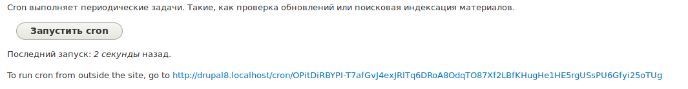

Создавая маршруты (роуты) и контроллеры для них, может возникнуть необходимость
проверки прав доступа. В этом материале мы разберемся с одним из таких способов
проверки — тегированным сервисом access_check.

## Отличие от других вариантов проверки

Для начала разберемся, какие могут быть варианты проверки прав доступа у
маршрута:

- Самый первый, очевидный и плохой — проверка доступа непосредственно в
  методе `_controller` маршрута.
- Второй способ — правильный вариант первого. При помощи `_custom_access`.
- Третий способ — сервис access_check.

В чем же отличие второго способа от третьего? На самом деле, у них много общего
и они почти идентичны. Но имеют некоторые особенности:

- Использование `_custom_access` привязывает логику проверки доступа
  непосредственно к контроллеру. Что подразумевает полную инициализацию объекта
  контроллера. **Access check** самодостаточная единица, благодаря чему, вызов
  объекта контроллера не произойдет, если данная проверка не пройдет условия.
- Использование `_custom_access` явно говорит о том, что данная проверка доступа
  касается только конкретного маршрута и его контроллера. **Access check**
  универсальная проверка доступа. Написав её единожды, вы можете использовать её
  сколько угодно раз в проекте, и на каких угодно маршрутах.

Подводя итог: `_custom_access` тесно связан с маршрутом и контроллером, а *
*access_check** универсальное решение, для любого маршрута.

## Состав Access Check сервиса

Access check является просто объектом, объявленным как
тегированный [сервис][d8-services]. Мы не будем разбираться в данной статье, что
такое сервисы, поэтому, обратитесь к соответствующему материалу.

Как и подобает сервису, он имеет описание в `*.services.yml` файле и объект,
вызываемый данным сервисом.

### Объект Access Check

В первую очередь нас интересует сам объект, отвечающий за проверку прав доступа.
Его рекомендуется создавать в `src/Access` папке, но это совершенно
необязательно.

Объект должен реализовывать `\Drupal\Core\Routing\Access\AccessInterface`.

У объекта будет вызван метод `access()` (по умолчанию), который должен вернуть
результат доступа — объект реализующий `AccessResultInterface`.

Метод имеет **очень специфичную работу с аргументами**, я бы даже сказал — ✨
магическую. Поэтому, уделите этому немного времени и вникните как это работает.

- Первым делом он принимает в качестве аргументов <abbr title="slugs">
  слаги</abbr>, в том порядке, в котором они объявлены в пути маршрута.
  Например `path: '/some/path/{node}/{another_arg}'`, придут в метод
  как `access(NodeInterface $node, $another_arg)`.
- Затем, он принимает один или несколько перечисленных далее аргументов. Порядок
  их указания не имеет значения, но они должны иметь корректно указанынй
  неймспейс чтобы были переданы корректно (иметь тип рядом с переменной и
  соответствующий use)
  - `\Symfony\Component\HttpFoundation\Request $request`
  - `\Symfony\Component\Routing\Route $route`
  - `\Drupal\Core\Routing\RouteMatch $route_match`
  - `\Drupal\Core\Session\AccountInterface $account`

Данный метод в конечном итоге должен вернуть объект
типа `\Drupal\Core\Access\AccessResultInterface`. В ядре у нас есть стандартный
объект данного типа `Drupal\Core\Access\AccessResult`.

У данного объекта может быть опциональный (при определенных условиях, см.
структуру services.yml файла) метод `applies(Route $route)`, который должен
возвращать массив из названий проверок, для которых будет применен данный Access
Check. Это очень специфичный метод и, скорее всего, вам не потребуется.

::: caution [Не перепутайте `$account` и `$user`!]
Если в пути присутствует слаг `{user}`, будьте очень аккуратны. Не забывайте,
что проверку доступа необходимо проводить по `$account` — текущему пользователю,
который делает запрос, а не по `$user` — который присутствует в пути. Таким
образом, если вы сделаете проверку по `$user` и он имеет права на доступ к
маршруту, но обращается гость, который не имеет прав, то доступ будет получен.
:::

#### Методы AccessResult

Объект достаточно простой и примитивный, поэтому быстро пробежимся по его
методам.

- `neutral($reason = NULL)`: Доступ ни запрещен, ни разрешен. Другие условия
  будут решать что делать с доступом, если таковые имеются у маршрута.
- `allowed()`: Доступ разрешен.
- `forbidden($reason = NULL)`: Доступ запрещен.
- `allowedIf($condition)`: Доступ будет разрешен если условие возвращает `TRUE`,
  в ином случае будет запрещен.
  Например `AccessResult::allowedIf($account->id() == 17)`.
- `forbiddenIf($condition, $reason = NULL)`: Запрещает доступ если условие
  возвращает `TRUE`, в ином случае разрешает.
- `allowedIfHasPermission(AccountInterface $account, $permission)`: Разрешает
  доступ, если у переданного аккаунта есть определенное право доступа.
- `allowedIfHasPermissions(AccountInterface $account, array $permissions, $conjunction = 'AND')`:
  Разрешает доступ, если у аккаунта есть все или один из указанных прав доступа.
- `setCacheMaxAge()`: Задает максимальное время жизни кэша в секундах для
  данного результата.
- `cachePerPermissions()`: Добавляет кэш контекст `user.permissions`, тем самым
  кэшируя результат для ролей.
- `cachePerUser()`: Добавляет кэш контекст `user`, тем самым кэшируя результат
  для каждого пользователя индивидуально.
- `cacheUntilEntityChanges(EntityInterface $entity)`: Кэширует результат до тех
  пор, пока переданная сущность не будет изменена.
- `cacheUntilConfigurationChanges(ConfigBase $configuration)`: Кэширует
  результат до тех пор, пока переданная конфигурация не будет изменена.
- `orIf(AccessResultInterface $other)`: Вы можете передать в данный метод,
  другой экземпляр `AccessResult`. Доступ будет выдан если ваш текущий разрешает
  доступ или же тот что передан в аргументе.
- `andIf(AccessResultInterface $other)`: Аналогично, только оба должны
  возвращать положительный результат. Если хотябы один возвращает `forbidden()`,
  то результат тоже будет "запрещено".
- `inheritCacheability(AccessResultInterface $other)`: Наследует кэш настройки
  переданного `AccessResult`.

Если у вас проблемы с пониманием что
делает `cachePerPermissions()`, `cachePerUser()` или `setCacheMaxAge()`,
рекомендую
прочитать [Drupal 8: #cache — cache tags, context и max-age][d8-cache-metadata].

Пример объекта Access Check

```php
<?php

namespace Drupal\dummy\Access;

use Drupal\Core\Session\AccountInterface;
use Drupal\Core\Access\AccessResult;
use Drupal\Core\Routing\Access\AccessInterface;

/**
 * My custom access check.
 */
class MyAccessCheck implements AccessInterface {
  
  /**
   * A custom access check.
   *
   * @param \Drupal\Core\Session\AccountInterface $account
   *   Run access checks for this account.
   *
   * @return \Drupal\Core\Access\AccessResultInterface
   *   The access result.
   */
  public function access(AccountInterface $account) {
    return AccessResult::allowedIf($account->id() == 17);
  }

}
```

### Структура .services.yml файла

Объявляется данный сервис как и любой другой, вы также можете использовать
аргументы и т.д. Вам лишь доступны некоторые новые значения для `tags` раздела
сервиса, а именно:

- `name`: Всегда равен `access_check`, так как это теггированный сервис.
- `applies_to`: (опционально) Строка с названием access check для маршрутов, для
  которых будет применяться данный access check. Если вы не указываете данное
  значение здесь, вы обязаны объявить в сервисе метод `applies(Route $route)` и
  возвращать `TRUE` (если применим) или `FALSE` (не применим). При этом объекту
  необходимо указать что он
  реализует `\Drupal\Core\Access\AccessCheckInterface`. **Обратите внимание**
  что в интерфейсе указано что результатом должен быть массив, но это не
  правильно, результатом должен быть boolean.
- `method`: (опционально) Название метода, который отвечает за проверку прав
  доступа и вернет результат. По умолчанию `access`.
- `needs_incoming_request`: (опционально) Указывайте `TRUE`, если ваш access
  check зависит от `\Symfony\Component\HttpFoundation\Request $request`. Таким
  образом, ваш access check не будет вызван там, где запрос недоступен.

Пример объявления сервиса:

```yaml
services:
  dummy.access_checker:
    class: Drupal\dummy\Access\MyAccessCheck
    tags:
      - { name: access_check, applies_to: _dummy_access_check }
```

### Применяем проверку к маршруту

Вы создали объект, делающий проверку доступа, затем объявили в качестве сервиса
и указали `applies_to: _dummy_access_check`. Остается один не решенный вопрос,
как заставить его работать на нужном маршруте? Достаточно добавить к необходимым
маршрутам в раздел `requirements` название своего access check со
значением `'TRUE'`.

```yaml
dummy.edit:
  path: '/hello-world'
  defaults:
    _controller: '\Drupal\dummy\Controller\DummyController::buildHelloWorld'
    _title: 'Hello World'
  requirements:
    _dummy_access_check: 'TRUE'
```

Теперь, обращаясь по пути `/hello-world`, Drupal, первым делом, вызовет
указанный access check, и только если его результат оказался удовлетворительным,
будет выполнен контроллер и все дальнейшие действия, иначе, обработка тут и
закончится и пользователь получит HTTP 403.

### Передача простых аргументов

Но это ещё не всё! При помощи `_dummy_access_check: 'TRUE'` вы можете передавать
примитивные строковые значения и использовать их при проверке логики! `'TRUE'`
это лишь формальная договоренность и отражение что проверка включена, так как он
должен иметь хоть какое-то значение.

Вы можете указать здесь любую строку,
например `_dummy_access_check: 'some value'`, а затем получить её в методе
проверки прав
доступа `$my_access_check_value = $route->getRequirement('_dummy_access_check'); // "some value"`.

Вы уже наверное догадались где используется данная хитрость? Правильно, при
указании `_permission: 'access content'` маршруту, который тоже является access
check сервисом.

## Примеры

Думаю, к этому моменту уже всё ясно, но давайте закрепим эти знания парочкой
примеров. Я не стал придумывать какие-то примеры, потому что, самые простые и
очевидные уже реализованы в ядре, поэтому мы разберем несколько access check
сервисов из ядра! Это не только реальные примеры, которые работают прямо в ядре,
но и знакомство с тем, как в нем происходят некоторые процессы.

### Пример №1: _access

Первый access check сервис что мы разберем, самый примитивный `_access`, который
разрешает доступ если указано `'TRUE'` и запрещает если указан `'FALSE`'.

Пример использования на маршруте:

```yaml
dummy.edit:
  path: '/hello-world'
  defaults:
    _controller: '\Drupal\dummy\Controller\DummyController::buildHelloWorld'
    _title: 'Hello World'
  requirements:
    _access: 'TRUE'
```

В данном примере мы указали `'TRUE'`, и данный access check учитывает это
значение.

Смотрим на определение соответствующего сервиса:

```yaml {"header":"core.services.yml"}
services:
  access_check.default:
    class: Drupal\Core\Access\DefaultAccessCheck
    tags:
      - { name: access_check, applies_to: _access }
```

Всё предельно стандартно, здесь указано что он будет применяться к маршрутам где
в требования укажут `_access`, что можно наблюдать в примере выше. Данный сервис
вызовет `Drupal\Core\Access\DefaultAccessCheck::access()` для проверки прав
доступа.

Смотрим на его содержимое:

```php {"header":"core/lib/Drupal/Core/Access/DefaultAccessCheck.php"}
<?php

namespace Drupal\Core\Access;

use Drupal\Core\Routing\Access\AccessInterface as RoutingAccessInterface;
use Symfony\Component\Routing\Route;

/**
 * Allows access to routes to be controlled by an '_access' boolean parameter.
 */
class DefaultAccessCheck implements RoutingAccessInterface {

  /**
   * Checks access to the route based on the _access parameter.
   *
   * @param \Symfony\Component\Routing\Route $route
   *   The route to check against.
   *
   * @return \Drupal\Core\Access\AccessResultInterface
   *   The access result.
   */
  public function access(Route $route) {
    if ($route->getRequirement('_access') === 'TRUE') {
      return AccessResult::allowed();
    }
    elseif ($route->getRequirement('_access') === 'FALSE') {
      return AccessResult::forbidden();
    }
    else {
      return AccessResult::neutral();
    }
  }

}
```

Мы видим что объект расширяет `RoutingAccessInterface`, но по факту это
алиас `Drupal\Core\Routing\Access\AccessInterface`, как и должно быть. Почему
так сделано, останется для нас загадкой.

В нем всего один простой метод `access()`, который ожидает что в него передадут
объект текущего маршрута, на который производится проверка. Он необходим, чтобы
получить из его структуры (YAML выше) значение установленное для `_access`. Если
там значение `'TRUE'`, как у нас в примере, он разрешит, доступ, если
же `'FALSE'`, запретит, а если значение другое, или в нижнем регистре, то будет
нейтральный статус. Это значит, что другие access check указанные
в `requirements` будут решать о доступе к данной странице, ведь их можно
указывать сколько угодно.

Так как это единственный access check, который мы указали в примере, то при
срабатывании нейтрального результата, доступ будет запрещен, потому что больше
некому определять доступ, и для сохранности данных, Drupal ничего не покажет.

### Пример №2: _access_system_cron

Данный access check отвечает за доступ к маршруту CRON операций, при заходе на
который, срабатывает запуск крона. Вы знакомы с этим адресом и должны были
видеть его ни раз в админке.



Для данного URL в ядре имеется маршрут, но прежде чем мы перейдем к его разбору,
давайте немного поймем как готовится данный Url:

- Когда вы только устанавливаете Drupal, происходит установка всех необходимых
  модулей, один из которых присутствует всегда - system.
- При включении модуля system срабатывает `system_install()` хук.
- В данном хуке генерируется случайный ключ для Cron
  URL `$cron_key = Crypt::randomBytesBase64(55);`.
- Затем он сохраняется при помощи [State API][d8-state-api]
  `\Drupal::state()->set('system.cron_key', $cron_key);`.

Теперь посмотрим на сам маршрут для вызова крон операций при помощи HTTP
запроса.

```yaml {"header":"system.cron.yml"}
system.cron:
  path: '/cron/{key}'
  defaults:
    _controller: '\Drupal\system\CronController::run'
  options:
    no_cache: TRUE
  requirements:
    _access_system_cron: 'TRUE'
```

Маршрут имеет динамическую часть (слаг) в виде `{key}`. Страница откроется по
любому из запросов `/cron/chto-ugodno`, где вторая часть может содержать что
угодно. Конечно, это плохо, так как крон будет запускаться при любом запросе, и
смысла в этом ключе не остается. Также, зная `{key}` можно устроить очень
эффективную DDOS атаку, именно из-за этого он такой большой и страшный.

Чтобы крон отрабатывал только если в `{key}` передана верная строка, которая
известна только администратору сайта, к маршруту подключается access
check `_access_system_cron`.

Описание его сервиса выглядит следующим образом:

```yaml {"header":"system.srvices.yml"}
services:
  access_check.cron:
    class: Drupal\system\Access\CronAccessCheck
    tags:
      - { name: access_check, applies_to: _access_system_cron }
```

Уже известная нам структура, поэтому переходим сразу к объекту с логикой.

```php {"header":"core/modules/system/src/Access/CronAccessCheck.php"}
<?php

namespace Drupal\system\Access;

use Drupal\Core\Access\AccessResult;
use Drupal\Core\Routing\Access\AccessInterface;

/**
 * Access check for cron routes.
 */
class CronAccessCheck implements AccessInterface {

  /**
   * Checks access.
   *
   * @param string $key
   *   The cron key.
   *
   * @return \Drupal\Core\Access\AccessResultInterface
   *   The access result.
   */
  public function access($key) {
    if ($key != \Drupal::state()->get('system.cron_key')) {
      \Drupal::logger('cron')->notice('Cron could not run because an invalid key was used.');
      return AccessResult::forbidden()->setCacheMaxAge(0);
    }
    elseif (\Drupal::state()->get('system.maintenance_mode')) {
      \Drupal::logger('cron')->notice('Cron could not run because the site is in maintenance mode.');
      return AccessResult::forbidden()->setCacheMaxAge(0);
    }
    return AccessResult::allowed()->setCacheMaxAge(0);
  }

}
```

Всё стандартно, как и должно быть, поэтому сразу переходим на `access()` метод.
В него приходит аргумент `$key`. В нем и будет значение второй части
URL (`{key}`), запрошенного пользователем.

Возвращаясь к установке друпала, вспоминаем что ключ был записан в State API.
Данное значение сразу подвергается
проверке `$key != \Drupal::state()->get('system.cron_key')`. Если ключ,
находящийся в запрошенном URL равен тому, что хранится в базе, то условие
пройдет успешно. Если ключ не равен, Drupal сообщит о попытке обратиться к крону
с неверным ключем и запретит доступ.

Если условие прошло, производится ещё одна проверка, на "Режим обслуживания"
сайта. Если сайт находится в режиме обслуживания, то Drupal запишет в лог,
попытку запуска крона в режиме обслуживания и запретит доступ к странице — крон
не запустится.

Если и эту проверку успешно получается пройти, доступ к контроллеру открывается
и будет вызван метод `\Drupal\system\CronController::run`, который и проведет
все необходимые действия для крон операций.

Вы уже, наверное, обратили внимание на `setCacheMaxAge(0)`, который запрещает
кэш результата. Это сделано затем, чтобы каждый раз производилась данная
проверка. Например, после вызова этого URL могли включить режим обслуживания, и
затем опять открыть данный URL. Без кэширования он бы вернул `allowed()`, но в
текущей реализации вернет `forbidden()`. И наоборот, если первый раз вызывали в
режиме обслуживания, закэшился отказ и все последующие разы будут тоже отказ.

### Пример №3: _csrf_request_header_token

Данный пример сделан на `_csrf_request_header_token`,
вместо `_access_check.csrf`, так как он более комплексный, все что есть
в `_access_check.csrf` должны быть ясно после предыдущих двух примеров.

Первым делом давайте посмотрим на объявление сервиса для данного Access Check.

```yaml {"header":"core.services.yml"}
services:
  access_check.header.csrf:
    class: Drupal\Core\Access\CsrfRequestHeaderAccessCheck
    arguments: ['@session_configuration', '@csrf_token']
    tags:
      - { name: access_check, needs_incoming_request: TRUE }
```

Этот сервис сразу выделяется от предыдущих наших примеров, потомучто:

- Он имеет аргументы, в виде двух других сервисов, поэтому ему потребуется их
  принимать и хранить.
- У него отсутствует значение `applies_to`, значит он обязан
  реализовывать `\Drupal\Core\Access\AccessCheckInterface` и
  метод `applies(Route $route)`;
- Для него указано значение `needs_incoming_request: TRUE`. Что вызовет данный
  Access Check только когда есть возможность передать объект текущего запроса.
  Так как CSRF токены передают всегда с запросом, он ему необходим, а
  следовательно, это явно указано в его сервисе, чтобы он не вызывался
  понапрасну.

Вроде с объявлением всё разобрали, переходим к самому объекту.

```php {"header":"core/lib/Drupal/Core/Access/CsrfRequestHeaderAccessCheck.php"}
<?php

namespace Drupal\Core\Access;

use Drupal\Core\Session\AccountInterface;
use Drupal\Core\Session\SessionConfigurationInterface;
use Symfony\Component\Routing\Route;
use Symfony\Component\HttpFoundation\Request;

/**
 * Access protection against CSRF attacks.
 */
class CsrfRequestHeaderAccessCheck implements AccessCheckInterface {

  /**
   * A string key that will used to designate the token used by this class.
   */
  const TOKEN_KEY = 'X-CSRF-Token request header';

  /**
   * The session configuration.
   *
   * @var \Drupal\Core\Session\SessionConfigurationInterface
   */
  protected $sessionConfiguration;

  /**
   * The token generator.
   *
   * @var \Drupal\Core\Access\CsrfTokenGenerator
   */
  protected $csrfToken;

  /**
   * Constructs a new rest CSRF access check.
   *
   * @param \Drupal\Core\Session\SessionConfigurationInterface $session_configuration
   *   The session configuration.
   * @param \Drupal\Core\Access\CsrfTokenGenerator $csrf_token
   *   The token generator.
   */
  public function __construct(SessionConfigurationInterface $session_configuration, CsrfTokenGenerator $csrf_token) {
    $this->sessionConfiguration = $session_configuration;
    $this->csrfToken = $csrf_token;
  }

  /**
   * {@inheritdoc}
   */
  public function applies(Route $route) {
    $requirements = $route->getRequirements();
    // Check for current requirement _csrf_request_header_token and deprecated
    // REST requirement.
    $applicable_requirements = [
      '_csrf_request_header_token',
      // @todo Remove _access_rest_csrf in Drupal 9.0.0.
      '_access_rest_csrf',
    ];
    $requirement_keys = array_keys($requirements);

    if (array_intersect($applicable_requirements, $requirement_keys)) {
      if (isset($requirements['_method'])) {
        // There could be more than one method requirement separated with '|'.
        $methods = explode('|', $requirements['_method']);
        // CSRF protection only applies to write operations, so we can filter
        // out any routes that require reading methods only.
        $write_methods = array_diff($methods, ['GET', 'HEAD', 'OPTIONS', 'TRACE']);
        if (empty($write_methods)) {
          return FALSE;
        }
      }
      // No method requirement given, so we run this access check to be on the
      // safe side.
      return TRUE;
    }
  }

  /**
   * Checks access.
   *
   * @param \Symfony\Component\HttpFoundation\Request $request
   *   The request object.
   * @param \Drupal\Core\Session\AccountInterface $account
   *   The currently logged in account.
   *
   * @return \Drupal\Core\Access\AccessResultInterface
   *   The access result.
   */
  public function access(Request $request, AccountInterface $account) {
    $method = $request->getMethod();

    // Read-only operations are always allowed.
    if (in_array($method, ['GET', 'HEAD', 'OPTIONS', 'TRACE'], TRUE)) {
      return AccessResult::allowed();
    }

    // This check only applies if
    // 1. the user was successfully authenticated and
    // 2. the request comes with a session cookie.
    if ($account->isAuthenticated()
      && $this->sessionConfiguration->hasSession($request)
    ) {
      if (!$request->headers->has('X-CSRF-Token')) {
        return AccessResult::forbidden()->setReason('X-CSRF-Token request header is missing')->setCacheMaxAge(0);
      }
      $csrf_token = $request->headers->get('X-CSRF-Token');
      // @todo Remove validate call using 'rest' in 8.3.
      //   Kept here for sessions active during update.
      if (!$this->csrfToken->validate($csrf_token, self::TOKEN_KEY)
        && !$this->csrfToken->validate($csrf_token, 'rest')) {
        return AccessResult::forbidden()->setReason('X-CSRF-Token request header is invalid')->setCacheMaxAge(0);
      }
    }
    // Let other access checkers decide if the request is legit.
    return AccessResult::allowed()->setCacheMaxAge(0);
  }

}
```

Пойдем сверху-вниз:

- Первым делом мы смотрим на объявление объекта, который
  реализует `AccessCheckInterface`, как и положено для aсcess check без явно
  указанного `applies_to`.
- Далее мы видим указание ключа для определения токена.
- Затем два защищенных свойства для хранения двух сервисов.
- После чего идет `__construct()`, который принимает два переданных
  аргумента-сервиса `arguments: ['@session_configuration', '@csrf_token']`. В
  нем объекты сервисов записываются в соответствующие свойства. Классический
  Dependency Injection в действии. Почему во втором примере так не сделали, мне
  не ясно, видимо давно писали код и не в приоритете.
- Затем нас встречает `applies()`, который и решает, применим ли данный Access
  Check к текущему маршруту или нет.
  - Первым делом получаются все указанные для текущего маршрута
    значения `requirements`.
  - Затем формируется массив с допустимыми значениями, для которых должен
    работать данный Access Check. Это `_csrf_request_header_token`
    и `_access_rest_csrf`.
  - Далее формируется новый массив с текущими названиями access check сервисов,
    указанных в `requirements`.
  - После чего проводится сравнение первого и второго массива. Если хотябы один
    из указанных в первом массиве access check, содержится в requirements,
    данное условие пройдет. Если же нет, дальнейшее выполнение прервется.
  - Если обнаружен хотябы один из этих двух access check в текущем маршруте,
    производится дополнительная проверка. Он проверяет, указано ли
    значение `_method` для маршрута?
  - Если не указано, то данный access check сразу перепрыгнет на `return TRUE`,
    а значит, будет применен к маршруту.
  - Если указан, то он получает массив данных методов, которые разрешает
    маршрут.
  - Затем из этого списка исключаются все безопасные методы (те, которые не
    производят записи и работу с данными, а следовательно, их не нужно
    защищать): "GET", "HEAD", "OPTIONS", "TRACE".
  - Если в результате исключения безопасных методов оказывается пустой массив —
    значит никаких проверок проводить не нужно, никаких данных отправлено не
    будет, если же там что-то осталось, например "POST", то выполнение перейдет
    на `return TRUE`, и данный access check будет использован для маршрута.
- Если access check прошел проверку `applies()` и применился к маршруту, а затем
  произошел его вызов, то в дело
  вступит `access(Request $request, AccountInterface $account)`.
  - Данный метод принимает доступные аргументы в удобном для него порядке. Но не
    забываем что если вы хотите использовать `Request $request`, необходимо
    сервису указать `needs_incoming_request: TRUE`, что мы и видели ранее.
  - Первым делом здесь получается метод, по которому произошел запрос.
  - Сразу же проводится очередная проверка на безопасные методы. Если текущий
    метод безопасный - доступ разрешается. Это сделано потому что маршрут может
    иметь значение `_method` (устаревшее значение) равный `GET|POST`. В случае
    если там был бы просто `GET`, то данный access check не добавился бы на
    этапе `applies()`, но в таком варианте оказался ещё `POST`, поэтому в момент
    обращения, производится новая проверка, по какому методу действильно
    обратились, и если он безопасный, чтобы не выполнять ненужные проверки и
    усложнять маршрут, он сразу дает доступ.
  - Если метод небезопасный, производится доп. проверка. Drupal проверяет,
    является ли пользователь авторизованным и имеет куки с сессией. Если нет, он
    почему-то возвращает `AccessResult::allowed()`, хотя, как мне кажется,
    должен возвращать `AccessResult::neutral()`.
  - Если пользователь авторизован и имеет куку, у запроса проверяется заголовок
    на наличие значения `X-CSRF-Token`. Если его нету, доступ сразу отклоняется.
  - Если заголовок содержит данный ключ, далее получается его значение.
  - Затем это значение проходит две сверки, является ли данный токен валидным.
    Если нет — доступ запрещается, если валидный, доступ разрешается.

## Заключение

Вот так просто можно взять доступ к маршрутам в полный контроль. В этом
материале мы не только разобрали, что такое access check и как он работает, но и
разобрали 3 сервиса из ядра, и теперь вы будете знать как они работают. Учитывая
что все они разные и комплексные, вы сможете понять как работают другие access
check не только от ядра, но и от сторонних модулей.

[d8-services]: ../../../../2017/06/21/d8-services/index.ru.md
[d8-cache-metadata]: ../../../../2017/07/15/d8-cache-tags-context-max-age/index.ru.md
[d8-state-api]: ../../../../2015/10/16/d8-state-api/index.ru.md
