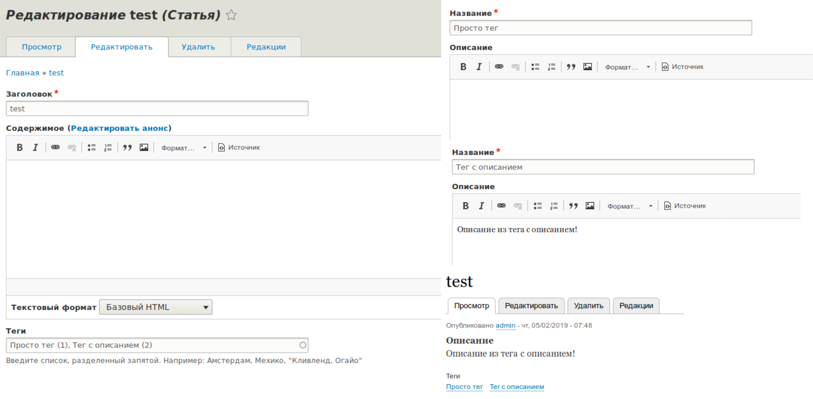

Поля выводят своё содержимое, а где значение не установлено, они ничего не
выводят, темплейт просто не рендерится. В некоторых случаях может помочь
настройка "значения по умолчанию", но не всегда, особенно, если речь идёт о
динамике.

Кейсов, возможно, для данного подхода множество, но я лишь напишу, для каких
целей я использовал данный "финт" в своей работе. Это был магазин, у меня было
поле с параграфами, используемое для описания товара. В определенный момент
пришла задача: "Было бы не плохо, задавать описание товарам в категории, и чтобы
всем товарам из данной категории, выводилось данное описание, если ему не задано
персональное описание непосредственно в товаре". Так как товаров много, описание
у всех на 99% схоже, в основном меняется название в тексте описания, то было
решено подменять значение парагарфа в связке с [Token][drupal-8-tokens], для
подстановки названия товара в нужном месте.

Это можно было бы и решить через препроцесс темплейта товара, докинуть туда
необходимую переменную с данным описанием, проверять в твиге и через условие
выводить его. Но я счёл что это не совсем приятно для меня, так как, во-первых,
это надо раскидать по всем товарам, во-вторых, немного изменится разметка, а
также некоторая внутряняя логика темплейтов. Например, ещё есть генераторы
различных PDF файлов, паспортов товаров, гарантийных паспортов на основе данных,
и доп. поле или значение, повело бы за собой огромное кол-во изменений, хотя они
вообще не нужны. И я подумал, а что если детектить пустое поле и эмулировать
значение которое мне надо. Так я и пришел к тому, о чем данная статья.

## Разбираемся с hook_theme для field

Прежде чем переходить к основному коду, необходимо разобраться откуда растут
ноги у field.html.twig темплейтов, которые и выводят значения полей. Так как
подмена будет производиться соответствующим образом, с поведением как при
наличии значения, нам нужно будет воспроизвести поведение ядра.

Прежде всего, если вы не знакомы с [hook_theme()][drupal-8-hook-theme], то
настоятельно рекомендую ознакомиться, иначе вопросов и недопонимания возникнет
много.

`field` является theme hook, который ожидает render element и объявлен
в `drupal_common_theme()`. То есть, у него даже не растут ноги из модуля field,
он есть всегда, даже в минимальной установке ядра.

Данный хук в ядре используется всего единожды
в `Drupal\Core\Field\FormatterBase`, который является основной всех дальнейших
виджетов для полей, что и выводят значения.

Он принимает приличное кол-во значений, поэтому пробежимся по ним:

- `#title`: Метка поля, аналогично настройке в админке.
- `#label_display`: Строковое значение, отвечающее за то, как отображать метку.
  Данное значение в админке представлено в виде селекта столбца "Метка". Может
  принимать:
  - `above`: Сверху.
  - `inline`: В линию.
  - `hidden`: Скрытый.
  - `visually_hidden`: Визуально скрыт (через класс и display: none).
- `#view_mode`: Режим отображения используемый для материала.
- `#language`: Код языка, для которого эти значения.
- `#field_name`: Машинное название поля, значение которого выводится.
- `#field_type`: Машинное название типа поля, которое выводится.
- `#field_translatable`: Булевое значение, является ли поле переводимым.
- `#entity_type`: Машинное название типа сущности, которому принадлежит поле,
  чьё значение выводится.
- `#bundle`: Машинное название бандла (подтипа) сушности, которому принадлежит
  поле.
- `#object`: Объект сущности.
- `#items`: Значения поля, которые и необходимо вывести. Тут содержатся не
  данные на вывод, а лишь "исходные значения" поля.
- `#formatter`: Машинное имя форматтера, отвечающего за вывод поля. Если не
  уверены что выбрать, используйте `string`.
- `#is_multiple`: Булевое значение, отмечающее, является ли поле с
  множественными значенями или одиночным. Используется при генерации разметки
  в `field.html.twig`.
- 0,1,2,3: Числовые ключи, содержащие значения на вывод в виде рендер массивов.
  Именно эти данные уйдут на рендер как значение поля, а не то что в `#items`.

Много? Достаточно. Но все они ещё и обязательные. Ну почти, на самом деле,
строго
обязательные: `#object`, `#entity_type`, `#field_name`, `#field_type`, `#label_display`, `#title`
и `#is_multiple`.

Но я бы рекомендовал задавать все значения, так как они используются для theme
hook suggestions и могут использоваться другими модулями и темами для своих
задач. Так что формально, обязательны не все, но по факту, все.

```php {"header":"Пример вызова данного theme hook"}
$field_value = [
  '#theme' => 'field',
  '#title' => 'My fake field value',
  '#label_display' => 'hidden',
  '#view_mode' => 'teaser',
  '#language' => 'ru',
  '#field_name' => 'field_paragraphs',
  '#field_type' => 'string',
  '#field_translatable' => FALSE,
  '#entity_type' => 'node',
  '#bundle' => 'text',
  '#object' => $node,
  '#is_multiple' => FALSE,
  // Use simple formatter.
  '#formatter' => 'string',
  '0' => [
    '#markup' => 'My custom value',
  ],
];
```

В общем то это и всё что нужно знать, чтобы решить нашу задачу. Поэтому, больше
тут объяснять нечего и можно сделать какой-нибудь пример.

## Пример

Давайте провернем простой пример используя стандартную установку Drupal, где мы
имеем тип содержимого "Статья", у которой есть поле "Теги".

Мы сделаем ровно тот же кейс, что я описал в начале статьи. У данного типа
материала есть поле "Содержимое" (body), которое не является обязательным. На
этом мы и построим нашу логику. Мы будем выводить описание из "тега", если оно
там задано, конечно, в качестве значения, если поле описания пустое.

Так как у нас есть абсолютно все что нам нужно, нам лишь остается написать
эмуляцию значения со всей логикой, если поле описания пустое.

Для этого мы
воспользуемся [хуком][drupal-8-hooks] `hook_entity_display_build_alter()`, который
позволяет влезть в процесс подготовки рендер массива для сущности, перед тем как
он уйдет на рендер.

```php {"header":"dummy.module"}
<?php

/**
 * @file
 * Primary module hooks for Dummy module.
 */

use Drupal\Core\Cache\Cache;
use Drupal\node\NodeInterface;

/**
 * Implements hook_entity_display_build_alter().
 */
function dummy_entity_display_build_alter(&$build, $context) {
  $entity = $context['entity'];

  // Check is current entity is node.
  if ($entity instanceof NodeInterface && $entity->bundle() == 'article') {
    $is_body_field_exists = $entity->hasField('body') && !empty($build['body']);
    $is_tags_field_exists = $entity->hasField('field_tags');
    $fields_exists = $is_body_field_exists && $is_tags_field_exists;

    // Only if both fields is exists and body field is empty, we continue to
    // process.
    if ($fields_exists && $entity->get('body')->isEmpty()) {
      // Default value for description;
      $description = NULL;
      // Loop over all tags and looking for first term with description.
      foreach ($entity->get('field_tags') as $item) {
        // "field_tags" is entity reference so we get entity from it.
        /** @var \Drupal\taxonomy\TermInterface $term */
        $term = $item->entity;

        if (!$term->get('description')->isEmpty()) {
          $description = $term->get('description')->view();

          $build['body']['#cache']['tags'] = Cache::mergeTags(
            $build['body']['#cache']['tags'],
            $term->getCacheTags()
          );

          break;
        }
      }

      if ($description) {
        $build['body'] = [
          '#theme' => 'field',
          '#title' => '',
          '#label_display' => 'hidden',
          '#view_mode' => $context['view_mode'],
          '#language' => $entity->get('body')->getLangcode(),
          '#field_name' => 'field_paragraphs',
          '#field_type' => 'string',
          '#field_translatable' => FALSE,
          '#entity_type' => $entity->getEntityTypeId(),
          '#bundle' => $entity->bundle(),
          '#object' => $entity,
          '#is_multiple' => FALSE,
          // Use simple formatter.
          '#formatter' => 'string',
          '0' => $description,
        ] + $build['body'];
      }
    }
  }
}
```

Первым делом мы получаем объект сущности, которая подготавливается к рендеру
из `$context['entity']`, после чего мы проверяем, является ли объект сущности
экземпляром `NodeInterface`, а также, что бандл у сущности `article`, так как
нам не нужно распространять данное поведение на другие типы материалов.

Затем производится две проверки на то что у данного типа материала есть поля "
body" и "field_tags", ведь эти поля могут отсутствовать или быть удалены в
дальнейшем. Также, мы проверяем, есть ли массив для поля "body" в массиве на
рендер, он может там отсутствовать по тем или иным причинам, например, на
странице листинга материалов, поэтому не забываем делать и данную проверку.

Далее мы делаем ещё одну проверку, где учавствует результат проверки на наличие
полей, и если они имеются, мы также проверяем что значение для поля "body"
отсутствует, ведь нам нужно подменять только если ничего не указал пользователь.

После чего мы задаем значение для описания по умолчанию в `NULL`, ведь мы не
знаем, найдем ли мы описание в тегах или нет, так как их описания также являются
опциональными.

Затем мы входим цикл всех значений указанных в поле "field_tags", получаем
сущность, проверяем, задано ли у неё описание, и если да, указываем данное
значение в нашу переменную `$description`. Таким образом, мы будем использовать
в качестве описания первое, что попадется в цикле по тегам в их порядке, в
котором они указаны.

Также, мы мерджим [кэш-теги][d8-cache-metadata] с тем что стоят у поля по
умолчанию, с теми, что предоставляет термин таксономии. Это позволит
инвалидировать описание статьи, при изменении описания тэга. Конечно, это будет
инвалидировать и при отсутствии изменений в описании, можно заморочиться и
добавить свои теги, занимать их инвалидацией более щепетильно, но опять же, это
совсем не про данную статью, да и не всем нужно. После всего этого, мы прерываем
цикл, так как описание у нас уже имеется.

Обратите также внимание, как мы записываем значение описания через
метод `view()`, мы не передаем ничего в качестве аргументов, это будет расценено
Drupal как "отрендерить значение данного поля, в соответствии с настройками
указанными в `default` режиме отображения термина". Вы также можете передать
любой другой режим отображения, или прямое значение для форматтера со всеми его
настройками. За подробностями обращайтесь
к `EntityViewBuilderInterface::viewField()`, так как это не относится уже к
данной статье. Вы можете сформировать результат и самостоятельно, в нашем случае
так мы получаем рендер массив сразу.

Затем, прошел цикл или был прерван, мы не знаем, поэтому проверяем
значение `$description`. Если оно осталось `NULL`, ничего не произойдет и поле
останется пустым, если же там появился рендер массив от термина, мы формируем
значение рендер массива для нашего "фейкового" поля.

Его значения мы рассмотрели выше, поэтому тут всё должно быть предельно ясно что
происходит, единственное что тут может оказаться любопытными,
это ` + $build['body']`. Своим присвоением мы перезатираем текущее значение, но
у нас там хранится информация о кэшировании, возможно даже что-то ещё, мы не
знаем наверняка, поэтому мы добавляем значения старого массива к новому.

Вот и всё! Теперь если у статьи отсутствует описание, оно будет искаться в тегах
и подставляться. И вам не придется заботиться об этой подстановке, ровно до тех
пор, пока эта сущность рендерится стандартными путями.



## Ссылки

- [Модуль с примером](example/dummy)

[d8-cache-metadata]: ../../../../2017/07/15/drupal-8-cache-metadata/index.ru.md
[drupal-8-hook-theme]: ../../../../2017/06/26/drupal-8-hook-theme/index.ru.md
[drupal-8-tokens]: ../../../../2018/09/06/drupal-8-tokens/index.ru.md
[drupal-8-hooks]: ../../../../2018/06/28/drupal-8-hooks/index.ru.md
