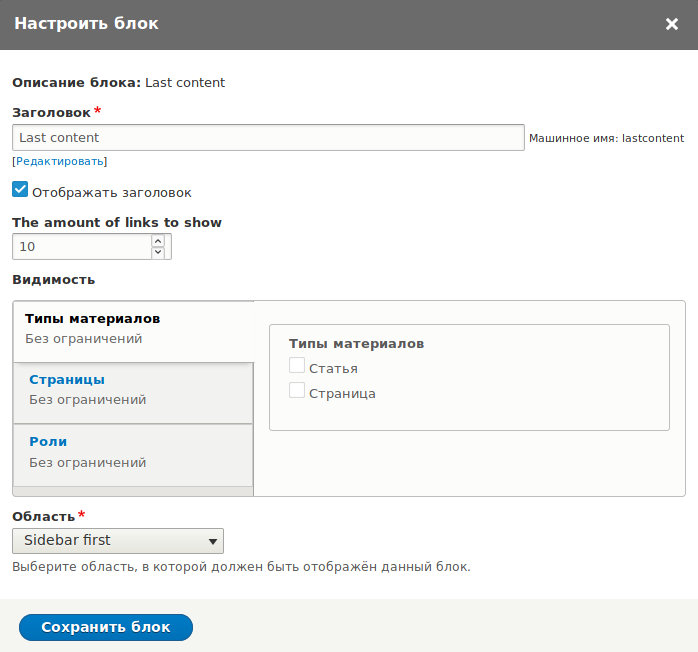
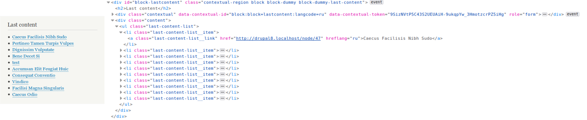
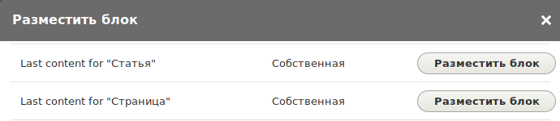
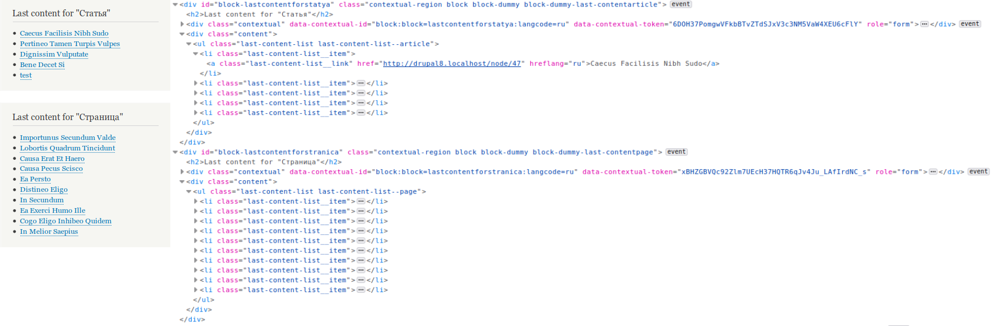

**Derivatives** (производные) — механизм в системе плагинов, позволяющий
создавать любые плагины программно в любом количестве. Суть дериватив в том, что
они позволяют зарегистрировать сколько угодно экземпляров одного и того же
плагина, с отличными настройками, при необходимости, но общей для всех данных
плагинов логикой.

Это полезный инструмент в той ситуации, когда вы хотите объявить плагин для
чего-либо динамического, не постоянного или же в неопределенном количестве.

Самый простой и показательный пример — блоки меню. В Drupal вы можете создавать
различные блоки для вывода любого меню в настройках региона. Добавляя меню в
регион в виде блока, вы используете плагин `SystemMenuBlock`. При добавлении
данного блока у вас есть различные настройки для выводимого меню, например
стартовый уровень вложений, максимальная глубина и т.д., всё это подготовлено в
виде формы и хранения настроек в данном плагине, ровно как и вывод меню.

Но при этом, вы не выбираете какое именно меню выводить, у вас просто на каждое
существующее меню сайта есть отдельный блок, где уже находится эта форма и
логика вывода. Естественно, под каждое меню делать плагин нереально, темболее
что меню можно как создавать, так и удалять. Тут то и включается деривер
плагинов, которой и генерирует экземпляр данного плагина для каждого отдельно
взятого меню и на списке выбор добавляемых блоков, вы какраз и видите экземплры
данного плагина подготовленные для каждого контреного меню.

Например у меня был кейс, когда определенный тип ноды использовался для рассылки
писем. При определенных условиях, данные ноды генерировали
[очередь][drupal-8-queue-api] со списком рассылки, так как адресатов там было очень
много.

Таких нод в определенный момент времени присутсвовало ни одна штука, и рассылки
могли запускаться в любой момент. Учитывая что использовались очереди, я не
собирал из них одну большую, так как на основе её значений определялся прогресс
рассылки. Естественно выход был один, генерировать индивидуальные очереди.

При этом, для выполнения очередей я использовал
[QueueWorker плагин][drupal-8-queue-worker-plugin], чтобы данный процесс был максимально
прозрачный и автоматический. Но учитывая как работает данный плагин, я не мог
создавать под каждую ноду свой собтвенный с одной и той же логикой. Тут-то и
приходят на помощь деривативы. При генерации плагинов деривативами, id
оригинального плагина сохраняется, а название деривативы добавляется в конце по
следующему шаблону `[plugin_id]:[derivative_id]`. Таким образом, я кидал всё в
очередь с названием `email_mass_send:[NID]` и для каждого подходящего материала,
по определенным условиям, деривативы генерировали данные плагины, а я лишь
создал один единственный `email_mass_send` где и находилась вся логика.

Таким образом, я сильно разгрузил кодовую базу, и процесс рассылки был
достаточно прозрачный, гибкий и все работало в автоматическом режиме.

## Создание Deriver — генератора экземпляров

Для того чтобы использовать деривативы, вам потребуется создать объект, который
и будет генерировать значения для плагина.

В общих чертах — дериватив описывает каждый экземпляр плагина, а также, его
настройки для аннотации плагина. Таким образом, именно дериватива отвечает за
настройки плагина из аннотации, а не сам плагин.

Собственные деривативы создаются в `src/Plugin/Derivative`. Как я уже написал,
они являются объектом который
расширяет `Drupal\Component\Plugin\Derivative\DeriverBase`.

У данного объекта всего два собственных метода:

- `getDerivativeDefinition()`: Метод, который позволяет получить значение для
  конкретного `$derivative_id`, а если его нет, то передаст
  в `getDerivativeDefinitions()` для создания. Скорее всего вам никогда не
  пригодится.
- `getDerivativeDefinitions()`: Метод, который отвечает непосредственно за
  генерацию всех необходимых инстансов и их настроек. В качестве аргумента он
  принимает массив `$base_plugin_definition`, который содержит базовые данные
  плагина, к которому данный дериватив был подключен, что можно расценивать
  как — состав аннотации плагина. Возвращает все созданные деритивы.

```php {"header":"Пример простого деривера, создающий один дериватив"}
<?php

namespace Drupal\example\Plugin\Derivative;

use Drupal\Component\Plugin\Derivative\DeriverBase;

/**
 * The simple derivative example.
 */
class ExampleOfDeriver extends DeriverBase {
  
  /**
   * {@inheritdoc}
   */
  public function getDerivativeDefinitions($base_plugin_definition) {
    $this->derivatives['derivative_id'] = $base_plugin_definition;
    $this->derivatives['derivative_id']['annotation_key'] = 'Annotation value';
  
    return $this->derivatives;
  }

}
```

## Изменения в плагине

Если вы решили использовать для своего плагина деривативы, вам необходимо
скорректировать его аннотацию.

Например, если у вашего QueueWorker плагина была следующая аннотация:

```php
/**
 * @QueueWorker(
 *   id = "my_queue_name_to_process",
 *   title = @Translation("My queue worker"),
 *   cron = {"time" = 60}
 * )
 */
```

Как минимум, ей необходимо указать Deriver объект.

```php
/**
 * @QueueWorker(
 *   id = "my_queue_name_to_process",
 *   title = @Translation("My queue worker"),
 *   cron = {"time" = 60},
 *   deriver = "Drupal\example\Plugin\Derivative\MyQueueDeriver",
 * )
 */
```

При этом, значения `id`, `title`, `cron` и прочие, добавляемые плагин
менеджером, будут доступны в аргументе `$base_plugin_definition`. Вы можете их
использовать как значения по умолчанию, но также и менять для экземпляров
плагина. Например, по умолчанию будет лимит на крон 60 секунд, а экземпляру
переназанчать это значение на основе данных из другого места. Так, каждый плагин
может иметь совершенно разные лимиты.

Вы также можете опустить эти значения в аннотации, например следующим образом:

```php
/**
 * @QueueWorker(
 *   id = "my_queue_name_to_process",
 *   deriver = "Drupal\example\Plugin\Derivative\MyQueueDeriver",
 * )
 */
```

В данном случае, если какое-либо значение из данных было обязательным,
необходимо об этом позаботиться в деривер объекте.

В конечном итоге Deriver объект решает, какие конечные значения должны быть в
аннотации конкретного экземпляра плагина. Вам также, скорее всего, потребуется
немного скорректировать основную логику плагина. В этом деле вам поможет
метод `getDerivativeId()`, который возвращает id деривативы, для которой
генерируется плагин.

## Пример

В качестве примера мы сделаем очень простую штуку, которую можно накликать во
вьюсах, но зато он должен быть простым и понятным, чтобы уловить суть данной
статьи и как это делать.

Возьмем за основу стандартную установку друпала с его стандартными типами
материалов "Статья" и "Страница". Мы сделаем [плагин блока][drupal-8-block-plugin],
который будет выводить 10 последних материалов определенного типа содержимого.

Так как мы не знаем наверняка, будут ли данные типы материалов на сайте, или
может там будут совершенно другие типы, мы будем данный плагин подготавливать
через деривативы под каждый существующий тип.

Первым делом, мы создадим плагин со всей необходимой логикой. Для начала мы его
жестко привяжем к типу материала "Статья" (article), чтобы проверить и натсроить
его работу. У данного плагина будет настройка "limit", которая позволит
пользователю указывать, какое количесво ссылок необходимо выводить в данном
блоке.

```php {"header":"src/dummy/Plugin/Block/LastContentBlock.php"}
<?php

namespace Drupal\dummy\Plugin\Block;

use Drupal\Core\Block\BlockBase;
use Drupal\Core\Entity\EntityTypeManagerInterface;
use Drupal\Core\Form\FormStateInterface;
use Drupal\Core\Plugin\ContainerFactoryPluginInterface;
use Drupal\node\NodeInterface;
use Symfony\Component\DependencyInjection\ContainerInterface;

/**
 * Provides a last content. block.
 *
 * @Block(
 *   id = "dummy_last_content",
 *   admin_label = @Translation("Last content"),
 *   category = @Translation("Custom")
 * )
 */
class LastContentBlock extends BlockBase implements ContainerFactoryPluginInterface {

  /**
   * The node storage.
   *
   * @var \Drupal\Core\Entity\EntityStorageInterface
   */
  protected $nodeStorage;

  /**
   * Constructs a new LastContentBlock instance.
   *
   * @param array $configuration
   *   The plugin configuration, i.e. an array with configuration values keyed
   *   by configuration option name. The special key 'context' may be used to
   *   initialize the defined contexts by setting it to an array of context
   *   values keyed by context names.
   * @param string $plugin_id
   *   The plugin_id for the plugin instance.
   * @param mixed $plugin_definition
   *   The plugin implementation definition.
   * @param \Drupal\Core\Entity\EntityTypeManagerInterface $entity_type_manager
   *   The entity type manager.
   *
   * @throws \Drupal\Component\Plugin\Exception\InvalidPluginDefinitionException
   * @throws \Drupal\Component\Plugin\Exception\PluginNotFoundException
   */
  public function __construct(
    array $configuration,
    $plugin_id,
    $plugin_definition,
    EntityTypeManagerInterface $entity_type_manager
  ) {

    parent::__construct($configuration, $plugin_id, $plugin_definition);

    $this->nodeStorage = $entity_type_manager->getStorage('node');
  }

  /**
   * {@inheritdoc}
   */
  public static function create(ContainerInterface $container, array $configuration, $plugin_id, $plugin_definition) {
    return new static(
      $configuration,
      $plugin_id,
      $plugin_definition,
      $container->get('entity_type.manager')
    );
  }

  /**
   * {@inheritdoc}
   */
  public function defaultConfiguration() {
    return [
      'limit' => 10,
    ];
  }

  /**
   * {@inheritdoc}
   */
  public function blockForm($form, FormStateInterface $form_state) {
    $form['limit'] = [
      '#type' => 'number',
      '#title' => $this->t('The amount of links to show'),
      '#min' => 1,
      '#max' => 50,
      '#default_value' => $this->configuration['limit'],
    ];

    return $form;
  }

  /**
   * {@inheritdoc}
   */
  public function blockSubmit($form, FormStateInterface $form_state) {
    $this->configuration['limit'] = $form_state->getValue('limit');
  }

  /**
   * {@inheritdoc}
   */
  public function build() {
    $node_ids = $this
      ->nodeStorage
      ->getQuery()
      ->condition('status', NodeInterface::PUBLISHED)
      ->condition('type', 'article')
      ->range(0, $this->configuration['limit'])
      ->sort('created', 'DESC')
      ->execute();

    if (empty($node_ids)) {
      return;
    }

    $nodes = $this->nodeStorage->loadMultiple($node_ids);

    $build['content'] = [
      '#type' => 'html_tag',
      '#tag' => 'ul',
      '#attributes' => ['class' => ['last-content-list']],
    ];

    foreach ($nodes as $node) {
      $link = [
        '#type' => 'link',
        '#title' => $node->label(),
        '#url' => $node->toUrl('canonical', ['absolute' => TRUE]),
        '#attributes' => ['class' => 'last-content-list__link'],
      ];

      $build['content'][] = [
        '#type' => 'html_tag',
        '#tag' => 'li',
        '#attributes' => ['class' => 'last-content-list__item'],
        '0' => $link,
      ];
    }

    return $build;
  }

}
```

После того как плагин готов, мы сможем его добавить на страницу в какой-либо
регион. Давайте это сделаем для проверки.



На странице мы получим примерно следующее.



И вот теперь у нас встает вопрос о том, что нужно сделать чтобы данный плагин
поддерживал все возможные типы содержимого, не зависимо от их количества и
названий. Для этого мы задействуем деривативы, а именно, создадим свой
собственный деривер объект.

Первым делом нам нужно разобраться с Deriver и создать его.

```php
<?php

namespace Drupal\dummy\Plugin\Derivative;

use Drupal\Component\Plugin\Derivative\DeriverBase;
use Drupal\Core\Entity\EntityTypeBundleInfoInterface;
use Drupal\Core\Plugin\Discovery\ContainerDeriverInterface;
use Drupal\Core\StringTranslation\TranslatableMarkup;
use Symfony\Component\DependencyInjection\ContainerInterface;

/**
 * Class LastContentBlockDeriver.
 *
 * @package Drupal\dummy\Deriver
 */
class LastContentBlockDeriver extends DeriverBase implements ContainerDeriverInterface {

  /**
   * The entity type bundle info.
   *
   * @var \Drupal\Core\Entity\EntityTypeBundleInfoInterface
   */
  protected $entityTypeBundleInfo;

  /**
   * LastContentBlockDeriver constructor.
   *
   * @param \Drupal\Core\Entity\EntityTypeBundleInfoInterface $entity_type_bundle_info
   *   The entity type bundle info.
   */
  public function __construct(EntityTypeBundleInfoInterface $entity_type_bundle_info) {
    $this->entityTypeBundleInfo = $entity_type_bundle_info;
  }

  /**
   * {@inheritdoc}
   */
  public static function create(ContainerInterface $container, $base_plugin_id) {
    return new static(
      $container->get('entity_type.bundle.info')
    );
  }

  /**
   * {@inheritdoc}
   */
  public function getDerivativeDefinitions($base_plugin_definition) {
    $node_types = $this->entityTypeBundleInfo->getBundleInfo('node');

    foreach ($node_types as $type => $type_info) {
      $this->derivatives[$type] = $base_plugin_definition;

      $admin_label = new TranslatableMarkup('Last content for content type "@node_type_label"', [
        '@node_type_label' => $type_info['label'],
      ]);
      $this->derivatives[$type]['admin_label'] = $admin_label;
    }

    return $this->derivatives;
  }
}
```

Давайте немножко разберемся.

Объект реализует `ContainerDeriverInterface`. Это
аналог `ContainerFactoryPluginInterface` от плагинов, который позволяет делать
правильный Dependency Injection.

Затем, мы через конструктор и `create()` подключаем
зависимость `entity_type.bundle.info`, которая позволит нам получать всю
необходимую информацию о типах материала `node`.

И остается один единственный метод `getDerivativeDefinitions()` в котром мы:

- Получаем массив с информацией о всех бандлах сущности `node`.
- Затем идем по циклу этого массива, где ключ - машинное имя бандла, а
  значение - информация о нем. В случае с `node` там находится лишь `label`
  значение, уже переведенное.
- Далее мы добавляем первый наш плагин
  конструкцией `$this->derivatives[$type] = $base_plugin_definition`, где ключ
  массива получает машинное имя бандла. Таким образом, для бандла `article` мы
  получим значение `dummy_last_content:article`. Мы присваиваем значение
  аннотации по умолчанию.
- После чего мы подготавливаем строку для `admin_label` значения из аннотации.
  Сейчас у нас там `admin_label = @Translation("Last content"),`, но в случае с
  динамикой это не совсем удачный вариант, поэтому задаем программно с указанием
  для какого типа материала данный плагин (блок).
- В конце мы возвращаем то что у нас получилось в свойстве `derivatives`. Если
  ничего, то никаких плагинов и не будет создано.

Теперь у нас есть плагин, заточенный под один тип, и деривер, для автоматической
генерации плагинов под все типы. Нам осталось их соединить.

Возвращаемся к плагину и первым же делом модифицирем его аннотацию следующим
образом:

```php
/**
 * Provides a last content. block.
 *
 * @Block(
 *   id = "dummy_last_content",
 *   category = @Translation("Custom"),
 *   deriver = "Drupal\dummy\Plugin\Derivative\LastContentBlockDeriver",
 * )
 */
```

Мы добавили новое значение `deriver`, которое ведет на наш объект созданный
ранее. Также мы удалили `admin_label`, так как теперь он задается в деривере.

Обратите внимание, что когда мы указываем `deriver` - основной плагин от файла
больше не работает, все его вариации обязательно должны быть в деривере. Если вы
хотите какой-то плагин по умолчанию, объявите статично его прямо в деривере как
деритиву.

Вроде всё в порядке, осталось только немного скорректировать нашу логику блока
в `build()`, так как сейчас она заточена жестко под `article`. Тут мы
воспользуемся `getDerivativeId()`, который возвращает id деритивы. ID получается
из ключа массива, который мы задавали ранее, а ключем у нас является машинное
имя типа содержимого. Беря это во внимание, модифицируем наш код:

```php
  /**
   * {@inheritdoc}
   */
  public function build() {
    $node_type = $this->getDerivativeId();
    $node_ids = $this
      ->nodeStorage
      ->getQuery()
      ->condition('status', NodeInterface::PUBLISHED)
      ->condition('type', $node_type)
      ->range(0, $this->configuration['limit'])
      ->sort('created', 'DESC')
      ->execute();

    if (empty($node_ids)) {
      return;
    }

    $nodes = $this->nodeStorage->loadMultiple($node_ids);

    $modifier_class = Html::getClass('last-content-list--' . str_replace('_', '-', $node_type));
    $build['content'] = [
      '#type' => 'html_tag',
      '#tag' => 'ul',
      '#attributes' => [
        'class' => [
          'last-content-list',
          $modifier_class,
        ],
      ],
    ];

    foreach ($nodes as $node) {
      $link = [
        '#type' => 'link',
        '#title' => $node->label(),
        '#url' => $node->toUrl('canonical', ['absolute' => TRUE]),
        '#attributes' => ['class' => 'last-content-list__link'],
      ];

      $build['content'][] = [
        '#type' => 'html_tag',
        '#tag' => 'li',
        '#attributes' => ['class' => 'last-content-list__item'],
        '0' => $link,
      ];
    }

    return $build;
  }
```

Мы добавили новую переменную `$node_type = $this->getDerivativeId();`, из
которой получаем необходимый тип материала. Затем данное значение подставляем в
наш запрос на получение данных.

Также я добавил модификатор класса для списка, чтобы было всё по БЭМ.

Вся остальная логика остается неизменной, так как она универсально подходит для
любого типа материала.

Теперь сбросив кэш, зайдя на страницу редактирования блоков, при добавлении
новых вы увидите как появятся блоки под каждый тип материала.



Я добавил оба блока на страницу, для "Статья" я указал вывод 5 элементов, а
для "Страница" оставил 10.

После чего видно результат на странице.



## Ссылки

- [Исходный код модуля с примером](example/dummy)

[drupal-8-queue-api]: ../../../../2015/11/12/drupal-8-queue-api/index.ru.md
[drupal-8-queue-worker-plugin]: ../../../../2019/04/21/drupal-8-queue-worker-plugin/index.ru.md
[drupal-8-block-plugin]: ../../../../2015/10/19/drupal-8-block-plugin/index.ru.md
