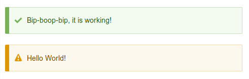

**Сервисы с метками** — способ объявления и работы с [сервисами][d8-services]
при помощи меток. У данных сервисов всегда имеется collector (коллектор,
сборщик), который собирает все доступные сервисы и производит какие-то операции
с ними. Иными словами, это позволяет группировать схожие по задаче и структуре
сервисы, в один сервис-менеджер, и решать что с ними делать.

## Сервисы с метками или плагины

Сервисы с метками по своей сути очень похожи на
[систему плагинов][d8-custom-plugins]. Между ними достаточно легко провести
параллели. У них есть объекты, отвечающие за бизнес логику, а также есть
менеджеры, собирающие все необходимые объекты и использующие их для достижения
своей цели.

Поэтому могут возникнуть совершенно резонные вопросы: "А в чем же тогда
разница?" и "Когда использовать плагины, а когда сервисы с меткой?".

Плагины являются более комплексным инструментом, они больше подходят для
массового использования, нежели сервисы. Их проще поддерживать разработчику при
больших количествах и они гибче.

Сервисы с метками, это, в первую очередь, сервисы, просто это такие сервисы,
которые вы не вызываете напрямую, а их вызывает менеджер. При больших объемах,
они просто загадят .services.yml файл, и поддерживать их станет проблемнее. Они
не такие гибкие как плагины, например аннотации плагинов позволяют отсеивать
ненужные плагины ещё на этапе сборки, тогда как у сервисов с метками, таких
полезных инструментов нет.

Сервисы с метками более точечный инструмент, тогда как плагины - более
универсальный.

Для сравнения возьмем [билдер хлебных крошек][d8-breadcrumb-builder] — который
является сервисом с меткой, а также [плагин QueueWorker][d8-queue-worker].

Оба не имеют пользовательских интерфейсов, и никаких выходов на них, они просто
объекты с бизнес логикой. Билдер хлебных крошек готовит список ссылок для
хлебных крошек, а QueueWorker обрабатывает элемент очереди. И вот назревает
вопрос, а почему QueueWorker плагин, а билдер крошек сервис, а не наоборот?

У них очень много общего, но даже при всей их схожести, они начинают сильно
отличаться при более детальном взгляде.

У QueueWorker есть аннотация, как у всех плагинов, и в ней уже можно настроить
поведение конкретно данного экземпляра плагина. У сервиса таких возможностей
нет, вы не можете передать какие-либо настройки в экземпляр, там поддерживается
только захардкоженый `priority`. Можно выкручиваться с аргументами в сервис, но
это уже по большей части костыль, нежели решение.

Самое главное — мы можем генерировать неограниченное кол-во QueueWorker плагинов
с единой логикой при помощи [Derivatives][d8-derivatives], делая это полностью
автоматически. С сервисами такое не прокатит. Каждый экземпляр должен иметь свой
физический объект, ну или как минимум объявленный сервис в services.yml, что
делает их совершенно непригодными для массового использования.

В случае с билдером хлебных крошек, сразу ясно, что их не будет много на весь
сайт. Есть стандартный от ядра, возможно какие-то модули добавят свои, а также
разработчик сделает парочку для себя, чтобы скорректировать поведение в
определенных ситуациях. Вот, в общем-то, и всё. Сколько это сервисов? Даже в
самых замороченных вариантах, у меня было не более 5, в общей сложности, на весь
проект.

А если посмотреть на QueueWorker, мы сразу же имеем дело с неопределенностью.
Сколько этих плагинов будет на проекте? По умолчанию 0, а сколько и какие
объявят другие, мы точно не знаем, так как задачи они могут решать разные,
поэтому тут намного безопаснее выбрать плагины.

Также стоит заметить, что сервисы по большей части - это просто куски логики,
без какой-либо интерактивности с пользователем. Тогда как плагины зачастую
позволяют объявлять свои собственыне формы для пользователей и т.д., а менеджеры
данных плагинов, это учитывают.

Подводя некий итог, я бы выделил следующее правило: используйте сервисы с
метками, вместо плагинов, если данные сервисы не должны предоставлять никакого
пользовательского интерфейса и их потенциально будет не так много, во всех
остальных случаях используйте плагины.

И тут возникает ещё один вопрос: "А почему бы тогда не использовать плагины для
всего, раз они гибче?". И ответ тут будет простой — какраз потому, что сервисы с
метками не обременены всей этой гибкостью плагинов. Они очень легко объявляются
и по сути состоят из менеджера и непосредственно сервисов, которые данный
менеджер и обрабатывает. Здесь очень прямая связь и всё это крайне прозрачно.

## Коллекторы сервисов

Коллекторы сервисов сами являются сервисами с меткой, они отвечают за сбор и
обработку собственных сервисов по собственной метке.

Их существует два варианта: `service_collector` и `service_id_collector`.

### service_collector

Начнем с самого распространенного — `service_collector`. Данный вариант
объявления коллектора заключается в том, что у данного колектора будет
вызываться определенный метод, на каждый подходящий сервис. При этом, каждый
подходящий сервис уже будет инициализирован и передан как объект.

Вот простой пример такого коллектора:

```yaml
services:
  example.my_tagged_service_collector:
    class: 'Drupal\example\Service\MyTaggedServiceManager'
    tags:
      - { name: service_collector, tag: my_special_tag, call: addService }
```

Объявление идентично обычным сервисам, с тем отличием что мы добавляем в `tags`
следующие данные:

- `name`: Метка, по которой ядро будет искать наш менеджер. Также, как мы будем
  затем искать свои сервисы. В данном случае это `service_collector`.
- `tag`: (опционально) Название нашего собственного тега, который за нас будет
  искать ядро в других сервисах и отдавать нам на обработку. Если данное
  значение не указать, то `tag` примет в качестве значения id
  сервиса `example.my_tagged_service_collector` - что может быть не совсем
  удобно, поэтому, лучше задать простой вариант.
- `call`: Название метода, который будет вызываться на каждый найденный сервис с
  меткой `my_special_tag`. В качестве аргументов данный метод может принимать:
  - `$service`: Объект сервиса. Он обязательно должен быть с тайпхинтингом в
    виде интерфейса. А все сервисы с меткой, которые объявляются для вашего
    коллектора, должны реализовывать данный интерфейс.
  - `$priority`: (опционально) Приоритет сервиса, заданный в services.yml для
    данного сервиса при объявлении. По умолчанию все сервисы получают приоритет
    0.
  - `$id`: (опционально) ID сервиса что передан в первом аргументе.
- `required`: (опционально) По умолчанию `FALSE`, если задать `TRUE`, то как
  минимум один сервис с данным тегом должен присутствовать.

Также хочу обратить ваше внимание на то, что `$id` и `$priority` могут быть в
любом порядке начиная со второго аргумента. Но их названия должны быть строго
такими же, чтобы ядро могло понять что оно должно туда передать.

А теперь простой пример реализации объекта для данного сервиса-коллектора.

```php
<?php

namespace Drupal\example\Service;

/**
 * Class MyTaggedServiceManager.
 * 
 * @package Drupal\example\Service
 */
class MyTaggedServiceManager {
  
  /**
   * The services for manager.
   * 
   * @var array 
   */
  protected $services = [];
  
  /**
   * Adds service to internal storage.
   * 
   * @param \Drupal\example\Service\MyServiceInterface $service
   *   The service instance.
   */
  public function addService(MyServiceInterface $service) {
    $this->services[] = $service;
  }
  
}
```

Этого достаточного, чтобы у нас уже был менеджер. Что дальше вы будете делать с
полученными сервисами - это ваша забота и то, что решает данный сервис с
метками.

Хочу также обратить внимание на то, что сервисы в данный метод передаются уже
будучи отсортированными по `priority`. Данная сортировка кэшируется, поэтому и
передается соответствующий аргумент, для реализации своей сортировки на лету.

### service_id_collector

`service_id_collector` отличается тем, что все найденные сервисы передаются в
конструктор в виде массива с id этих самых сервисов, без инициализации
экземпляров. В массиве они уже автоматически будут отсортированы по `priority`.
Данная сортировка проводится только после очистки кэша.

Пример объявления подобного коллектора:

```yaml
services:
  example.my_tagged_service_collector:
    class: 'Drupal\example\Service\MyTaggedServiceManager'
    arguments: ['@another_service']
    tags:
      - { name: service_id_collector, tag: my_special_tag }
```

Всё идентично `service_collector`, за исключением того, что здесь не нужно
указывать `call`.

Все найденные сервисы будут переданы последним аргументом, после всех
зависимостей, которые вы укажите в `arguments`.

А теперь посмотрим на пример реализации объекта для данного сервиса.

```php
<?php

namespace Drupal\example\Service;

use Drupal\Core\Messenger\MessengerInterface;

/**
 * Class MyTaggedServiceManager.
 * 
 * @package Drupal\example\Service
 */
class MyTaggedServiceManager {
  
  /**
   * The messenger.
   * 
   * @var \Drupal\Core\Messenger\MessengerInterface
   */
  protected $messenger;
  
  /**
   * The services ids.
   * 
   * @var array 
   */
  protected $serviceIds;
  
  /**
   * MyTaggedServiceManager constructor.
   * 
   * @param \Drupal\Core\Messenger\MessengerInterface $messenger
   *   The messenger.
   * @param array $services
   *   An array with service ids.
   */
  public function __construct(MessengerInterface $messenger, array $services) {
    $this->messenger = $messenger;
    $this->serviceIds = $services;
  }
  
}
```

Что делать с данными id и как их обрабатывать, опять же, ложится на данный
сервис-менеджер в зависимости от того, для чего вы его используете.

Хочу заметить, что `service_id_collector` самый не распространенный вариант. В
ядре всего два подобных коллектора, один для Workspace модуля,
второй [ThemeNegotiator][d8-theme-negotiator].

Поэтому, если вы не уверены какой из них использовать,
берите `service_collector`.

## Требования к сервисам с метками

Сервисы с метками для ваших или иных коллекторов также, ничем не отличаются об
обычных сервисом, кроме того, что они имеют нужный `tag` и при
желании `priority`.

Чтобы ваш сервис был найден, он обязательно должен иметь соответствующий `tag`
как и у коллектора.

Также, сервисы для тегов, должны реализовывать какой-то интерфейс. А именно тот,
что ожидает в качестве аргумента их коллектор. В примере для `service_collector`
выше, мы указали что ожидаем сервис экземпляра `MyServiceInterface`. Таким
образом, все сервисы для нашего тега должны его реализовывать. Это обязательное
условие, без которого коллектор просто не будет работать, а сервисы без данного
интерфейса не будут передаваться в коллектор.

В остальном, вам просто достаточно добавить тег:

```yaml
services:
  example.firs_example:
    class: 'Drupal\example\Service\MyServiceForTag'
    arguments: ['@another_service']
    tags:
      - { tag: my_special_tag }
  example.second_example:
    class: 'Drupal\example\Service\MyAnotherServiceForTag'
    tags:
      - { tag: my_special_tag, priority: -100 }
```

## Пример

В качестве примера мы сделаем бесполезный сервис с метками для вывода сообщений
на сайте.

Наш коллектор будет собирать все сервисы с нашей меткой, а данные сервисы
отдавать текст сообщения для вывода, а также, опционально, его тип.

Первым делом, нам необходимо написать интерфейс будущих сервисов с меткой,
которые мы будем ожидать. Так как это обязательное требование для
аргумента `service_collector`, который мы будем использовать для решения данной
задачи.

```php {"header":"src/Service/MessageServiceInterface.php"}
<?php

namespace Drupal\dummy\Service;

/**
 * Interface MessageServiceInterface.
 *
 * @package Drupal\dummy\Service
 */
interface MessageServiceInterface {

  /**
   * Gets message content.
   *
   * @return string
   *   The message.
   */
  public function getMessage();

  /**
   * Gets message type.
   *
   * @return string
   *   The message type.
   */
  public function getType();

}
```

В данном интерфейсе, пока что, мы указали, что нам в будущем потребуются два
метода на получение текста сообщения и его тип. На текущем этапе он нам лишь
нужен для тайпхинтинга в коллекторе.

А теперь мы переходим непосредственно к коллектору.

```php {"header":"src/Service/MessageServiceManager.php"}
<?php

namespace Drupal\dummy\Service;

/**
 * Class MessageServiceManager.
 *
 * @package Drupal\dummy\Service
 */
class MessageServiceManager {

  /**
   * The messages services array.
   *
   * @var \Drupal\dummy\Service\MessageServiceInterface[]
   */
  protected $messages = [];

  /**
   * An array with sorted services by priority, NULL otherwise.
   *
   * @var NULL|array
   */
  protected $messagesSorted = NULL;

  /**
   * Adds message service to internal service storage.
   *
   * @param \Drupal\dummy\Service\MessageServiceInterface $message
   *   The message service.
   * @param int $priority
   *   The service priority.
   */
  public function addService(MessageServiceInterface $message, $priority = 0) {
    $this->messages[$priority][] = $message;
    // Reset sorted status to be resorted on next call.
    $this->messagesSorted = NULL;
  }

  /**
   * Sorts messages services.
   *
   * @return \Drupal\dummy\Service\MessageServiceInterface[]
   *   The sorted messages services.
   */
  protected function sortMessages() {
    $sorted = [];
    krsort($this->messages);

    foreach ($this->messages as $messages) {
      $sorted = array_merge($sorted, $messages);
    }

    return $sorted;
  }


  /**
   * Gets all messages from services.
   *
   * @return array
   *   The array contains message and it's type.
   */
  public function getMessages() {
    if (!$this->messagesSorted) {
      $this->messagesSorted = $this->sortMessages();
    }

    $messages = [];
    foreach ($this->messagesSorted as $message_service) {
      $messages[] = [
        'message' => $message_service->getMessage(),
        'type' => $message_service->getType(),
      ];
    }

    return $messages;
  }

}
```

Мы подготовили наш коллектор в котором:

`addService()`: Будет указан как метод, который необходимо вызывать на каждый
найденный сервис. Он ожидает первым аргументом подходщий сервис с тайпхинтингом
на наш интерфейс. Также мы получаем приоритет сервиса и записываем всё это во
внутреннее хранилище. Мы также сбрасывает значение свойства, которое будет
хранить сервисы в отсортированном порядке.

`sortMessages()`: Метод, который будет сортировать текущие сервисы по их
приоритету. Мы это делаем сами, потому что `addService()` в теории также можно
вызывать в любой момент и докинуть туда ещё сервисов, и чтобы приоритет был
учтен, мы проводим собственные сортировки.

`getMessages()`: Метод, возвращающий массив из сообщений и их типов, полученных
из сервисов с нашей меткой. Первым делом он проверяет, есть ли в нашем свойстве
уже отсортированные сервисы по приоритету, и если нет, то первым делом сортирует
их. Затем мы проходимся по экземпляру каждого из сервисов и получаем оттуда
данные в наш массив. В конце мы просто возвращаем результат.

Теперь объявим его как сервис:

```yaml {"header":"dummy.services.yml"}
services:
  dummy.message_collector:
    class: 'Drupal\dummy\Service\MessageServiceManager'
    tags:
      - { name: service_collector, tag: dummy_messages, call: addService }
```

Таким образом, мы будем получать все сервисы в наш коллектор, у которых
установлен тег `dummy_messages`.

И вот мы уже всё подготовили. Далее нам нужно сделать парочку сервисов с
метками, которые и будут добавлять туда сообщения.

Но прежде чем мы это сделаем, мы добавим базовый объект для всех будущих
сервисов, которые мы ожидаем. При помощи базового объекта, мы зададим значение
для `getType()` по умолчанию.

```php {"header":"src/Service/MessageServiceBase.php"}
<?php

namespace Drupal\dummy\Service;

/**
 * Class MessageServiceBase.
 *
 * @package Drupal\dummy\Service
 */
abstract class MessageServiceBase implements MessageServiceInterface {

  /**
   * {@inheritDoc}
   */
  public function getType() {
    return 'status';
  }

}
```

Очень простенький объект, где в качестве значения по умолчанию для типа
сообщения всегда будет `status`, а хотят сервисы это менять или нет, это уже их
забота. Так мы делаем это значение опциональным.

Теперь мы начнем делать наши сервисы с метками, расширяя их от данного базового
объекта.

Делаем первый сервис.

```php {"header":"src/Service/MessageServiceFirst.php"}
<?php

namespace Drupal\dummy\Service;

/**
 * Class MessageServiceFirst.
 *
 * @package Drupal\dummy\Service
 */
class MessageServiceFirst extends MessageServiceBase {

  /**
   * {@inheritDoc}
   */
  public function getMessage() {
    return 'Hello World!';
  }

  /**
   * {@inheritDoc}
   */
  public function getType() {
    return 'warning';
  }

}
```

Думаю тут всё предельно понятно, поэтому мы далее регистрируем данный объект как
сервис.

```yaml {"header":"dummy.services.yml"}
services:
  dummy.message_service_first:
    class: 'Drupal\dummy\Service\MessageServiceFirst'
    tags:
      - { name: dummy_messages, priority: -10 }
```

В нем мы указали что данный сервис является с меткой `dummy_messages` и
приоритетом -10. Я напоминаю, что приоритет сортируется от большего к меньшему.

Далее делаем второй объект для примера.

```php {"header":"src/Service/MessageServiceSecond.php"}
<?php

namespace Drupal\dummy\Service;

/**
 * Class MessageServiceSecond.
 *
 * @package Drupal\dummy\Service
 */
class MessageServiceSecond extends MessageServiceBase {

  /**
   * {@inheritDoc}
   */
  public function getMessage() {
    return 'Bip-boop-bip, it is working!';
  }

}
```

В нем мы не стали указывать тип сообщения, а только его значение.

Теперь региструем его как сервис.

```yaml {"header":"dummy.services.yml"}
services:
  dummy.message_service_second:
    class: 'Drupal\dummy\Service\MessageServiceSecond'
    tags:
      - { name: dummy_messages }
```

В этот раз мы не указали `priority`, который по умолчанию будет 0.

Таким образом, беря во внимание что у первого примера он имеет значение -10,
порядок будет следующим: сначала будет обработан второй
пример (`dummy.message_service_second`), а затем
первый (`dummy.message_service_first`).

Остается это как-то протестировать, поэтому подключимся к странице при
помощи `hook_preprocess_page()` и там будем выводить собранные сообщения.

```php {"header":"dummy.module"}
<?php

/**
 * @file
 * Primary module hooks for Dummy module.
 */

/**
 * Implements hook_preprocess_HOOK() for page.html.twig.
 */
function dummy_preprocess_page(&$variables) {
  $messenger = \Drupal::messenger();
  /** @var \Drupal\dummy\Service\MessageServiceManager $messages_manager */
  $messages_manager = \Drupal::service('dummy.message_collector');
  foreach ($messages_manager->getMessages() as $message) {
    $messenger->addMessage($message['message'], $message['type']);
  }
}
```

Сбросив кэш, зайдя на любую страницу сайта, вы увидите данные сообщения.



[d8-services]: ../../../../2017/06/21/d8-services/index.ru.md
[d8-custom-plugins]: ../../../../2016/09/17/d8-custom-plugins/index.ru.md
[d8-queue-worker]: ../../../../2019/04/21/d8-queue-worker/index.ru.md
[d8-breadcrumb-builder]: ../../../../2016/09/02/d8-breadcrumb-builder/index.ru.md
[d8-derivatives]: ../../../../2019/05/04/d8-derivatives/index.ru.md
[d8-theme-negotiator]: ../../../../2016/08/30/d8-theme-negotiator/index.ru.md
