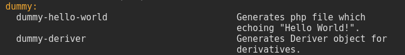

::: warning [Материал неактуален для новых версий Drush]
Материал актуален только для **Drush 9** и **Drush 10**. В **Drush 11**
изменились генераторы, поэтому она не актуальна.
:::

**Drush генератор** — сервис, добавляющий команду `drush generate [NAME]`,
результатом выполнения которой является набор каких-либо файлов.

В основном драш генераторы используются для генерации кода или заготовок для
кода в Drupal. Так, например, есть простенькие генераторы,
типа `drush generate composer`, который добавляет composer.json файл к модулю с
базовой информацией, так и более комплексные,
например `drush generate content-entity`, которая создает модуль, а также
различные файлы с примерами создания своей собственной контент-сущности, по
сути, делая полноценный рабочий модуль.

Стандартные генераторы нацелены на разработчиков, позволяя им писать меньше кода
и не заниматься копипастом. Например, все [плагины блоков][d8-block-plugin]
имеют идентичный каркас, не зависимо от задачи. Запомнить все подобные
конструкции - очень сложно. Писать их каждый раз с нуля, или копируя откуда-то -
очень затратное по времени действие. Тут и пригодится генератор. Вы просто
пишите `drush generate block`, отвечаете на необходимые вопросы, и в зависимости
от ваших ответов, вы получите максимально готовый к использованию и допиливанию
каркас с кодом, который сделает за вас 99% рутины.

По умолчанию, генераторы нацелены на ядро и его возможности, они ничего не знают
о сторонних модулях и ваших потребностях. Поэтому у них есть свой API,
позволяющий модулям добавлять свои собственные генераторы со своей целью,
поведением, требованиями и т.д.

Drush генератор - это обертка
над [Drupal Code Generator](https://github.com/Chi-teck/drupal-code-generator),
который, в свою очередь, является обёрткой для компонента
Symfony [Console](https://symfony.com/doc/current/components/console.html).
Таким образом, мы имеем достаточно обширный API, который позволяет делать по
сути, любые возможные генераторы.

## Состав генератора

### Сервис генератора

Генератор для Drush — это [сервис с меткой][d8-tagged-services]
`drush.generator`, объявленный в файле **drush.services.yml** по всем тем же
правилам, что и [обычные сервисы][d8-services].

Пример сервиса

```yaml {"header":"drush.service.yml"}
services:
  mymodule.generator:
    class: Drupal\mymodule\Generator\MyAwesomeGenerator
    tags:
      - { name: drush.generator }
```

### Объект генератора

Как и все сервисы, он должен иметь под собой объект. В случае с генератором, это
будет объект, который расширяет `DrupalCodeGenerator\Command\BaseGenerator`. В
нём и будет находиться вся основная логика.

#### Свойства

Свойства, которые наследуются от `BaseGenerator`:

- `$name`: (обязательно) Название команды для генератора. Например, если
  укажите `foo-bar`, то он будет доступен по вызову `drush generate foo-bar`. Вы
  также можете указать название в формате `namespace:command-name`. В таком
  случае, если команда в `namespace` одна, её можно вызвать по этому
  неймспейсу `drush generate namespace`. Если команд две и более, при обращении
  как к `namespace` так и к `command-name` будет показан ошибка с подсказкой
  какие команды имеются в данном неймспейсе или из каких неймспейсов есть данная
  команда, соответственно. Таким образом, команды уже нужно будет вызывать
  как `drush generate namespace-command-name`. Основной задачей указания
  неймспейса является то, что команды из одного неймспейса группируются в
  документации. Если же неймспейс не указан, то они попадают в `_global`.
- `$description`: Строка с описанием данного генератора. Будет отображена в
  списке генераторов `drush generate`.
- `$alias`: Позволяет задать альтернативное название команде. Например `module`
  в Drupal Code Generator, это алиас для `d8:module:standard`. Все генераторы
  DCG проходят дополнительную обработку Drush и у них срезается приставка версии
  ядра (`d8`), что по факту делает `module` алиасом для `module:standard`, так
  он становится доступен по двум запросам `drush generate module`
  и `drush generate module-standard`.
- `$label`: Метка команды. Не заметил её использование дальше DCG, так что,
  смело можно пропускать. По всей видимости это только для команд, поставляемых
  DCG.
- `$templatePath`: Путь до папки, где находятся .html.twig файлы с шаблонами,
  которые вы хотите использовать для генерации файлов. По умолчанию, примет
  значение `[drupal-code-generator-vendor]/templates` — это значит, что
  темплейты будут искаться, в templates папке самого Drupal Code Generator.
- `$directory`: Путь до рабочей папки, куда будет сгенерирован результат. По
  умолчанию принимает значения корня ядра (где находится index.php).
- `$destination`: Путь назначения результата работы генератора. По умолчанию он
  имеет значение `modules/%`. Данное значение используется Drush если
  там `modules/%` или `themes/%`. В таком случае, он автоматически добавит
  генератору вопрос, о том, к какому модулю или теме, соответственно, необходимо
  положить результат. Он предложит автодополнение активного модуля или темы в
  процессе генерации, а затем, в зависимости от выбранного модуля или темы,
  заменит значение `$directory` на полный путь до их корневой папки. Обратите
  внимание, что даное поведение работает только с `collectVars()` где
  в `$questions` он обнаружит ключи `name` и `machine_name`.
- `$assets`: Массив из `\DrupalCodeGenerator\Asset` объектов, в которых описано
  что нужно создать и как это сделать.
- `$vars`: Массив переменных, при принципу `$variables`
  от `hook_preprocess_HOOK()`, которые будут переданы во все темплейты,
  вызванные в процессе генерации. Также он хранит результаты всех вопросов.

#### Методы

Методов у `BaseGenerator` предостаточно, часть из них тянется от самого
Symfony `Command`, поэтому все рассматривать мы не будем, так как часть из них,
не нужно, ни вызывать, ни переопределять.

##### Необходимые методы

- `interact()`: Первый и единственный самый важный метод у генераторов. Данный
  метод вызывается в процессе работы генератора. Он отвечает за то, как поведет
  себя генератор и что будет его результатом.

##### Утилитарные методы

В данном разделе находятся меоды, которые вы также можете переопределить, но с
огромной вероятностью, этого делать не нужно. Они уже описаны, настроены и
готовы вам помочь. Поэтму лишь рассмотрим их в действии.

`ask()`: Задает пользователю лишь один вопрос и получает его ответ.

```php
$question = new Question('What is your name?');
$result = $this->ask($input, $output, $question);
```

`&collectVars()`: Метод, позволяющий запросить какие-либо данные у пользователя.
Работает как `ask()`, только принимает сразу несколько вопросов и задает каждый
по порядку, а результаты записывает в свойство `$vars`.

```php
$questions = [];

$questions['name'] = new Question('What is your name?');

$questions['likes_drupal'] = new ChoiceQuestion('Do you like Drupal?', [
  'yes' => 'Yes!',
  'no' => 'No :(‍',
]);

$this->collectVars($input, $output, $questions);

// $this->vars['name']
// $this->vars['likes_drupal']
```

`addFile()`: Добавляет файл в ассеты. В качестве аргумента, принимает путь до
файла. Является обёрткой для `addAsset()`.

Обратите внимание на то, что `path()` метод у ассета умеет подставлять
переменные из `$vars` автоматически, тогда как `template()` не умеет!

```php
$this
  ->addFile()
  ->path('src/Plugin/MyModule/{foo}/{bar}.php')
  ->template($this->vars['template_name'] . '.html.twig');
```

`addDirectory()`: Добавляет директорию в ассеты. Также является оберткой
для `addAsset()`.

```php
$this
  ->addDirectory()
  ->path('new-folder');
```

## Дополнительные объекты

В данном разделе мы рассмотрим объекты, которые уже не являются частью
непосредственно генератора, но при этом активно используются в процессе работы.

### DrupalCodeGenerator\Asset

Каждый объект данного типа хранит в себе информацию, что ему необходимо сделать.
Он может быть двух типов `directory` — для создания папок и `file` — для
создания файла.

Для него, в объекте генератора уже подготовлены три метода `addAsset()`,а также
обертки над ним `addDirectory()` и `addFile()`, которые сразу задают
соответствующие типы ассета. В качестве результата вы получите экземпляр
созданного `Asset` объекта, и можете дополнить его.

#### Методы

- `path()`: Задает путь до создаваемого файла или деректории,
  относительно `$directory`.
- `content()`: Содержимое для создаваемого `file`.
- `template()`: Путь до шаблона, отсносительно `$templatePath` который будет
  использован для генерации содержимого `file`. Данная строка поддерживает
  токены формата `{token_name}`, где `token_name` ключ из `$this->vars` объект
  генератора или переданного вручную при помощи `vars()`.
- `headerTemplate()`: Аналогично `template()`, только его результат добавится
  перед результатом `template()`.
- `action()`: Действите, которое будет применено к ассету. Используется только
  для `file`. Может принимать значения `replace` (по умолчанию) - замена файла
  если имеется, `append` — создание файла если нет, а если есть, добавляет
  содержимое ассета в конец существующего файла.
- `setMode()`: Chmod значение для директории или файла, которые необходимо
  применить при их создании. По умолчанию 755 для директории и 644 для файлов.

### DrupalCodeGenerator\Utils

Утилитарный объект, который уже содержит часто используемый и необходимый код.

Там прилично методов, все они простые, поэтому посмотрим лишь на парочку самых
ходовых.

- `Utils::pluginQuestions()`: Возвращает массив вопросов для генерации плагина,
  которые запрашивают у пользователя: `plugin_label`, `plugin_id`, `class`.
- `Utils::moduleQuestions()`: Возвращает массив вопросов для генерации модуля,
  которые спрашивают у пользователя: `name`, `machine_name`. Передав данные
  вопросы в `collectVars()`, Drush автоматически сделает автоматическое
  дополнение название модуля.
- `Utils::camelize()`: Преобразовывает строку в CamelCase. Очень полезно для
  генерации объектов. Например, передав туда id плагина,
  например `foo_bar_plugin`, можно получить `FooBarPlugin` и использовать для
  создания одноименного объекта и файла, и не придется спрашивать об этом
  пользователя.
- `Utils::replaceTokens()`: Заменяет токены в строке в формате `{token_name}` на
  значения из массива.

### Symfony\Component\Console\Question

Question объекты, это то, при помощи чего вы можете взаимодействовать с
пользователем.

Всего их предоставляется по умолчанию три штуки, два из которых лишь обертки
над `Question`.

#### Question

Простой объект, вы указываете вопрос, и при желании значение по умолчанию. Этот
вопрос будет задан пользователю, а ответ будет результатом.

```php
$question = new Question('What is your name?');
$result = $this->ask($question);
```

#### ChoiceQuestion

Вопрос, где пользователю необходимо выбрать один из предоставленных вариантов.
Варианты состоят из массива, где ключ — значение, что вы получите в качестве
результата, а значение — его метка.

```php
$choices = [
  'ru' => 'Russian',
  'en' => 'English',
  'und' => 'Another language',
];

$question = new ChoiceQuestion('What is your primary language?', $choices, 'und');
$result = $this->ask($question);
```

#### ConfirmationQuestion

Данный объект задает какой-то утвердительный вопрос, на который можно ответить
лишь да или нет. Используется для подтверждения действий.

```php
$question = new ConfirmationQuestion('Are you sure?', FALSE);
$result = $this->ask($question);
```

У объектов `Question` множество различных методов. Вы можете создавать свои,
наследуя их, и расширять функционал. Там есть весь инструментарий чтобы вам в
этом помочь, валидаторы, нормалайзеры и т.д. Для этого лучше обращайтесь
к [документации Symfony](https://symfony.com/doc/current/components/console/helpers/questionhelper.html)
или просто изучите исходник. Там нет ничего сложного.

## А также

Там есть два объекта, которые вы постоянно будете принимать в `interact()` и
передавать их в другие методы: `InputInterface` и `OutputInterface`. Напрямую с
ними вы врятли будете работать, но если вдруг потребуется, аналогично,
обращайтесь к документации Symfony.

Следует также понимать, что в момент вызова генератора, Drupal ядро полностью
запущено, и вы можете спокойно передавать сервисы из ядра или иных модулей,
используя их для своих целей, а также, обращаться к Drupal API.

Вам не нужно заботиться о `$destination`, если вы передадите в `collectVars()`
вопросы с ключами `name` и `machine_name` для того чтобы получить модуль или
тему. Если вы их передадите Drush добавит автокомплит, а также, после выбора
модуля, установит `$destination` равный корню данного модуля или темы.

## Примеры

Время собирать пазл!

### Пример №1 — Простой пример

Данный пример не будет нести абсолютно никакой практической пользы, он будет
лишь очень лайтовым примером работы генератора.

Мы создадим генератор, который будет создавать .php с
содержимым `echo "Hello World";` в корне ядра, без использования темплейтов.
Чтобы всё было максимально просто.

Первым делом нам необходимо создать объект генератора.

```php {"header":"src/Generators/HelloWorldGenerator.php"}
<?php

namespace Drupal\dummy\Generators;

use DrupalCodeGenerator\Command\BaseGenerator;
use Symfony\Component\Console\Input\InputInterface;
use Symfony\Component\Console\Output\OutputInterface;

/**
 * Class HelloWorldGenerator.
 *
 * @package Drupal\dummy\Generators
 */
class HelloWorldGenerator extends BaseGenerator {

  /**
   * {@inheritDoc}
   */
  protected $name = 'dummy:hello-world';

  /**
   * {@inheritDoc}
   */
  protected $description = 'Generates php file which echoing "Hello World!".';

  /**
   * {@inheritDoc}
   */
  public function interact(InputInterface $input, OutputInterface $output) {
    $file_content = <<<PHP
<?php

/**
 * @file
 * Shows how simple generator works.
 */
 
echo 'Hello World';

PHP;

    // Write content to file.
    $this
      ->addFile('hello-world.php')
      ->content($file_content);
  }

}
```

Что мы сделали в генераторе:

- Задали название команды `dummy:hello-world`, следовательно, вызываться наш
  генератор будет по запросу `drush generate dummy-hello-world`.
- Установили простенькое описание для нашего генератора.
- В методе `interact()` мы подготавливаем содержимое файла без шаблона.
- Затем мы добавляем файл `hello-world.php` и помещяем туда, в качестве
  содержимого, значение из переменной.

Вот такой простой генератор, который создаст файл относительно ядра, так как мы
не задавали `$directory`.

Теперь нам необходимо объявить его как сервис.

```yaml {"header":"drush.services.yml"}
services:
  dummy.hello_world_generator:
    class: Drupal\dummy\Generators\HelloWorldGenerator
    tags:
      - { name: drush.generator }
```

Всё готово!

:: video [drush generate dummy-hello-world] (
video/Drush-generator-hello-world.mp4)

### Пример №2 — Deriver

В этом примере мы уже воспользуемся Twig темплейтом, а также утилитарными
вопросами насчет модулей.

Мы создадим генератор [Deriver объекта][d8-derivatives]. Да не просто генератор,
а с возможностью выбора, делать его простым, или с Dependency Injection
сервисов.

Первым делом давайте подготовим объект генератора.

```php {"header":"src/Generators/DeriverGenerator.php"}
<?php

namespace Drupal\dummy\Generators;

use DrupalCodeGenerator\Command\BaseGenerator;
use DrupalCodeGenerator\Utils;
use Symfony\Component\Console\Input\InputInterface;
use Symfony\Component\Console\Output\OutputInterface;
use Symfony\Component\Console\Question\ConfirmationQuestion;
use Symfony\Component\Console\Question\Question;

class DeriverGenerator extends BaseGenerator {

  /**
   * {@inheritDoc}
   */
  protected $name = 'dummy:deriver';

  /**
   * {@inheritDoc}
   */
  protected $description = 'Generates Deriver object for derivatives.';

  /**
   * {@inheritDoc}
   */
  protected $templatePath = __DIR__ . '/templates';

  /**
   * {@inheritDoc}
   */
  public function interact(InputInterface $input, OutputInterface $output) {
    // Collects module info.
    $questions = Utils::moduleQuestions();
    $this->vars = &$this->collectVars($input, $output, $questions);

    // Ask for DependencyInjection.
    $dependency_injection_question = new ConfirmationQuestion(t('Do you want to add Dependency Injection support for deriver?'), TRUE);
    $this->vars['dependency_injection'] = $this->ask($input, $output, $dependency_injection_question);

    // Ask for deriver name.
    $default_deriver_name = Utils::camelize($this->vars['name'] . 'Deriver');
    $deriver_name_question = new Question(t('Deriver object name'), $default_deriver_name);
    $deriver_name_question->setValidator([Utils::class, 'validateRequired']);
    $this->vars['class_name'] = $this->ask($input, $output, $deriver_name_question);
  
    $this
      ->addFile('src/Plugin/Derivative/{class_name}.php')
      ->template('deriver.html.twig');
  }

}
```

А теперь разберемся что сделали:

- Мы добавили название нашей команде `dummy:deriver` для вызова
  по `drush generate dummy-deriver`.
- Мы добавили простенькое описание.
- Мы также указали путь где искать темплейты, так как мы уже ими будем
  пользоваться. В данном случае, мы указали что искать в папке /templates,
  относительно текущей (где объект генератора).
- Затем мы описываем метод `interact()`:
  - Мы воспользовались `Utils::moduleQuestions()`, который подготавливает
    вопросы и автокомплит для модулей. Результат этих вопросов мы записываем
    в `$this->vars`.
  - Мы добавлем вопрос-подтверждение, нужно ли добавить Dependency Injection для
    нашего объекта, по умолчанию задав `TRUE`. Результат вопроса мы записываем
    в `$this->vars['dependency_injection']`.
  - Так как мы генерируем название, нам нужно для него название. Первым делом,
    мы генерируем значение по умолчанию, чтобы можно было "предугадать"
    название, или просто чтобы было как подсказка для пользователя. Мы готовим
    название из названия модуля (машинного) добавляя к нему `Deriver` строку.
    Всё это мы обрабатываем `Utils::camelize()` чтобы строка стала подходящим
    названием объекта и файла. Например результат `foo_barDeriver` превратиться
    в `FooBarDeriver`.
  - Далее мы задаем вопрос насчет названия объекта, и устанавливаем наше
    значение по умолчанию.
  - Мы также используем метод `validateRequired()` как валидатор для нашего
    вопроса. Это значит, что пользователю надо будет дать на него ответ, хотя в
    этом особо смысла и нет, так как наш вопрос уже содержит значение по
    умолчанию, и его невозможно зафейлить, но для примера пусть будет.
  - Затем задаем этот вопрос пользователю и записываем результат
    в `$this->vars['class_name']`.
  - В конце мы указываем что нужно создать файла по
    пути `'src/Plugin/Derivative/{class_name}.php'`, где `{class_name}`
    заменится на значение из переменной выше. А в качестве содержимого файла
    нужно использовать шаблон `deriver.hmtl.twig`, который будет искаться
    в `$templatePath`.

Далее нам необходимо создать темплейт с учетом всего необходимого.

```twig {"header":"src/Generators/templates/deriver.html.twig"}
<?php

namespace Drupal\{{ machine_name}}\Plugin\Derivative;

use Drupal\Component\Plugin\Derivative\DeriverBase;

use Drupal\Core\Logger\LoggerChannelInterface;
use Drupal\Core\Plugin\Discovery\ContainerDeriverInterface;
use Symfony\Component\DependencyInjection\ContainerInterface;


/**
 * Class {{ class_name }}.
 *
 * @package Drupal\{{ machine_name }}\Deriver
 */
class {{ class_name }} extends DeriverBase implements ContainerDeriverInterface {


  /**
   * The logger channel.
   *
   * @var \Drupal\Core\Logger\LoggerChannelInterface
   */
  protected $logger;

  /**
   * {{ class_name }} constructor.
   *
   * @param \Drupal\Core\Logger\LoggerChannelInterface
   *   The logger channel.
   */
  public function __construct(LoggerChannelInterface $logger) {
    $this->logger = $logger;
  }

  /**
  * {@inheritdoc}
  */
  public static function create(ContainerInterface $container, $base_plugin_id) {
    return new static(
      $container->get('logger.factory')->get('{{ machine_name }}'),
    );
  }

  /**
   * {@inheritdoc}
   */
  public function getDerivativeDefinitions($base_plugin_definition) {
    $this->derivatives['derivative_id'] = $base_plugin_definition;
    $this->derivatives['derivative_id']['annotation_key'] = 'Annotation value';

    return $this->derivatives;
  }

}
```

Наш темплейт содержит весь объект деривера, где динамические части заменены на
переменные из `$this->vars`.

Думаю, тут особо даже объяснять нечего, все стандартно для Twig, никаких
особенностей.

Результат данного шаблона будет вставлен в файл который генерируется.

Нам остается только объявить наш объект как сервис.

```yaml {"header":"drush.services.yml"}
services:
  dummy.deriver_generator:
    class: Drupal\dummy\Generators\DeriverGenerator
    tags:
      - { name: drush.generator }
```

Сбрасываем кэш, и можно проверять!

:: video [drush generate dummy-deriver] (video/Drush-generator-deriver.mp4)

Мы также можем написать команду `drush generate` и увидить, что наши команды
находятся в собственной группе, из-за неймспейса, с указанными нами описаниями



[d8-services]: ../../../../2017/06/21/d8-services/index.ru.md
[d8-block-plugin]: ../../../../2015/10/19/d8-block-plugin/index.ru.md
[d8-derivatives]: ../../../../2019/05/04/d8-derivatives/index.ru.md
[d8-tagged-services]: ../../../../2019/05/05/d8-tagged-services/index.ru.md
