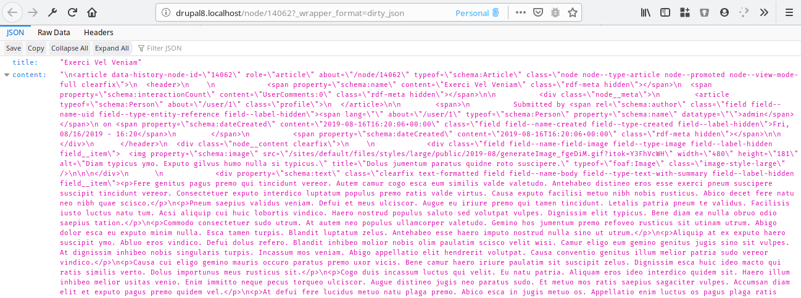
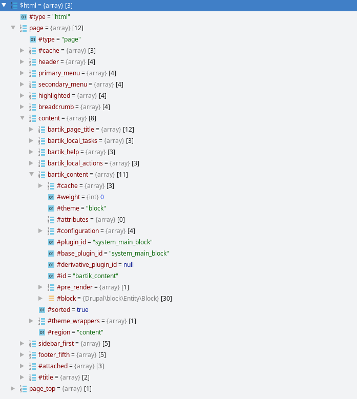
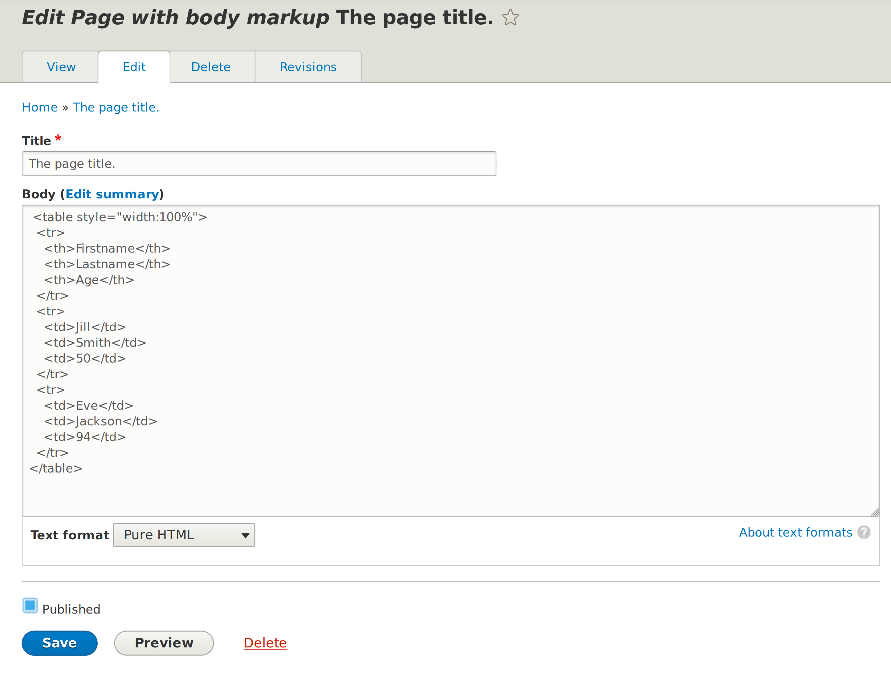
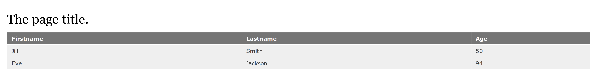
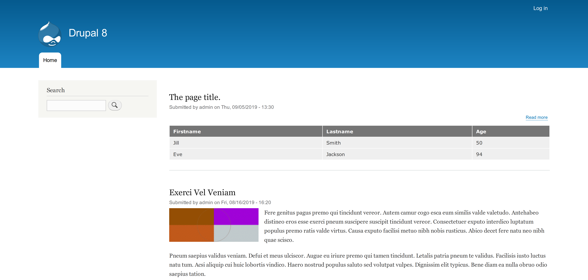
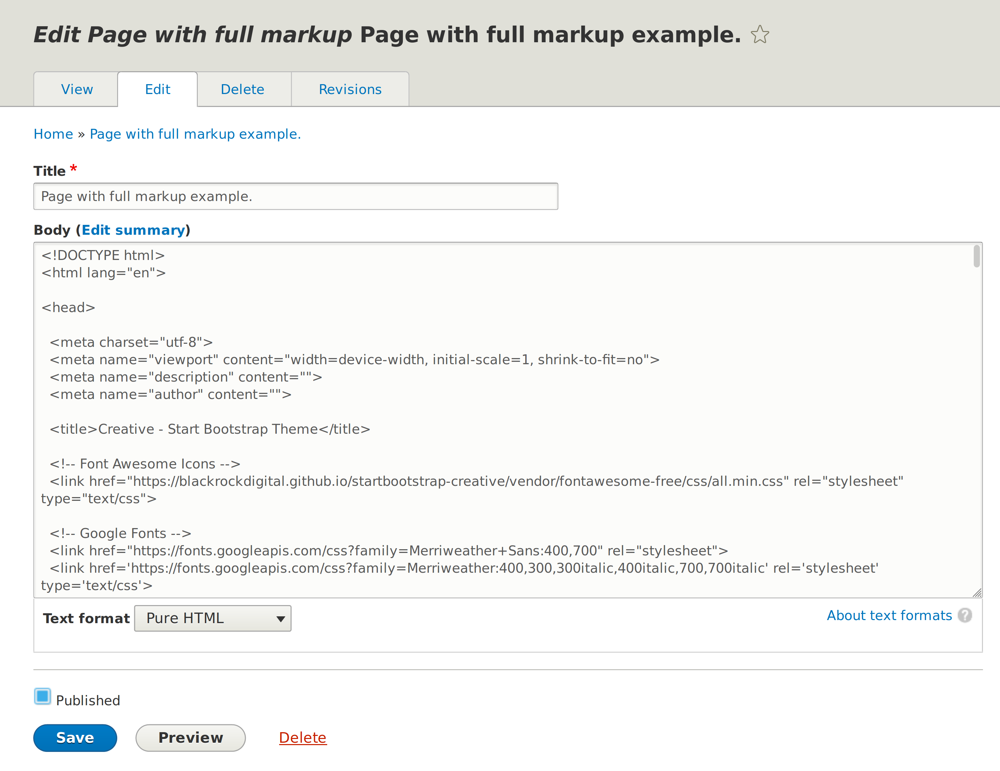

Drupal, так или иначе, отдаёт ответ на пришедший запрос. В качестве результата
ответа может быть что угодно: html, json, xml и т.д. Если вы знакомы
с [REST Resource плагинами][drupal-8-how-to-create-a-custom-rest-plugin], то вы уже знаете параметр
`_format`, который позволяет влиять на то, в каком формате вернёт ответ
REST-ресурс. В это материале мы разберемся и посмотрим как можно заставить ядро
отдавать результат страниц, так как нужно и в каком нужно формате.

## Событие KernelEvents::VIEW

Наша история начинается с [события][drupal-8-events] `KernelEvents::VIEW`. Данное
событие вызывается в тех случаях, когда контроллер страницы не
возвращает `Response`. В случае если `Response` возвращается непосредственно
контроллером, то наша история на этом заканчивается, что там вернули, то и будет
ответом сайта.

Именно поэтому, в Drupal ответы и результат страницы собирается через рендер
массивы, но это уже отдельная тема. Так вот, по умолчанию, почти все контроллеры
что в ядре, что в контрибе, что в кастоме, обычно возвращают именно рендер
массив, а не `Response`.

Так происходит ситуация, когда надо возвращать результат пользователю, но
никакого ответа нет. Срабатывает данное событие и подключаются подписчики. Им
передается объект события типа `GetResponseForControllerResultEvent`, при помощи
одного из методов которого `setResponse()`, один из них и должен установить
ответ.

Друпал также подписывается несколько раз на данное событие для обработки
различных ситуаций, но самый важный и интересный подписчик, который будет
срабатывать практически всегда, это `main_content_view_subscriber`.

## MainContentViewSubscriber

`main_content_view_subscriber` он же `MainContentViewSubscriber` — самый главный
подписчик `KernelEvents::VIEW`. Он срабатывает в 100% случаев, когда вы гуляете
по рабочим страницам сайта без всяких кастомизаций, с обычным HTTP запросом.

Данный подписчик делает следующие действия:

- Получает текущий `Request` и результат контроллера запроса.
- Он сразу проверяет:
  - Является ли результат контроллера массивом (подразумевая что это рендер
    массив).
  - Указан ли для запроса query параметр `_wrapper_format` или же, `_format`
    равный `html`. По умолчанию, `_format` равняется `html`, но мы его иногда
    меняем, например для REST ресурсов. Таким образом, если `_format` указан, и
    не равняется `html`, но при этом отсутствует параметр `_wrapper_format`, то
    данный подписчик прекратит свою работу.
- Затем он пытается получить формат обёртки для ответа из `_wrapper_format`, и
  если она не указана, устанавливает `html` по умолчанию.
- Затем, он проверяет, есть ли рендерер данного типа в Drupal, если его нет, по
  умолчанию используется `html`. Об этом чуть позже.
- Далее он пытается получить объект данного рендерера. В Drupal из коробки они
  все являются сервисами.
- Затем рендерер формирует результат и он устанавливается в качестве основного
  ответа сайта.

Он достаточно простой и маленький, но вы уже узнали:

- Что существуют некие рендереры ответов (и это не `renderer` для рендер
  массивов).
- Что вы можете обратиться к сайту с параметром `_wrapper_format`, и если
  укажите корректный рендерер, который доступен на сайте, то сможете получить
  ответ в ином формате. Попробуйте на своём сайте обратиться к любой действующей
  странице с `?_wrapper_format=drupal_modal`.

Как вы уже могли догадаться по второму пункту, содержимое
для [модальных окон][drupal-8-modal-api] именно так и обрабатывается. Магия того, как
он так открывает содержимое без лишнего оформление в модальном окне, потихоньку
начинает становиться явной, не так ли? ;)

## Рендереры

В предыдущем разделе я упомянул что ищется и используется некий рендерер, `html`
по умолчанию, результат работы которого и будет ответ сайта.

Ядро поставляет следующие типы рендереров:

- `html` (сервис `main_content_renderer.html`): Подготавливает HTML результат в
  качестве ответа. Но о нём чуть позже.
- `drupal_ajax` и `iframeupload` (сервис `main_content_renderer.ajax`): Рендер
  AJAX ответов.
- `drupal_dialog` (сервис `main_content_renderer.dialog`): Рендер AJAX ответов
  для диалоговых окон. Подключает все необходимые библиотеки, готовит результат
  и опции для конечной js-библиотеки.
- `drupal_dialog.off_canvas` (сервис `main_content_renderer.off_canvas`): Рендер
  AJAX ответов для выезжающего (справа или слева) диалогового окна.
- `drupal_dialog.off_canvas_top` (
  сервис `main_content_renderer.off_canvas_top`): Делает то же самое что
  и `drupal_dialog.off_canvas`, только диалоговое окно будет сверху.
- `drupal_modal` (сервис `main_content_renderer.modal`): Рендер AJAX ответов для
  модальных окон.

Рендерер является [сервисом с меткой][drupal-8-tagged-services]
`render.main_content_renderer`. Он формирует ответ, который будет возвращен
`MainContentViewSubscriber`.

Для того чтобы создать свой собственный рендерер, вам необходимо создать объект,
реализующий `MainContentRendererInterface`, а затем объявить как сервис с
меткой.

Данный объект должен иметь всего один метод `renderResponse()`. Он принимает
следующие аргументы:

- `$main_content`: Рендер массив (или просто какой-то массив) собранный
  контроллером с содержимым страницы (без обёрток типа page, html).
- `$request`: Объект текущего запроса.
- `$route_match`: Объект, содержащий всю информацию о текущем маршруте.

На основе данных аргументов, вы должны подготовить `Response`.

Очень грубый пример рендерера (лишь для общего понимания происходящего), который
отрендерит рендер массив в HTML и вернет его в качестве JSON ответа:

```php {"header":"src/Render/MainContent/DirtyJsonRenderer.php"}
<?php

namespace Drupal\example\Render\MainContent;

use Drupal\Core\Controller\TitleResolverInterface;
use Drupal\Core\Render\MainContent\MainContentRendererInterface;
use Drupal\Core\Render\RendererInterface;
use Drupal\Core\Routing\RouteMatchInterface;
use Symfony\Component\HttpFoundation\JsonResponse;
use Symfony\Component\HttpFoundation\Request;

/**
 * Example renderer which render to HTML and return it as JSON.
 */
class DirtyJsonRenderer implements MainContentRendererInterface {

  /**
   * The renderer.
   *
   * @var \Drupal\Core\Render\RendererInterface
   */
  protected $renderer;

  /**
   * The title resolver.
   *
   * @var \Drupal\Core\Controller\TitleResolverInterface
   */
  protected $titleResolver;

  /**
   * Constructs a new DirtyJsonRenderer object.
   *
   * @param \Drupal\Core\Render\RendererInterface $renderer
   *   The renderer.
   */
  public function __construct(RendererInterface $renderer, TitleResolverInterface $title_resolver) {
    $this->renderer = $renderer;
    $this->titleResolver = $title_resolver;
  }

  /**
   * {@inheritdoc}
   */
  public function renderResponse(array $main_content, Request $request, RouteMatchInterface $route_match) {
    $title = isset($main_content['#title']) ? $main_content['#title'] : $this->titleResolver->getTitle($request, $route_match->getRouteObject());
    $html = $this->renderer->renderPlain($main_content);

    $result = [
      'title' => $title,
      'content' => $html,
    ];

    return new JsonResponse($result);
  }

}
```

Затем объявляем его как сервис с меткой, указывая в `format` то, за какой
враппер он отвечает:

```yaml {"header":"example.services.yml"}
services:
  example.main_content_renderer.dirty_json:
    class: Drupal\example\Render\MainContent\DirtyJsonRenderer
    arguments: ['@renderer', '@title_resolver']
    tags:
      - { name: render.main_content_renderer, format: dirty_json }
```

После сброса кэша мы сможем запрашивать страницы в данном формате, добавляя в
запрос `?_wrapper_format=dirty_json`.

Пример такого ответа:



## HtmlRenderer

`HtmlRenderer` (сервис `main_content_renderer.html`) отвечает за обработку
обёртки `html`, которая используется по умолчанию. То есть, открывая сайты на
друпал и просто кликая по страницам, отрабатывает именно данный обработчик.

Ему стоит уделить отдельное внимание. Во-первых, именно он формирует остаточную
обёртку страниц, заворчивая содержимое в `page.html.twig`, а также
в `html.html.twig`. Да, именно тут происходит
вызов [хуков тем][drupal-8-hook-theme] `page` и `html`, с передачей всех переменных.
Во-вторых, он имеет свою систему плагинов! А это значит, вы можете влиять на его
работу.

Что делает данный рендерер:

- Первым делом он обрабатывает входящий рендер массив:
  - Здесь готовится заголовок для страницы и финальный рендер массив страницы.
  - Если в пришедшем ему рендер массиве основной элемент уже является
    типом `page`, то он подготовит лишь заголовок и обработку основного
    содержимого прекратит.
  - Если тип не `page` или не указан, он начнёт обработку основного содержимого:
    - Подготовит и вызовет событие `RenderEvents::SELECT_PAGE_DISPLAY_VARIANT`,
      на который могут подписаться модули и повлять на то, какой вариант
      отображения содержимого будет использован в конкретном случае. Об этом
      чуть позже.
    - После того как он получил вариант, он пре-рендерит содержимое, для того
      чтобы найти заголовок внутри содержимого по ключу `#title`.
    - Затем он окончательно готовит заголовок страницы, если его не обнаружено в
      рендер массиве, то он будет получен при помощи `title_resolver`. Именно
      поэтому, на страницах вьюсов заголовок меняется на кастомный "особым"
      способом, так как заголовок там формируется в `#title` и до title_resolver
      даже не доходит.
    - После того как заголовок получен, начинается ещё одна очень важная часть —
      инициализации и передача параметров плагину `@PageDisplayVariant`, который
      был выбран в `RenderEvents::SELECT_PAGE_DISPLAY_VARIANT`. По умолчанию
      это `simple_page`.
    - Далее, запускается `build()` плагина и он попадает в рендер массив
      с `'#type' => 'page'`, или, в темплейт `page.html.twig.`.
  - Затем, когда `page` уже готов, получается список регионов активной темы, и
    они добавляются к массиву страницы по своим ключам. И тут важно заметить,
    если плагин `@PageDisplayVariant` имеет в своём результате ключ, равные
    машинному названию региона, то данный регион работать не будет, если,
    конечно, плагин не позаботиться об этом. Приоритет отдаётся плагину. По
    умолчанию, под каждый регион создается просто пустая переменная темплейта.
  - Последним этапом подготовки, вызываются хуки
    аттачментов `hook_page_attachments()` и `hook_page_attachments_alter()`,
    позволяя добавить или повлиять на то, какие ататчменты доедут до финального
    результата.
- После того как все обработки завершились, он присваивает заголовок страницы
  в `$page['#title']`.
- А затем, заворачивает `page` в `html` (`html.html.twig`).
- Потом в `html` также добавляются переменные `page_top` и `page_bottom`,
  которые могут быть добавлены при помощи хуков `hook_page_top()`
  и `hook_page_bottom()`, соответственно.
- Затем происходит финальный пререндер темплейта.
- Собираются и добавляются в `html` все собранные
  [кэш данные][d8-cache-metadata]: tags, contexts, max-age. Также сверху
  докидывается тег `rendered` и кэш контексты из `required_cache_contexts`
  сервис-параметра (например `default.services.yml`).
- В конечном итоге, результат в виде, всё ещё, рендер массива, заворачивается
  в `HtmlResponse` и возвращается. Стоит заметить, что на данном этапе ещё не
  прозведены замены `<css-placeholder>` и подготовка прочих плейсхолдеров. Тут
  просто `#markup` всей `html.html.twig` страницы, обработка, замена на
  подключаемые библиотеки и т.д., происходит за пределами данного материала уже.
- Его перехыватывает `KernelEvents::VIEW`, а дальше вы уже знаете.

Если зарезюмировать, то в данном рендерере
готовится `html.html.twig`, `page.html.twig` и регионы темы с их блоками.

Примерный результат работы рендерера, до того как будет произведен пре-рендер:



Обратие внимание на то, что в регионах имеются рендер-массивы блоков, хотя ранее
я писал, что для них готовятся пустые переменные. Это связано с тем, что ядро
само подписывается на `RenderEvents::SELECT_PAGE_DISPLAY_VARIANT` и заменяет
стандартный плагин `simple_page` на `block_page`, который готовит рендер массивы
для регионов. Так как ключи совпадают, они скипаются и остаются неизменными до
конца.

## Плагины @PageDisplayVariant

`HtmlRenderer` имеет свою собственную систему плагинов, которая и отвечает за
подготовку финального рендер массива для содержимого сайта в `page.html.twig`.
Как ранее упоминалось, выбор, какой вариант отображения использовать, происходит
при помощи события `RenderEvents::SELECT_PAGE_DISPLAY_VARIANT`.

Ядро предоставляет следующие варианты отображения страницы:

- `simple_page`: (по умолчанию, формально) Прострая страница, готовит только
  переменную `content`, в которой будут находиоться рендер массивы для системных
  сообщений, заголовка страницы и непосредственно само содержимое. Иными
  словами, регионы в данном подходе будут иметь пустые переменные и на странице
  их не будет.
- `block_page`: (по умолчанию, если включен модуль `block`) Страница с блоками.
  Именно данные плагин работает в 100% случаев при стандартном поведении
  системы. Он и готовит рендер массивы блоков в свои регионы.
- `block_place_page`: Предоставляется эксперементальным модулем в
  ядре `place_block`. С аргументом `?block-place=1` он добавляет в регионы
  специальные кнопки для вставки нужных блоков прямо со страницы, в обход "
  Структура — Блоки".

### Пример плагина

Не могу придумать интересного кейса для примера плагина, поэтому
разберем `simple_page` из
ядра `Drupal\Core\Render\Plugin\DisplayVariant\SimplePageVariant`.

Плагины данного типа имеют простую аннотацию:

```php
/**
 * Provides a page display variant that simply renders the main content.
 *
 * @PageDisplayVariant(
 *   id = "simple_page",
 *   admin_label = @Translation("Simple page")
 * )
 */
```

Она содержит только `id` для машинного имени, и административную метку. Если не
ошибаюсь, page_variant от panels в 8-ке может позволять выбирать эти самые
варианты.

Сам объект плагина должен расширять `Drupal\Core\Display\VariantBase` и
реализовывать `Drupal\Core\Display\PageVariantInterface`.

У него может быть множество различных методов, но самые значимые это:

- `setMainContent()`: В него передается рендер массив основного содержимого
  из `HtmlRenderer`.
- `setTitle()`: В него передается заголовок страницы из `HtmlRenderer`.
- `build()`: На основе имеющихся данных, вы должно подготовить необходимый вам
  рендер-массив, который и станет частью `page.html.twig`.

После того как плагин объявлен, он начнёт обнаруживаться, но работать не будет,
так как нужно явно указать в каких ситуациях использовать его.

Для этого `HtmlRenderer`, прежде чем инициализировать плагин, вызывает
событие `RenderEvents::SELECT_PAGE_DISPLAY_VARIANT`.

В подписчик передается событие `PageDisplayVariantSelectionEvent`, у которого
есть парочка полезных методов:

- `getPluginId()`: Текущий выбранный id плагина.
- `setPluginId()`: Позволяет указать необходимый плагин.
- `addCacheContexts()`: Позволяет добавить дополнительные кэш контексты к
  результату страницы.
- `getRouteMatch()`: Информация о текущем роуте.

Так как события являются сервисами, вы можете передавать какие угодно
зависимости через Dependency Injection.

Так как `simple_page` по сути фолбек, если ничего не сработало, то и подписчика
у него нету. Давайте для этого глянем на подписчик `BlockPlaceEventSubscriber`,
который от плагина `block_place_page`.

```php
<?php

namespace Drupal\block_place\EventSubscriber;

use Drupal\Core\Render\PageDisplayVariantSelectionEvent;
use Drupal\Core\Render\RenderEvents;
use Symfony\Component\EventDispatcher\EventSubscriberInterface;
use Symfony\Component\HttpFoundation\RequestStack;
use Drupal\Core\Session\AccountInterface;

/**
 * @see \Drupal\block_place\Plugin\DisplayVariant\PlaceBlockPageVariant
 */
class BlockPlaceEventSubscriber implements EventSubscriberInterface {

  /**
   * The request stack.
   *
   * @var \Symfony\Component\HttpFoundation\RequestStack
   */
  protected $requestStack;

  /**
   * The current user.
   *
   * @var \Drupal\Core\Session\AccountInterface
   */
  protected $account;

  /**
   * Constructs a \Drupal\block_place\EventSubscriber\BlockPlaceEventSubscriber object.
   *
   * @param \Symfony\Component\HttpFoundation\RequestStack $request_stack
   *   The request stack used to retrieve the current request.
   * @param \Drupal\Core\Session\AccountInterface $account
   *   The current user.
   */
  public function __construct(RequestStack $request_stack, AccountInterface $account) {
    $this->requestStack = $request_stack;
    $this->account = $account;
  }

  /**
   * Selects the block place override of the block page display variant.
   *
   * @param \Drupal\Core\Render\PageDisplayVariantSelectionEvent $event
   *   The event to process.
   */
  public function onBlockPageDisplayVariantSelected(PageDisplayVariantSelectionEvent $event) {
    if ($event->getPluginId() === 'block_page') {
      if ($this->requestStack->getCurrentRequest()->query->has('block-place') && $this->account->hasPermission('administer blocks')) {
        $event->setPluginId('block_place_page');
      }
      $event->addCacheContexts(['user.permissions', 'url.query_args']);
    }
  }

  /**
   * {@inheritdoc}
   */
  public static function getSubscribedEvents() {
    // Set a very low priority, so that it runs last.
    $events[RenderEvents::SELECT_PAGE_DISPLAY_VARIANT][] = ['onBlockPageDisplayVariantSelected', -1000];
    return $events;
  }

}
```

Он достаточно примитивен и прост, пойдём снизу-вверх:

- В `getSubscribedEvents()` происходит подписка на событие, как обычно, в общем.
  Но тут стоит обратить внимание на вес этого подписчика. У `block_page`
  подписчик не имеет веса, а значит получает 0. Так как событие уведомляет всех
  подписчиков, и все они пытаются поставить своё значение, то для перекрытия
  нужно чтобы ваш подписчик сработал позже всех. Именно поэтому тут -1000. Он
  ожидает что сработает подписчик `block_page`, так как его логика завязана на
  нём же, а также, гарантирует что он отработает последним и его точно никто не
  перекроет (ну кроме жадненьких с весом -1001+ :)).
- В `onBlockPageDisplayVariantSelected()` описана логика. Он проверяет что
  текущий плагин установлен в `block_page`, а затем, проверяет query
  параметр `block-place` и права доступа к управленю блоками для текущего
  пользователя. Если всё положительно, то плагин подменяется на свой собственный
  и страница выглядит иначе.

И не забывайте. В данных плагинах вы отвечаете за формирование
содержимого `page.html.twig`, оно при любых раскладах будет также завёрнуто
в `html.html.twig` перед финальной обработкой.

## Резюмируя

В данном материале мы прошлись по всем основным этапам формирования основного
содержимого страницы, а точнее, попытку сформировать его.

Ключевые моменты:

- Ответ формируется не контроллером (в частном случае), а подписчиками
  события `KernelEvents::VIEW`. Вы можете вмешиваться в ответы и отдавать вообще
  что угодно и как угодно.
- Основной подписчик `main_content_view_subscriber` — который умеет обрабатывать
  различные форматы запроса. Для этого используются рендереры.
- Рендереры работают с основным содержимым сайта, что обычно попадает в
  переменную `content` темплейта `page.html.twig`.
- Самый популярный рендерер - `html`.
- У `html` рендерера есть своя система плагинов, которые позволяют повлиять на
  то, как вернется ответ в формате html.

Это открывает очень много различных возможностей и кейсов. Об этом, как минимум,
полезно знать.

## Пример

Учитывая что, то, что описано в материале, охватывает серьезный кусок Drupal
API, то привести какие-то примеры, покроющие многие вопросы, просто невозможно,
как и сложно придумать кейсы для примеров, ибо ядро из коробки хорошенько уже
позаботилось о нас.

Тем не менее я попробую добавить пример. Не так давно в drupal чатике задали
вопрос, который попадает в область данного материала, поэтому я возьму его за
пример, немного дополнив под задачу.

Там был кейс, что есть условный тип материала (ноды), в нём есть body поле, в
нём находится HTML разметка страницы. Задача в том, что на страницах данного
типа материала, нужно отдавать эту самую разметку, без всяких регионов и т.д.

Остальных деталей я не знаю, но в зависимости от следующих факторов, решение,
куда подключаться, будет совершенно разным:

- Если HTML разметка готова для вставки в `<body>`, будет достаточно создать
  плагин `@PageDisplayVariant` и отдавать его там.
- Если HTML разметка сразу включает в себя `<html>`, и возможно, даже свои
  собственные CSS и JS, то плагином тут не отделаться, и придется писать свой
  рендерер.

При любом раскладе, задача звучит крайне костыльно, но она хорошо подойдет для
иллюстрации как то, что описано в данном материале, может помочь в решении
данного рода задач в Drupal Way.

### Пример реализации №1

Данный пример реализации подразумевает следующее:

- Имеется тип материала `page_with_body_markup`.
- Материал имеет поле `body`, в котором будет разметка для `<body>`. То есть,
  обычный HTML в любом виде.
- Заголовок материала — будет использован для заголовка страницы.
- Результат будет использоваться в пределах основной темы, стили темы будут
  влиять на результат. Тема будет Bartik.

В данном случае нам будет достаточно сделать свой тип
плагина `@PageDisplayVariant` и через подписку на
событие `RenderEvents::SELECT_PAGE_DISPLAY_VARIANT` установить его в качестве
основного, в нужных нам местах.

Начнем мы с создания плагина:

```php {"header":"src/Plugin/DisplayVariant/BodyMarkup.php"}
<?php

namespace Drupal\example\Plugin\DisplayVariant;

use Drupal\Core\Display\PageVariantInterface;
use Drupal\Core\Display\VariantBase;
use Drupal\Core\Plugin\ContainerFactoryPluginInterface;
use Drupal\Core\Routing\RouteMatchInterface;
use Symfony\Component\DependencyInjection\ContainerInterface;

/**
 * Provides a page display variant that simply renders the main content.
 *
 * @PageDisplayVariant(
 *   id = "body_markup",
 *   admin_label = @Translation("Markup from body field")
 * )
 */
class BodyMarkup extends VariantBase implements PageVariantInterface, ContainerFactoryPluginInterface {

  /**
   * The render array representing the main content.
   *
   * @var array
   */
  protected $mainContent;

  /**
   * The page title: a string (plain title) or a render array (formatted title).
   *
   * @var string|array
   */
  protected $title = '';

  /**
   * The current route match.
   *
   * @var \Drupal\Core\Routing\RouteMatchInterface
   */
  protected $routeMatch;

  /**
   * {@inheritdoc}
   */
  public static function create(ContainerInterface $container, array $configuration, $plugin_id, $plugin_definition) {
    return new static(
      $configuration,
      $plugin_id,
      $plugin_definition,
      $container->get('current_route_match')
    );
  }

  /**
   * Constructs a new BodyMarkup object.
   *
   * @param array $configuration
   *   The plugin configuration.
   * @param $plugin_id
   *   The plugin ID.
   * @param $plugin_definition
   *   The plugin definition.
   * @param \Drupal\Core\Routing\RouteMatchInterface $route_match
   *   The current route match.
   */
  public function __construct(array $configuration, $plugin_id, $plugin_definition, RouteMatchInterface $route_match) {
    parent::__construct($configuration, $plugin_id, $plugin_definition);

    $this->routeMatch = $route_match;
  }

  /**
   * {@inheritdoc}
   */
  public function setMainContent(array $main_content) {
    $this->mainContent = $main_content;

    return $this;
  }

  /**
   * {@inheritdoc}
   */
  public function setTitle($title) {
    $this->title = $title;

    return $this;
  }

  /**
   * {@inheritdoc}
   */
  public function build() {
    /** @var \Drupal\node\NodeInterface $node */
    $node = $this->routeMatch->getParameter('node');

    $build = [
      'content' => [
        'messages' => [
          '#type' => 'status_messages',
          '#weight' => -1000,
          '#include_fallback' => TRUE,
        ],
        'page_title' => [
          '#type' => 'page_title',
          '#title' => $this->title,
          '#weight' => -900,
        ],
        'content' => [
          '#markup' => $node->get('body')->value,
          '#weight' => -800,
        ]
      ]
    ];

    return $build;
  }

}

```

Основные моменты плагина были описаны ранее в материале, пройдемся лишь по
ключевым местам:

- Был добавлен Dependency Injection, чтобы получать информацию о текущем
  маршрутье.
- В билде мы получаем ноду из маршрута. Проверок никаких нет, так как они будут
  произведены в событии, и до сюда даже не дойдет, если что-то пойдёт не так.
- Мы собираем собираем рендер массив для `page.html.twig`. Вы должны учитывать,
  что у вы должны готовить переменные, которые есть в темплейте, иначе вам
  придется корректировать темплейт. У всех тем есть вывод `page.content`,
  поэтому мы в `content` добавляем 3 вложенных рендер массива: вывод системных
  сообщений, заголовок и содержимое из `body` поля в качестве `markup` элемента.

Так будет формироваться результат для нашей страницы. Учитывая, что мы больше не
готовим никаких переменных для страницы, они окажутся пустыми и не будут
выведены.

Теперь необходимо подписаться на событие, определяющее, какой из плагинов
необходимо использовать для обработки.

```php {"header":"src/EventSubscriber/PageDisplayVariantSubscriber.php"}
<?php

namespace Drupal\example\EventSubscriber;

use Drupal\Core\Render\PageDisplayVariantSelectionEvent;
use Drupal\Core\Render\RenderEvents;
use Drupal\node\NodeInterface;
use Symfony\Component\EventDispatcher\EventSubscriberInterface;

/**
 * Selects the custom page display variant.
 */
class PageDisplayVariantSubscriber implements EventSubscriberInterface {

  /**
   * {@inheritdoc}
   */
  public static function getSubscribedEvents() {
    $events[RenderEvents::SELECT_PAGE_DISPLAY_VARIANT][] = ['onSelectPageDisplayVariant'];

    return $events;
  }

  /**
   * Selects the page display variant.
   *
   * @param \Drupal\Core\Render\PageDisplayVariantSelectionEvent $event
   *   The event to process.
   */
  public function onSelectPageDisplayVariant(PageDisplayVariantSelectionEvent $event) {
    $route_match = $event->getRouteMatch();

    // Only applicable for main content pages.
    if ($route_match->getRouteName() != 'entity.node.canonical') {
      return;
    }

    /** @var NodeInterface $node */
    $node = $route_match->getParameter('node');

    // Set this plugin only for specific type of nodes.
    if ($node->bundle() != 'page_with_body_markup') {
      return;
    }

    // We only apply plugin if body field is exist and is not empty.
    if (!$node->hasField('body') || $node->get('body')->isEmpty()) {
      return;
    }

    $event->setPluginId('body_markup');
  }

}

```

Чтобы наш плагин применился к странице, необходимо:

- Проверить, что мы находимся на каноничном маршруте сущности. Так мы ограничим
  работу плагина только на странице материала.
- Получить ноду из текущего маршрута.
- Проверяем что материал нужного типа.
- Проверяем, имеется ли поле `body` и оно не пустое. Иначе нам не хватит данных
  для сборки страницы.
- Если все условия пройдены, устанавливаем наш плагин.

Осталось зарегистрировать наш подписчик в сервисах.

```yaml {"header":"example.services.yml"}
  example.page_display_variant_subscriber:
    class: Drupal\example\EventSubscriber\PageDisplayVariantSubscriber
    tags:
      - { name: event_subscriber }
```

И можно проверять! Для примера я добавил следующий простой материал:



Заходя на страницу материала, пользователь будет видеть следующее:



При этом, это не влияет ни на какие иные страницы, где может оказаться материал.



### Пример реализации №2

Данный пример будет более хардкорный:

- Имеется тип материала `page_with_full_markup`.
- Материал имеет поле `body`, в котором будет абсолютно вся разметка страницы.
- Результат будет самодостаточный. Drupal на фронтенде никак не будет
  представлен.

В данном примере я не буду углубляться в ньюансы типа, где и как хранить css и
js файлы разметки. Подразумевается что они внешние. В друпале только разметка и
вывод как нужно.

Чтобы было нагляднее, я
взял [готовую тему](https://github.com/BlackrockDigital/startbootstrap-creative/)
и вставил её исходнки в `body`.



Теперь нужно вывести это без вмешательства Drupal в результат, но средствами
Drupal.

Принцип тут будет похож на предыдущей, только подключаться мы тут будем намного
раньше, и сами готовить ответ сервера, до того как им начнёт заниматься Drupal.

Для этого, нам достаточно подписаться на `KernelEvents::VIEW` и раньше всех
обработать данные, и если они нас устраивают, установить ответ.

```php {"header":"src/EventSubscriber/FullMarkupPageSubscriber.php"}
<?php

namespace Drupal\example\EventSubscriber;

use Drupal\Core\Render\HtmlResponse;
use Drupal\Core\Routing\RouteMatchInterface;
use Drupal\node\NodeInterface;
use Symfony\Component\EventDispatcher\EventSubscriberInterface;
use Symfony\Component\HttpKernel\Event\GetResponseEvent;
use Symfony\Component\HttpKernel\KernelEvents;

/**
 * Theme test subscriber for controller requests.
 */
class FullMarkupPageSubscriber implements EventSubscriberInterface {

  /**
   * The current route match.
   *
   * @var \Drupal\Core\Routing\RouteMatchInterface
   */
  protected $currentRouteMatch;

  /**
   * Constructs a new ThemeTestSubscriber.
   *
   * @param \Drupal\Core\Routing\RouteMatchInterface $current_route_match
   */
  public function __construct(RouteMatchInterface $current_route_match) {
    $this->currentRouteMatch = $current_route_match;
  }

  /**
   * {@inheritdoc}
   */
  public static function getSubscribedEvents() {
    $events[KernelEvents::VIEW][] = ['onView', 100];

    return $events;
  }

  /**
   * Enable raw response.
   */
  public function onView(GetResponseEvent $event) {
    // Only applicable for main content pages.
    if ($this->currentRouteMatch->getRouteName() != 'entity.node.canonical') {
      return;
    }

    /** @var NodeInterface $node */
    $node = $this->currentRouteMatch->getParameter('node');

    // Set this plugin only for specific type of nodes.
    if ($node->bundle() != 'page_with_full_markup') {
      return;
    }

    // We only apply plugin if body field is exist and is not empty.
    if (!$node->hasField('body') || $node->get('body')->isEmpty()) {
      return;
    }

    $response = new HtmlResponse($node->get('body')->value);
    $event->setResponse($response);
  }

}

```

В данном подписчкие мы проводим такие же проверки, как и в предыдущем примере,
только тип содержимого называется немного иначе.

Если все условий успешной пройдены, мы создаем `HtmlResponse` с содержимым из
поля `body` и устанавливаем его как ответ через событие.

Добавляем информацию о нашем подписчике в сервисы:

```yaml {"header":"example.services.yml"}
  example.full_markup_page_subscriber:
    class: Drupal\example\EventSubscriber\FullMarkupPageSubscriber
    arguments: ['@current_route_match']
    tags:
      - { name: event_subscriber }
```

И всё готово!

Зайдя на страницу материала, будет следующий результат:


А вот так это выглядит вживую:

:: video [Результаты из примеров подготовки основного содержимого.] (
video/full-result.mp4)

## Ссылки

- [Исходный код модуля с примером](example)

[d8-cache-metadata]: ../../../../2017/07/15/drupal-8-cache-metadata/index.ru.md
[drupal-8-how-to-create-a-custom-rest-plugin]: ../../../../2018/01/16/drupal-8-how-to-create-a-custom-rest-plugin/index.ru.md
[drupal-8-events]: ../../../../2018/04/10/drupal-8-events/index.ru.md
[drupal-8-hook-theme]: ../../../../2017/06/26/drupal-8-hook-theme/index.ru.md
[drupal-8-tagged-services]: ../../../../2019/05/05/drupal-8-tagged-services/index.ru.md
[drupal-8-modal-api]: ../../../../2016/08/30/drupal-8-modal-api/index.ru.md
