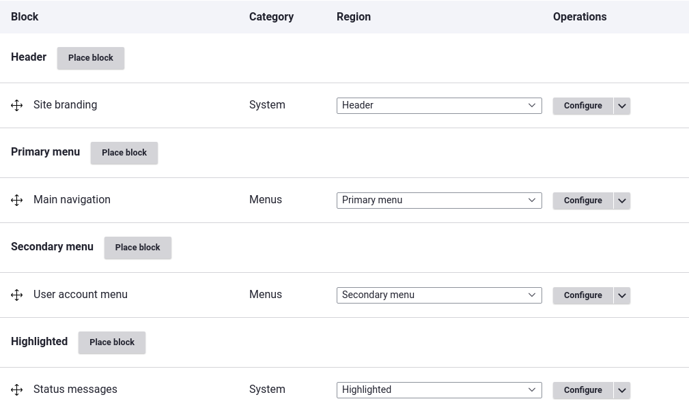

Материал может оказаться информативным если вы разработчик и:

- Устали от своей текущей CMS.
- Уже отлично знаете свою текущую CMS, но ощущаете что потолок слишком низкий
  или вы его достигли.
- Желаете узнать больше и прокачать свои навыки.
- Хотите посмотреть на альтернативы, но не можете их найти.
- Считаете или вам рассказывают что Drupal старая и тормозная система.

В сети регулярно, то тут, то там, всплывает вопрос: «А как дела у Drupal?», за
которым, с огромной вероятностью следует ответ: «Drupal — говно», «Drupal —
мёртвая система», «Drupal — мамонт», «Drupal — глючный и тормоз» и т.п.
Аргументация там обычно либо вообще отсутствует, либо уровня «потому что».

Я хочу пролить немного света на то, что сейчас на самом деле представляет собой
Drupal. Я не буду рассказывать что Drupal лучший и всё в таком духе. Я приведу
некоторые его достоинства, возможности и инструменты, которые, как мне кажется,
могут вызвать интерес у разработчиков попробовать Drupal. А выводы вы делайте
сами.

## Высокий порог входа

![Кривая обучения Drupal в сравнении с другими популярными CMS][cms-learning-curve]

Многие приводят данный факт как недостаток Drupal, я считаю что это огромное
преимущество, ведь он работает как естественный фильтр.

Современный стэк технологий требует современных знаний. Современные знания
требуют временных затрат и усилий для их освоения и поддержки в актуальном
состоянии.

Drupal предоставляет современный стэк технологий, инструменты и решения
заточенные под текущие реалии. Drupal не так сложен, как многие считают, в нём
просто много различных инструментов на все случаи жизни. Разработчику придётся
познакомиться с основными инструментами, понять, где и когда применять тот или
иной. Долго запрягаешь, потом быстро едешь.

В [ключевом докладе](https://dri.es/state-of-drupal-presentation-october-2019)
DrupalCon 2019 Amsterdam, Дрис привёл результаты по опросу, который проводила
команда Acquia UX.


_«Новички борются с Drupal, тогда как эксперты любят Drupal.»_ — Dries


_«Кривая настроений Drupal идёт в противоположном направлении от WordPress, AEM
и Sitecore.
Это предоставляет как большой вызов, так и возможность для Drupal.»_ — Dries

С каких пор высокая компетенция и актуальные знания стали недостатком?

## Composer

Composer — де-факто стандарт в PHP разработке. Сложно представить современную
разработку без него, тем не менее, многие системы до сих пор избегают его, от
чего страдают, в первую очередь, сами разработчики.

Drupal начал адаптацию Composer начиная с 8-й версии, и уже сейчас является
основным инструментом при разработке проектов. Проекты на Drupal можно целиком и
полностью [вести через Composer][d8-composer], без костылей и прослоек.

## ООП

Релиз Drupal 8 ознаменовал переход на ООП. Для Drupal это глоток свежего
воздуха, так как в нём можно практически всё расширять, заменять или изменять, и
ООП только помогает в этом.

У нас до сих пор есть легаси API который работает на функциях, но его количество
уже не так велико и постепенно остатки переводят на ООП.

Как подобает современным практикам, у нас
есть [сервисы и Dependency Injection][d8-services].

## Symfony

В Drupal используются компоненты Symfony, и не только, в качестве базы для своих
разработок. Подобный подход позволяет Drupal не изобретать колесо и
концентрировать свои силы на создании «космического корабля».

Работая с Drupal, вы хоть и немного, но начнёте знакомиться с некоторыми
компонентами и возможностями Symfony, а это, очень полезные знания. Вы также
увидите, как применяются данные компоненты на крупных проектах.

## Маршрутизация и ЧПУ

Для маршрутизации Drupal использует компоненты Symfony и имеет свои собственные
надстройки. Это позволяет делать маршрутизацию и ЧПУ любой сложности без
каких-либо проблем. Сложная иерархия в пути материалов? Не проблема!

Хотите взять работу ЧПУ под полный контроль?
Нужно [сделать параметры фильтров частью пути](http://xandeadx.ru/blog/drupal/965)?
Пожалуйста, [Inbound и Outbound обработчики][d8-inbound-outbound-processor]
позволят вам сделать всё что только придёт в голову.

## Система рендера

Система рендера в Drupal унифицирует и стандартизует работу со всем что не
является PHP кодом в PHP. Следовательно, никакого HTML, CSS, JavaScript прямо в
коде у нас нет. Это решается при помощи [рендер массивов][d8-render-arrays],
которые описывают требования и зависимости (этакий компонентный подход), а уже
затем, Drupal это превращает в HTML или что требуется проекту.

<mark>В PHP коде мы работаем с PHP</mark> — это простое правило протаптывает
тропинку для почти всего что будет перечислено далее, и без этой системы, многие
инструменты или решения были бы сложнее в реализации, использовании или вовсе не
возможны.

## TWIG (HTML)

Не пугайтесь, HTML и прочее у нас есть. За генерацию HTML разметки из рендер
массивов отвечает шаблонизатор Twig.

Таким образом, PHP код [выставляет требования и готовит данные][d8-hook-theme],
а Twig их превращает в результат. Это также позволяет иметь различные оформления
для одих и тех же данных. Хотите сделать версию для слабовидящих которая должна
быть сама по себе, или отдельную тему для определенного типа содержимого,
пожалуйста — вы можете [переключать темы оформления][d8-theme-negotiator] хоть
по фазе луны. Все остальные темы даже не узнают что произошёл рендер и не
создадут оверхеда.

Twig способствует снижению ошибок, максимально снижает возможность оставить дыры
в шаблонах, делает синтаксис более читабельным и акцентирует внимание на
разметке, а не коде. Писать бизнес-логику или запросы к БД в шаблонах — это не
про Drupal, шаблоны работают с готовыми данными.

Тема оформления отвечает только за визуальную составляющую сайта — простое
правило, но не все CMS это ещё усвоили.

## CSS и JavaScript

Знакома проблема когда на страницах грузятся CSS и JavaScript какой-нибудь
формы, которой даже нет не этой странице? В Drupal таких проблем не существует.

Drupal предоставляет [Libraries API][d8-libraries-api] который позволяет
централизованно объявлять и управлять библиотеками проекта. Библиотека — это
именованный набор CSS и/или JS файлов. Библиотеки подключаются к рендер массивам
или шаблонам только там где они нужны. Рендер массив или шаблон с библиотекой не
использовался на странице? Не будет и библиотек. Таким образом Drupal
автоматически понимает, какие файлы нужны на этой странице, а какие не нужны.
Всё это работает автоматически.

Библиотеки могут объявлять зависимости на другие библиотеки, так Drupal
выстраивает дерево зависимостей и подключает всё что нужно в нужном порядке.
Никаких конфликтов что JS подключился раньше библиотеки, которую он использует.
Попутно, Drupal может всё это сжать в один бандл.

Такая унификация позволяет также отключать или изменять ненужные библиотеки
целиком, или только конкретные файлы. Никаких регулярок и прочих ухищрений. Не
нужна библиотека, но она подключается? Просто удаляйте её по названию, а все
файлы и зависимости также отключатся:

```php
function hook_page_attachments_alter(array &$attachments): void {
  // Conditionally remove an asset.
  if (in_array('core/jquery', $attachments['#attached']['library'])) {
    $index = array_search('core/jquery', $attachments['#attached']['library']);
    unset($attachments['#attached']['library'][$index]);
  }
}
```

## Form API

В Drupal также стандартизована работа с формами. [Form API][d8-form-api]
построен поверх рендер массивов и предоставляет инструментарий для создания форм
любой сложности.

Вы можете описывать, валидировать и обрабатывать формы из одного файла. Вы
можете подключаться к сторонним формам и добавлять свои элементы, проверки,
обработчики или менять имеющиеся. Более того, благодаря такой унификации,
появляется возможность вызывать и отправлять формы программно, без участия
фронтенда.

Знакома ситуация когда на сайт можно отправить специально отформатированный POST
запрос на любую страницу и система заметит его и обработает, даже если форма
отключена? В Drupal таких проблем нет. Формы работают только там, где они
выводятся, и больше нигде.

Элементарная задачка, которая может стать проблемой: Добавить всем формам на
сайте CSS класс без использования JavaSсript. Это должно работать абсолютно со
всеми формами: системными, сторонними, собственными, текущими и будущими.
Например, в Drupal это делается в 3 строчки:

```php
function example_form_alter(array &$form, FormStateInterface $form_state): void {
  $form['#attributes']['class'][] = 'hello-world';
}
```

## Производительность


`ab -c 10 -n 1000`, Linux (docker4drupal), Nginx 1.19.0, PHP 7.4.7, MySQL (
MariaDB) 10.4, чистые установки (в одной сгенерено 10000 статей), никаких
варнишей, редисов, мемкешей и прочего. Результаты:

- **Минимальный профиль.** Min: 7ms, Max: 24ms, Avg: 10ms.
- **Демо Umami с контентом на двух языках.** Min: 8ms, Max: 35ms, Avg: 14ms.
- **Стандартный профиль.** Min: 7ms, Max: 27ms, Avg: 12ms.
- **Стандартный профиль + 10000
  материалов (`drush devel-generate:content 10000 --bundles=article`).** Min:
  8ms, Max: 34ms, Avg: 15ms.

_«Но мне говорили что Drupal тормоз»_ — сюрприз, сюрприз! При этом, кол-во
данных и установленных модулей в Drupal не сильно влияет на его
производительность.

Такая производительность из коробки достигается
благодаря [гибкому и умному кэшированию][d8-cache-metadata]. Drupal не только
умеет кэшировать кусками, в разные кэш-бины, с различными метками и для
различных ситуаций, но и умеет гибко инвалидировать.

Обновилась цена у товара? Drupal автоматически инвалидирует те куски кэша, где
эта цена, конкретно данного товара использовалась, при этом, это не затронет кэш
не связанный с данной ценой.

Хотите чтобы часть кэша хранилась в БД, другая в файлах, третья в оперативке, а
четвертая ещё где-то? Не проблема, вы вольны хранить что и где угодно, и
переносить стандартные хранилища куда это требуется.

_«А что если у меня есть раздел на странице, который нельзя кэшировать, кэш
отключится для всей страницы?»_ — нет! Для этого у нас
есть [ленивые билдеры][d8-lazy-builder] — это как lazy load для картинок, только
на бэкенде и для PHP. Не устраивает его работа? Пришла в голову более гениальная
реализация или определённые элементы надо отдавать несколько иначе? Не
проблема, [стратегии рендера плейсхолдеров][d8-d9-placeholder-strategy]
полностью передают процесс под контроль. Drupal может сам определять когда и где
необходимо задействовать данное поведение, без вмешательства пользователя или
разработчика.

Конечно, всё это отлично взаимодействует с остальными подсистемами, модулями и
API, так и получается смесь, которая контролируют всё автоматически, вам лишь
остаётся только писать код с использованием API и наслаждаться быстродействием.

Drupal, если не самая, так одна из самых производительных CMS на рынке.

## Система плагинов

Многие решения в Drupal основаны на [системе плагинов][d8-custom-plugins].
Плагин — как правило, это класс с аннотацией реализующий конкретный тип
плагинов.
Но они также могут быть объявлены в YAML файлах и функциях, а если потребуется,
можно объявить собственные Discovery объекты и добавить возможность описывать
плагины хоть в JSON, хоть в Markdown. Поведение и применение сильно зависит от
назначения плагина.

Также эта система предоставляет побочные инструменты, которые позволяют решать
различные кейсы с их применением, например,
можно [генерировать плагины при помощи деритив][d8-derivatives] если их код
повторяется или реализации должны появляться на лету.

Плагины в Drupal играют очень важную роль, на них базируются многие
фундаментальные системы и появляются новые API. Далее, они ещё не раз всплывут.

## Headless и Decoupled

Drupal — Headless CMS и Decoupled CMS. Маловероятно что вы увидите Drupal в
списке подобных CMS. То ли авторы не в курсе, то ли выбирают только хайповые
решения. Иронично, но единственная (как указано на их сайте) конференция
посвящённая Headless CMS и Decoupled
CMS — [Decoupled Days](https://decoupleddays.com/),
фактически [конференция о Drupal](https://twitter.com/nmdmatt/status/1153369856089178112).

Фронтед и бэкенд отделены друг от друга, не без помощи системы рендера. Это
позволяет использовать Drupal как API-first решение, при желании можно оставить
админку со всем функционалом. Например, мобильное приложение для автомобилей
Tesla [управляется Headless Drupal](https://twitter.com/dries/status/529720261093113857),
а кому-то может
приглянётся [применение в качестве POS](https://www.drupal.org/case-study/running-a-billion-dollar-business-on-drupal-commerce)
или в качестве бэкенда
для [weather.com](https://www.drupal.org/case-study/the-weather-channel-weathercom).
Drupal уже давно применяется не только для создания сайтов.

Ядро из коробки предоставляет поддержку HAL, JSON:API и при необходимости, вы
можете объявлять свои [REST ресурсы][d8-rest-plugin]. Если хотите что-то иное,
можете
сделать сами, либо взять готовое,
например [GraphQL](https://www.drupal.org/project/graphql).

Вы можете собирать API мышкой в админке, а JSON:API и вовсе zero configuration
решение. Вы просто включаете, и всё что есть в системе автоматически начинает
отвечать на запросы, и API будет всегда в самом актуальном состоянии.

Drupal умеет отвечать в форматах HTML, JSON, XML, а при желании вы можете
добавлять свои форматы.

Кстати, благодаря тому что бэкенд отделен от всего остального, вы можете
полностью менять то, [как будет отвечать Drupal][d8-main-content-renderer] для
различных ситуаций.

Простенький пример REST ресурса, который отвечает «Hello World» на GET запросы:

```php
<?php

namespace Drupal\example\Plugin\rest\resource;

use Drupal\rest\Plugin\ResourceBase;
use Drupal\rest\ResourceResponse;

/**
 * Provides a resource that returns "Hello World".
 *
 * @RestResource(
 *   id = "hello_world",
 *   label = @Translation("Hello World!"),
 *   uri_paths = {
 *     "canonical" = "/api/hello-world"
 *   }
 * )
 */
final class HelloWorldResource extends ResourceBase {

  /**
   * Responds to GET requests.
   */
  public function get() {
    return new ResourceResponse('Hello World!');
  }

}
```

## Сущности

Entity API — это API позволяющий создавать, расширять и манипулировать
сущностями при помощи CRUD операций. Сущность — это доменный объект с хранилищем
данных. Это основной API, который используется для хранения и работы со всеми
данными в системе. Фактически всё что хранится где-то — это сущности. Например:
Содержимое, Пользователи, Файлы, Настройки и т.д. Один объект сущности
представляет собой одну единицу данных. <mark>Это не ORM!</mark>

Сущности могут иметь бандлы (подтипы, варианты). Например, для сущности «Товар»
бандлом может быть «Кружка» или «Одежда». Каждый бандл может иметь свои
уникальные черты, наборы значений, поведение или требования, но все они имеют
общие данные и требования выставляемые непосредственно сущностью. Если базовая
сущность описывает значение «Цена», то все бандлы также унаследуют его. В общем,
как в ООП.

Drupal предоставляет две базовые реализации сущностей из коробки: Content Entity
и Configuration Entity — от них расширяются все сущности в ядре. Первый
предназначен для хранения содержимого и хранит всё в БД, второй предназначен для
хранения различного рода настроек и конфигураций, и хоть эти данные также
хранятся в БД, они также хранятся и в виде YAML файлов. Вы можете описывать
совершенно новые реализации сущностей. Но стандартные две покроют 99% задач.

Сущности базируются на системе плагинов. Таким образом, Content Entity и
Configuration Entity — это лишь плагины, вы можете создавать свои собственные
реализации для будущих сущностей.

Сущности очень гибкие, это достигается при помощи хендлеров. Хендлер — это
расширение для сущности. Сущности или сторонние модули могут запрашивать эти
хендлеры и влиять на процесс и работу сущностей. Например, поведение
мультиязычности или ревизионности для сущности настраивается через хендлеры, а
Drupal имеет множество готовых универсальных решений на все случаи жизни, так
что вам можно просто использовать готовые.

Всё это интегрировано и взаимосвязано с остальными системами Drupal, из-за чего
область их применения становится практически безграничной.

Пример создания простого типа сущности для хранения данных в БД:

```php
/**
 * Defines the Product entity.
 *
 * @ContentEntityType(
 *   id = "product",
 *   base_table = "product",
 *   entity_keys = {
 *     "id" = "id",
 *   },
 * )
 */
final class Product extends ContentEntityBase {

  /**
   * {@inheritdoc}
   */
  public static function baseFieldDefinitions(EntityTypeInterface $entity_type) {
    parent::baseFieldDefinitions($entity_type);

    $fields['price'] = BaseFieldDefinition::create('integer')
      ->setLabel(new TranslatableMarkup('Price'))
      ->setRequired()
      ->setSetting('unsigned', TRUE);

    return $fields;
  }

}
```

## Типы содержимого


_«Ну вот, придётся писать много кода!»_ — нет! Хоть система сущностей и является
фундаментальной для Drupal, это не значит что вам нужно описывать свои сущности.
Это для более уникальных задач и более продвинутого уровня разработки.

Все самые необходимые сущности уже давно написаны и они есть в ядре. Например,
Drupal предоставляет из коробки сущность `node`, которая может иметь бандлы,
именуемые в интерфейсе как «Типы содержимого». Это очень универсальная сущность
для хранения различного рода контента. Новости, акции, отзывы, публикации в блог
и т.д. — всё это про типы материалов, а они, кликаются мышкой. Даже их
отображание, что, как и где — всё делается мышкой. Каждый тип будет иметь свои
собственные настройки и данные не мешающие друг другу.

Подобных сущностей в ядре достаточно, чтобы вы не сели писать свою сущность даже
спустя годы работы с Drupal.

## Система полей


Поля — это хранилища для данных. Они бывают разных типов и подключаются к
сущностям. Они отвечают за сбор, валидацию, хранение, обновление и прочие
действия связанные с конкретным типом данных.

Хотите добавить текст в отзыв? Добавляете текстовое поле. Хотите фотографию?
Добавляете поле для изображений. Друпал предоставляет обширный набор полей прямо
из коробки, но также можно [создавать свои собственные][d8-custom-field-type].

Система полей предоставляет три типа плагинов:

- **Тип поля** — отвечает за хранилище, то как данные хранятся, какого типа,
  какая у них схема в БД, и непосредственно API поля.
- **Форматтер поля** — отвечает за вывод значения для пользователя. Например,
  для поля хранящего координаты, можно сделать форматтер выводящий широту и
  долготу, а можно чтобы он выводил эти данные в виде карты.
- **Виджет поля** — UI элемент отвечающий за визуальное управление значением
  поля, его добавление и редактирование.

Благодаря этому, можно добавлять что угодно, и расширять то что уже имеется,
любом способом.

Также имеется механизм [создания псевдо-полей][d8-extra-field], это такие
произвольные поля, которые не хранят ничего в БД, а собирают свой результат в
процессе рендера сущности (в HTML). А ещё можно создавать Computed поля, которые
работают и имеют все возможности обычных полей, но также вычисляются в рантайме.

Например, у в Drupal есть тип поля Entity Reference — он позволяет связывать
различные данные между собой и хранит эти связи, а через них можно запрашивать
данные. Допустим, есть сайт афиши мероприятий. На нём есть тип материала «Место
проведения», которое хранит адрес, телефон и т.д, а также «Мероприятие», которое
хранит информацию о мероприятии и поле связи с местом проведения. Вы можете без
проблем получить и вывести всю информацию о месте проведения, например адрес и
телефон на странице мероприятия. Если обновить место проведения, обновится и у
всех мероприятий. Таким образом, на Drupal очень просто собирать сложные
иерархические контентные структуры.

## Управление отображением


А для всей этой связки из сущностей и полей, также имеется «Управление
отображением». Это интерфейс, который позволяет настраивать различные варианты
вывода сущности и значений полей кликая мышкой.

Конечно, иногда вы захотите «подкрутить» разметку чего-то, тогда вы сможете
скорректировать это шаблонами. Но многие вещи можно просто кликать.

Кстати, все эти админки, возможности и прочее, к своим собственным сущностям
подключаются в пару строк и всё будет автоматизировано! Как я и писал, всё уже
готово, можно только корректировать, если это вообще нужно.

## Layout Builder


А если хотите более точечно настроить вывод конкретного типа материала (бандла)
или конкретного материала, то в ядре есть Layout Builder, который позволяет
собирать макеты мышкой.

Это не привычный для большинства конструктор — он может генерировать
наичистейшую разметку, благодаря тому, что всё построено на компонентах и ядре
Drupal, тесно интегрировано и предоставляется обширный API, для того чтобы
влиять на всё это.

## Система блоков



Блок — некая единица, которая выводится в регион темы оформления и что-то
выводит. Результат страницы собирается из регионов и блоков внутри (по
умолчанию, но можно и поменять).

Также есть блоки сущности. А это значит, всё что описано выше, да и дальше,
применимо к ним. Можно делать кодом, можно делать простые с текстом, а можно
делать различные типы блоков и добавлять поля, мышкой настраивать вывод и т.д. и
т.п.

## Управление контентом

А если хочется какое-то экзотическое управление содержимым, например хотим как в
СМИ: черновики, модерация и прочее. Не проблема! У Drupal и на этот счёт есть
штатные решения: Content Moderation, Workspaces и Workflows.


**Content Moderation** и **Workflows** — позволяют создавать различные состояния
для сущностей. Например: Черновик, Опубликовано, Архивировано. А затем,
указывать переходы: «Архивировать» можно только «Опубликованный» контент, а
публиковать только «Черновики».

:: video [Drupal 8 workspaces preview.mp4] (
video/Drupal.8.workspaces.preview.mp4)

Хотите вывести это на новый уровень? Здесь выходит на сцену **Workspaces**,
который позволяет делать разные «Рабочие области» в пределах сайта, или более
знакомый для нас термин — бранчи (из git).

По умолчанию есть рабочая область «Live» — это то что видит пользователь. Вы
можете создавать сколько угодно различных областей и пользователи с
соответствующими правами могут создавать свои. Затем, в этих областях можно
добавлять новые материалы, и видны они будут только в данной рабочей области. А
когда всё готово, они плавненько, по нажатию кнопочки, будут интегрированы в
«Live».

## Мультиязычность


Всё переводится, настраивается, расширяется и даже
можно [написать свою логику определения языка][d8-language-negation].

Всё работает, ЧПУ будут какие хотите, никаких конфликтов и проблем. Для кастома
можно просто и беззаботно
[деплоить переводы][d8-custom-module-translations-deploy].

Даже добавить больше нечего, оно просто работает.

## Контроль доступа


В Drupal очень гибкая система настроек прав доступа. От привычных для остальных
систем ролей и прав доступа, до более
[гибких и тонких настроек][d7-node-grants-and-access] при помощи кода.

Всё меняется, настраивается и переопределяется. Не устраивает или не подходит
аутентификация по логину и паролю?
Можно [добавить новый способ аутентификации][d8-authentication-api] с любой
логикой, которая необходима. И все остальные подсистемы будут это учитывать.

## CI/CD


_«В деплой уж точно не умеет!»_ — умеет! Drupal, наверное, единственная CMS из
известных и популярных, где этот процесс уже поставили на рельсы.

Все настройки проекта, всё что вы кликаете в админке, а накликать там можно
полноценный сайт, всё хранится в конфигурациях. Вы можете создавать свои
конфигурации для хранения данных, которые будут синхронизироваться и деплоится,
либо использовать Form API и `ConfigFormBase`, где вам достаточно указать
желаемое название, а всю остальную рутину возьмёт на себя Drupal.

Целый месяц работали на локалке, и вот, настал час переноса на продакшен. Что же
делать? Экспортируете конфигурации (YAML файлы), при помощи Git, rsync, архива,
или любого другого способа, они доставляются на нужный сервер и импортируются.
Drupal сравнивает, где новее, что добавили, что удалили и вносит
изменения. [Всё это моментально и бесшовно][develop-and-deploy-2018] для
пользователей.

Это просто как:

- На локалке:
  - `drush config:export` — экспортирует изменённые, удалённые или созданные
    конфигурации.
  - `git add -A`, `git commit -m ''`, `git push` — попутно с кодом.
- На продакшене. Тут уже можно использовать, например, GitLab CI или другие
  средства автоматизации.
  - `git pull` — получаем.
  - `drush deploy` — применяем.

Но и это не всё. У нас также есть хуки `hook_update_N()`
и `hook_post_update_NAME()`, которые позволяют писать более точные и уникальные
изменения для деплоя. Например, изменить схему БД, или всем товарам поставить
какую-то галочку по условию? Не проблема, Drupal обнаружит обновление, применит
и больше оно никогда не запустится.

Можно забыть что такое клонирование, экспорт и импорт БД. Оставьте продакшен
посетителям сайта.

Кстати, [конфигурации переводимы][d8-configuration-schema]!

## События и хуки

Для внедрения в различные процессы системы у нас
есть [события Symfony][d8-events] и [хуки][d8-hooks]. Конечно, есть и другие
способы менять всё и внедряться куда-то, но это два фундаментальных. Благодаря
им, вы сможете поменять или повлиять на работу Drupal в практически любой
ситуации.

Этим уже никого не удивить, тем не менее. Хуки в Drupal постепенно исчезают,
что-то переносят в события, что-то в плагины и прочие подсистемы, либо вовсе
создают новые API под задачу. В общем, постепенно, их количество сокращается.
Хуки по большей части сейчас используются в качестве API для изменения данных,
например форм. В общем, тренд на ООП.

## Database API

Тут всё просто. Статичные запросы мы не пишем, потому что Drupal позволяет
работать со множеством различных типов баз данных. Из коробки это MySQL (
MariaDB), SQLite, PostgreSQL. Модули могут создавать свои драйвера баз данных,
так Drupal начинает работать с MongoDB, MS SQL, Oracle и т.д.

У всех БД разные особенности, синтаксис, возможности и т.д. Писать статичные
запросы, даже в кастоме — плохой тон в Drupal.

В связи с данной ситуацией у нас есть строители запросов (Query Builder). Всего
их в ядре два: для создания динамических запросов, как бы вы писали статичный,
но через ООП, и Entity Query, который, как не сложно догадаться, тесно связан с
сущностями и сам соединяет пазл, вы просто просите что нужно (он даже может сам
сделать проверку прав доступа к результатам). Всё это, как уже несложно
догадаться, расширяется, перехватывается, меняется и заменяется.

```php
// Динамический запрос.
$query
  ->select('upload', 'u')
  ->distinct()
  ->fields('u', ['nid', 'vid']);
$query->innerJoin('node', 'n');
$query->addField('n', 'type');
$query->addField('n', 'language');
$result = $query->execute();

// Entity Query
$query = $node_storage->getQuery();
$query
  ->condition('status', NodeInterface::PUBLISHED)
  ->condition('field_categories', [1, 2, 3], 'IN')
  ->condition('langcode', 'ru')
  ->accessCheck(FALSE)
  ->execute();
```

## Media и oEmbed

Для хранения мультимедиа разного рода, включая oEmbed (youtube ролики, твитты,
сообщения телеграма) у нас имеется Media модуль.

Он позволяет загружать и повторно использовать различные мультимедиа ресурсы.
Все они отслеживаются, кем и где используются.

Медиа являются сущностями, поэтому им можно добавлять поля, кликать мышкой,
настраивать вывод и всё что описано ранее и далее.

## Обработка изображений


Больная тема многих CMS, но Drupal разработчики с таких проблем просто
улыбаются. Для работы с изображениями у нас есть полноценный Image API, который
решает вопрос с обработкой изображений. Всё это, как и полагается в Drupal,
можно накликать мышечкой.

Вы добавляете соответствующее поле для хранения изображений куда вам нужно,
затем загружаете фотки котов. Drupal хранит оригиналы, поэтому, лучше загружать
лучшего качества. Далее врывается Image API и предоставляет:

- **Обработчики изображений:** Плагины, которые предоставляют интеграцию с любым
  желаемым инструментом обработки изображений. По умолчанию это GD, встроенный в
  PHP. Вы можете [подключать ImageMagick][d7-d8-imagemagick] и прочие
  инструменты.
- **Эффекты изображений:** Плагины, которые при помощи обработчика производят
  какие-то действия над картинкой. Они могут предоставить пользователю
  настройки. Например, добавление водяного знака.
- **Стили изображений:** Возможность создавать именованные стили изображений.
  Стиль содержит в себе набор эффектов которые будут применены к изображению в
  указанном порядке.

Всё это позволяет делать картинки сжатыми, нужных размеров и с нужными
эффектами.

Поверх этой системы, в связке с брейкпоинтами (тип плагинов в Drupal) можно
делать [адаптивные картинки](https://developer.mozilla.org/ru/docs/Learn/HTML/Multimedia_and_embedding/Responsive_images)!
Для каждого брейкпоинта вы выбираете какие стили отдавать, и Drupal выведет
картинку, которая будет адаптивной.

Всё это, конечно, можно править, менять и расширять. Хотите добавить ленивую
загрузку всем картинкам на сайте и подгружать JS библиотеку только на страницах
где есть картинки? Libraries API, хук,
и [пара строк кода](https://gitlab.com/druki/website/-/blob/4ae89f0d79e404c2cb59c83e8788647ccc846161/web/modules/custom/druki/druki.module#L160-176)
сделают свою работу.

Нужно на всём сайте перегенерировать конкретный стиль изображений, или сразу
все? Не беда `drush image-flush`. Причём, генерация производится таким образом,
что это не повесит сервер.

## Файловая система

Ещё одна боль многих CMS — работа с файлами.

В Drupal мы не обращаемся к файлам напрямую. Для этого у нас есть специальная
сущность «Файл». Она хранит всю самую необходиму информацию: название файла,
размер, mime тип и URI до файла.

Drupal активно
пользуется [Stream Wrappers](https://www.php.net/manual/ru/function.stream-wrapper-register.php)
и поверх этого построен свой собственный штатный API. Все пути до файлов всегда
указываются в виде URI.

По умолчанию, Drupal предоставляет три враппера:

- `public://` — для публичных файлов, доступных из вне.
- `private://` — для приватных файлов, доступ к которым контролируется системой.
- `temporary://` — путь для создания и хранения временных файлов.

Например, `public://` после установки является обёрткой
для `sites/default/files` (реальный путь где хранятся публичные файлы). Таким
образом `public://image/photo.jpg` трактуется
как `sites/default/files/image/photo.jpg`.

Это решает множество проблем, и открывает новые возможности. Например, вы хотите
чтобы все публичные файлы теперь хранились в `foo/bar/public_files` вашего
проекта? Вы меняете в настройках путь на новый, и переносите туда файлы любым
способом. Всё готово. Вам не нужно ничего трогать в БД, в материалах, шаблонах.
Так как везде будет храниться именно `public://image/photo.jpg` и враппер
преобразует это в новый адрес, где уже будут файлы.

Эти обёртки также позволяют использовать и внешние хранилища. Нужно хранить
что-то на Amazon S3? Вы ставите соответствующий модуль, и везде где нужно,
указываете что сохранять нужно в `s3://foo/bar`.

Использование файлов также отслеживается, какой модуль и для чего использует, а
также сколько раз. Благодаря этой информации можно искать мёртвые файлы в
системе и удалять их, а также выводить сводку использования (из коробки).

## Обработка больших объёмов данных

Нужно сделать импорт или экспорт большого количества данных, например, пару
миллионов? Не проблема, на помощь вам приходят:

- [Queue API][d8-queue-api] — позволяет программно создавать и управлять
  очередями. Есть специальный тип плагина [@QueueWorker][d8-queue-worker]
  который позволяет производить обработку в формате ООП по крону, или не по
  крону. Эта связка может работать полностью автономно, написали и забыли.
- [Batch API][d8-batch-api] — надстройка над Queue API, которая имеет UI и
  отображает процесс пользователю.

Возможно вы возразите: _«Не всегда нужно обрабатывать такие объемы данных»_ — но
если проявить смекалочку, то можно найти применение хоть для лендинга. Например,
вы можете собранные с форм данные отправлять в очереди, а они уже
будут [отсылать письма][d8-d9-oop-mail].

Допустим, помимо письма вам ещё нужно передать данные в CRM, а его API упал или
тормозит. Ведь пока это всё не закончится, пользователь будет сидеть и ждать
ответа. Вы можете бросить задачу в очередь, пользователю сразу сказать «всё
ушло», а затем, по крону, раз в минуту разгребать всё что скопилось. А если
что-то упадёт или не получится отправить письмо, проблемный элемент можно
отложить на следующий запуск обработчика. Для пользователя это будет моментально
и приятный опыт, а вы гарантированно обработаете данные, особенно, если
произойдут проблемы.

## Токены

[Токен][d8-tokens] — это специально отформатированная строка, которая заменяется
на значение. Это своего рода переменные для интерфейса и настроек. Они
используются при создании шаблонов ЧПУ, метатегов, писем и много-много чего ещё.

## Дистрибутивы

Дистрибутив или же установочный профиль — это некая сборка из модулей и тем, а
также установочного профиля, которая может развернуть какой-то проект на Drupal.
Drupal в таком случае выступает как чистое ядро и API.

Заметили что клиентам на старте проекта всегда делаете одно и то же?
Экспортируете нужные конфигурации, заворачиваете в дистрибутив и вуаля. Теперь
при установке вы сможете его выбирать, а он вам создаст абсолютно чистую, новую
копию со всеми возможностями и функционалом, но без содержимого (если не
захотите).

Такие сборки даже можно найти в сети, или купить готовые. Благодаря
дистрибутивам, можно сделать конвейер по производству сайтов на Drupal.
Достаточно сделать сайт один раз, как из него уже можно штамповать копии.
Фактически, вы делаете свою CMS, поверх Drupal.

Примеры сборок:

- [Thunder](http://thunder.org/) — сборка для создания СМИ.
- [Open Social](https://www.getopensocial.com/) — сборка для создания своих
  собственных сообществ. В июле
  они [получили инвестиции](https://www.getopensocial.com/blog/news-room/open-social-raises-eur-125m-peak-capital-and-nimbus-ventures)
  на развитие в размере 1.25 млн. евро.
- [Opigno LMS](https://www.drupal.org/project/opigno_lms) — сборка для создания
  обучающих порталов, с лекциями, тестами, отчётами.
- [Varbase](https://www.drupal.org/project/varbase) — Drupal на стероидах.
  Фактически, чтобы сразу начать кликать проект. Отлично может подойти новичкам,
  чтобы потыкать Drupal.
- [Lightning](https://www.drupal.org/project/lightning) — ещё одна сборка для
  СМИ.

Все они бесплатные и есть ещё множество других, как платных, так и
проприетарных.

## Тестирование

Только в Drupal ядре, на момент написания материала, чуть больше 28000 тестов.
Ошибки обнаруженные в Drupal, подтверждаются fail тестами, а затем, их
исправляют, и делают новые тесты. В конечном итоге все тесты, попадают в ядро
вместе с изменением. Вы никогда не внесете изменение кода в ядро без тестов. Вам
придётся либо написать их самостоятельно, либо попросить сообщество сделает это
за вас.

В Drupal ядре [тестируется](https://dispatcher.drupalci.org/view/all/builds) всё
что может быть протестировано. А это значит, ядро очень устойчивое и имеет
минимум ошибок. Конечно, это не искореняет их, но большинство проблем
обнаруживается до того как изменение будет принято.

Популярные contrib модули придерживаются схожей тактики, и покрываются тестами,
а изменения вносятся только с тестами. Вас никто не заставляет этого делать в
своих модулях, и уж тем более на проектах, но по крайней мере за ядро и модули
можно быть чуточку спокойней.

## Стандарты кодирования и документирования

В Drupal имеются конкретные требования к
тому, [как нужно писать код и документировать его API](https://www.drupal.org/docs/develop/standards).
Объявить функцию или метод без комментария? Вам никто не запрещает гадить в
своём коде, но в сообществе такое порицается. Если вы пишите модуль для
публичного использования, это первое, на что вам ткнут пальцем. А получить права
на публикацию первого модуля можно только вылизав код до последней строчки. Даже
отсутствие точки в конце предложения или его начало со строчной буквы — ошибка.

Эти стандарты применяются как в ядре, так и в модулях. Есть правила для PHP CS
которые будут проверять всё на стандарты. Опять, предложить изменения в ядро или
популярный контриб без соблюдения код стайла — это всё равно что все свои труды
сразу выбросить в корзину. Высока вероятность что даже изучать такой код не
станут. Данные стандарты написаны сообществом для всех кто собрался писать код
на Drupal, без исключений.

Такая строгость и требования приучают писать код качественно и документировать
его. Также, благодаря тому что все пишут код по одним стандартам — чужой код
становится легко воспринимать, и он читается как свой собственный. В коде,
который пишется не хаотично и как попало, а всегда в одном стиле, намного легче
обнаруживать мелкие ошибки, так как они начинают визуально выделяться.

PhpStorm — идеальная IDE для работы с Drupal. Его очень
легко [настроить](https://www.youtube.com/watch?v=cOfp016iyts) на то, чтобы он
понимал что происходит и делал 90% рутины за вас.

## Безопасность

В Drupal очень серьезно заботятся о безопасности. Крупных проблем было всего
несколько за последние 10 лет, и то, только одна, требовала отреагировать
оперативно. В сообществе имеется Drupal Security Team, которая занимается
поиском, аудитом и закрытием подобных проблем. Иногда проводятся независимые
аудиты безопасности.

За подобными проблемами и ситуациями наблюдают не только для ядра, но и для
контрибных модулей.

Процессы связанные с безопасностью строго регламентированы, и не получится что в
пятницу вечером выпустят обновление безопасности. Всё предсказуемо: обновления
безопасности выходят в третью среду месяца, а о выпуске таких обновлений
предупреждают за неделю и пытаются вас оповестить всевозможными способами. Это
позволяет планировать подобные процессы и они не застанут вас врасплох.

То что в других системах не сочтут за ошибку, у нас могут признать угрозой
безопасности системы. Даже если проблема только теоретическая и не имеет примера
эксплуатации. И так с большинством обновлений безопасности. Чтобы ими
воспользоваться, необходимо иметь определенный набор модулей, определённых
версий, чтобы луна была в полной фазе, выдать все возможные администраторские
права гостям, возможно тогда что-то и получится взломать.

## Это только вершина айсберга

Можно также упомянуть:

- [Система фильтрации и обработки текста][d8-filter-plugin], позволяющая
  проводить операции над текстом.
- **Система типизированных данных.** Хоть PHP и потихоньку получает возможность
  указывать типы для всего и вся, но ещё предстоит долгий путь
  совершенствования, а затем адаптации. В Drupal есть Typed Data API, который
  позволяет создавать свои типы данных, когда это необходимо.
- **Serialization API** — позволяющий писать свои сериалайзеры, десириалайзеры и
  нормалайзеры. Это фактически компонент Symfony, но достаточно тесно
  интегрированный и широко применяемый в системе.
- [Modal API][d8-modal-api] для работы с модальными окнами.
- [Блокировщики состояний][d8-d9-lock-services] для предотвращения ситуаций
  приводящих к сбою или дублированию операций.
- [Tour API][d8-tour-api] для создания простеньких обучающих инструкций для
  различных частей сайта.
- Множество инструментов которые помогу с SEO оптимизацией. Например,
  возможность легко и просто кастомизировать и
  гнуть [хлебные крошки][d8-breadcrumb-builder].
- **Logging API** для логирования различных происшествий в системе или
  произведенных действий.
- [State API][d8-state-api] для хранения различных состояний. Это что-то типа
  переменных которые хранятся в БД.
- [Temp Store API][d8-temp-store] для создания временных хранилищ данных, общих
  для проекта или специфичных для конкретного пользователя, которые в дальнейшем
  самоуничтожаются.
- [Middleware API][d8-middleware-api] позволяющий производить операции связанные
  с запросами на очень ранних этапах.
- **Система комментариев** (сущности), которая позволяет создать различные типы
  комментариев, прикреплять их к чему угодно, добавлять различные поля и т.д.
- **Mail API**, позволяющий централизованно отсылать письма, влиять на них,
  менять почтовые системы и т.д.
- **Search API** (`search`) для создания поисков по сайту.
- [Migrate API][d8-migrate-api] инструментарий для переноса чего угодно куда
  угодно.

И многое, многое другое. Возможностей в ядре припасено на все случаи жизни. Если
вы раньше слышали о Drupal, то могли обратить внимание, что я до сих пор не
упомянул Views, а он никуда не делся, а в других CMS до сих пор нет его
полноценной замены.

Drupal из коробки полностью соответствует
спецификациям [WCAG 2.0](https://www.w3.org/TR/WCAG20/)
и [ATAG 2.0](https://www.w3.org/TR/ATAG20/) и даже
имеет [команду](https://groups.drupal.org/accessibility), которая целиком
занимается [a11y](https://www.drupal.org/about/features/accessibility).

## Стоимость

Может возникнуть мысль, что всё это, либо в какой-то платной версии системы,
либо базово стоит денег. Но нет, Drupal полностью OpenSource и абсолютно
бесплатный.

Такие возможности и огромный функционал достигается усилиями всего сообщества. В
Drupal принято делиться своими работами, а затем кооперироваться, дорабатывать,
развивать и совершенствовать. Рекомендуется не писать очередной модуль, когда
уже есть точно такой же. В идеале, надо помогать уже существующему, а если
бросили, запросить права и оживить.

Можно сказать что для Drupal практически отсутствует рынок платных модулей и
тем. Для кого-то это будет плюс, для кого-то минус. Я лично вижу в этом только
плюсы. Платные модули/плагины дробят сообщество и распыляют силы понапрасну. Ни
один разработчик не будет инвестировать своё время и помогать развивать или
покрывать тестами модуль, который продаёт другой разработчик. Это приводит к
тому, что для решения одной задачи может существовать несколько популярных
решений с небольшими отличиями, вместо одного. Другие расширения могут
поддерживать только одного из них, а для поддержки 2+ сторонних API потребуется
больше сил, это приведёт к тому, что придётся делать платную версию, и всё, круг
замкнулся.

Это хорошая практика для супер-уникальных решений, и такие есть даже под Drupal.
Решения, которые базово требуются на каждом сайте и имеются в различных
вариантах исполнения, ничего хорошего не дадут, ни разработчику, ни владельцу
сайта. Именно поэтому, в Drupal ядро добавили CCK, Views, недавно JSON:API,
чтобы сконцентрировать все силы на одном решении и максимально интегрировать его
с остальными.

## Drupal мероприятия

:: youtube {vid=zbdI7ugf6B8}

Drupal ассоциация, а также участники сообщества, регулярно проводят мероприятия.
От больших [DrupalCon](https://events.drupal.org/drupalcon), до мелких посиделок
типа DrupalCafe. Бывают даже очень тематические и узкоспециализированные, такие
как [Drupal GovCon](https://www.drupalgovcon.org/) где обсуждают и делятся
опытом применения Drupal исключительно в контексте государственных проектов.

Также, регулярно проводятся Drupal Training Days, где заинтересованные в Drupal
люди, могут получить помощь и свои первые знания.

Не так много CMS, да даже фреймворков, у которых проводятся такие масштабные
мероприятия. В среднем, на одном DrupalCon выступают со 165 докладами, а
конференцию посещают 3000 человек.

Из-за их обилия даже появился сайт
с [картой мероприятий](https://www.drupical.com/) (и это во время карантина).

## Заключение

Всё что перечислено выше — возможности ядра и ни одного контрибного модуля. И
да, они огромны, даже при том что это далеко не полный список.

Это может напугать, но посмотрите на это с другой стороны. Всё это так или иначе
требуется на каждом проекте в том или ином виде, где-то прямо, где-то косвенно
для других инструментов. Когда всё это в ядре и тесно интегрировано между собой,
сторонние решения строятся вокруг одного и того же API — это позволяет решать
задачи быстрее и более элегантными способами.

Потребуется время на то, чтобы познакомиться со всеми возможностями, но все
сразу они вам и не нужны. Многие могут работать в автономном режиме очень
длительное время и не беспокоить. Например, вникать в кэширование можно после
нескольких проектов, стандартное поведение всё равно будет летать. Создавать
различные листинги, выборки данных, каталоги и подобное? Всё это решается
мышкой, а когда потребуется уже тотальный контроль, тогда и начнёте постепенно
вникать.

Наоборот, чем скромнее API у системы, тем больше проблем на более сложных и
нетипичных проектах. Отсутствие базового API в системе приводит к тому, что
каждое расширение и разработчик будут изобретать колесо. Чем больше таких
велосипедов, тем сложнее всем. Пример с добавлением класса на все формы разом,
где нет централизованного API для работы с формами, наглядно проиллюстрирует
проблему. Вы дополнительно будете тратить время на поиск решения, а затем его
придётся изучать точно также. Например, вопрос с деплоем у других CMS, с
вероятностью 99%, не решен вообще никак. Экспорт/импорт БД с фризом контента или
перекликивание настроек на проде — это не деплой. Костыли, грабли, условности —
всё это будет мешаться, увеличивать затраты времени, когда в Drupal вам
достаточно выучить две команды и у вы уже можете деплоить и не париться о таких
проблемах.

Все инструменты и решения в ядре оттачиваются уже давно. Drupal в январе
исполняется 20 лет, всё это время он эволюционирует и развивается. Он мало того
что в тренде современной веб-разработки, так по некоторым пунктам опережает своё
время и даёт вам инструменты на будущее. Например, в 2010 году, когда начали
разработку Drupal 8, понимали что в будущем всё больше трафика будет уходить в
пользу мобильных устройств, и вообще, от сайтов потребуется API first, так как
от CMS уже начинают требовать не только отвечать за сайтик с новостями. В то
время даже адаптив был только у избранных. Теперь, когда всё больше и чаще на
фронтенде требуется React, Vue и прочие Angular, вопрос уже активно поднимается
и обсуждается, для многих это становится всё большей проблемой и REST в спешке
приклеивают на сопли и скотч. А мы уже с 2015 вооружены до зубов.

Drupal не останавливается на
этом, [дорожная карта](https://www.drupal.org/core/roadmap) постоянно
пополняется идеями и улучшениями, а также появляются
новые [стратегические инициативы](https://www.drupal.org/about/strategic-initiatives),
формируются команды и воплощают их в жизнь. Уже сейчас в Drupal можно опробовать
новую административную
тему [Claro](https://www.drupal.org/about/strategic-initiatives/admin-ui-js), а
в Drupal 9.1, релиз которого запланирован на декабрь 2020, планируют завершить и
выпустить новую тему оформления
сайта [Olivero](https://www.drupal.org/about/strategic-initiatives/olivero),
которую уже
можно [загрузить и попробовать](https://www.drupal.org/project/olivero).

Drupal предоставит вам, как разработчику, невероятную платформу и фундамент для
прокачки своих навыков и знаний. Вы откроете для себя множество паттернов,
решений, горизонтов, изучите как делают архитектуры для таких крупных и
комплексных систем.

Drupal постепенно воспитает в вас культуру написания кода. Со временем, если вы
до сих пор этим не занимаетесь, начнёте писать код в соответствии кодстайлу,
комментировать и документировать его в процессе написания. Количество ситуаций
когда в процессе написания «и так ясно же что делает код», а через полгода в
обнимку с дебагером пытаетесь понять что вообще происходит и нужен ли этот кусок
кода, будет стремиться к нулю.

Drupal приучит вас разделять код, разметку и всё остальное. PHP сейчас уверенно
развивается именно как язык программирования, а не как шаблонизатор. Умение
писать код и мыслить в decoupled формате, определённо пригодится в будущем, ведь
фронтенд уверенно уходит в JavaScript.

Знания, полученные в Drupal пригодятся и за его пределами. Как правило, после
Drupal идут либо в чистые фреймворки, где опыт Drupal будет невероятно полезен,
либо в другие языки. Возможно, даже при прочтении вы заметили, как у Drupal
много общего с фреймворками, при этом, он остаётся CMS/CMF.

В сообществе множество опытных разработчиков которые делятся своим опытом,
обсуждают какие-то проблемы или помогают найти решение. Вам будет с кем обсудить
разработку, а не искать коллективным разумом расширения или тему на темфоресте
под ТЗ.

Да, мы пишем код, и иногда много, просто потому что некоторые вещи решаются
быстрее кодом, даже если это можно накликать мышкой. С таким набором
инструментов, намного легче писать индивидуальные решения, а код вовсе можно
генерировать (`drush generate`). По моим, и не только, наблюдениям (мы мониторим
как разделы на Тостере, так и множество чатов), как не парадоксально, в
конкурирующих системах пишут код чаще и больше, особенно на простых задачах
которые в Drupal решаются мышкой.

И тут мы приходим к закономерному вопросу: _«А для каких проектов подходит
Drupal?»_ — для многих. Всё это надо воспринимать в контексте возможностей
Drupal. Да, сделать один лендинг на Drupal будет значительно дольше, сложнее и
дороже, чем на том же конструкторе. Но не стоит забывать что второй такой
лендинг будет сделать многократно быстрее, так как наработки первого можно
завернуть в готовое решение. И если собрать множество таких решений с различных
проектов, со временем, окажется что на Drupal будет делать быстрее, проще и
дешевле. Дистрибутивы разворачиваются за секунды, и вот он, сайт готов.

Если вы думаете что Drupal не выживет в лоукост сегменте, то вы ошибаетесь,
этим [успешно занимаются](https://www.ra-don.ru/) даже в России — вряд ли вы
переплюнете их цены и скорость. При всём при этом под капотом остаётся Drupal,
который по мере необходимости можно плавно расширять, раскачивать и превратить
лендинг в магазин. Drupal себя чувствует хорошо в любом ценовом сегменте, если
подойти с умом. Да, где-то другие решения окажутся лучше, где-то Drupal, но
думать что Drupal только для интерпрайза — очень большое заблуждение.

Drupal идеален для проектов которые после запуска поддерживают, модернизируют,
дорабатывают и развивают. Для сайтов однодневок и тех, которые делаются по
принципу «сделал, сдал, забыл», тут как не поверни — Drupal нет места. Но разве
это проблема? Для живых сайтов, старт на Drupal может быть немного дороже
конкурентов, но его поддержка будет дешевле. В итоге, на длительной дистанции и
живых проектах, Drupal чувствует себя максимально уверенно.

<mark>Drupal — не золотой молоток и он не идеален.</mark> У него свои проблемы и
недостатки.

Если вы решите познакомиться с сообществом
или [попробовать Drupal](https://simplytest.me/), добро пожаловать
в [русскоязычное сообщество](https://druki.ru/wiki/community/resources).

А я пойду запасаться 🧯 для комментариев.

:: youtube {vid=PWjcqE3QKBg}

[cms-learning-curve]: image/cms-learning-curve.jpg "Рисунок 1 - Кривая обучения для популярных CMS: ModX, Joomla!, Wordpress, Drupal"
[d8-services]: ../../../../2017/06/21/d8-services/index.ru.md
[d8-cache-metadata]: ../../../../2017/07/15/d8-cache-tags-context-max-age/index.ru.md
[d8-rest-plugin]: ../../../../2018/01/16/d8-rest-plugin/index.ru.md
[d8-events]: ../../../../2018/04/10/d8-events/index.ru.md
[d8-hook-theme]: ../../../../2017/06/26/d8-hook-theme/index.ru.md
[d8-custom-field-type]: ../../../../2016/09/06/d8-custom-field-type/index.ru.md
[d8-tour-api]: ../../../../2015/11/04/d8-tour-api/index.ru.md
[d8-form-api]: ../../../../2015/10/16/d8-form-api/index.ru.md
[d8-custom-plugins]: ../../../../2016/09/17/d8-custom-plugins/index.ru.md
[d8-configuration-schema]: ../../../../2018/05/04/d8-configuration-schema/index.ru.md
[d8-composer]: ../../../../2016/09/03/d8-composer/index.ru.md
[develop-and-deploy-2018]: ../../../../2018/07/03/develop-and-deploy-2018/index.ru.md
[d8-tokens]: ../../../../2018/09/06/d8-tokens/index.ru.md
[d8-hooks]: ../../../../2018/06/28/d8-hooks/index.ru.md
[d8-lazy-builder]: ../../../../2017/07/07/d8-lazy-builder/index.ru.md
[d8-queue-api]: ../../../../2015/11/12/d8-queue-api/index.ru.md
[d8-state-api]: ../../../../2015/10/16/d8-state-api/index.ru.md
[d8-batch-api]: ../../../../2018/09/11/d8-batch-api/index.ru.md
[d8-authentication-api]: ../../../../2018/01/19/d8-authentication-api/index.ru.md
[d8-queue-worker]: ../../../../2019/04/21/d8-queue-worker/index.ru.md
[d8-breadcrumb-builder]: ../../../../2016/09/02/d8-breadcrumb-builder/index.ru.md
[d8-derivatives]: ../../../../2019/05/04/d8-derivatives/index.ru.md
[d8-theme-negotiator]: ../../../../2016/08/30/d8-theme-negotiator/index.ru.md
[d8-modal-api]: ../../../../2016/08/30/d8-modal-api/index.ru.md
[d8-main-content-renderer]: ../../../../2019/09/05/d8-main-content-renderer/index.ru.md
[d8-render-arrays]: ../../../../2020/02/05/d8-render-arrays/index.ru.md
[d8-libraries-api]: ../../../../2015/10/15/d8-libraries-api/index.ru.md
[d8-inbound-outbound-processor]: ../../../../2018/05/30/d8-inbound-outbound-processor/index.ru.md
[d8-d9-placeholder-strategy]: ../../../../2020/05/15/d8-d9-placeholder-strategy/index.ru.md
[d8-language-negation]: ../../../../2017/07/04/d8-language-negation/index.ru.md
[d8-custom-module-translations-deploy]: ../../../../2019/09/02/d8-custom-module-translations-deploy/index.ru.md
[d7-node-grants-and-access]: ../../../../2014/06/22/d7-node-grants-and-access/index.ru.md
[d8-d9-oop-mail]: ../../../../2020/05/29/d8-d9-oop-mail/index.ru.md
[d8-filter-plugin]: ../../../../2015/10/25/d8-filter-plugin/index.ru.md
[d8-d9-lock-services]: ../../../../2020/04/30/d8-d9-lock-services/index.ru.md
[d8-temp-store]: ../../../../2018/07/05/d8-temp-store/index.ru.md
[d8-middleware-api]: ../../../../2018/07/05/d8-middleware-api/index.ru.md
[d8-migrate-api]: ../../../../2017/10/22/d8-migrate-api/index.ru.md
