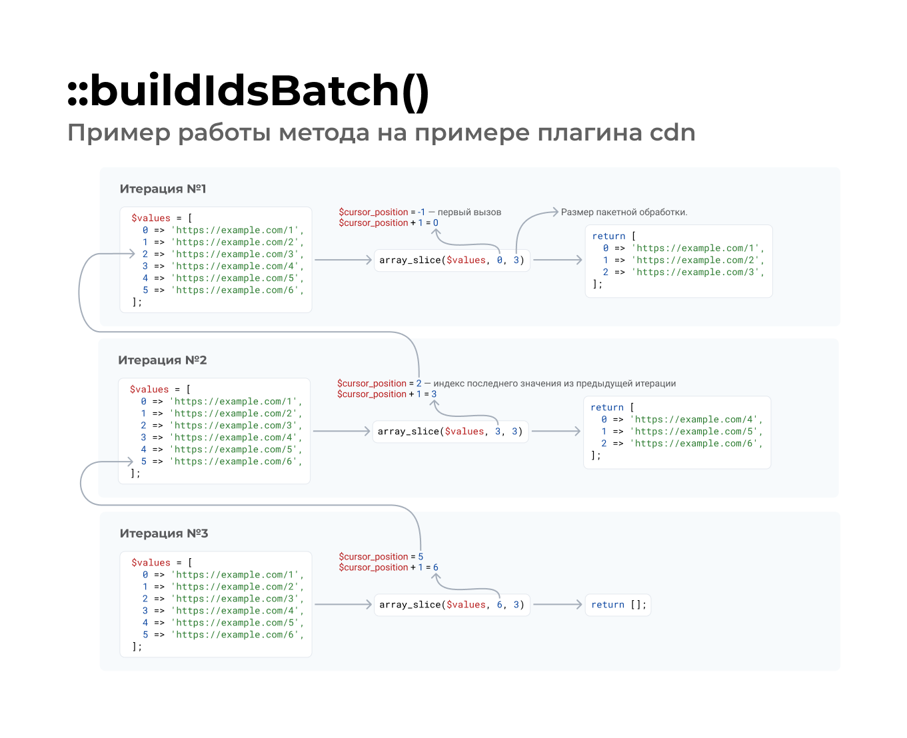

:: youtube {vid=Y1I7zGn6F-w}

**Кеширование** (_в контексте Drupal_) — процесс, при котором сложные или долгие
для вычисления результаты сохраняются в специальные хранилища. Это позволяет
ускорить подготовку ответа пользователю за счёт того, что результат уже заранее
известен и нет необходимости его вычислять повторно.

Кеш принято делить на два состояния:

* **Холодный кеш** (англ. «Cold Cache») — это когда в хранилище отсутствуют
  необходимые нам данные.
* **Горячий кеш** (англ. «Warm Cache», буквально «Тёплый кеш») — это кеш, в
  котором есть данные, и мы можем повторно их использовать.

Если всё работает в штатном режиме и используется с умом (нет смысла кешировать
результат вычисления «2 + 2»), то «холодный кеш» будет гарантированно медленнее
«горячего». Чтобы получить «горячий кеш», нужно запросить данные на «холодный
кеш», они будут вычислены, сохранены в кеш и использоваться при следующих
запросах — это называется «прогрев кеша» (англ. «Cache Warming»).

Выходит, чем лучше прогрет сайт, тем он быстрее и эффективнее. Пользовательский
опыт будет лучше, если посетитель будет попадать на горячий кеш с TTFB < 10 мс,
нежели холодный TTFB 1000 мс (как пример). В идеале пользователь должен всегда
попадать на горячий кеш, а не на холодный.

Но так как горячий кеш не появится до тех пор, пока кто-то не зайдёт на страницу
в первый раз и не спровоцирует прогрев, появляется потребность в этом самом
прогреве. Одно дело, когда у сайта 10 страниц, и их можно прокликать руками, тем
самым разогрев кеш, совсем другое, когда страниц тысячи.

Способов прогрева существует множество, можно банально натравить какого-нибудь
SEO-краулера, который пробежится по всем страничкам, тем самым прогревая кеш,
либо специализированный софт. В нашем же случае мы рассмотрим решение в виде
модуля для Drupal — Warmer.

## Модуль Warmer

[Warmer](https://www.drupal.org/project/warmer) (`warmer`) — это модуль, который
предоставляет инструментарий для прогрева кеша. Его работа построена
на [очередях][drupal-8-queue-api] и [плагинах][drupal-8-how-to-create-custom-plugin-type] `@Warmer`. Также
модуль предоставляет команды для Drush и административный интерфейс, в котором
можно запускать прогрев вручную и настраивать плагины.

Данный модуль не только занимается прогревом по требованию, но и умеет
поддерживать его в актуальном состоянии при помощи регулярных операций.

## Плагины @Warmer

Для прогрева используются `@Warmer` плагины. Они отвечают за пользовательские
настройки, что и как прогревать, а также административный интерфейс.

### Стандартные плагины

Модуль Warmer предоставляет только API, но в поставке также имеются два
дополнительных модуля:

* **CDN Warmer** (`warmer_cdn`) — данный модуль предоставляет возможность
  прогрева при помощи HTTP-запросов к определённым страницам. Следовательно,
  если ваш сайт закрыт CDN, он будет разогрет, так как запрос попадёт на него. А
  ещё так можно прогревать чужие сайты. 🤭 Но пусть вас не путает его название,
  его можно использовать и для сайтов без CDN. Он предоставляет два плагина:
  * **CDN via Sitemap** (`sitemap`) — плагин позволяет указать пути до карт
    сайта, затем он будет получать адреса из этих карт и прогревать их. Удачное
    решение для большинства небольших сайтов. По своей сути он будет прогревать
    все страницы, что важны для сайта (добавлены в карту сайта).
  * **CDN** (`cdn`) — плагин для разогрева указанных URL-адресов. Вы просто
    указываете в текстовое поле абсолютные или относительные пути, и он будет
    запрашивать их.
* **Entity Warmer** (`warmer_entity`) — данный модуль предоставляет единственный
  плагин (`entity`), в котором вы можете настроить, какие контент-сущности нужно
  разогревать. Он загружает все эти сущности в память и чистит её без каких-либо
  внешних HTTP-запросов. Иными словами, он производит внутренний прогрев кеша
  сущностей. Загружая сущность в Drupal, она получает кеш данных — все значения
  сущности собираются со всех таблиц, полей и сохраняются в одну единственную
  запись, что позволяет сущностям грузиться очень быстро, даже если у вас там
  100 полей. Так даже не прогревая всю страницу целиком, скорость загрузки
  страницы на холодный кеш будет намного быстрее, так как сущности, данные
  которых будут использоваться для формирования страницы, уже будут собраны в
  кучку.

Данные плагины должны покрыть большинство задач и кейсов для обычных сайтов. Но
если они вам не подходят, вам предоставляется возможность создавать плагины с
собственными техниками и подходами прогрева.

### Собственные плагины

Если у вас свои особенности или потребности на проекте, вы можете создавать свои
плагины и использовать их для прогрева кеша так, как вам нужно.

#### Аннотация @Warmer

```php
/**
 * The cache warmer for my awesome website.
 *
 * @Warmer(
 *   id = "example",
 *   label = @Translation("Example"),
 *   description = @Translation("This is an example.")
 * )
 */
```

Аннотация у плагинов очень простая, она содержит всего 3 свойства:

* `id`: Машинное название плагина.
* `label`: Название плагина, будет отображаться в административном интерфейсе.
* `description`: (опционально) Описание, отображаемое на вкладке настройки
  плагина, где и его форма (если есть).

#### Интерфейс WarmerInterface

Все `@Warmer` плагины реализуют
интерфейс `\Drupal\warmer\Plugin\WarmerInterface`. Он описывает все доступные
специфичные для данного типа плагинов методы.

##### ::getBatchSize()

Метод `::getBatchSize()` должен возвращать число с количеством элементов для
одной операции [пакетной обработки данных][drupal-8-batch-api]. Иными словами, какое
количество элементов будет разогреваться за один проход.

##### ::getFrequency()

Метод `::getFrequency()` возвращает время в секундах, при прошествии которого
будет сформирована новая очередь и запустится прогрев.

##### ::buildIdsBatch()

Метод `::buildIdsBatch()` отвечает за формирование коллекций (массивов) с
данными для пакетной обработки данных. Каждый такой сформированный массив
добавляется как операция и при обработке передаётся в `::loadMultiple()`.

Метод принимает один аргумент:

* `$cursor`: Указатель на последнее значение из предыдущего результата.

Данный метод вызывается до тех пор, пока он возвращает массив с данными. Как
только он вернёт пустой массив, его вызов для данного плагина прекратится.

При первом вызове `$cursor` всегда равен `NULL`. Так вы можете определить что
производится первый вызов метода. На все последующие вызовы он будет содержать
значение последнего элемента массива, который был возвращён данным методом на
предыдущей итерации.

Это сделано для того, чтобы большие объёмы данных можно было легко «нарезать» на
массивы.

###### Wait, WUT?



Давайте рассмотрим показательную реализацию данного метода с применением курсора
от плагина `cdn`.

```php
  /**
   * {@inheritdoc}
   */
  public function buildIdsBatch($cursor) {
    // Parse the sitemaps and extract the URLs.
    $config = $this->getConfiguration();
    $urls = empty($config['urls']) ? [] : $config['urls'];
    $cursor_position = is_null($cursor) ? -1 : array_search($cursor, $urls);
    if ($cursor_position === FALSE) {
      return [];
    }
    return array_slice($urls, $cursor_position + 1, (int) $this->getBatchSize());
  }
```

Предположим что размер пакетной обработки (`::getBatchSize()`) равен трём (3),
а `$urls` имеет следующее значение:

```php
$urls = [
  'https://example.com/1',
  'https://example.com/2',
  'https://example.com/3',
  'https://example.com/4',
  'https://example.com/5',
  'https://example.com/6',
];
```

Это массив адресов, что мы хотим прогреть. У нас указано, что прогревается всего
3 адреса за раз, следовательно, у нас должно получиться 2 элемента очереди в
каждом по 3 URL'а максимум. Значит, данный метод должен вернуть два массива с
данными.

Тут на помощь и приходит `$cursor` и вот эта часть кода:

```php
    $cursor_position = is_null($cursor) ? -1 : array_search($cursor, $urls);
    if ($cursor_position === FALSE) {
      return [];
    }
    return array_slice($urls, $cursor_position + 1, (int) $this->getBatchSize());
```

В данном коде происходит следующее:

* Получается позиция курсора. Если он `NULL` (первый вызов), значение будет -1,
  если значение есть, он произведет поиск по данному значению в массиве `$urls`
  при помощи `array_search()`.
* Если значение по каким-то причинам не найдено (`FALSE`), то вернётся пустой
  массив и подготовка данных закончится.
* Если значение -1 или получен результат от `array_search()`, из массива `$urls`
  получается срез начиная с индекса курсора со смещением на один вперёд, в
  размере пакетной обработки (`::getBatchSize()`).

А теперь то же самое, но уже пошагово:

* Первый вызов присвоит `$cursor_position` значение -1.
* Затем из массива `$urls` будет возвращён срез, начиная с нулевого
  индекса (`-1+1=0`), размеров в 3 значения (потому что мы договорились
  что `::getBatchSize()` возвращает 3 для примера).
* Результатом станет следующий массив:

```php
$urls = [
  'https://example.com/1',
  'https://example.com/2',
  'https://example.com/3',
];
```

* Так как мы вернули не пустой результат, метод вызывается в очередной раз, но в
  этот раз `$cursor` уже имеет значение `'https://example.com/3'` — это значение
  последнего элемента массива который мы вернули на предыдущей итерации.
* `$cursor_position` в этот раз получит значение 2, так как по этому индексу в
  массиве адресов находится значение из `$cursor`.
* Затем из массива `$url` опять производится срез, но в этот раз точкой старта
  станет индекс 3 (`'https://example.com/4'`), а длина среза прежняя — 3.
* Результатом станет следующий массив:

```php
$urls = [
  'https://example.com/4',
  'https://example.com/5',
  'https://example.com/6',
];
```

* Так как результат опять не пустой, метод будет вызван повторно. В этот
  раз `$cursor` будет иметь значение `'https://example.com/6'`
* `$cursor_position` получит значение 5.
* Затем будет попытка сделать срез, на 3 элемента, начиная с индекса 6. Но там
  уже нет данных, а значит, срез получится пустым и это будет финальный вызов.

Таким образом мы подготовили два элемента для пакетной обработки с тремя
адресами в каждой.

##### ::loadMultiple()

Метод `::loadMultiple()` формирует данные для прогрева. Результат выполнения
данного метода — массив с данными, который будет передан в `::warmMultiple()`.

Метод принимает один аргумент:

* `$ids`: Массив с ID элементов для прогрева подготовленный
  в `::buildIdsBatch()`. В зависимости от контекста применения плагина, ID могут
  быть чем угодно. Например, в случае с плагином `entity` — это будут ID
  сущностей, а в случае плагинов `cdn` и `sitemap` это URL-адреса.

Данный метод может быть использован (см. `warmer_cdn` и `cdn`) как фильтр
входных данных на валидность, прежде чем они будут переданы на разогрев.

##### ::warmMultiple()

Метод `::warmMultiple()` отвечает непосредственно за прогрев. В данном методе вы
должны написать код для прогрева в зависимости от потребностей.

Метод принимает один аргумент:

* `$items`: Массив с данными для прогрева подготовленный `::loadMultiple()`.

##### ::isActive()

Метод `::isActive()` отвечает за то, можно ли на данный момент сформировать
очередь для прогрева используя текущий плагин.

Данное значение используется только при формировании очередей на прогрев при
помощи Cron операций. Это значит, что при вызове прогрева при помощи Drush
команды или из административного интерфейса, значение этого метода ни на что не
влияет.

##### ::markAsEnqueued()

Метод `::markAsEnqueued()` вызывается после добавления среза `::buildIdsBatch()`
в очередь на пакетную обработку.

**Важно!** Метод вызывается на каждый срез. То есть, если ваш плагин готовит 10
срезов, значит это 10 элементов очереди, а следовательно, данный метод будет
вызван 10 раз!

##### ::addMoreConfigurationFormElements()

Метод `::addMoreConfigurationFormElements()` предназначен для того чтобы вы
могли сформировать форму настроек для плагина.

Данный метод работает в точности
как `PluginFormInterface::buildConfigurationForm()`. Он вызывается в реализации
данного метода базовым плагином. Это значит, что вам также
доступны `::validateConfigurationForm()` и `::submitConfigurationForm()`, но
добавлять свои элементы нужно при помощи выделенного метода, а не стандартного,
так как модуль добавляет свою разметку.

### WarmerPluginBase — абстрактный плагин

Модуль предоставляет абстрактную реализацию плагина, которую вы должны расширять
при создании своих плагинов — `\Drupal\warmer\Plugin\WarmerPluginBase`.

Данная реализация предоставляет:

* Настройки по умолчанию:
  * `frequency`: Частота регулярных прогревов плагином. Значение по умолчанию 5
    минут.
  * `batchSize`: Размер элемента очереди. По умолчанию 50.
* Форму настроек для данных значений и их валидацию.
* Вызов формы настроек плагина.
* Реализацию `::getFrequency()` которая возвращает значение `frequency`.
* Реализацию `::getBatchSize()` которая возвращает значение `batchSize`.
* Реализацию `::isActive()` возвращающую `TRUE`, если с момента последней
  очереди с данным плагином прошло время возвращаемое `::getFrequency()`.
* Реализацию `::markAsEnqueued()` которая помечает время последнего запуска
  очереди для дальнейшего использования в `::isActive()`.

Данный плагин делает за вас большинство работы. Вам лишь остается описать
выборку данных для прогрева, их загрузку и непосредственно прогрев.

## Drush команды

Модуль предоставляет две Drush команды, которые могут помочь вам с прогревом при
работе из CLI. Это очень полезно для тех, у кого автоматический деплой, ведь
можно сразу после сброса кеша начать прогрев!

### warmer:list

Команда `warmer:list` выводит список всех доступных плагинов для прогрева с
информацией о них.

```bash
 --------- ----------------- ---------------------------------------------------------------------------------------------------------------------------------- ----------- ------------ 
  ID        Label             Description                                                                                                                        Frequency   Batch Size  
 --------- ----------------- ---------------------------------------------------------------------------------------------------------------------------------- ----------- ------------ 
  sitemap   CDN via Sitemap   Collects the URLs to warm from the sitemap. Then uses the CDN warmer for those.                                                    300         50          
  cdn       CDN               Executes HTTP requests to warm the edge caches. It is useful without a CDN as well, as it will also warm Varnish and Page Cache.   300         50           
  entity    Entity            Loads entities from the selected entity types & bundles to warm the entity cache.                                                  300         50          
 --------- ----------------- ---------------------------------------------------------------------------------------------------------------------------------- ----------- ------------ 

```

### warmer:enqueue

Команда `warmer:enqueue` запускает процесс сборки элементов очереди для прогрева
используя один или более плагинов.

Пример формирования очереди для конкретного плагина:

```bash
drush warmer:enqueue cdn
```

Пример формирования очереди для двух плагинов:

```bash
drush warmer:enqueue cdn,sitemap
```

Данная команда также имеет одну опцию — `--run-queue`. Если указана данная опция
при вызове, то после формирования очереди из указанных плагинов она будет
запущена. Выполнение будет длиться до тех пор, пока очередь не опустеет или не
пройдёт 99999999 секунд или процесс не будет закрыт по внешним причинам.

Пример формирование очереди на прогрев для плагина и запуска прогрева
немедленно:

```bash
drush warmer:enqueue cdn --run-queue
```

Это достаточно опасная опция. Если элементов очереди очень много, это
перманентная нагрузка на сервер. По умолчанию, прогрев выполняется с
использованием [@QueueWorker][drupal-8-queue-worker-plugin] и этот подход более щадящий для
сервера.

Если вы хотите «пнуть» прогрев, чтобы не дожидаться очередного крона, вы можете
это сделать штатными командами для очередей. Например, чтобы сразу прогреть
первые 100 элементов, а затем прогревать в фоне, достаточно сделать следующее:

```bash
drush warmer:enqueue entity
drush queue:run warmer --items-limit=100
```

Обратите внимание, что элементов очереди 100. Если у вас 50 значений на один
элемент очереди, то это 5000 значений. Учитывайте это, когда прогреваете тяжелые
данные. Прогрев 5000 сущностей — это очень быстро, прогрев 5000 страниц — нет.
Подобный вызов может загрузить сервер на 100% на время прогрева. Всё хорошо в
меру!

Если вы точно знаете какие прогревы быстрые, а какие медленные, вы можете это
учитывать при прогреве. Рассмотрим:

```bash
drush warmer:enqueue entity --run-queue
drush warmer:enqueue cdn
drush queue:run warmer --items-limit=10
```

Пример выше, сначала создаст очередь для прогрева сущностей и выполнит её
полностью. А затем, сформирует очередь CDN на прогрев, и прогреет первые 10
элементов (500 страниц), остальное будет по крону.

## Караул, пожар! 🔥

У модуля есть очень неочевидная особенность, игнорируя которую, вместо
«прогрева» вы можете организовать «пожар». «Не баг, а фича» кроется в ответе на
вопрос: «А кто чистит очередь?». Дело то в том, что очередь никто и не чистит!
🤔

И вот простой пример, как, игнорирование данной особенности, может превратиться
в снежный ком:

* У нас есть 1000 страниц на прогрев. По 50 на элемент очереди. Выходит — 20
  элементов очереди, в каждом по 50 адресов.
* Предположим, что прогрев 1 страницы занимает 1 секунду, и они вызываются
  последовательно (`cdn` прогревает асинхронно).
* Крон запускается раз в минуту. Выходит что за 1 минуту мы успеем обработать 1
  элемент, или 50 адресов из 1000. Всего нам потребуется 20 минут на полноценный
  прогрев.
* **Фатальная настройка** — это делать прогрев данным плагином чаще чем
  необходимо времени для его прогрева. Например, 10 минут. **Обратите внимание**
  что настройка по умолчанию вовсе 5 минут!

В итоге плагин будет формировать 20 элементов очереди по 50 адресов каждые 10
минут. Но прогрев занимает 20 минут. Получается, когда будет формироваться
следующая очередь, плагин успеет обработать только половину данных — 500
адресов. Выходит следующее:

* На второй вызов у нас будет очередь из 30 элементов или 1500 адресов.
* На третий вызов у нас будет очередь из 40 элементов или 2000 адресов.
* На 144 вызов (спустя сутки) у нас будет очередь из 1450 элементов или 72 500
  адресов!

Вишенкой на торте будет то, что очередь для всех плагинов общая — `warmer`. А
значит, проблема может обостриться очень быстро и выйти из-под контроля.
Таблица `queue` будет раздуваться всё больше и больше, и чем чаще запуск и
больше данных на прогрев, а также, чем он медленнее, тем быстрее вы столкнётесь
с данной проблемой.

Это может показаться не слишком страшным на первый взгляд, всего-то 1450 записей
в БД за сутки. Но проблема будет не с производительностью этой таблицы, а с тем,
что она со временем выжрет всю свободную память сервера и он просто-напросто
даст сбой.

**Как не допустить?** Всё просто — учитывайте это поведение, и думайте когда
настраиваете частоту регулярного прогрева для плагинов. Частота регулярного
прогрева должна быть больше, чем время, требуемое **всем активным плагинам** на
прогрев. Если страниц очень много и вы их все прогреваете, не бойтесь выставлять
большие значения.

Так же держите в уме то, что [Queue Worker][drupal-8-queue-worker-plugin] плагины,
выполняемые по Drupal крону, обрабатывают очереди последовательно и в таком
случае, либо нужно выносить обработчики (свои или модуля) из крона и вешать
вызов на системный крон через Drush, либо учитывать общее время выполнение всех
очередей, а не только от Warmer модуля.

**В процессе деплоя**, после того как вы сделали сброс кеша при
помощи `drush cache:rebuild`, я бы рекомендовал сначала чистить
очередь `warmer`, а только затем формировать её. Так вы удалите то что не успело
прогреться, ведь это и не важно, вы только что полностью сбросили кеш и прогрев
нужно начинать заново. Выглядит это примерно следующим образом:

```bash
# Main deploy commands, like drush deploy.
drush cache:rebuild
drush queue:delete warmer
drush warmer:enqueue cdn,sitemap
drush queue:run warmer --items-limit=100
```

🧯 **Как тушить, если уже горит?** Просто почистите
очередь: `drush queue:delete warmer`.

Первое время я рекомендую очень внимательно понаблюдать что происходит с
табличкой `queue`, чтобы в случае чего, среагировать раньше чем проблема дойдёт
до критической отметки.

## Пример

Реализации Warmer плагинов будут сильно отличаться от проекта к проекту, так как
устройство, требования и определение «важного» содержимого у всех будут
отличаться.

Я постарался придумать пример, который может оказаться полезным в некоторых
кейсах — разогрев каталога и товаров в нём.

### Вводные для примера

* Имеется словарь таксономии (`category`) для категорий с иерархией.
* На странице категории выводятся все товары из данной категории, а также
  дочерних категорий.
* Имеется тип материала (`node`) «Товар» (`product`), который имеет связь на
  категорию (`field_category`).
* Количество товаров — 50 000 по 10 на страницу.
* Количество категорий — 10.
* Товары распределены по категориям случайным образом.

Мы также подразумеваем что у нас есть некая статистика на руках, что большинство
пользователей не переходит дальше третей страницы в категориях, а также изучают
последнюю страницу.

Учитывая всё вышесказанное, становится понятно, что если у категории 100
страниц, нет никакой практической пользы греть страницы 4-99, включительно. Они
будут разогреты естественным путём, либо их нужно разогревать отдельно с более
низким приоритетом. Греть их в основном потоке с важными страницами —
неэффективно и пустая трата ресурсов.

Это означает, что нам важно, чтобы первые три и последняя страницы категории
работали быстро. Если пользователи изучают данные страницы категорий, это также
означает, что все товары выводимые на данных страницах, также должны работать
быстро.

Например, если у нас всего 50 категорий (без вложений) и на странице выводится
по 30 уникальных товаров, и в каждой категории больше 3 страниц, то по логике
выше нам необходимо прогреть 200 страниц для категорий и 6 000 товаров.

Даже для таких условий, прогревать нужно всего 6 200 страниц, тогда как, одних
лишь товаров 50 000. При этом, это должно покрыть пути большинства
пользователей. На деле, категории будут вложенные, товары могут пересекаться, а
следовательно количество страниц для прогрева будет намного меньше.

Мы напишем два плагина, один для категорий, другой для товаров, чтобы иметь
больше контроля и можно было греть кеш независимо. Плагины будут разогревать
страницы категорий с пагинацией и все товары входящие на данные страницы.

В данных плагинах мы дадим возможность настраивать количество страниц для
прогрева с начала и конца листинга. Это позволит прогревать кеш немного
независимо. Например, можно будет прогревать первые и последние 5 страниц
категорий, но при этом греть только товары с первых и последних двух.

### CatalogBasedWarmerBase — основа наших плагинов

Нам потребуется два плагина, но оба они завязаны на категории и их код по
большей части пересекается. Чтобы не дублировать его, мы создадим базовый класс,
который расширяет `WarmerPluginBase` и предоставляет универсальный код для
будущих плагинов.

_Код написан во славу универсальности и копипасты._

```php {"header":"src/Plugin/warmer/CatalogBasedWarmerBase.php"}
<?php

declare(strict_types=1);

namespace Drupal\example\Plugin\warmer;

use Drupal\Core\Cache\CacheBackendInterface;
use Drupal\Core\Entity\ContentEntityStorageInterface;
use Drupal\Core\Entity\EntityTypeManagerInterface;
use Drupal\Core\Entity\Query\QueryInterface;
use Drupal\Core\Form\FormStateInterface;
use Drupal\Core\Form\SubformStateInterface;
use Drupal\Core\StringTranslation\TranslatableMarkup;
use Drupal\taxonomy\TermStorageInterface;
use Drupal\warmer\Plugin\WarmerPluginBase;
use GuzzleHttp\ClientInterface;
use GuzzleHttp\Promise\Utils;
use Psr\Http\Message\ResponseInterface;
use Symfony\Component\DependencyInjection\ContainerInterface;

/**
 * Provides abstract implementation for warmer plugins based on catalog warming.
 */
abstract class CatalogBasedWarmerBase extends WarmerPluginBase {

  /**
   * The vocabulary ID with categories.
   */
  protected const CATEGORY_VOCABULARY_ID = 'category';

  /**
   * The entity type used for products.
   */
  protected const PRODUCT_ENTITY_TYPE_ID = 'node';

  /**
   * An array with product bundles.
   */
  protected const PRODUCT_BUNDLES = ['product'];

  /**
   * The field name with category entity reference.
   */
  protected const CATEGORY_FIELD = 'field_category';

  /**
   * The field name to sort by.
   */
  protected const SORT_FIELD = 'created';

  /**
   * The default sort direction.
   */
  protected const SORT_DIRECTION = 'DESC';

  /**
   * The maximum amount of products listed on a single category page.
   */
  protected const ITEMS_PER_PAGE = 10;

  /**
   * The amount of concurrent requests during warming.
   */
  protected const CONCURRENT_REQUESTS = 10;

  /**
   * The entity type manager.
   */
  protected EntityTypeManagerInterface $entityTypeManager;

  /**
   * The product storage.
   */
  protected ?ContentEntityStorageInterface $productStorage;

  /**
   * The term storage.
   */
  protected ?TermStorageInterface $termStorage;

  /**
   * The HTTP client.
   */
  protected ClientInterface $httpClient;

  /**
   * The static cache.
   */
  protected CacheBackendInterface $cache;

  /**
   * {@inheritdoc}
   */
  public static function create(ContainerInterface $container, array $configuration, $plugin_id, $plugin_definition): self {
    $instance = parent::create($container, $configuration, $plugin_id, $plugin_definition);
    $instance->entityTypeManager = $container->get('entity_type.manager');
    $instance->httpClient = $container->get('http_client');
    $instance->cache = $container->get('cache.static');
    return $instance;
  }

  /**
   * {@inheritdoc}
   */
  public function loadMultiple(array $ids = []): array {
    return $ids;
  }

  /**
   * {@inheritdoc}
   */
  public function warmMultiple(array $items = []): int {
    $promises = [];
    $success = 0;

    foreach ($items as $key => $url) {
      // Fire async request.
      $promises[] = $this->httpClient
        ->requestAsync('GET', $url)
        ->then(static function (ResponseInterface $response) use (&$success): void {
          if ($response->getStatusCode() < 399) {
            $success++;
          }
        });
      // Wait for all fired requests if max number is reached.
      $item_keys = \array_keys($items);
      if ($key % $this->getConcurrentRequests() == 0 || $key == \end($item_keys)) {
        Utils::all($promises)->wait();
        $promises = [];
      }
    }

    return $success;
  }

  /**
   * Gets the amount of simultaneous requests during warming.
   *
   * @return int
   *   The amount of requests.
   */
  protected function getConcurrentRequests(): int {
    return $this::CONCURRENT_REQUESTS;
  }

  /**
   * {@inheritdoc}
   */
  public function buildIdsBatch($cursor): array {
    $cid = __METHOD__ . ':' . $this->getPluginId();
    if ($cache = $this->cache->get($cid)) {
      $urls = $cache->data;
    }
    else {
      $urls = $this->prepareUrls();
      $this->cache->set($cid, $urls);
    }
    $cursor_position = \is_null($cursor) ? -1 : \array_search($cursor, $urls);
    if ($cursor_position === FALSE) {
      return [];
    }
    return \array_slice($urls, $cursor_position + 1, (int) $this->getBatchSize());
  }

  /**
   * Prepares a list of URLs for warming.
   *
   * @return array
   *   An array with URLs to warm.
   */
  abstract protected function prepareUrls(): array;

  /**
   * {@inheritdoc}
   */
  public function defaultConfiguration(): array {
    return [
      'pages_from_beginning' => 3,
      'pages_from_end' => 1,
      'frequency' => 60 * 60,
    ] + parent::defaultConfiguration();
  }

  /**
   * {@inheritdoc}
   */
  public function addMoreConfigurationFormElements(array $form, SubformStateInterface $form_state): array {
    $form['pages_from_beginning'] = [
      '#type' => 'number',
      '#min' => 1,
      '#step' => 1,
      '#required' => TRUE,
      '#title' => new TranslatableMarkup('First pages to warm'),
      '#description' => new TranslatableMarkup('The number of pages to warm starting from a beginning, including first one.'),
      '#default_value' => $this->getPagesFromBeginning(),
    ];

    $form['pages_from_end'] = [
      '#type' => 'number',
      '#min' => 0,
      '#step' => 1,
      '#required' => TRUE,
      '#title' => new TranslatableMarkup('Last pages to warm'),
      '#description' => new TranslatableMarkup('The number of pages to warm starting from an end.'),
      '#default_value' => $this->getPagesFromEnd(),
    ];

    return $form;
  }

  /**
   * Gets number of pages needs to be warmed from beginning.
   *
   * @return int
   *   The amount of pages to warm from beginning.
   */
  public function getPagesFromBeginning(): int {
    return (int) $this->getConfiguration()['pages_from_beginning'];
  }

  /**
   * Gets number of pages needs to be warmed from the end.
   *
   * @return int
   *   The number of pages.
   */
  public function getPagesFromEnd(): int {
    return (int) $this->getConfiguration()['pages_from_end'];
  }

  /**
   * Gets items per page.
   *
   * @return int
   *   The amount of items per page.
   */
  public function getItemsPerPage(): int {
    return $this::ITEMS_PER_PAGE;
  }

  /**
   * {@inheritdoc}
   */
  public function validateConfigurationForm(array &$form, FormStateInterface $form_state): void {
    $pages_from_beginning = $form_state->getValue('pages_from_beginning');
    if (!\is_numeric($pages_from_beginning) || $pages_from_beginning < 1) {
      $form_state->setError($form['pages_from_beginning'], new TranslatableMarkup('First pages to warm should be greater than or equal 1.'));
    }

    $pages_from_end = $form_state->getValue('pages_from_end');
    if (!\is_numeric($pages_from_end) || $pages_from_end < 0) {
      $form_state->setError($form['pages_from_end'], new TranslatableMarkup('Last pages to warm should be a positive number.'));
    }

    parent::validateConfigurationForm($form, $form_state);
  }

  /**
   * Loads active categories IDs.
   *
   * @return array
   *   An array with category IDs.
   *
   * @throws \Drupal\Component\Plugin\Exception\InvalidPluginDefinitionException
   * @throws \Drupal\Component\Plugin\Exception\PluginNotFoundException
   */
  protected function loadCategoryIds(): array {
    $ids = [];
    foreach ($this->loadCatalogTree() as $term) {
      if ($term->status != 1) {
        continue;
      }
      $ids[] = (int) $term->tid;
    }
    return $ids;
  }

  /**
   * Loads catalog tree.
   *
   * @return \stdClass[]
   *   An array with tree information.
   *
   * @throws \Drupal\Component\Plugin\Exception\InvalidPluginDefinitionException
   * @throws \Drupal\Component\Plugin\Exception\PluginNotFoundException
   */
  protected function loadCatalogTree(): array {
    return $this->getTermStorage()->loadTree($this->getCategoryVocabularyId());
  }

  /**
   * Gets term storage.
   *
   * @return \Drupal\taxonomy\TermStorageInterface
   *   The term storage.
   *
   * @throws \Drupal\Component\Plugin\Exception\InvalidPluginDefinitionException
   * @throws \Drupal\Component\Plugin\Exception\PluginNotFoundException
   */
  protected function getTermStorage(): TermStorageInterface {
    if (!isset($this->termStorage)) {
      $this->termStorage = $this->entityTypeManager->getStorage('taxonomy_term');
    }
    return $this->termStorage;
  }

  /**
   * Gets category vocabulary ID.
   *
   * @return string
   *   The vocabulary ID.
   */
  protected function getCategoryVocabularyId(): string {
    return $this::CATEGORY_VOCABULARY_ID;
  }

  /**
   * Counts the amount of products in category.
   *
   * @param int $category_id
   *   The category ID.
   *
   * @return int
   *   The amount of products in category.
   *
   * @throws \Drupal\Component\Plugin\Exception\InvalidPluginDefinitionException
   * @throws \Drupal\Component\Plugin\Exception\PluginNotFoundException
   */
  protected function countProductsInCategory(int $category_id): int {
    $query = $this->getProductsQuery($category_id);
    return (int) $query->count()->execute();
  }

  /**
   * Prepares entity query for products in category.
   *
   * @param int $category_id
   *   The category ID.
   * @param bool $negate_sort
   *   TRUE if sort should be reversed, FALSE to use default.
   *
   * @return \Drupal\Core\Entity\Query\QueryInterface
   *   The entity query with basic conditions.
   *
   * @throws \Drupal\Component\Plugin\Exception\InvalidPluginDefinitionException
   * @throws \Drupal\Component\Plugin\Exception\PluginNotFoundException
   */
  protected function getProductsQuery(int $category_id, bool $negate_sort = FALSE): QueryInterface {
    $category_ids = $this->getCategoryChildren($category_id);
    $category_ids[] = $category_id;

    $product_entity_definition = $this->entityTypeManager->getDefinition($this->getProductEntityTypeId());

    $query = $this->getProductStorage()->getQuery()->accessCheck(FALSE);
    if (!empty($this->getProductBundles()) && $product_entity_definition->hasKey('bundle')) {
      $query->condition($product_entity_definition->getKey('bundle'), $this->getProductBundles(), 'IN');
    }
    if ($product_entity_definition->hasKey('status')) {
      $query->condition($product_entity_definition->getKey('status'), 1);
    }
    $query->condition($this->getCategoryField(), $category_ids, 'IN');
    $query->sort($this->getSortField(), $this->getSortDirection($negate_sort));
    return $query;
  }

  /**
   * Gets children categories.
   *
   * @param int $term_id
   *   The current category ID.
   *
   * @return array
   *   An array with parent category IDs.
   *
   * @throws \Drupal\Component\Plugin\Exception\InvalidPluginDefinitionException
   * @throws \Drupal\Component\Plugin\Exception\PluginNotFoundException
   */
  protected function getCategoryChildren(int $term_id): array {
    $children = [];
    foreach ($this->loadCatalogTree() as $term) {
      if (\in_array($term_id, $term->parents)) {
        $children[] = (int) $term->tid;
        $children = \array_merge($children, $this->getCategoryChildren((int) $term->tid));
      }
    }
    return $children;
  }

  /**
   * Gets the product entity type ID.
   *
   * @return string
   *   The entity type ID.
   */
  protected function getProductEntityTypeId(): string {
    return $this::PRODUCT_ENTITY_TYPE_ID;
  }

  /**
   * Gets product storage.
   *
   * @return \Drupal\Core\Entity\ContentEntityStorageInterface
   *   The product storage.
   *
   * @throws \Drupal\Component\Plugin\Exception\InvalidPluginDefinitionException
   * @throws \Drupal\Component\Plugin\Exception\PluginNotFoundException
   */
  protected function getProductStorage(): ContentEntityStorageInterface {
    if (!isset($this->productStorage)) {
      $this->productStorage = $this->entityTypeManager->getStorage($this->getProductEntityTypeId());
    }
    return $this->productStorage;
  }

  /**
   * Gets product entity type bundle used for products.
   *
   * @return array
   *   An array with bundle IDs. Returns an empty array if all bundles allowed.
   */
  protected function getProductBundles(): array {
    return $this::PRODUCT_BUNDLES;
  }

  /**
   * Gets entity reference field name used for categories in product.
   *
   * @return string
   *   The name of category field.
   */
  protected function getCategoryField(): string {
    return $this::CATEGORY_FIELD;
  }

  /**
   * Gets the field name used for sorting results in category by default.
   *
   * @return string
   *   The category field name.
   */
  protected function getSortField(): string {
    return $this::SORT_FIELD;
  }

  /**
   * Gets default sort direction used for sorting results in category.
   *
   * @param bool $negate
   *   Used to flip sort direction.
   *
   * @return string
   *   The sort direction.
   */
  protected function getSortDirection(bool $negate = FALSE): string {
    if ($negate) {
      return $this::SORT_DIRECTION == 'ASC' ? 'DESC' : 'ASC';
    }
    else {
      return $this::SORT_DIRECTION;
    }
  }

}

```

#### Константы

Константы используются для того, чтобы указать ключевые настройки для наших
плагинов. Если вы захотите использовать данные плагины на своём проекте, это
первое, и возможно, единственное, что вам потребуется поправить.

* `CATEGORY_VOCABULARY_ID` / `::getCategoryVocabularyId()`: Машинное имя словаря
  таксономии, который используется для категоризации товаров. В нашем случае
  это `category`.
* `PRODUCT_ENTITY_TYPE_ID` / `::getProductEntityTypeId()`: Машинное имя
  сущности, которое используется для товаров. В нашем примере это «Тип
  содержимого» (`node`), но если вы используете Drupal Commerce, в этом случае
  необходимо указать `commerce_product`.
* `PRODUCT_BUNDLES` / `::getProductBundles()`: Машинные имена подтипов (бандлов)
  сущности, которые используются для товаров. В нашем случае это единственный
  подтип `product`, если вы используете все подтипы, например в случае Drupal
  Commerce, можете оставить значение пустым массивом, тогда будут учитываться
  все подтипы.
* `CATEGORY_FIELD` / `::getCategoryField()`: Машинное имя поля типа entity
  reference, где указана категория или категории для товара. В нашем случае
  это `field_category`.
* `SORT_FIELD` / `::getSortField()`: Машинное имя поля, по которому будет
  производиться сортировка при выборке товаров. В нашем случае это `created` от
  типа материала. Если у сущности, что вы используете для товаров отсутствует
  такое поле, учтите что потребуется внести изменения в условие. У товара Drupal
  Commerce оно то же `created`.
* `SORT_DIRECTION` / `::getSortDirection()`: Направление сортировки по умолчанию
  для значения `SORT_FIELD`. Это направление используется для выборки товаров с
  первых страниц, соответственно, для выборки с конца, оно будет обращено, для
  этого метод принимает аргумент, нужно ли обращать сортировку или нет.
* `ITEMS_PER_PAGE` / `::getItemsPerPage()`: Максимальное число товаров,
  выводимое на одной странице категории. Используется для подсчёта количества
  страниц.
* `CONCURRENT_REQUESTS` / `::getConcurrentRequests()`: Количество одновременно
  выполняемых HTTP запросов.

#### Настройки

Все `@Warmer` плагины могут иметь настройки, и по умолчанию, если вы ничего не
переопределите, ваш плагин будет иметь настройку `frequency` и `batchSize`.

Мы же добавляем нашим плагинам возможность настраивать сколько страниц с начала
и конца листинга прогревать. Для категорий это просто страницы с листингом, а
для товаров, способ высчитать смещение для получения товаров для прогрева.

* `::defaultConfiguration()`: Возвращает настройки по умолчанию. Мы
  устанавливаем, что по умолчанию, будут прогреваться первые три и последняя
  страница, а частота прогрева будет 1 час, так как стандартная настройка в 5
  минут слишком опасна для такого плагина.
* `::addMoreConfigurationFormElements()`: Здесь, при помощи Form API мы
  объявляем дополнительные настройки для страниц нашего плагина. Настройки для
  частоты прогрева объявлять не нужно, они добавляются базовым классом для всех
  плагинов.
* `::validateConfigurationForm()`: Валидация наших настроек. В ней мы убеждаемся
  что количество страниц с начала для прогрева должно быть больше или равно
  единице. Так как мы всегда хотим прогревать как минимум первую страницу и
  товары с неё. Для настройки страниц с конца, мы проверяем что значение
  положительно, но допускаем установку 0, чтобы прогрев с конца не производился.
* `::getPagesFromBeginning()`: Возвращает значение настройки для страниц
  прогрева с начала списка.
* `::getPagesFromEnd()`: Возвращает значение настройки для страниц прогрева с
  конца списка.

#### ::getTermStorage() — получение хранилища терминов таксономии

Утилитарный метод `::getTermStorage()` лениво загружает хранилище терминов
таксономии и возвращает его.

Этот метод добавлен для разгрузки метода `::create()`, а также потому что нам не
нужно данное хранилище при каждой инициализации плагина. Например, оно не нужно
в процессе прогрева. Это экономия на спичках, поэтому основной причиной тут всё
же является удобство и упрощение `::create()`.

#### ::getProductStorage() — получение хранилища товаров

Утилитарный метод `::getProductStorage()` лениво загружает хранилище товаров и
возвращает его. Аналогично `::getTermStorage()`.

#### ::getCategoryChildren() — получение дочерних категорий

Утилитарный метод `::getCategoryChildren()`, который формирует массив из ID
дочерних категорий для переданной в аргументе. По нашему условию, на странице
категории выводятся товары как из данной категории, так и дочерних категорий.

#### ::loadCatalogTree() — загрузка дерева категорий

Утилитарный метод `::loadCatalogTree()` загружает дерево терминов из словаря с
категориями.

#### ::loadCategoryIds() — получаем ID активных категорий

Утилитарный метод `::loadCategoryIds()` возвращает ID активных категорий.

#### ::countProductsInCategory() — подсчёт количества товаров в категории

Утилитарный метод `::countProductsInCategory()` производит запрос на количество
товаров в указанной категории.

Метод принимает параметр `$catregory_id` с ID категории, для которой будет
производиться подсчёт.

#### ::getProductsQuery() — формирование запроса на получение товаров

Метод `::getProductsQuery()` позволяет сформировать единый и общий запрос для
получения товаров. Нам потребуется делать запросы связанные с товарами несколько
раз: посчитать количество товаров в категории (`::countProductsInCategory()`), а
также, непосредственное получение ID товаров с первых и последних страниц.

Он принимает два аргумента:

* `$category_id`: ID категории, для которой будут запрашиваться товары.
* `$negate_sort`: (по умолчанию FALSE) Позволяет обратить сортировку по
  умолчанию. Необходимо для получения товаров с конца списка.
  См. `::getSortDirection()`.

В методе, первым делом формируется список ID категорий, из которых будет
выбираться товар — текущая переданная категория, плюс её дочерние категории.
Затем мы получаем хранилище для сущности отвечающей за товар.

После чего мы формируем наш базовый запрос для всех последующих:

* Мы отключаем проверку прав доступа. Так как она здесь не нужна и даже может
  помешать.
* Если `::getProductBundles()` возвращает не пустой массив, мы проверяем, может
  ли данная сущность иметь подтипы (бандлы). Если может, мы добавляем в запрос
  условие по указанным бандлам товаров.
* Если у сущности есть статус (активна или нет), мы добавляем условие, что нам
  нужны только активные товары. Разогревать отключенные нет никакой нужды.
* Далее, добавляем условие, что у товара, в поле, где выбрана категория, должна
  быть указана одна из полученных нами категорий. Мы проверяем на текущую, для
  которой прогрев, а также все её дочерние.
* Добавляем сортировку по нужному полю.

Результатом будет подготовленный запрос с базовыми условиями на основе текущей
категории и необходимости получить результаты с конца. Все остальные
корректировки, если потребуется, можем вносить непосредственно в экземпляр
запроса полученного данным методом.

#### ::prepareUrls() — формирование адресов для прогрева

Метод `::prepareUrls()` является абстрактным, для того чтобы мы могли его
вызывать в `::buildIdsBatch()`, а также, чтобы все кто наследуются от нашего
базового класса, обязательно реализовывали его.

Задача данного метода проста — подготовить массив из адресов, по которым нужно
пройтись для прогрева кеша. Эта логика будет отличаться для двух наших плагинов,
и этот метод как раз позволяет нам переиспользовать код для формирования
очереди, но при этом формировать адреса совершенно по-разному.

#### ::buildIdsBatch() — формирование очереди

В данном методе мы формируем срезы адресов из тех что мы подготовим
в `::prepareUrls()`. Он также отвечает за кеширование
результата `::prepareUrls()`, чтобы это не делать в каждой его реализации.
Причиной этому служит то, что метод вызывается многократно, пока не сформирует
очередь, а список адресов мы получаем в рантайме. Получение адресов также влечет
за собой запросы к БД и прочую логику, но список адресов, полученный в первый
раз будет идентичен тому что мы получим в последующие вызовы в пределах этого
запроса. Конечно, есть вероятность, что в момент формирования очереди появились
новые данные, но тем полезнее нам этот кеш, так как он гарантирует целостность
данных.

Кеш является статичным (`cache.static`), а это значит, результат будет храниться
в оперативной памяти процесса PHP, в котором он вызван, и очищен как он
завершится. То есть, этот кеш актуален только в пределах одного PHP процесса и
чистить его не нужно.

Сам же процесс нарезки абсолютно идентичен стандартным плагинам поставляемым с
модулем и описан выше.

#### ::loadMultiple() — загрузка данных для прогрева

Нам нет нужды загружать данные для прогрева. Наши данные это URL-адреса, которые
будут получены методом `::prepareUrls()` непосредственно в рантайме. Мы также не
будем делать валидацию путей, как это делается в `cdn` плагинах, так как все
адреса мы будем генерировать при помощи Drupal API без ручного ввода.

Так как нам ничего загружать не нужно, мы возвращаем значение без изменений.

#### ::warmMultiple() — прогрев данных

Метод, в котором мы будем прогревать кеш. В нём мы получим сформированные нами
пути для прогрева из одного среза `::buildIdsBatch()` (данные одного элемента
очереди).

Так как мы прогреваем страницы при помощи HTTP запросов, мы используем HTTP
Client (`http_client`), который поставляется с Drupal — Guzzle. Он умеет
отправлять запросы асинхронно и дожидаться их ответов. Это значит что мы можем
прогревать X адресов одновременно, тем самым ускоряя процесс прогрева, но и
создавая увеличенную нагрузку на сервер.

По умолчанию настроено прогревать по 10 адресов за раз, это значит, что наш
метод сделает 5 подходов по 10 запросов на каждый. Каждый подход будет
дожидаться окончания выполнения всех 10 запросов прежде чем перейти к следующим.
Все запросы с кодом ответа менее 399 считаются успешными, суммируются и это
значение возвращается в качестве результата.

### CatalogWarmer — плагин прогрева категорий

`CatalogWarmer` — плагин, который готовит адреса категорий для прогрева.

```php {"header":"src/Plugin/warmer/CatalogWarmer.php"}
<?php

declare(strict_types=1);

namespace Drupal\example\Plugin\warmer;

use Drupal\Core\Url;

/**
 * Provides warmer for catalog.
 *
 * @Warmer(
 *   id = "example_catalog",
 *   label = @Translation("Catalog"),
 *   description = @Translation("Warms all categories and some of their pages."),
 * )
 */
final class CatalogWarmer extends CatalogBasedWarmerBase {

  /**
   * {@inheritdoc}
   */
  protected function prepareUrls(): array {
    $category_ids = $this->loadCategoryIds();
    $urls = [];
    foreach ($category_ids as $category_id) {
      $urls[] = $this->buildCategoryUrl($category_id);
      $urls[] = $this->buildCategoryUrl($category_id, 0);

      $count = $this->countProductsInCategory($category_id);
      if ($count == 0) {
        continue;
      }

      $build_url_callback = function (int $page) use ($category_id, &$urls): void {
        $urls[] = $this->buildCategoryUrl($category_id, $page);
      };

      $this->prepareFirstPagesToWarm($count, $build_url_callback);
      $this->prepareLastPagesToWarm($count, $build_url_callback);
    }

    return $urls;
  }

  /**
   * Builds category URL.
   *
   * @param int $category_id
   *   The category ID.
   * @param int|null $page
   *   The query page value.
   *
   * @return string
   *   The category URL.
   */
  protected function buildCategoryUrl(int $category_id, ?int $page = NULL): string {
    $url = Url::fromRoute('entity.taxonomy_term.canonical', ['taxonomy_term' => $category_id]);
    if (isset($page)) {
      $url->setOption('query', [
        'page' => $page,
      ]);
    }
    return $url->setAbsolute()->toString();
  }

  /**
   * Executes callback to prepare first pages to warm.
   *
   * @param int $items_count
   *   The total item count.
   * @param callable $callback
   *   The callback.
   */
  protected function prepareFirstPagesToWarm(int $items_count, callable $callback): void {
    $pages_to_warm = $this->getPagesFromBeginning();
    if ($pages_to_warm <= 1) {
      return;
    }

    $pages_count = (int) \ceil($items_count / $this->getItemsPerPage());
    if ($pages_count == 1) {
      return;
    }
    if ($pages_count < $pages_to_warm) {
      $pages_to_warm = $pages_count;
    }

    // Subtract 1 because first page warmed separately.
    $pages_to_warm--;
    for ($page = 1; $page <= $pages_to_warm; $page++) {
      \call_user_func($callback, $page);
    }
  }

  /**
   * Executes callback to prepare last pages to warm.
   *
   * @param int $items_count
   *   The total item count.
   * @param callable $callback
   *   The callback.
   */
  protected function prepareLastPagesToWarm(int $items_count, callable $callback): void {
    $pages_to_warm = $this->getPagesFromEnd();
    if ($pages_to_warm == 0) {
      return;
    }

    $pages_count = (int) \ceil($items_count / $this->getItemsPerPage());
    // If total page count lesser or equal pages warmed from the beginning,
    // there is no reason to warm.
    if ($pages_count <= $this->getPagesFromBeginning()) {
      return;
    }

    $total_pages_to_warm = $this->getPagesFromBeginning() + $pages_to_warm;
    if ($total_pages_to_warm > $pages_count) {
      $pages_to_warm = $pages_count - $this->getPagesFromBeginning();
    }

    // Adjust page index for Drupal, which counts pages from 0.
    $last_page_index = $pages_count - 1;
    for ($page = $last_page_index; $page > $last_page_index - $pages_to_warm; $page--) {
      \call_user_func($callback, $page);
    }
  }

}

```

#### ::prepareFirstPagesToWarm() — подготовка первых страниц для прогрева

Метод `::prepareFirstPagesToWarm()` создан для облегчения генерации адресов для
прогрева первых страниц каталога.

В качестве аргументов принимает:

* `$items_count`: Количество товаров в категории.
* `$callback`: Функция обратного вызова, которая будет вызываться на каждую
  страницу, что необходимо прогреть.

Первым делом мы получаем настройку, сколько необходимо прогревать первых
страниц. Если значение 1 - мы ничего не делаем. Первая страница — страница
категории, прогревается в любом случае.

Если указано, что нужно прогревать больше 1 страницы, мы считаем количество
страниц для данной категории. Если количество страниц равно единице, завершаем
выполнение. Если количество страниц получается меньше необходимых для прогрева,
мы сбрасываем значение до текущего количества страниц. Например, у нас указано
прогревать первые 3 страницы, но всего в категории 2 страницы, мы устанавливаем
количество страниц для прогрева равным 2.

Затем вычитаем из количества страниц для прогрева одну (первую) и начинаем
вызывать функцию обратного вызова, передавая туда номер страницы. Например, если
нужно прогревать 3 страницы и в категории есть такое количество страниц, функция
обратного вызова будет вызвана 2 раза со значениями 1 и 2 в качестве аргумента.

Почему 1 и 2, ведь первая страница прогревается отдельно? Не забывайте что у
Drupal пагинация начинается с 0, и первая страница это фактически `?page=0`,
а `?page=1` - это вторая страница, следовательно, `?page=2` - третья.

#### ::prepareLastPagesToWarm() — подготовка последних страниц для прогрева

Метод `::prepareLastPagesToWarm()` аналог `::prepareFirstPagesToWarm()`, с
идентичной задачей и поведением, только он готовит страницы с конца.

В качестве аргументов принимает:

* `$items_count`: Количество товаров в категории.
* `$callback`: Функция обратного вызова, которая будет вызываться на каждую
  страницу, что необходимо прогреть.

Первым делом проверяем, сколько страниц необходимо прогревать с конца списка.
Если это значение равно 0, мы сразу завершаем выполнение.

Далее считаем итоговое количество страниц в категории. Если оно меньше или равно
количеству первых страниц для прогрева, мы завершаем выполнение. Например, имеем
3 страницы, страниц с начала прогревается тоже 3, а с конца 1. Нам нет смысла
что-либо делать, так как все страницы будут прогреты
благодаря `::prepareFirstPagesToWarm()`.

Затем, мы считаем, сколько всего наш плагин хочет прогреть страниц. Для этого мы
складываем количество страниц для прогрева с начала списка и с конца. Затем
проверяем, если получившийся результат больше количества страниц в категории, мы
считаем остаток для прогрева. Например, мы имеем настройку прогревать 3 страницы
с начала списка и 3 страницы с конца, итого 6, но всего мы имеем 4 страницы. 3
первые страницы будут подготовлены `::prepareFirstPagesToWarm()`. Вычитаем из
количества страниц, это значение (4-3) и получаем 1 — количество страниц, что
требуется прогреть с конца, чтобы полностью покрыть все страницы в таком кейсе.

Затем мы готовим индекс последней страницы, от которого мы будем отсчитывать в
обратном порядке. Для этого мы вычитаем единицу как
в `::prepareFirstPagesToWarm()`, так как пагинация начинается с 0, и 100
страница будет иметь индекс 99.

В конечном итоге мы вызываем функцию обратного вызова с индексами страниц, что
необходимо прогреть с конца. Например, если нужно прогреть 3 страницы с начала и
конца, а страниц 50, то функция обратного вызова будет вызвана трижды, со
значениями 49, 48 и 47 соответственно.

#### ::buildCategoryUrl() — формирование адреса для прогрева

Утилитарный метод `::buildCategoryUrl()` генерирует адрес категории для прогрева
с опциональным параметром для пагинации.

В качестве аргументов принимает:

* `$category_id`: ID категории для которой генерируем адрес.
* `$page`: (опционально) Индекс страницы для прогрева.

В качестве результата метод вернёт абсолютный адрес категории с query параметром
для пагинации, если это требуется. Этот адрес будет запрашиваться для прогрева.

#### ::prepareUrls() — подготовка адресов

Метод `::prepareUrls()` формирует адреса для прогрева категорий.

В нём мы получаем ID всех активных категорий при помощи `::loadCategoryIds()`, а
затем идём по каждой из категории и генерируем адреса:

* Сразу генерируем два пути для основной страницы и страницы с индексом 0, что
  равносильно основной странице. Если у вас этот момент никак не изменён на
  проекте, важно не забывать про первую страницу, которая будет иметь `?page=0`.
  Мы прогреваем эти страницы независимо от количества товаров в категории, чтобы
  она всегда открывалась быстро. Раз она активна и без товаров, значит
  пользователи на неё смогут попасть.
* Считаем количество товаров в категории. Если их 0, переходим к следующей
  категории.
* Если товаров больше 0, мы вызываем `::prepareFirstPagesToWarm()` для
  подготовки адресов для прогрева с начала списка. Функция обратного вызова
  генерирует адрес с полученным индексом страницы и добавляем в общий массив
  адресов.
* Аналогично делаем для страниц с конца списка, но при помощи
  метода `::prepareLastPagesToWarm()`.

В конечном итоге мы возвращаем данные адреса.

### ProductWarmer — плагин прогрева товаров

`ProductWarmer` — плагин, который готовит адреса товаров для прогрева.

```php {"header":"src/Plugin/warmer/ProductWarmer.php"}
<?php

declare(strict_types=1);

namespace Drupal\example\Plugin\warmer;

use Drupal\Core\Url;

/**
 * Provides warmer for products.
 *
 * @Warmer(
 *   id = "example_product",
 *   label = @Translation("Products"),
 *   description = @Translation("Warms specific products based on categories and pagination."),
 * )
 */
final class ProductWarmer extends CatalogBasedWarmerBase {

  /**
   * {@inheritdoc}
   */
  protected function prepareUrls(): array {
    $product_ids = [];
    $category_ids = $this->loadCategoryIds();
    foreach ($category_ids as $category_id) {
      $count = $this->countProductsInCategory($category_id);
      if ($count == 0) {
        continue;
      }
      $page_count = (int) \ceil($count / $this->getItemsPerPage());
      $product_ids = \array_merge($product_ids, $this->prepareFirstProductIdsToWarm($page_count, $category_id));
      $product_ids = \array_merge($product_ids, $this->prepareLastProductIdsToWarm($count, $page_count, $category_id));
    }

    $urls = [];
    foreach (\array_unique($product_ids) as $product_id) {
      $urls[] = $this->buildProductUrl((int) $product_id);
    }

    return $urls;
  }

  /**
   * Looking for product IDs from the first pages.
   *
   * @param int $page_count
   *   The total pages in category.
   * @param int $category_id
   *   The category ID.
   *
   * @return array
   *   An array with product IDs.
   */
  protected function prepareFirstProductIdsToWarm(int $page_count, int $category_id): array {
    $first_pages_to_warm = $this->getPagesFromBeginning();
    if ($page_count < $first_pages_to_warm) {
      $first_pages_to_warm = $page_count;
    }
    $query = $this->getProductsQuery($category_id);
    $query->range(0, $first_pages_to_warm * $this->getItemsPerPage());
    return $query->execute();
  }

  /**
   * Looking for product IDs from the last pages.
   *
   * @param int $item_count
   *   The total items in category.
   * @param int $page_count
   *   The total pages in category.
   * @param int $category_id
   *   The category ID.
   *
   * @return array
   *   An array with product IDs.
   */
  protected function prepareLastProductIdsToWarm(int $item_count, int $page_count, int $category_id): array {
    $last_pages_to_warm = $this->getPagesFromEnd();
    if ($last_pages_to_warm == 0) {
      return [];
    }

    $first_pages_to_warm = $this->getPagesFromBeginning();
    $total_pages_to_warm = $first_pages_to_warm + $last_pages_to_warm;
    if ($total_pages_to_warm > $page_count) {
      $last_pages_to_warm = $page_count - $first_pages_to_warm;
    }

    // At this point value can also be negative. E.g. 3 first pages, 3 last,
    // and only 2 total pages.
    if ($last_pages_to_warm <= 0) {
      return [];
    }

    // First, count as if the pages are full.
    $items_to_warm = $last_pages_to_warm * $this->getItemsPerPage();
    // Then check, if last page isn't full.
    if (($leftover_items = $item_count % $this->getItemsPerPage()) > 0) {
      // If it isn't full, subtract missing amount from total items.
      $items_to_warm -= $this->getItemsPerPage() - $leftover_items;
    }

    $query = $this->getProductsQuery($category_id, TRUE);
    $query->range(0, $items_to_warm);
    return $query->execute();
  }

  /**
   * Builds absolute URL for product page.
   *
   * @param int $product_id
   *   The product ID.
   *
   * @return string
   *   The product page URL.
   */
  protected function buildProductUrl(int $product_id): string {
    $route_name = 'entity.' . $this->getProductEntityTypeId() . '.canonical';
    return Url::fromRoute($route_name, [$this->getProductEntityTypeId() => $product_id])
      ->setAbsolute()
      ->toString();
  }

}

```

#### ::prepareFirstProductIdsToWarm() — получение ID товаров с первых страниц

В методе `::prepareFirstProductIdsToWarm()` мы получаем ID товаров с первых
страниц.

В качестве аргументов принимает:

* `$page_count`: Количество страниц в категории.
* `$category_id`: ID категории с которой работаем.

Первым делом проверяем, с какого количества страниц необходимо прогреть товары.
Не забывайте что настройки страниц могут быть разные для двух плагинов. Если это
количество страниц в категории меньше необходимого для прогрева, то
устанавливаем текущее количество страниц для прогрева.

Затем получаем экземпляр для запроса товаров при помощи `::getProductsQuery()` и
указываем сколько товаров получать от 0 до количества страниц на прогрев
умноженного на количество элементов на страницу.

Возвращаем результат запроса.

#### ::prepareLastProductIdsToWarm() — получение ID товаров с последних страниц

В методе `::prepareLastProductIdsToWarm()` мы получаем ID товаров с последних
страниц.

В качестве аргументов принимает:

* `$item_count`: Количество товаров в категории.
* `$page_count`: Количество страниц в категории.
* `$category_id`: ID категории с которой работаем.

Первым делом проверяем, что количество страниц с конца, для которых необходимо
прогреть товары, больше 0, иначе завершаем выполнение. Если значение больше 0,
мы считаем общее число страниц для прогрева, складывая количество страниц с
начала и конца.

Если общее количество страниц больше чем всего страниц в категории, мы получаем
сколько на самом деле необходимо прогреть страниц с конца. Для этого вычитаем из
общего количества страниц, количество страниц прогреваемых с начала списка.
Например, мы хотим прогревать 3 страницы с начала и конца. Итого нам нужно
прогреть 6 страниц, но страниц у нас 5. Первые три страницы подготовятся
методом `::prepareFirstProductIdsToWarm()`, нам остается прогреть всего две
страницы с конца.

Затем убеждаемся, что итоговое количество страниц положительное. Если оно равно
нулю или отрицательное, то возвращаем пустой результат. Например, хотим
прогревать 3 страницы с начала и конца, а страниц всего 2. На текущем этапе у
нас получится значение -4=2-(3+3).

Если значение положительное, то считаем, сколько товаров нам нужно фактически
прогреть с конца. Сначала получаем максимальное количество товаров, что мы можем
прогреть с конца — для этого умножаем количество страниц для прогрева на
количество товаров на одной странице. Затем, мы проверяем, полностью ли
заполнена последняя страница товарами — для этого делим по модулю количество
товаров в категории на количество товаров на страницу. Если значение не равно
нулю, значит страница заполнена частично. Если она заполнена частично, то
считаем сколько лишних товаров сейчас содержится в общем количестве на прогрев —
для этого вычитаем количество товаров на последней странице из количества
товаров на страницу. Затем это значение вычитаем из общего количества, которое
подразумевало что все страницы заполнены полностью.

Например, у нас 52 товара в категории, по 10 на страницу. Мы хотим прогревать
товары с последних двух страниц. Изначально получится что нам нужно прогревать
20 товаров, но делением по модулю мы обнаружим что на последней странице всего 2
товара. Выходит что на данный момент мы планируем прогреть на 8 товаров больше
чем необходимо, поэтому вычитаем данное значение из ранее полученных 20. Так мы
вычисляем что нужно прогреть всего 12 товаров, для того чтобы покрыть последние
две страницы.

В конечном итоге мы готовим запрос
аналогично `::prepareFirstProductIdsToWarm()`, только при
вызове `::getProductsQuery()` вторым аргументом мы указываем что сортировку
нужно обратить. Вызываем и возвращаем его результат.

#### ::buildProductUrl() — формирование адреса для прогрева

Метод `::buildProductUrl()` формирует абсолютный путь до страницы товара по его
ID. Этот метод также учитывает тип сущности, который используется для товаров.

#### ::prepareUrls() — подготовка адресов

Метод `::prepareUrls()` формирует адреса для прогрева товаров.

Первым делом получаем все активные категории на сайте, после чего начинаем
проходиться по каждой из категории циклом.

В цикле мы первым делом проверяем что товаров в категории больше 0, иначе нам
нечего прогревать. Если товаров больше 0, мы получаем количество страниц путём
деления количества товаров в категории на количество товаров на страницу и сразу
округляя результат вверх. Например, 2.1 - это значит что у нас 3 страницы, но 3
страница не заполнена целиком товарами.

После чего вызываем методы `::prepareFirstProductIdsToWarm()`
и `::prepareLastProductIdsToWarm()` объединяя их результаты в наш массив.

После того как цикл по категориям закончился, мы проходимся по полученным ID
товаров, предварительно отсеяв дубли при помощи `array_unique()`, которые точно
будут при наличии вложенных категорий. Для каждого товара генерируем адрес и
добавляем в наш массив адресов.

В конечном итоге возвращаем получившиеся адреса товаров для прогрева.

### Проверка плагинов

Проверить результаты можно разными путями: открыть страницу в браузере и
посмотреть на ответ, зайти в БД и посмотреть в кеш-таблицу, либо замерить из
терминала. Тут кому что ближе. Для статьи нагляднее всего будет проверять через
терминал.

**Важное уточнение!** Все проверки далее подразумевают, что
после `drush cache:rebuild` я сначала прогревал ядро, путём открытия любой
другой страницы, которая не тестируется в примере. Это необходимо для более
реальных значений. Например, на тестируемом сайте открытие главной после сброса
кеша занимает 2.44 секунды, открытие главной на холодный кеш с прогретым
Kernel - 0.68 секунды, а на горячий кеш 0.02 секунды. То есть, прогрев Kernel
занимает порядка 1.76 сек, это разовый лаг после сброса и чтобы не держать его в
уме далее, мы его исключаем и сверяем с реальным холодным кешем страницы.

Проверяем что наши плагины генерируют очередь (настройки по умолчанию):

```shell
$ drush warmer:enqueue example_catalog
> [success] 50 items enqueued for cache warming.
$ drush warmer:enqueue example_product
> [success] 280 items enqueued for cache warming.
```

Из данных результатов следует:

* Добавлено 50 URL-адресов для прогрева категорий. Тут легко сверить. 10
  категорий, прогреваются первые 3 и последняя страница, и в каждой из них
  больше 4 страниц. И не забываем про `?page=0`.
* Добавлено 280 URL-адресов для прогрева товаров с этих страниц категорий. Тут
  уж доверимся что код работает верно, ибо всё это проставлено рандомно. Такое
  небольшое значение обусловлено тем, что словарь древовидный и выводится по 10
  элементов на страницу — товары пересекаются по категориям.

Но количество нас мало интересует, ведь нам важнее всего прогревать эти URL'ы.

Проверяем ответы на холодный кеш:

```bash
$ drush cache:rebuild
$ curl http://video-examples.localhost/taxonomy/term/1 -s -o /dev/null -w %{time_starttransfer}
> 0.701627
$ curl http://video-examples.localhost/node/49589 -s -o /dev/null -w %{time_starttransfer}
> 0.201568
```

Как видно из результатов, страница категории на холодный кеш ответила за 701 мс,
а страница товара за 201 мс.

Теперь, после сброса кеша мы прогреем его нашими плагинами. Дополнительно мы
проверим страницу товара (`http://video-examples.localhost/node/13184`) которая
находится в листинге на 20 (из 480) странице и не должна быть прогрета. От неё
мы ожидаем результат заведомо и значительно больше (медленнее) чем от прогретых.

```bash
$ drush cache:rebuild
$ drush warmer:enqueue example_catalog --run-queue
> [success] Processed 1 items from the warmer queue in 8.6 sec.
$ drush warmer:enqueue example_product --run-queue
> [success] Processed 6 items from the warmer queue in 6.31 sec.
$ curl http://video-examples.localhost/taxonomy/term/1 -s -o /dev/null -w %{time_starttransfer}
> 0.011202
$ curl http://video-examples.localhost/node/49589 -s -o /dev/null -w %{time_starttransfer}
> 0.011774
$ curl http://video-examples.localhost/node/13184 -s -o /dev/null -w %{time_starttransfer}
> 0.142558
$ curl http://video-examples.localhost/node/13184 -s -o /dev/null -w %{time_starttransfer}
> 0.009897
```

Итого:

* Страницы категорий были прогреты за 9 секунд.
* Товары были прогреты за 7 секунд.
* Страница прогретой категории ответила за 11мс, против 701 на холодный кеш.
* Страница прогретого товара ответила за 11мс, против 201мс на холодный кеш.
* Страница товара, которая не попадает под прогрев плагинов ответила за 142мс.
  Повторным вызовом мы убеждаемся, что это был действительно холодный кеш, ведь
  на второй раз она ответила уже за 9мс.

Из чего можно сделать вывод, что наши плагины работают и страницы прогреваются
корректно. А главное, это даёт существенный результат в полностью автоматическом
режиме!

## Заключение

💡 Не забывайте про стандартные плагины, которые могут сделать аналогичный
прогрев без единой строчки кода. Возможно они смогут покрыть все ваши
потребности или стать дополнением к вашим собственным плагинам. Конечно,
прогревать сайт из примера при помощи `cdn` плагина равносильно стрельбе себе по
коленям, но и не каждый сайт имеет такие объёмы данных и условия где можно
прогревать лишь малую часть.

## Ссылки

* [Модуль Warmer](https://www.drupal.org/project/warmer), drupal.org
* [Исходный код примера](https://github.com/Niklan/niklan.net-examples/tree/master/blog/216),
  GitHub

[drupal-8-how-to-create-custom-plugin-type]: ../../../../2016/09/17/drupal-8-how-to-create-custom-plugin-type/index.ru.md
[drupal-8-queue-api]: ../../../../2015/11/12/drupal-8-queue-api/index.ru.md
[drupal-8-batch-api]: ../../../../2018/09/11/drupal-8-batch-api/index.ru.md
[drupal-8-queue-worker-plugin]: ../../../../2019/04/21/drupal-8-queue-worker-plugin/index.ru.md
