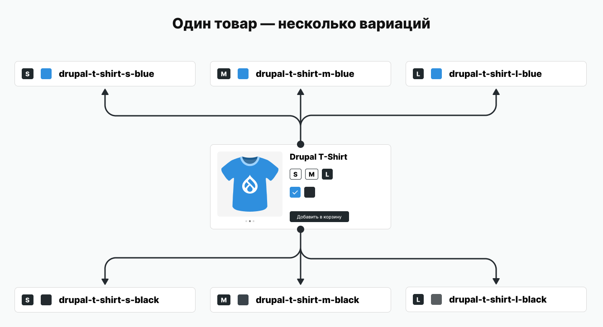
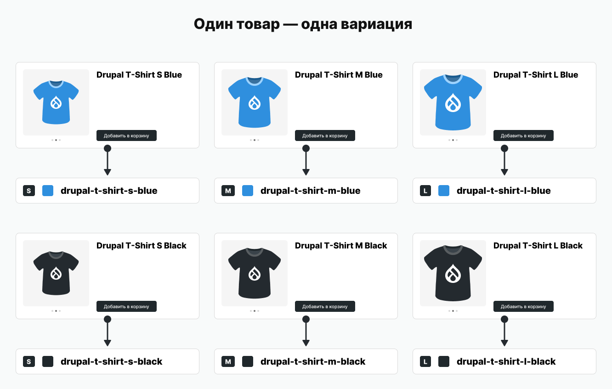
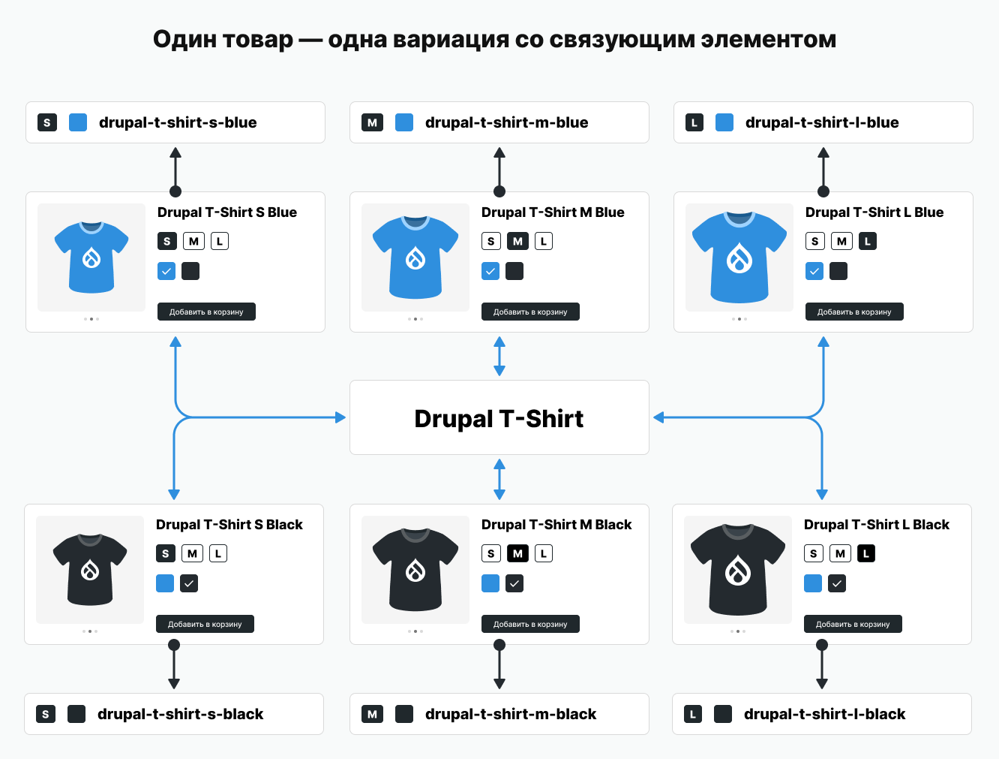
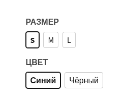
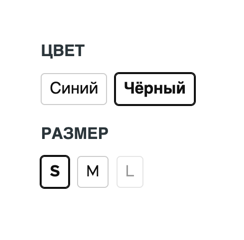

Один товар — одна вариация? Это не значит, что перелинковку нельзя использовать. В статье разберём, как в **Drupal Commerce 3**[^drupal-commerce-2]:

- объединять товары в группы, не меняя структуру каталога;
- создавать блоки со ссылками между «независимыми» позициями.

Такой подход особенно полезен для каталогов с автономными товарными позициями — он сохраняет структуру и создаёт смысловые связи между ними.

## Анализ проблемы и решение

### Практический пример

Чтобы было проще следить за материалом, рассмотрим конкретный пример. В каталоге продаётся футболка с логотипом Drupal. У неё два параметра — размер (S, M, L) и цвет (синий, чёрный). Всего шесть товарных позиций:

- S, синий (арт.: `drupal-t-shirt-s-blue`);
- S, чёрный (арт.: `drupal-t-shirt-s-black`);
- M, синий (арт.: `drupal-t-shirt-m-blue`);
- M, чёрный (арт.: `drupal-t-shirt-m-black`);
- L, синий (арт.: `drupal-t-shirt-l-blue`);
- L, чёрный (арт.: `drupal-t-shirt-l-black`).

### Стандартные подходы в Drupal Commerce

Если вы читаете этот материал, то, вероятно, уже знакомы с устройством Drupal Commerce.[^default-solution-remark] Существует два основных способа работы с вариациями:

#### Первый подход: один товар с несколькими вариациями

Штатные атрибуты позволяют выбирать параметры, однако у вариаций нет отдельных страниц.

::::: figure

::: figcaption
**Рисунок 1** — Схема «один товар с несколькими вариациями»
:::
:::::

#### Второй подход: один товар — одна вариация

Каждая вариация становится отдельным товаром. Это даёт несколько преимуществ:

- уникальную страницу;
- полный контроль над содержимым;
- возможность управлять метатегами.

Но при таком подходе теряются перелинковки, и выбор параметров через атрибуты становится невозможным.

::::: figure

::: figcaption
**Рисунок 2** — Схема «один товар — одна вариация»
:::
:::::

### Решение

Иногда нужно объединить преимущества обоих подходов. Это особенно важно, когда необходимо:

- контролировать контент конкретных вариаций;
- сохранять связи между товарами;
- улучшать UX и SEO.

**Оптимальное решение:** как показано на рисунке 1, все вариации объединены общим товаром. Это позволяет легко находить их и показывать различия. Для подхода «один товар — одна вариация» достаточно добавить связующий элемент — он объединит товары и обеспечит простой доступ ко всем вариациям.

#### Связующий элемент в системе вариаций

::::: figure

::: figcaption
**Рисунок 3** — Схема «один товар — одна вариация» со связующим элементом
:::
:::::

Связующий элемент помогает быстро находить похожие товары и связывать их между собой. Источник данных при этом не важен: подойдут как вариации одного товара, так и разные товары.

Как это работает? Нужно соблюсти два условия:

1. **Критерии группировки должны совпадать** — например, это может быть общая модель товара.

2. **Данные не должны конфликтовать** — уникальные параметры (цвет, размер) должны чётко отличать один товар от другого.

Какой может быть связующий элемент:

- **Логика в коде.** Если артикулы товаров соответствуют шаблону `префикс-вариация`, группу можно определить по префиксу. Этот способ хорошо подходит для автоматизированных систем: он снижает риск опечаток (лишние пробелы, неправильный регистр или раскладка).

- **Текстовое поле.** Этот вариант дополняет предыдущий и даёт явную привязку. С ним проще настраивать связи для разных задач — например, вносить правки через административный интерфейс.

- **Отдельная сущность** — например, таксономия. Такой подход удобен для ручного управления: товары редактируются через интерфейс, а не импортируются из внешних систем.

Рассмотрим пример. У всех товаров есть поле «Группа товаров» со значением `Drupal T-Shirt`. Если все шесть товаров используют это значение, можно:

1. Легко найти их по общему полю.
2. Выделить различия (размер, цвет). 
3. Создать перелинковку по принципу «один товар с несколькими вариациями».

Всё действительно так просто.

## Практическая реализация

Практическая часть включает два метода:

1. Использование атрибутов Drupal Commerce;
2. Использование произвольных полей.

Хотя методы похожи, их стоит рассматривать отдельно. В первом случае мы используем штатный API, чтобы упростить решение задач. Во втором случае придётся разработать собственное решение. Выберите метод, который лучше всего подходит для вашего магазина.

### Подготовка фундамента

Прежде чем приступить к реализации, подготовим общий фундамент — он одинаков для обоих методов.

Нам потребуется:

1. Добавить поле для хранения идентификатора группы товаров.
2. Создать шаблон для вывода вариантов товаров (та самая перелинковка).
3. Настроить простое хранилище для поиска всех связанных товаров по этому полю.

#### Группирующее поле

Как упоминалось ранее, нам нужен связующий элемент для поиска связанных вариаций. Предлагаю создать поле **«Группа товаров»** (`field_product_group`) типа «Связь» (Entity Reference), которое будет ссылаться на термины словаря «Группы товаров».

Почему стоит использовать таксономию? Вот основные причины:

1. **Встроенный виджет с автодополнением.**\
   Он поможет уменьшить количество ошибок при ручном вводе и избавит от необходимости дополнительно обрабатывать данные для поиска. Найти группы с логичными названиями (например, «Drupal T‑Shirt») будет легко: поле само предложит варианты.

2. **Аналогия с категориями.**\
   Категории объединяют товары глобально, а группы — по конкретным признакам.

3. **Безопасное массовое редактирование.**\
   Если изменить название группы, связи товаров не нарушатся. Даже если случайно создать похожие названия (например,  «Drupal T‑Shirt»),[^entity-reference-value-id] система распознаёт их как разные группы. Поэтому товары не перемешаются.

::: note [Удаление термина и его влияние на группировку товаров]
При удалении термина «группа товаров» могут возникнуть нюансы. Группировка товаров, связанных с этим термином, сохранится, пока все товары не будут пересохранены (например, через редактирование или импорт).

Это происходит потому, что:

1. Поля «Связь» хранят ID сущности, даже если она удалена:
   - система не очищает такие поля автоматически;
   - невалидные связи исправляются только при сохранении сущности.

2. До пересохранения товары остаются сгруппированными по старому ID. В базе данных связи сохраняются, поэтому группировка работает, даже если термина уже нет.

Если важно избежать временных «висячих» связей, можно использовать хук `taxonomy_term_delete`. Он позволяет принудительно очищать поля при удалении термина.

Решение легко реализовать с помощью хранилища — мы рассмотрим его в листинге 6.

💡 **«Не баг, а фича»:** такое поведение можно считать особенностью. Например, оно позволяет сохранить группировку, если группирующий термин был удалён случайно.
:::

::::: figure
  :: video [Демонстрация поля «Группа товаров»](video/field-product-group-ui-autocomplete.ru.mp4){muted autoplay loop}
  ::: figcaption
  **Видео 1** — Демонстрация поля «Группа товаров» с виджетом «Автодополнение»
  :::
:::::

Поле я добавляю к товару, так как оно больше похоже на категорию. Его задача — объединять товары по определённому признаку для конкретных целей. В своих проектах я размещаю это поле сразу после выбора категорий: это логично из‑за схожести функций.

Хотите добавить поле в вариацию? Это несложно: достаточно поправить одну строку кода, чтобы работать через вариации. <mark>Выбирайте вариант, который удобнее вашим менеджерам и лучше подходит проекту.</mark>

Словарь вы, скорее всего, создадите самостоятельно. 🤨 Название и технический идентификатор выбирайте на своё усмотрение. Главное — не забудьте назначить словарь для созданного поля.

::::: tip [Закройте доступ к терминам словаря]
Поскольку словарь «Группы товаров» носит технический характер, его термины не должны быть доступны ни пользователям, ни поисковым системам. Закройте словарь от индексации — выберите любой удобный способ.

Самый простой способ — использовать модуль [Rabbit Hole](https://www.drupal.org/project/rabbit_hole) — он позволяет управлять поведением сущностей: запрещать прямой доступ к страницам, настраивать перенаправления или скрывать элементы. Настройте для словаря режим «Страница не найдена»: тогда страницы терминов будут возвращать код ответа HTTP 404
:::::

#### Шаблон перелинковки

Нам также понадобится шаблон для вывода перелинковки и переключения между вариантами[^variant-vs-variation] товара. Реализовать его можно любым способом — ограничений нет. Однако в учебных целях мы не будем усложнять задачу и выберем простой вариант. Шаблон будет показывать ссылки на варианты товара, сгруппированные по определённым признакам.

::::: figure
  ::: figcaption
  **Листинг 1** — Пример массива с группами и вариантами для перелинковки
  :::
  ```php
  return [
    'size' => [
      'label' => 'Размер',
      'variants' => [
        ['value' => 'S', 'url' => '/product/drupal-t-shirt-s-blue', 'is_active' => TRUE],
        ['value' => 'M', 'url' => '/product/drupal-t-shirt-m-blue'],
        ['value' => 'L', 'url' => '/product/drupal-t-shirt-l-blue'],
      ],
    ],
    'color' => [
      'label' => 'Цвет',
      'variants' => [
        ['value' => 'Синий', 'url' => '/product/drupal-t-shirt-s-blue', 'is_active' => TRUE],
        ['value' => 'Чёрный', 'url' => '/product/drupal-t-shirt-m-blue'],
      ],
    ],
  ];
  ```
:::::

Пока не заостряйте внимание на том, как формируется массив из листинга 1 — мы разберём это позже. Сейчас главное — понять структуру данных на входе:

1. **Верхний уровень** — группы атрибутов (например, размер или цвет).

2. **Внутри групп** — варианты, которые включают:
   - значение (`value`);
   - ссылку на товар;
   - отметку об активности варианта в рамках атрибутов (`is_active`).

::::: figure
  
  ::: figcaption
  **Рисунок 4** — Примерный вывод обработанных опций с вариантами
  :::
:::::

Чтобы не терять время: если вы пока не знакомы с [тем‑хуками][theme-hooks] или [библиотеками][libraries] в Drupal, ознакомьтесь с соответствующими материалами. Ниже приведены листинги всех этапов и файлов, необходимых для реализации (все примеры кода предполагают, что модуль называется **example**).

::::: figure
  ::: figcaption
  **Листинг 2** — Регистрация тем‑хука `example_product_variant_selector` в `src/Hook/Theme.php`
  :::
```php
<?php

declare(strict_types=1);

namespace Drupal\example\Hook;

use Drupal\Core\Hook\Attribute\Hook;

#[Hook('theme')]
final readonly class Theme {

  public function __invoke(): array {
    return [
      'example_product_variant_selector' => [
        'variables' => [
          'groups' => [],
        ],
      ],
    ];
  }

}
```
:::::

::::: figure
  ::: figcaption
  **Листинг 3** — Шаблон тем‑хука `example_product_variant_selector` — `templates/example-product-variant-selector.html.twig`
  :::
```twig
{#
/**
 * @file
 * Default theme implementation to display a product variant selector.
 *
 * Available variables:
 * - attributes: HTML attributes for the main container.
 * - groups: An array of option groups. Each group contains:
 *   - label: Group label (e.g., "Color", "Size").
 *   - variants: Array of available variants in the group:
 *     - value: Displayed option text or render array (e.g., "Red", "XL").
 *     - url: URL to select this variant.
 *     - is_active: (boolean) TRUE if this is the current variant.
 */
#}
{{ attach_library('example/product-variant-selector') }}
<div{{ attributes.addClass('product-variant-selector') }}>
  
    <div class="product-variant-selector__group">
      <div class="product-variant-selector__label">{{ group.label }}</div>
      <div class="product-variant-selector__variants">
        
          
            <div class="product-variant-selector__variant product-variant-selector__variant--selected">
              {{- variant.value -}}
            </div>
          
            <a href="{{ variant.url }}" class="product-variant-selector__variant">
              {{- variant.value -}}
            </a>
          
        
      </div>
    </div>
  
</div>
```
:::::

::::: figure
  ::: figcaption
  **Листинг 4** — CSS-стили тем‑хука `example_product_variant_selector` — `css/product-variant-selector.css`
  :::
```css
.product-variant-selector {
  display: flex;
  flex-direction: column;
  gap: 1rem;
}

.product-variant-selector__group {
  display: flex;
  flex-direction: column;
  gap: 0.5rem;
}

.product-variant-selector__label {
  text-transform: uppercase;
  font-weight: bold;
}

.product-variant-selector__variants {
  display: flex;
  flex-flow: wrap;
  gap: 0.5rem;
}

.product-variant-selector__variant {
  display: inline-flex;
  align-items: center;
  justify-content: center;
  height: 2rem;
  text-decoration: none;
  color: #111;
  border: 1px solid #ccc;
  border-radius: 4px;
  padding-inline: 0.5rem;

  &:hover {
    color: #111;
    border-color: #111;
    background: none;
  }
}

.product-variant-selector__variant--selected {
  border-color: #111;
  box-shadow: 0 0 0 1px #111;
  font-weight: bold;
}
```
:::::

::::: figure
  ::: figcaption
  **Листинг 5** — Регистрация библиотеки `product-variant-selector` для шаблона — `example.libraries.yml`
  :::
```yaml
product-variant-selector:
  css:
    theme:
      css/product-variant-selector.css: {}
```
:::::

#### Хранилище для вариаций

Мы также создадим несложное хранилище.[^product-group-field-on-variation][^product-group-field-text] Оно позволит находить другие вариации товара в пределах одной группы — даже если они размещены в других товарах.

::::: figure
  ::: figcaption
  **Листинг 6** — Хранилище для вариаций товаров
  :::
```php {"highlighted_lines":"28"}
<?php

declare(strict_types=1);

namespace Drupal\example\Repository;

use Drupal\commerce_product\ProductVariationStorageInterface;
use Drupal\Core\Entity\EntityTypeManagerInterface;

final readonly class ProductVariationRepository {

  public const string PRODUCT_GROUP_FIELD = 'field_product_group';

  public function __construct(
    private EntityTypeManagerInterface $entityTypeManager,
  ) {}

  public function loadByGroup(string $group_id): array {
    return $this->getStorage()->loadMultiple($this->findIdsByGroup($group_id));
  }

  public function findIdsByGroup(string $group_id): array {
    return $this
      ->getStorage()
      ->getQuery()
      ->accessCheck(FALSE)
      ->condition('status', 1)
      ->condition('product_id.entity.' . self::PRODUCT_GROUP_FIELD . '.target_id', $group_id)
      ->execute();
  }

  private function getStorage(): ProductVariationStorageInterface {
    return $this->entityTypeManager->getStorage('commerce_product_variation');
  }

}
```
:::::

::::: figure
  ::: figcaption
  **Листинг 7** — Регистрация сервисов модуля `example` в `example.services.yml`
  :::
```yaml
services:
  _defaults:
    autowire: true

  Drupal\example\Repository\ProductVariationRepository: {}
```
:::::

### Метод 1. Атрибуты Drupal Commerce

Использование атрибутов в Drupal Commerce упрощает работу: встроенный API автоматически сопоставляет данные для перелинковки — поэтому реализовывать маппер с нуля не придётся.

::::: figure
  ::: figcaption
  **Листинг 8** — Реализация выбора опций в `src/Hook/ProductVariantSelector.php`
  :::
```php
<?php

declare(strict_types=1);

namespace Drupal\example\Hook;

use Drupal\commerce_product\Entity\ProductInterface;
use Drupal\commerce_product\Entity\ProductVariationInterface;
use Drupal\commerce_product\ProductVariationAttributeMapperInterface;
use Drupal\Core\Cache\CacheableMetadata;
use Drupal\Core\Cache\CacheTagsInvalidatorInterface;
use Drupal\Core\Entity\Display\EntityViewDisplayInterface;
use Drupal\Core\Hook\Attribute\Hook;
use Drupal\Core\StringTranslation\TranslatableMarkup;
use Drupal\example\Repository\ProductVariationRepository;

final readonly class ProductVariantSelector {

  private const string FIELD_NAME = 'product_variant_selector';
  private const string PRODUCT_GROUP_FIELD = ProductVariationRepository::PRODUCT_GROUP_FIELD;

  public function __construct(
    private ProductVariationRepository $productVariationRepository,
    private ProductVariationAttributeMapperInterface $attributeMapper,
    private CacheTagsInvalidatorInterface $cacheTagsInvalidator,
  ) {}

  #[Hook('commerce_product_insert')]
  #[Hook('commerce_product_update')]
  #[Hook('commerce_product_delete')]
  public function invalidateSelectorCache(ProductInterface $product): void {
    if (!$this->hasGroupFieldWithValue($product)) {
      return;
    }

    $group_id = $product->get(self::PRODUCT_GROUP_FIELD)->getString();
    $this->cacheTagsInvalidator->invalidateTags([self::getSelectorCacheTag($group_id)]);
  }

  #[Hook('entity_extra_field_info')]
  public function info(): array {
    $product_types = ['default'];

    $definition = [
      'label' => new TranslatableMarkup('Product Variant Selector'),
      'visible' => FALSE,
      'weight' => 0,
    ];

    $definitions = [];
    foreach ($product_types as $product_type) {
      $definitions['commerce_product'][$product_type]['display'][self::FIELD_NAME] = $definition;
    }
    return $definitions;
  }

  #[Hook('commerce_product_view')]
  public function build(array &$build, ProductInterface $product, EntityViewDisplayInterface $display, string $view_mode): void {
    if (!$this->shouldDisplay($product, $display, $view_mode)) {
      return;
    }

    $cacheable_metadata = new CacheableMetadata();
    $groups = $this->prepareGroups($product, $cacheable_metadata);
    $build[self::FIELD_NAME] = [
      '#theme' => 'example_product_variant_selector',
      '#groups' => $groups,
    ];
    $cacheable_metadata->applyTo($build[self::FIELD_NAME]);
  }

  private function shouldDisplay(ProductInterface $product, EntityViewDisplayInterface $display, string $view_mode): bool {
    return $display->getComponent(self::FIELD_NAME)
      && $view_mode === 'full'
      && $this->hasGroupFieldWithValue($product)
      && $product->getDefaultVariation();
  }

  private function hasGroupFieldWithValue($product): bool {
    return $product->hasField(self::PRODUCT_GROUP_FIELD) && !$product->get(self::PRODUCT_GROUP_FIELD)->isEmpty();
  }

  /**
   * @return array<string, array{label: string, options: non-empty-array<array{value: string, url: string, is_active: bool}>}>
   */
  private function prepareGroups(ProductInterface $product, CacheableMetadata $cacheable_metadata): array {
    $group_id = $product->get(self::PRODUCT_GROUP_FIELD)->getString();
    $cacheable_metadata->addCacheTags([self::getSelectorCacheTag($group_id)]);
    $variations = $this->productVariationRepository->loadByGroup($group_id);
    $current_variation = $product->getDefaultVariation();
    $attributes = $this->attributeMapper->prepareAttributes($current_variation, $variations);

    $active_attributes = [];
    foreach ($attributes as $field_name => $attribute) {
      $active_attributes[$field_name] = $current_variation->getAttributeValueId($field_name);
    }

    $groups = [];
    foreach ($attributes as $field_name => $attribute) {
      $groups[$attribute->getId()] = [
        'label' => $attribute->getLabel(),
        'variants' => [],
      ];

      foreach ($attribute->getValues() as $value_id => $value) {
        if ($value_id === '_none') {
          continue;
        }

        $attribute_values = $active_attributes;
        $attribute_values[$field_name] = $value_id;

        $variation = $this->attributeMapper->selectVariation($variations, $attribute_values);
        if (!$variation instanceof ProductVariationInterface) {
          continue;
        }

        $cacheable_metadata->addCacheableDependency($variation);
        if (!$variation->getProduct()?->isPublished()) {
          continue;
        }

        $groups[$attribute->getId()]['variants'][$value_id] = [
          'value' => $value,
          'url' => $variation->getProduct()->toUrl()->toString(),
          'is_active' => (string) $value_id === (string) $current_variation->getAttributeValueId($field_name),
        ];
        $cacheable_metadata->addCacheableDependency($variation->getProduct());
      }
    }

    return \array_filter($groups, static fn ($group) => \count($group['variants']) > 0);
  }

  private static function getSelectorCacheTag(string $group_id): string {
    return "product_variant_selector:$group_id";
  }

}
```
:::::

Данный класс состоит из трёх основных частей:

1. **Инвалидация [кеш‑тегов][cache-metadata]** — метод `::invalidateSelectorCache()` вызывается при CRUD-операциях с товарами. Если поле группы товаров заполнено, кеш с тегом `product_variant_selector:[group_id]` очищается. Это автоматически обновляет аналогичные элементы на страницах товаров из этой группы. Так поддерживается актуальность выбора вариантов — без ручного контроля связанных товаров.

2. **Добавление [псевдо‑поля][extra-fields]** — метод `::info()` регистрирует поле для типов товаров из массива `$product_types` (в примере — `default`). По умолчанию поле скрыто[^extra-field-visible] — его нужно вручную включить в разделе «Управление отображением» для нужного режима (например, `full`).

3. **Подготовка и добавление в товар нашего [тем‑хука][theme-hooks]** — метод `::build()` готовит структуру данных согласно листингу 1. За подготовку отвечает метод `::prepareGroups()`.

Давайте разберём, что происходит в методе `::prepareGroups()`:

- **Инициализация данных**
  - получаем текущий ID группы товаров (`$group_id`);
  - добавляем кастомный тег в метаданные кеша;
  - загружаем все вариации с аналогичной группой через хранилище (см. листинг 6).

- **Получение текущей информации**
  - получаем активную вариацию товара (`$current_variation`);
  - запрашиваем все доступные атрибуты для текущей вариации через Drupal Commerce API (`$attributes`).

- **Получение активных атрибутов**
  - создаём массив `$active_attributes`;
  - формируем структуру с ключами‑названиями полей и значениями‑ID атрибутов.

  **Пример структуры:**
  ```php
  $active_attributes = [
    'attribute_color' => 1, // 1 — ID значения «Чёрный»
    'attribute_size' => 2, // 2 — ID значения «M»
  ];
  ```

- **Создание групп вариаций:**
  - формируем массив `$groups` по ID типа атрибута;
  - добавляем метку и варианты выбора.

  - **Обработка каждого возможного значения атрибута:**
    - создаём временный контекст выбора (`$attribute_values`), заменяя в цикле значение атрибута на новое — это имитирует процесс выбора значения для вариации;
    - ищем соответствующую вариацию через `attributeMapper` с использованием нового контекста. Например, если у текущей вариации (`drupal-t-shirt-m-black`) выбраны: Цвет «Чёрный», Размер «M», то при подстановке цвета «Синий» найдём `drupal-t-shirt-m-blue`;
    - если вариация с новыми критериями не найдена — переходим к следующему значению, иначе добавляем её в метаданные кеша;
    - если у вариации нет товара или он снят с публикации — пропускаем её (ссылка будет битой);
    - если вариация привязана к опубликованному товару:
      - добавляем вариант с меткой, URL и отметкой активности;
      - добавляем товар вариации в кеш‑метаданные.

- **Финальная фильтрация**
  - фильтруем группы, оставляя только те, у которых есть доступные варианты выбора. Например, если у всех значений атрибута товары не опубликованы, группа исключается.

::: tip [`value` может быть и рендер‑массивом]
В нашем примере значение варианта — это метка атрибута Drupal Commerce. Однако возможны и другие варианты.

Для `value` вы можете создать собственный [рендер‑массив][render-arrays], чтобы настроить отображение атрибута, или реализовать собственную логику. Например:

- добавить новый режим отображения товара — «Выбор варианта»;
- в этом режиме показывать фотографию и название товара;
- затем в value указать отображение товара: `$view_builder->view($product, 'variant_choice')`.

**Важно:** `value` не должен содержать внутреннюю ссылку — само значение становится кликабельным. Если в содержимом нужна ссылка, проверьте её актуальность. Обёртку‑ссылку следует либо удалить, либо сделать опциональной.
:::

После связывания товаров через поле «Группа товаров» на страницах этих товаров появится выбор варианта.

::::: figure
:: video [Демонстрация перелинковки вариаций на странице товара](video/selector-on-page.ru.mp4){muted autoplay loop}
::: figcaption
**Видео 2** — Демонстрация перелинковки между вариантами на странице товара
:::
:::::

### Метод 2. Произвольные поля

Этот метод потребует немного больше кода: нужно будет реализовать маппер для параметров товара — именно по ним будет происходить переключение вариантов[^variant-vs-variation]. Преимущество этого подхода в том, что вы не будете ограничены ни атрибутами Drupal Commerce, ни его сущностями товаров и вариаций. Хотя этот метод будет описан на примере Drupal Commerce, его легко адаптировать для любых других сущностей и организации каталогов и магазинов.

#### Подготовка полей

Этот этап необязательный — он нужен, чтобы лучше понять дальнейшие действия. В первом методе мы использовали два атрибута Drupal Commerce — «Цвет» и «Размер». Теперь эти данные нам понадобятся в виде произвольных полей. Поэтому я добавил в вариацию товара два поля:

1. **«Размер»:**
   - машинное имя: `field_size`;
   - тип поля: «Список (текст)»;
   - допустимые значения:
     - название: S, машинное имя: `s`;
     - название: M, машинное имя: `m`.

2. **«Цвет»:**
   - машинное имя: `field_color`;
   - тип поля: «Ссылка на сущность»;
   - тип связи: термин таксономии;
   - словарь: Цвет.

Я специально выбрал разные типы полей — дальше вы поймёте почему. Главная задача этого этапа — добавить эти поля и сразу определить их типы. В отличие от атрибутов (которые являются сущностью), здесь нет такой стандартизации. Эти два поля станут нашими ориентирами в «зоопарке» типов полей.

#### Стандартизация через ParameterValue

Поскольку в текущей реализации нет стандартизованного представления параметра как сущности атрибута в Drupal Commerce, его необходимо ввести.

Для этого создадим простой объект‑значение ([Value Object](https://en.wikipedia.org/wiki/Value_object), далее — VO) `ParameterValue`. Он будет хранить только идентификатор параметра и его метку. Например: `new ParameterValue('color', 'Синий')`.

::::: figure
  ::: figcaption
  **Листинг 9** — Реализация в `src/Data/ParameterValue.php`
  :::
```php
<?php

declare(strict_types=1);

namespace Drupal\example\Data;

final readonly class ParameterValue {

  public function __construct(
    public string $id,
    public string $label,
  ) {}

}
```
:::::

#### Контракт извлечения параметров

Как уже упоминалось, в текущем подходе нет унифицированного способа извлечения данных параметров из произвольных полей. Введём его самостоятельно.

Поскольку в Drupal много типов полей, и они ведут себя по‑разному, нам понадобится механизм для сбора данных в нужном формате (`ParameterValue` VO). Для этого предлагаю ввести простой контракт `ParameterResolver`.

::::: figure
  ::: figcaption
  **Листинг 10** — Реализация контракта в `src/Contract/ParameterResolver.php`
  :::
```php
<?php

declare(strict_types=1);

namespace Drupal\example\Contract;

use Drupal\commerce_product\Entity\ProductVariationInterface;
use Drupal\Core\Field\FieldDefinitionInterface;
use Symfony\Component\DependencyInjection\Attribute\AutoconfigureTag;

#[AutoconfigureTag]
interface ParameterResolver {

  public function supports(FieldDefinitionInterface $field_definition): bool;

  /**
   * @return array<string, \Drupal\example\Data\ParameterValue>
   */
  public function resolveValues(FieldDefinitionInterface $field_definition, ProductVariationInterface ...$variations): array;

}

```
:::::

Этот контракт позволяет реализовывать извлечение параметров для разных типов полей (в общем случае), а также решать частные задачи — например, для конкретного поля или определённого типа сущности. Контракт достаточно простой.

Он включает следующие элементы:

- `#[AutoconfigureTag]` — помечаем контракт как метку для [сервисов с меткой][tagged-services][^autoconfigure-tag].
- `::supports()` — метод, который определяет, подходит ли текущая реализация контракта для предоставленного определения поля.
- `::resolveValues()` — метод, который принимает:
  - определение поля;
  - коллекцию вариаций товара (из неё нужно извлечь значения для параметров).

В результате резолвер должен вернуть массив стандартизованных значений `ParameterValue`.

#### Резолвер для полей типа «Ссылка на сущность»

Начнём с поля «Цвет» (`field_color`) типа «Ссылка на сущность». Этот тип поля будет стандартизован следующим образом: `ParameterValue(<entity_id>, <entity_label>)`.

::::: figure
  ::: figcaption
  **Листинг 11** — Реализация резолвера параметров для типа поля `entity_reference` в `src/Resolver/EntityReferenceParameterResolver.php`
  :::
```php
<?php

declare(strict_types=1);

namespace Drupal\example\Resolver;

use Drupal\commerce_product\Entity\ProductVariationInterface;
use Drupal\Core\Entity\EntityInterface;
use Drupal\Core\Field\FieldDefinitionInterface;
use Drupal\example\Contract\ParameterResolver;
use Drupal\example\Data\ParameterValue;
use Symfony\Component\DependencyInjection\Attribute\AutoconfigureTag;

#[AutoconfigureTag(ParameterResolver::class)]
final readonly class EntityReferenceParameterResolver implements ParameterResolver {

  public function supports(FieldDefinitionInterface $field_definition): bool {
    return $field_definition->getType() === 'entity_reference';
  }

  public function resolveValues(FieldDefinitionInterface $field_definition, ProductVariationInterface ...$variations): array {
    $values = [];
    $field_name = $field_definition->getName();

    foreach ($variations as $variation) {
      $field = $variation->get($field_name);
      if ($field->isEmpty()) {
        continue;
      }

      $entity = $field->first()->get('entity')->getValue();
      if (!$entity instanceof EntityInterface) {
        continue;
      }

      $values[$entity->id()] = new ParameterValue((string) $entity->id(), $entity->label());
    }

    return $values;
  }

}
```
:::::

Пройдёмся по коду сверху вниз:

- Добавляем резолверу метку для сервиса на основе контракта с помощью `#[AutoconfigureTag]`.

- В методе `::supports()` обрабатываем только тип поля `entity_reference`.

- В методе `::resolveValues()`:
  - пропускаем вариацию, если поле не имеет значения;
  - получаем сущность из поля и проверяем, что она существует. Как уже упоминалось ранее, удаление сущности не обновляет поля данного типа. Поэтому наличие значения в поле не гарантирует, что связь по‑прежнему действительна;
  - добавляем `ParameterValue` в массив результатов.

::: note
Возможно, вы обратили внимание, что для параметра берётся первое значение из поля каждой вариации товара.

Теоретически могут быть сценарии, когда несколько параметров идентифицируют одну и ту же вариацию товара. Но мне не удалось придумать даже отдалённого примера такого случая. Это больше похоже на опции, а не на параметры.

Поэтому в этом резолвере и далее мы берём только первое значение — даже если поле множественное. Мы исходим из того, что первое значение является основным и, вероятно, единственным. Такой подход упрощает и код, и объяснение логики работы.

Технически вы можете добавлять сразу все значения. Однако в дальнейшем это потребует дополнительной проработки. Правки будут несложными, но стоит учитывать пограничные случаи — например, ситуации, когда разные вариации по каким‑то причинам имеют пересекающиеся значения.
:::

#### Резолвер для полей типа «Список (текст)»

Второе поле — «Размер» (`field_size`) — имеет тип «Список (текст)», то есть представляет собой селект с опциями.

В Drupal нужно указывать машинное имя (ключ или идентификатор опции) и название опции. Мы добавили две опции: S (`s`) и M (`m`).

Поэтому для этого типа поля мы стандартизуем параметры как `ParameterValue(<key>, <label>)`.

::::: figure
  ::: figcaption
  **Листинг 12** — Реализация резолвера параметров для типа поля `list_string` в `src/Resolver/ListStringParameterResolver.php`
  :::
```php
<?php

declare(strict_types=1);

namespace Drupal\example\Resolver;

use Drupal\commerce_product\Entity\ProductVariationInterface;
use Drupal\Core\Field\FieldDefinitionInterface;
use Drupal\example\Contract\ParameterResolver;
use Drupal\example\Data\ParameterValue;
use Symfony\Component\DependencyInjection\Attribute\AutoconfigureTag;

#[AutoconfigureTag(ParameterResolver::class)]
final readonly class ListStringParameterResolver implements ParameterResolver {

  public function supports(FieldDefinitionInterface $field_definition): bool {
    return $field_definition->getType() === 'list_string';
  }

  public function resolveValues(FieldDefinitionInterface $field_definition, ProductVariationInterface ...$variations): array {
    $storage_definition = $field_definition->getFieldStorageDefinition();
    $values = [];

    foreach ($variations as $variation) {
      $field = $variation->get($field_definition->getName());
      if ($field->isEmpty()) {
        continue;
      }

      $options = \options_allowed_values($storage_definition, $variation);
      $selected_option = $field->first()->getString();
      $values[$selected_option] = new ParameterValue($selected_option, $options[$selected_option]);
    }

    return $values;
  }

}
```
:::::

Поскольку реализация следует контракту, принцип работы схож с предыдущей реализацией — отличаются лишь внутренняя логика и тип поля:

- Добавляем резолверу метку для сервиса на основе контракта с помощью `#[AutoconfigureTag]`.

- В методе `::supports()` обрабатываем только тип поля `list_string`.

- В методе `::resolveValues()`:
  - пропускаем вариацию, если поле не имеет значения;
  - получаем все доступные опции для данного поля и вариации;
  - извлекаем значение выбранной опции (ключ);
  - добавляем `ParameterValue` в массив результатов.

---

Если нужно добавить поддержку других типов полей, принцип уже понятен: реализуем контракт `ParameterResolver`, добавляем метку, а также методы `::supports()` и `::resolveValues()`. В последнем возвращаем извлечённые параметры через объект‑значение `ParameterValue`.

Убедитесь, что ID параметра максимально уникален и каждый раз точно идентифицирует параметр. Не забудьте зарегистрировать созданный резолвер параметров как сервис. Мы рассмотрим этот шаг чуть позже.

#### Выбор резолвера

Теперь, когда мы ввели резолверы параметров для двух типов полей, нам нужно для удобства и последующей масштабируемости добавить селектор резолверов параметров. Ведь на реальном проекте двух резолверов будет недостаточно.

Задача селектора — выбрать подходящий резолвер на основе типа поля.

::::: figure
  ::: figcaption
  **Листинг 13** — Реализация селектора для резолверов параметров в `src/Resolver/ParameterResolverSelector.php`
  :::
```php
<?php

declare(strict_types=1);

namespace Drupal\example\Resolver;

use Drupal\Core\Field\FieldDefinitionInterface;
use Drupal\example\Contract\ParameterResolver;
use Symfony\Component\DependencyInjection\Attribute\AutowireIterator;

final readonly class ParameterResolverSelector {

  public function __construct(
    #[AutowireIterator(ParameterResolver::class)]
    private iterable $resolvers,
  ) {}

  public function forField(FieldDefinitionInterface $field_definition): ParameterResolver {
    foreach ($this->resolvers as $resolver) {
      \assert($resolver instanceof ParameterResolver);
      if ($resolver->supports($field_definition)) {
        return $resolver;
      }
    }
    throw new \InvalidArgumentException("No resolver found for field type '{$field_definition->getType()}'");
  }

}
```
:::::

Разберём, что здесь происходит:

- В конструкторе через `#[AutowireIterator]` внедряется коллекция всех сервисов с меткой `ParameterResolver`. Это те самые резолверы, которые мы создали ранее — и любые новые, которые появятся в будущем.
- Метод `::forField()` перебирает резолверы и возвращает первый, который поддерживает переданное определение поля.
- Если ни один резолвер не подошёл — выбрасывается исключение. Это помогает быстро обнаружить неподдерживаемые типы полей на этапе разработки.

#### Маппер параметров

Переходим к ключевому элементу — маппер параметров вариантов. Его задача — собрать данные из произвольных полей в единую структуру для перелинковки: определить, какие значения параметров доступны, и подобрать подходящую вариацию для каждой комбинации. По сути, это аналог `ProductVariationAttributeMapperInterface` из Drupal Commerce, но без привязки к сущности атрибутов — он работает с любыми полями через резолверы, которые мы создали ранее.

::::: figure
::: figcaption
**Листинг 14** — Реализация маппера параметров вариантов в `src/Mapper/ProductVariantParameterMapper.php`
:::
```php
<?php

declare(strict_types=1);

namespace Drupal\example\Mapper;

use Drupal\commerce_product\Entity\ProductVariationInterface;
use Drupal\Core\Entity\EntityFieldManagerInterface;
use Drupal\Core\Field\FieldDefinitionInterface;
use Drupal\example\Data\ParameterValue;
use Drupal\example\Resolver\ParameterResolverSelector;

final readonly class ProductVariantParameterMapper {

  private const array PARAMETER_FIELDS = [
    'field_color',
    'field_size',
  ];

  public function __construct(
    private EntityFieldManagerInterface $entityFieldManager,
    private ParameterResolverSelector $parameterResolverSelector,
  ) {}

  /**
   * @param list<\Drupal\commerce_product\Entity\ProductVariationInterface> $variations
   * @param array<string, \Drupal\example\Data\ParameterValue> $parameter_values
   */
  public function selectVariation(array $variations, array $parameter_values = []): ?ProductVariationInterface {
    foreach ($variations as $variation) {
      if ($this->variationMatchesParameters($variation, $parameter_values)) {
        return $variation;
      }
    }
    return $this->findBestMatchingVariation($variations, $parameter_values);
  }

  /**
   * @return array<string, array{label: string, values: list<\Drupal\example\Data\ParameterValue>}>
   */
  public function prepareParameters(ProductVariationInterface $selected_variation, ProductVariationInterface ...$variations): array {
    $parameters = [];
    foreach (self::PARAMETER_FIELDS as $field_name) {
      $data = $this->buildParameter($field_name, $selected_variation, ...$variations);
      if (\count($data['values']) === 0) {
        continue;
      }
      $parameters[$field_name] = $data;
    }

    return $parameters;
  }

  public function getParameterValue(string $field_name, ProductVariationInterface $variation): ?ParameterValue {
    $field_definition = $this->getFieldDefinition($field_name, $variation);
    $resolver = $this->parameterResolverSelector->forField($field_definition);
    $values = $resolver->resolveValues($field_definition, $variation);
    $property_value = \array_shift($values);
    return $property_value instanceof ParameterValue ? $property_value : NULL;
  }

  private function variationMatchesParameters(ProductVariationInterface $variation, array $parameter_values): bool {
    foreach ($parameter_values as $field_name => $expected_value) {
      if ($this->getParameterValue($field_name, $variation)?->id !== $expected_value->id) {
        return FALSE;
      }
    }
    return TRUE;
  }

  private function getFieldDefinition(string $field_name, ProductVariationInterface $variation): FieldDefinitionInterface {
    $definitions = $this->entityFieldManager->getFieldDefinitions(
      $variation->getEntityTypeId(),
      $variation->bundle(),
    );
    return $definitions[$field_name] ?? throw new \InvalidArgumentException(\sprintf(
      'Field "%s" not found for %s:%s',
      $field_name,
      $variation->getEntityTypeId(),
      $variation->bundle(),
    ));
  }

  /**
   * Finds best match by relaxing constraints stepwise.
   */
  private function findBestMatchingVariation(array $variations, array &$parameter_values): ?ProductVariationInterface {
    if (\count($variations) === 0) {
      return NULL;
    }

    while (\count($parameter_values) > 0) {
      \array_pop($parameter_values);
      foreach ($variations as $variation) {
        if ($this->variationMatchesParameters($variation, $parameter_values)) {
          return $variation;
        }
      }
    }

    return \array_shift($variations) ?? NULL;
  }

  private function buildParameter(string $field_name, ProductVariationInterface $selected_variation, ProductVariationInterface ...$variations): array {
    $field_definition = $this->getFieldDefinition($field_name, $selected_variation);
    $parameter_index = \array_search($field_name, self::PARAMETER_FIELDS, TRUE);
    $filtered_variations = $this->filterVariationsByEstablishedParameters(
      variations: $variations,
      selected_variation: $selected_variation,
      current_index: $parameter_index,
    );

    return [
      'label' => $field_definition->getLabel(),
      'values' => $this
        ->parameterResolverSelector
        ->forField($field_definition)
        ->resolveValues($field_definition, ...$filtered_variations),
    ];
  }

  private function filterVariationsByEstablishedParameters(array $variations, ProductVariationInterface $selected_variation, int $current_index): array {
    if ($current_index === 0) {
      return $variations;
    }

    $required_values = $this->getEstablishedParameterValues($selected_variation, $current_index);

    return \array_filter($variations, function (ProductVariationInterface $variation) use ($required_values) {
      foreach ($required_values as $field_name => $expected_value) {
        $actual_value = $this->getParameterValue($field_name, $variation);
        if ($actual_value?->id !== $expected_value->id) {
          return FALSE;
        }
      }
      return TRUE;
    });
  }

  /**
   * @return array<string, \Drupal\example\Data\ParameterValue>
   */
  private function getEstablishedParameterValues(ProductVariationInterface $variation, int $current_index): array {
    $values = [];
    for ($i = 0; $i < $current_index; $i++) {
      $field_name = self::PARAMETER_FIELDS[$i];
      $field_value = $this->getParameterValue($field_name, $variation);
      if ($field_value === NULL) {
        continue;
      }
      $values[$field_name] = $this->getParameterValue($field_name, $variation);
    }
    return $values;
  }

}
```
:::::

Разберём класс по частям:

- **Константа `PARAMETER_FIELDS`** — определяет, какие поля вариации являются параметрами и в каком порядке они обрабатываются. Порядок важен: он влияет на фильтрацию доступных значений (подробнее ниже).

- **Метод `::prepareParameters()`** — точка входа для построения структуры параметров. Перебирает поля из `PARAMETER_FIELDS`, для каждого вызывает `::buildParameter()` и исключает параметры без доступных значений.

- **Метод `::buildParameter()`** — формирует данные одного параметра:
  - получает определение поля и его позицию в массиве `PARAMETER_FIELDS`;
  - фильтрует вариации через `::filterVariationsByEstablishedParameters()`, оставляя только релевантные;
  - передаёт отфильтрованные вариации в резолвер, который извлекает из них доступные значения.

- **Фильтрация по «установленным» параметрам** — ключевая особенность маппера. Порядок полей в `PARAMETER_FIELDS` задаёт иерархию зависимости: при построении доступных значений для параметра с индексом N вариации сначала фильтруются по значениям всех предыдущих параметров (`0..N-1`) из текущей вариации.

  Вернёмся к нашему примеру. Порядок полей — `['field_color', 'field_size']`. Текущая вариация — `drupal-t-shirt-m-blue` (цвет «Синий», размер «M»):
  - **Цвет** (индекс 0) — предыдущих параметров нет, поэтому учитываются все шесть вариаций. Доступные цвета: синий, чёрный.
  - **Размер** (индекс 1) — вариации фильтруются по значению параметра с индексом 0, то есть по цвету «Синий». Остаются три вариации: `drupal-t-shirt-s-blue`, `drupal-t-shirt-m-blue`, `drupal-t-shirt-l-blue`. Доступные размеры: S, M, L.

  В нашем примере все комбинации существуют, поэтому фильтрация не исключает ни одного значения. Но если бы вариации `drupal-t-shirt-l-blue` не было, размер L не появился бы в списке — иначе пользователь, выбрав L при синем цвете, попал бы на `drupal-t-shirt-l-black`, что было бы неожиданно.

  За это отвечают методы `::filterVariationsByEstablishedParameters()` и `::getEstablishedParameterValues()`.[^php84-array-all]

- **Метод `::selectVariation()`** — подбирает вариацию по набору параметров. Используется при построении перелинковки: для каждого возможного значения параметра формируется набор, в котором одно значение заменено на новое, а остальные остаются от текущей вариации. Например, если текущая вариация — `drupal-t-shirt-m-blue` (цвет «Синий», размер «M»), то при переборе цветов для значения «Чёрный» набор будет `['color': 'Чёрный', 'size': 'M']` — и метод вернёт `drupal-t-shirt-m-black`. Сначала ищется точное совпадение по всем параметрам. Если его нет, вызывается `::findBestMatchingVariation()`, который последовательно ослабляет критерии — убирает параметры с конца, пока не найдётся подходящая вариация. Если ничего не подошло — возвращается первая доступная.[^php84-array-find]

- **Метод `::getParameterValue()`** — вспомогательный метод. Получает стандартизованное значение `ParameterValue` для конкретного поля вариации, делегируя извлечение подходящему резолверу через селектор.

::: tip [Атрибуты Drupal Commerce]
Метод 2 сохраняет возможность работы со стандартными атрибутами Drupal Commerce. Поскольку атрибуты являются сущностями, а стандартные поля для них — Entity Reference, `EntityReferenceParameterResolver` подхватит их из коробки. Не придётся заменять их на произвольные поля — достаточно указать уже существующие `attribute_color` и `attribute_size` вместо `field_color` и `field_size`.
:::

---

Порядок полей влияет на доступность вариантов: каждый следующий параметр фильтруется по значениям предыдущих. Однако определять этот порядок должны не технические ограничения, а специфика вашего проекта.

Ориентируйтесь на:

- **поведение целевой аудитории** — как пользователи выбирают тот или иной тип товара;
- **особенности товарной категории** — что важнее для конкретной категории товаров;
- **бизнес-приоритеты** — какие параметры критичны для продаж.

Например: для футболок приоритетным может быть цвет, для ноутбуков — объём памяти, для обуви — размер.

Хотя в примере порядок задан константой (`PARAMETER_FIELDS`), настраивайте его индивидуально под свои задачи — получайте из бандл-класса товара, конфигурации или реализуйте логику на основе типа товара и контекста проекта.

#### Финальная интеграция

Осталось собрать всё воедино. Как и в методе 1, за отображение перелинковки отвечает класс `ProductVariantSelector` — он регистрирует псевдо‑поле, управляет кеш‑тегами и формирует данные для тем‑хука. Структура класса и принцип работы полностью совпадают с листингом 8, поэтому подробно разбирать общие части не будем. Ключевое отличие — в методе `::prepareGroups()`: вместо `ProductVariationAttributeMapperInterface` используется наш `ProductVariantParameterMapper`. В листинге подсвечены ключевые отличия от аналогичного кода из метода 1.

::::: figure
::: figcaption
**Листинг 15** — Реализация выбора опций с произвольными полями в `src/Hook/ProductVariantSelector.php`
:::
```php {"highlighted_lines":"14,24,84,91,93-95,99-101,105-107,109,119-120,122"}
<?php

declare(strict_types=1);

namespace Drupal\example\Hook;

use Drupal\commerce_product\Entity\ProductInterface;
use Drupal\commerce_product\Entity\ProductVariationInterface;
use Drupal\Core\Cache\CacheableMetadata;
use Drupal\Core\Cache\CacheTagsInvalidatorInterface;
use Drupal\Core\Entity\Display\EntityViewDisplayInterface;
use Drupal\Core\Hook\Attribute\Hook;
use Drupal\Core\StringTranslation\TranslatableMarkup;
use Drupal\example\Mapper\ProductVariantParameterMapper;
use Drupal\example\Repository\ProductVariationRepository;

final readonly class ProductVariantSelector {

  private const string FIELD_NAME = 'product_variant_selector';
  private const string PRODUCT_GROUP_FIELD = ProductVariationRepository::PRODUCT_GROUP_FIELD;

  public function __construct(
    private ProductVariationRepository $productVariationRepository,
    private ProductVariantParameterMapper $parameterMapper,
    private CacheTagsInvalidatorInterface $cacheTagsInvalidator,
  ) {}

  #[Hook('commerce_product_insert')]
  #[Hook('commerce_product_update')]
  #[Hook('commerce_product_delete')]
  public function invalidateSelectorCache(ProductInterface $product): void {
    if (!$this->hasGroupFieldWithValue($product)) {
      return;
    }

    $group_id = $product->get(self::PRODUCT_GROUP_FIELD)->getString();
    $this->cacheTagsInvalidator->invalidateTags([self::getSelectorCacheTag($group_id)]);
  }

  #[Hook('entity_extra_field_info')]
  public function info(): array {
    $product_types = ['default'];

    $definition = [
      'label' => new TranslatableMarkup('Product Variant Selector'),
      'visible' => FALSE,
      'weight' => 0,
    ];

    $definitions = [];
    foreach ($product_types as $product_type) {
      $definitions['commerce_product'][$product_type]['display'][self::FIELD_NAME] = $definition;
    }
    return $definitions;
  }

  #[Hook('commerce_product_view')]
  public function build(array &$build, ProductInterface $product, EntityViewDisplayInterface $display, string $view_mode): void {
    if (!$this->shouldDisplay($product, $display, $view_mode)) {
      return;
    }

    $cacheable_metadata = new CacheableMetadata();
    $groups = $this->prepareGroups($product, $cacheable_metadata);
    $build[self::FIELD_NAME] = [
      '#theme' => 'example_product_variant_selector',
      '#groups' => $groups,
    ];
    $cacheable_metadata->applyTo($build[self::FIELD_NAME]);
  }

  private function shouldDisplay(ProductInterface $product, EntityViewDisplayInterface $display, string $view_mode): bool {
    return $display->getComponent(self::FIELD_NAME)
      && $view_mode === 'full'
      && $this->hasGroupFieldWithValue($product)
      && $product->getDefaultVariation();
  }

  private function hasGroupFieldWithValue($product): bool {
    return $product->hasField(self::PRODUCT_GROUP_FIELD) && !$product->get(self::PRODUCT_GROUP_FIELD)->isEmpty();
  }

  /**
   * @return array<string, array{label: string, variants: non-empty-array<string, array{value: string, url: string, is_active: bool}>}>
   */
  private function prepareGroups(ProductInterface $product, CacheableMetadata $cacheable_metadata): array {
    $group_id = $product->get(self::PRODUCT_GROUP_FIELD)->getString();
    $cacheable_metadata->addCacheTags([self::getSelectorCacheTag($group_id)]);
    $variations = $this->productVariationRepository->loadByGroup($group_id);
    $current_variation = $product->getDefaultVariation();
    $parameters = $this->parameterMapper->prepareParameters($current_variation, ...$variations);

    $active_parameters = [];
    foreach ($parameters as $field_name => $parameter) {
      $active_parameters[$field_name] = $this->parameterMapper->getParameterValue($field_name, $current_variation);
    }

    $groups = [];
    foreach ($parameters as $field_name => $parameter) {
      $groups[$field_name] = [
        'label' => $parameter['label'],
        'variants' => [],
      ];

      foreach ($parameter['values'] as $value) {
        $parameter_values = $active_parameters;
        $parameter_values[$field_name] = $value;

        $variation = $this->parameterMapper->selectVariation($variations, $parameter_values);
        if (!$variation instanceof ProductVariationInterface) {
          continue;
        }

        $cacheable_metadata->addCacheableDependency($variation);
        if (!$variation->getProduct()?->isPublished()) {
          continue;
        }

        $groups[$field_name]['variants'][$value->id] = [
          'value' => $value->label,
          'url' => $variation->getProduct()->toUrl()->toString(),
          'is_active' => $value->id === $this->parameterMapper->getParameterValue($field_name, $current_variation)?->id,
        ];
        $cacheable_metadata->addCacheableDependency($variation->getProduct());
      }
    }

    return \array_filter($groups, static fn ($group) => \count($group['variants']) > 0);
  }

  private static function getSelectorCacheTag(string $group_id): string {
    return "product_variant_selector:$group_id";
  }

}
```
:::::

Инвалидация кеша, псевдо‑поле и общая логика `::build()` идентичны листингу 8 — различается только `::prepareGroups()`. Разберём отличия:

- **Источник параметров** — вместо `$this->attributeMapper->prepareAttributes()`, который возвращает объекты атрибутов Drupal Commerce, вызывается `$this->parameterMapper->prepareParameters()`. Результат — массив с ключами `label` и `values`, где значения представлены объектами `ParameterValue`.

- **Активные параметры** — в методе 1 значения берутся напрямую через `$current_variation->getAttributeValueId()`. Здесь же используется `$this->parameterMapper->getParameterValue()`, который делегирует извлечение подходящему резолверу.

- **Перебор значений** — в методе 1 итерируются значения атрибута (`$attribute->getValues()`), а служебное значение `_none` пропускается вручную. Здесь итерируются объекты `ParameterValue` из маппера — служебных значений нет.

- **Подбор вариации** — вызов `$this->parameterMapper->selectVariation()` вместо `$this->attributeMapper->selectVariation()`. Логика та же: подставляем новое значение одного параметра в текущий набор и ищем соответствующую вариацию.

- **Определение активности** — сравниваются ID объектов `ParameterValue` вместо ID значений атрибутов.

Не забудьте объявить регистрацию сервисов:

::::: figure
::: figcaption
**Листинг 16** — Регистрация сервисов модуля `example` в `example.services.yml`
:::
```yaml {"highlighted_lines":"4"}
services:
  _defaults:
    autowire: true
    autoconfigure: true

  Drupal\example\Repository\ProductVariationRepository: {}
  Drupal\example\Mapper\ProductVariantParameterMapper: {}
  Drupal\example\Resolver\ParameterResolverSelector: {}
  Drupal\example\Resolver\EntityReferenceParameterResolver: {}
  Drupal\example\Resolver\ListStringParameterResolver: {}
```
:::::

Обратите внимание на `autoconfigure: true` — эта настройка необходима, чтобы резолверы параметров с атрибутом `#[AutoconfigureTag]` автоматически получали нужные метки.

Результат работы полностью идентичен методу 1 (см. видео 2): после заполнения поля «Группа товаров» на страницах связанных товаров появится перелинковка с выбором вариантов. Разница — только «под капотом»: данные для переключения берутся из произвольных полей, а не из атрибутов Drupal Commerce. Хотя `ParameterValue` хранит лишь `id` и `label`, это не ограничивает отображение: в `value` варианта можно подставить любой [рендер‑массив][render-arrays] — например, миниатюру товара или его карточку в специальном режиме отображения. Достаточно адаптировать шаблон перелинковки из листинга 3 (подробнее — в заметке «`value` может быть и рендер‑массивом» в описании метода 1).

## Дополнительные материалы

Теперь, когда основной функционал готов и оба метода рассмотрены, стоит поразмышлять о дополнительных идеях. Они могут пригодиться после реализации основного функционала.

### Разделяем «1 товар — X вариаций» на «1 товар — 1 вариация»

Первая задача, которая возникнет при использовании принципа «1 товар — 1 вариация»: как из одного товара с несколькими вариациями сделать отдельные товары? Вручную это займёт очень много времени. К счастью, процесс легко автоматизировать — через простое обновление. Более того, при необходимости можно вернуть всё обратно, так как товары связаны через группу.

::::: figure
::: figcaption
**Листинг 17** — Пакетное обновление для разделения товаров по принципу «1 товар — 1 вариация» — `src/Hook/PostUpdateSplitProductVariations.php`
:::
```php
<?php

declare(strict_types=1);

namespace Drupal\example\Hook;

use Drupal\Core\DependencyInjection\ContainerInjectionInterface;
use Drupal\Core\Entity\EntityInterface;
use Drupal\Core\Entity\EntityTypeManagerInterface;
use Drupal\Core\Field\EntityReferenceFieldItemListInterface;
use Drupal\Core\Site\Settings;
use Drupal\Core\StringTranslation\TranslatableMarkup;
use Drupal\commerce_product\Entity\ProductInterface;
use Drupal\commerce_product\Entity\ProductVariationInterface;
use Drupal\example\Repository\ProductVariationRepository;
use Symfony\Component\DependencyInjection\ContainerInterface;

final readonly class PostUpdateSplitProductVariations implements ContainerInjectionInterface {

  private const string PRODUCT_GROUP_VOCABULARY = 'product_group';
  private const string FIELD_PRODUCT_GROUP = ProductVariationRepository::PRODUCT_GROUP_FIELD;
  private const int MIN_VARIATIONS_TO_SPLIT = 2;

  public function __construct(
    private EntityTypeManagerInterface $entityTypeManager,
  ) {}

  public static function create(ContainerInterface $container): self {
    return new self(
      $container->get(EntityTypeManagerInterface::class),
    );
  }

  private function splitProductVariations(ProductInterface $product): void {
    $group_id = $this->prepareGroupId($product->label());
    $product->set(self::FIELD_PRODUCT_GROUP, ['target_id' => $group_id]);

    $variations = $product->getVariations();
    $first_variation = \array_shift($variations);

    $product->setVariations([$first_variation]);

    foreach ($variations as $variation) {
      $new_product = $this->createProductFromVariation($product, $variation);
      $new_product->save();

      $variation->set('product_id', $new_product->id());
      $variation->save();
    }

    $product->save();
  }

  private function createProductFromVariation(ProductInterface $source_product, ProductVariationInterface $variation): ProductInterface {
    $new_product = $source_product->createDuplicate();
    $new_product->setVariations([$variation]);

    $this->duplicateParagraphs($source_product, $new_product);

    return $new_product;
  }

  private function duplicateParagraphs(ProductInterface $source_product, ProductInterface $target_product): void {
    foreach ($target_product->getFields() as $field_name => $field_item_list) {
      if (!$field_item_list instanceof EntityReferenceFieldItemListInterface || $field_item_list->getSetting('target_type') !== 'paragraph') {
        continue;
      }

      $target_product->set($field_name, NULL);

      foreach ($source_product->get($field_name)->referencedEntities() as $paragraph) {
        \assert($paragraph instanceof EntityInterface);
        $new_paragraph = $paragraph->createDuplicate();
        $target_product->get($field_name)->appendItem($new_paragraph);
      }
    }
  }

  private function prepareGroupId(string $name): int {
    $term_storage = $this->entityTypeManager->getStorage('taxonomy_term');

    $group_ids = $term_storage
      ->getQuery()
      ->accessCheck(FALSE)
      ->condition('vid', self::PRODUCT_GROUP_VOCABULARY)
      ->condition('name', $name)
      ->range(0, 1)
      ->execute();

    if (\count($group_ids) > 0) {
      return (int) \reset($group_ids);
    }

    $group = $term_storage->create(['vid' => self::PRODUCT_GROUP_VOCABULARY]);
    $group->setName($name);
    $group->save();

    return (int) $group->id();
  }

  public function __invoke(array &$sandbox): string {
    $step_size = Settings::get('entity_update_batch_size', 50);
    $storage = $this->entityTypeManager->getStorage('commerce_product');

    if (!isset($sandbox['total'])) {
      $sandbox['product_ids'] = $storage->getQuery()->accessCheck(FALSE)->execute();
      $sandbox['total'] = \count($sandbox['product_ids']);
      $sandbox['current'] = 0;

      if ($sandbox['total'] === 0) {
        $sandbox['#finished'] = 1;
        return (string) new TranslatableMarkup('No products found.');
      }
    }

    $batch_ids = \array_slice($sandbox['product_ids'], $sandbox['current'], $step_size);
    $products = $storage->loadMultiple($batch_ids);

    foreach ($products as $product) {
      \assert($product instanceof ProductInterface);
      $variation_ids = $product->getVariationIds();
      if (\count($variation_ids) >= self::MIN_VARIATIONS_TO_SPLIT) {
        $this->splitProductVariations($product);
      }
      $sandbox['current']++;
    }

    $sandbox['#finished'] = $sandbox['current'] / $sandbox['total'];

    return (string) new TranslatableMarkup('Processing products: @current of @total checked.', [
      '@current' => $sandbox['current'],
      '@total' => $sandbox['total'],
    ]);
  }

}
```
:::::

::::: figure
::: figcaption
**Листинг 18** — Точка входа пакетного обновления — `example.post_update.php`
:::
```php
<?php

declare(strict_types=1);

use Drupal\example\Hook\PostUpdateSplitProductVariations;

/**
 * Split multiple variations in a single product into single products.
 */
function example_post_update_split_product_variations(array &$sandbox): string {
  return \Drupal::classResolver(PostUpdateSplitProductVariations::class)($sandbox);
}
```
:::::

Разберём, как работает обновление.

При первом запуске обновление собирает ID всех товаров и запоминает их в `$sandbox`. При каждом следующем вызове обрабатывается очередная пачка.

::: tip [LRU-кеш в Drupal 11.2+]
При обновлении большого количества товаров (тысячи или десятки тысяч) не нужно вручную сбрасывать entity-кеш через `reset()`, так как `entity.memory_cache`, начиная с Drupal 11.2, использует LRU-кеш[^lru-cache].
:::

Товары с одной вариацией пропускаются — разделять нечего. Для товаров с двумя и более вариациями вызывается `::splitProductVariations()`. Алгоритм:

1. **Создаётся группа товаров.** По названию товара ищется термин в словаре `product_group`. Если термин не найден — создаётся новый. Полученный ID сохраняется в поле группы исходного товара — так все будущие товары также унаследуют эту группу.

2. **Первая вариация остаётся у исходного товара**, остальные переезжают в новые.

3. **Для каждой оставшейся вариации создаётся новый товар** через `createDuplicate()`. Дубль автоматически получает все значения оригинала, включая поле группы[^variation-product-id].

4. **Параграфы дублируются явно.** `createDuplicate()` копирует только ID для полей со связями, а не сами сущности — все новые товары будут указывать на одну и ту же сущность. Поэтому для параграфов добавлен явный `::duplicateParagraphs()`, который обходит все поля-параграфы и создаёт независимые копии для каждого нового товара (вложенные параграфы дублируются автоматически — при копировании сущность параграфа сама вызывает `createDuplicate()` для дочерних параграфов[^paragraph-duplicate-source]).

После запуска товар с N вариациями превращается в N отдельных товаров, связанных общей группой.

### Скрытие второстепенных товаров

После разделения вариаций на отдельные товары в листингах появится много однотипных позиций. В зависимости от специфики проекта, подходов, задач и самих товаров, это может быть как плюсом, так и минусом. С одной стороны — в листинге будет больше товаров, с другой — даже в нашем примере пользователь увидит шесть фактически одинаковых товаров, которые создают визуальный и информационный шум.

В зависимости от конкретного случая, стоит рассмотреть несколько вариантов действий:

1. **Не делать ничего.**\
   Допустимо, если захламление листинга несущественно для проекта или товары достаточно различаются между собой.

2. **Добавить отметку «Основной товар группы».**\
   По ней можно сортировать листинг: сначала показывать «основные» товары, а затем остальные. На первых страницах пользователь увидит по одному варианту каждого товара, остальные — на более поздних страницах. Преимущество сортировки перед фильтрацией: фильтры листинга по‑прежнему смогут находить все варианты товара.

3. **Добавить отметку «Скрывать в листинге».**\
   Такой подход сложнее: скрытие подразумевает фильтрацию, а значит часть товаров будет недоступна через фильтры категории. Можно применять скрытие только на «верхних» категориях, показывая все товары в самых конкретных и глубоких категориях — это частично сохранит возможность поиска через фильтры. Другой вариант — при индексации основного товара группы включать в его фильтруемые значения характеристики всех связанных вариантов. Тогда скрытые товары не будут отображаться в листинге, но основной товар группы будет находиться по любому параметру, а выбрать нужный вариант пользователь сможет уже на его странице. Готового решения для этого нет — подход зависит от реализации листинга.

Если нужно скрыть часть товаров из листинга, второй вариант предпочтительнее третьего: он не нарушает работу фильтров и сохраняет доступность всех позиций для пользователей.

### Общие отзывы

Если у ваших товаров есть отзывы, с высокой вероятностью они привязаны к конкретному товару. Это значит, что после разделения вариаций на отдельные товары все новые товары окажутся без отзывов.

Рассмотрите вариант, при котором сводка, рейтинг и отзывы загружаются не для конкретного товара, а для всей группы. Логика проста: из текущего товара получаем группу, загружаем все вариации через `ProductVariationRepository::loadByGroup()` и выбираем отзывы для всех связанных товаров сразу.

Визуально это выглядит так: в нашем примере есть шесть футболок, но даже один отзыв, добавленный к любой из них, отобразится у всех шести. Это удобно для пользователей и полезно для SEO — ни один товар из группы не будет искусственно выделен количеством отзывов. Это не обман: фактически это шесть вариантов одного товара с незначительными отличиями, поэтому отзывы и рейтинг логично делать общими.

Посмотрите, как это реализуют крупные интернет-магазины и маркетплейсы: неважно, к какому варианту товара написан отзыв — он отображается у всех вариантов и учитывается в общем рейтинге. Если отзывов много, добавьте переключатель «Все отзывы» / «Только для этого варианта».

### Блок вариантов группы

Переключатель вариантов, описанный в статье, имеет особенность: на странице конкретного товара доступны не все ссылки на варианты — только те, что релевантны текущей комбинации параметров.

Рассмотрим на примере футболок. Находясь на странице «Синяя M», пользователь увидит:

- **Переключатель цвета:** Синий (активен), Чёрный → ссылка на «Чёрная M»
- **Переключатель размера:** S → ссылка на «Синяя S», M (активен), L → ссылка на «Синяя L»

Таким образом, со страницы «Синяя M» доступны ссылки только на три варианта: «Чёрная M», «Синяя S», «Синяя L». Ссылок на «Чёрная S» и «Чёрная L» нет — они появятся только после переключения цвета на «Чёрный».

Дополнительный блок со всеми вариантами группы (иногда его называют «Похожие товары») решает сразу две задачи:

- **SEO** — каждая страница содержит прямые ссылки на все комбинации параметров, что улучшает внутреннюю перелинковку и ускоряет индексацию.
- **UX** — пользователь видит весь ассортимент группы сразу, не переходя по цепочке переключателей.

Реализация проста: загрузите все вариации группы через `ProductVariationRepository::loadByGroup()`, исключите текущую и отобразите остальные — в виде таблицы с параметрами или карточек-тизеров через View Builder.

Блок особенно ценен для товаров с тремя и более параметрами: чем больше комбинаций, тем больше «скрытых» ссылок в переключателе.

### Предзагрузка страниц вариаций в фоне

В отличие от атрибутов Drupal Commerce, виджет которых выводит AJAX‑форму для переключения между вариациями, в нашей реализации мы используем статические ссылки. Когда пользователь переключает вариант, происходит переход на новую страницу.

Вы можете добавить AJAX‑загрузку и обновление страницы для этих ссылок — например, с помощью [HTMX, поддержка которого появилась в Drupal 11.3][htmx-drupal-11-3]. Но зачастую проще воспользоваться предзагрузкой через [`<link rel="prefetch">`](https://developer.mozilla.org/en-US/docs/Web/HTML/Reference/Attributes/rel/prefetch): браузер загрузит страницы вариантов в фоновом режиме, и при клике переход будет практически мгновенным.

Однако в контексте Drupal Commerce у предзагрузки есть важные ограничения.

Предзагрузка имеет смысл **только для анонимных посетителей без сессии**. Для пользователей с активной сессией Drupal отдаёт заголовок `Cache-Control: must-revalidate, no-cache, private` — браузер не кеширует такие ответы. Предзагруженные страницы загрузятся повторно при переходе, создавая холостые запросы и необоснованную нагрузку на сервер. Учитывайте, что Drupal Commerce создаёт сессию при добавлении товара в корзину — даже у анонимного посетителя. Поэтому важно именно наличие сессии, а не роль пользователя. Реализовывать предзагрузку без учёта этого — всё равно что ДДоСить собственный сайт.

Также убедитесь, что параметр `cache.page.max_age` в настройках производительности (_Конфигурация → Разработка → Производительность → Максимальный возраст кеша браузера и прокси_, `system.performance`) больше нуля. При `max_age: 0` Drupal отдаёт `no-cache` даже анонимам — и предзагрузка не сработает.

Реализовать проверку сессии на бэкенде — например, добавить `<link rel="prefetch">` в рендер‑массив из тем‑хука — технически можно, но для этого потребуется [кеш‑контекст][cache-metadata] `session.exists`. Так как формирование рендер‑массива происходит при рендере сущности товара, этот кеш‑контекст приведёт к тому, что для каждого товара будут храниться **две версии** рендер-кеша — одна для посетителей с сессией, другая без. Это фактически удвоит объём кеша рендера сущностей на ровном месте — без какой‑либо пользы для посетителей с сессией, которым предзагрузка всё равно не добавляется.

На клиенте проверить наличие сессии тоже непросто: Drupal использует [HTTP-only куки](https://developer.mozilla.org/ru/docs/Web/HTTP/Guides/Cookies#secure_%D0%B1%D0%B5%D0%B7%D0%BE%D0%BF%D0%B0%D1%81%D0%BD%D1%8B%D0%B5_%D0%B8_httponly_%D0%BA%D1%83%D0%BA%D0%B8) для хранения сессии, и они недоступны из JavaScript через `document.cookie`. Можно передать информацию через `drupalSettings`, но это потребует дополнительной логики на последних этапах обработки страницы. Если анонимные корзины отключены, достаточно простой проверки `drupalSettings.user.uid !== 0`.

Вместо самостоятельной реализации рассмотрите готовые библиотеки предзагрузки:

- **[Quicklink](https://github.com/GoogleChromeLabs/quicklink)** — библиотека от Google, которая предзагружает ссылки, попадающие в область видимости. Есть готовый [модуль для Drupal](https://www.drupal.org/project/quicklink).

- **[ForesightJS](https://github.com/spaansba/ForesightJS)** — библиотека, которая предсказывает намерение пользователя по траектории курсора и запускает предзагрузку до того, как произойдёт клик.

- **[Speculation Rules API](https://developer.mozilla.org/en-US/docs/Web/API/Speculation_Rules_API)** — современный браузерный API для декларативного задания правил предзагрузки и предрендеринга страниц. Но с поддержкой будет туго.

Эти решения работают исключительно на клиенте (кроме Speculation Rules API — его можно передавать и с бэкенда), и они не требуют кеш‑контекстов на бэкенде.

Поэтому внедрять такое улучшение стоит индивидуально — в зависимости от особенностей проекта.

Если есть столько нюансов и проблем, зачем это всё делать? И почему я об этом пишу?

На самом деле, несмотря на все эти нюансы, реализация на клиенте остаётся простой. Фактически вам достаточно включить условный модуль Quicklink — и всё.

При этом пользователи, которые впервые попали на сайт и ещё не начали пользоваться корзиной, получат отличный первый опыт: сайт будет работать очень быстро. А первый опыт очень важен. Так что здесь, хоть и с оговорками, минимум усилий даёт хороший результат практически без затрат.

### Отображение недоступных вариантов

В текущей реализации `::prepareGroups()` пропускает значения параметров, для которых не находится подходящая вариация. Посетитель видит только доступные варианты — но не знает, какие ещё бывают. Например, если футболка синего цвета выпускается только в размерах S и M, переключатель на странице синей футболки покажет два размера вместо трёх. Посетитель может решить, что размера L не существует вовсе, хотя на самом деле он есть — просто в другом цвете.

Решение — показывать **все** значения параметров, но недоступные для текущей комбинации отображать как неактивные элементы без ссылки. Для этого потребуется внести изменения в маппер, селектор и шаблон.

Добавьте в `ProductVariantParameterMapper` два новых метода:

::::: figure
  ::: figcaption
  **Листинг 19** — Новые методы в `src/Mapper/ProductVariantParameterMapper.php`
  :::
```php
  /**
   * @param list<\Drupal\commerce_product\Entity\ProductVariationInterface> $variations
   * @param array<string, \Drupal\example\Data\ParameterValue> $parameter_values
   */
  public function findExactMatch(array $variations, array $parameter_values): ?ProductVariationInterface {
    foreach ($variations as $variation) {
      if ($this->variationMatchesParameters($variation, $parameter_values)) {
        return $variation;
      }
    }

    return NULL;
  }

  /**
   * @return array<string, array{label: string, values: array<string, \Drupal\example\Data\ParameterValue>}>
   */
  public function prepareAllParameterValues(ProductVariationInterface $selected_variation, ProductVariationInterface ...$variations): array {
    $parameters = [];
    foreach (self::PARAMETER_FIELDS as $field_name) {
      $field_definition = $this->getFieldDefinition($field_name, $selected_variation);
      $values = $this->parameterResolverSelector
        ->forField($field_definition)
        ->resolveValues($field_definition, ...$variations);
      if (\count($values) === 0) {
        continue;
      }
      $parameters[$field_name] = [
        'label' => $field_definition->getLabel(),
        'values' => $values,
      ];
    }

    return $parameters;
  }
```
:::::

Разберём отличия от существующих методов:

- **`findExactMatch()`** — в отличие от `selectVariation()`, не делает фоллбэк к частичному совпадению. Если ни одна вариация не соответствует _всем_ переданным параметрам, метод возвращает `NULL`. Это важное отличие: для недоступной комбинации нужен именно `NULL`, а не «ближайшее совпадение».

- **`prepareAllParameterValues()`** — в отличие от `prepareParameters()`, не фильтрует значения каскадно. Метод `prepareParameters()` сужает список значений каждого последующего параметра на основе уже выбранных — это исключает недоступные комбинации из выдачи. Новый метод возвращает **все** значения из всех вариаций, что позволяет показать их в интерфейсе — пусть и в отключённом виде.

Теперь обновите `::prepareGroups()` в `ProductVariantSelector`:

::::: figure
  ::: figcaption
  **Листинг 20** — Обновлённый метод `::prepareGroups()` — `src/Hook/ProductVariantSelector.php`
  :::
```php {"highlighted_lines":"2,9,26,28,30-48"}
  /**
   * @return array<string, array{label: string, variants: non-empty-array<string, array{value: string, url: ?string, is_active: bool, is_disabled: bool}>}>
   */
  private function prepareGroups(ProductInterface $product, CacheableMetadata $cacheable_metadata): array {
    $group_id = $product->get(self::PRODUCT_GROUP_FIELD)->getString();
    $cacheable_metadata->addCacheTags([self::getSelectorCacheTag($group_id)]);
    $variations = $this->productVariationRepository->loadByGroup($group_id);
    $current_variation = $product->getDefaultVariation();
    $parameters = $this->parameterMapper->prepareAllParameterValues($current_variation, ...$variations);

    $active_parameters = [];
    foreach ($parameters as $field_name => $parameter) {
      $active_parameters[$field_name] = $this->parameterMapper->getParameterValue($field_name, $current_variation);
    }

    $groups = [];
    foreach ($parameters as $field_name => $parameter) {
      $groups[$field_name] = [
        'label' => $parameter['label'],
        'variants' => [],
      ];

      foreach ($parameter['values'] as $value) {
        $parameter_values = $active_parameters;
        $parameter_values[$field_name] = $value;
        $is_active = $value->id === $active_parameters[$field_name]?->id;

        $variation = $this->parameterMapper->findExactMatch($variations, $parameter_values);

        if ($variation instanceof ProductVariationInterface && $variation->getProduct()?->isPublished()) {
          $cacheable_metadata->addCacheableDependency($variation);
          $cacheable_metadata->addCacheableDependency($variation->getProduct());

          $groups[$field_name]['variants'][$value->id] = [
            'value' => $value->label,
            'url' => $variation->getProduct()->toUrl()->toString(),
            'is_active' => $is_active,
            'is_disabled' => FALSE,
          ];
        }
        else {
          $groups[$field_name]['variants'][$value->id] = [
            'value' => $value->label,
            'url' => NULL,
            'is_active' => $is_active,
            'is_disabled' => TRUE,
          ];
        }
      }
    }

    return \array_filter($groups, static fn ($group) => \count($group['variants']) > 0);
  }
```
:::::

Ключевые изменения:

- **`prepareAllParameterValues()`** вместо `prepareParameters()` — теперь метод получает все значения параметров, включая те, для которых нет доступной вариации в текущей комбинации.
- **`findExactMatch()` вместо `selectVariation()`** — строгий поиск без фоллбэка. Если точного совпадения нет, вариация не подбирается «приблизительно».
- **Две ветки результата** — если вариация найдена и опубликована, формируется обычный вариант со ссылкой. Если нет — вариант добавляется с `url: NULL` и `is_disabled: TRUE`.

Осталось обновить шаблон и стили. Добавьте ветку для отключённых вариантов:

::::: figure
  ::: figcaption
  **Листинг 21** — Обновлённый шаблон — `templates/example-product-variant-selector.html.twig`
  :::
```twig {"highlighted_lines":"12,14,28-31"}
{#
/**
 * @file
 * Default theme implementation to display a product variant selector.
 *
 * Available variables:
 * - attributes: HTML attributes for the main container.
 * - groups: An array of option groups. Each group contains:
 *   - label: Group label (e.g., "Color", "Size").
 *   - variants: Array of available variants in the group:
 *     - value: Displayed option text or render array (e.g., "Red", "XL").
 *     - url: URL to select this variant (NULL when disabled).
 *     - is_active: (boolean) TRUE if this is the current variant.
 *     - is_disabled: (boolean) TRUE if this variant is unavailable.
 */
#}
{{ attach_library('example/product-variant-selector') }}
<div{{ attributes.addClass('product-variant-selector') }}>
  
    <div class="product-variant-selector__group">
      <div class="product-variant-selector__label">{{ group.label }}</div>
      <div class="product-variant-selector__variants">
        
          
            <div class="product-variant-selector__variant product-variant-selector__variant--selected">
              {{- variant.value -}}
            </div>
          
            <div class="product-variant-selector__variant product-variant-selector__variant--disabled">
              {{- variant.value -}}
            </div>
          
            <a href="{{ variant.url }}" class="product-variant-selector__variant">
              {{- variant.value -}}
            </a>
          
        
      </div>
    </div>
  
</div>
```
:::::

И дополните CSS стилем для недоступных вариантов:

::::: figure
  ::: figcaption
  **Листинг 22** — Стиль для недоступных вариантов — `css/product-variant-selector.css`
  :::
```css
.product-variant-selector__variant--disabled {
  cursor: not-allowed;
  color: #999;
  border-color: #e5e5e5;
}
```
:::::

::::: figure

::: figcaption
**Рисунок 5** — Варианты с недоступным значением «Размер — L»
:::
:::::

### Структурированные данные для вариаций

Если вы добавляете [структурированные данные][json-ld] Schema.org, то вам стоит рассмотреть добавление разметки
[`ProductGroup`][google-product-variants] с `hasVariant`. Она предназначена именно для таких случаев, когда страницы
связанных вариаций разнесены по разным URL. Разметку нужно размещать на каждой странице варианта — целиком[^product-group-id-ref], со всеми вариантами сразу. Так поисковик понимает, что страницы связаны и относятся к одной группе.

Ключевые свойства:

- **`name`** — название группы товаров. Если используется таксономия, всё просто: возьмите название термина.
- **`productGroupID`** — общий идентификатор группы. Удобно использовать ID термина.
- **`variesBy`** — свойства, по которым различаются варианты. Принимает:
  - полные URI свойств Schema.org — для стандартных характеристик (`color`, `size`);
  - произвольные строки — для нестандартных характеристик.
- **`hasVariant`** — список всех вариантов с их URL, SKU и характеристиками.

::::: figure
::: figcaption
**Листинг 23** — Пример JSON-LD разметки `ProductGroup` для футболок
:::
```json
{
  "@context": "https://schema.org/",
  "@type": "ProductGroup",
  "name": "Футболка с логотипом Drupal",
  "description": "Классическая футболка с логотипом Drupal, доступна в трёх размерах и двух цветах.",
  "productGroupID": "drupal-t-shirt",
  "variesBy": ["https://schema.org/color", "https://schema.org/size"],
  "hasVariant": [
    {
      "@type": "Product",
      "name": "Футболка с логотипом Drupal — S, синий",
      "sku": "drupal-t-shirt-s-blue",
      "color": "Синий",
      "size": "S",
      "url": "https://example.com/catalog/drupal-t-shirt-s-blue",
      "offers": {
        "@type": "Offer",
        "price": "1500",
        "priceCurrency": "RUB",
        "availability": "https://schema.org/InStock"
      }
    },
    {
      "@type": "Product",
      "name": "Футболка с логотипом Drupal — S, чёрный",
      "sku": "drupal-t-shirt-s-black",
      "color": "Чёрный",
      "size": "S",
      "url": "https://example.com/catalog/drupal-t-shirt-s-black",
      "offers": {
        "@type": "Offer",
        "price": "1500",
        "priceCurrency": "RUB",
        "availability": "https://schema.org/InStock"
      }
    },
    {
      "@type": "Product",
      "name": "Футболка с логотипом Drupal — M, синий",
      "sku": "drupal-t-shirt-m-blue",
      "color": "Синий",
      "size": "M",
      "url": "https://example.com/catalog/drupal-t-shirt-m-blue",
      "offers": {
        "@type": "Offer",
        "price": "1500",
        "priceCurrency": "RUB",
        "availability": "https://schema.org/InStock"
      }
    },
    {
      "@type": "Product",
      "name": "Футболка с логотипом Drupal — M, чёрный",
      "sku": "drupal-t-shirt-m-black",
      "color": "Чёрный",
      "size": "M",
      "url": "https://example.com/catalog/drupal-t-shirt-m-black",
      "offers": {
        "@type": "Offer",
        "price": "1500",
        "priceCurrency": "RUB",
        "availability": "https://schema.org/InStock"
      }
    },
    {
      "@type": "Product",
      "name": "Футболка с логотипом Drupal — L, синий",
      "sku": "drupal-t-shirt-l-blue",
      "color": "Синий",
      "size": "L",
      "url": "https://example.com/catalog/drupal-t-shirt-l-blue",
      "offers": {
        "@type": "Offer",
        "price": "1500",
        "priceCurrency": "RUB",
        "availability": "https://schema.org/InStock"
      }
    },
    {
      "@type": "Product",
      "name": "Футболка с логотипом Drupal — L, чёрный",
      "sku": "drupal-t-shirt-l-black",
      "color": "Чёрный",
      "size": "L",
      "url": "https://example.com/catalog/drupal-t-shirt-l-black",
      "offers": {
        "@type": "Offer",
        "price": "1500",
        "priceCurrency": "RUB",
        "availability": "https://schema.org/InStock"
      }
    }
  ]
}
```
:::::

Google поддерживает ограниченный набор стандартных характеристик: `color`, `size`, `suggestedAge`, `suggestedGender`, `material` и `pattern`. В примере выше как раз используются `color` и `size`. В случае если различия идут по другим параметрам, можно добавлять произвольные значения и описывать их с использованием `PropertyValue`.

::: note [`PropertyValue` как альтернатива стандартным свойствам]
Вы можете объявить `color` и `size` через `PropertyValue` в том числе. Но, вероятно, Google и другие системы, считывающие метаданные, лучше поймут стандартизованные версии. Тем не менее, имейте в виду, что у вас есть такая возможность.
:::

Например, если вы продаёте смартфоны, прямого свойства для объёма ОЗУ и объёма ПЗУ в Schema.org нет. В таких случаях в `variesBy` указывают произвольную строку. На каждом варианте товара добавляют `additionalProperty` с `PropertyValue`, где значение `name` **точно совпадает** с этой строкой.

::::: figure
::: figcaption
**Листинг 24** — Пример `ProductGroup` с нестандартными характеристиками через `additionalProperty`
:::
```json
{
  "@context": "https://schema.org/",
  "@type": "ProductGroup",
  "name": "Смартфон ExamplePhone",
  "productGroupID": "examplephone",
  "variesBy": ["Объём ОЗУ", "Объём ПЗУ"],
  "hasVariant": [
    {
      "@type": "Product",
      "name": "Смартфон ExamplePhone — 8/128",
      "sku": "examplephone-8-128",
      "url": "https://example.com/catalog/examplephone-8-128",
      "additionalProperty": [
        { "@type": "PropertyValue", "name": "Объём ОЗУ", "value": "8 ГБ" },
        { "@type": "PropertyValue", "name": "Объём ПЗУ", "value": "128 ГБ" }
      ]
    },
    {
      "@type": "Product",
      "name": "Смартфон ExamplePhone — 12/256",
      "sku": "examplephone-12-256",
      "url": "https://example.com/catalog/examplephone-12-256",
      "additionalProperty": [
        { "@type": "PropertyValue", "name": "Объём ОЗУ", "value": "12 ГБ" },
        { "@type": "PropertyValue", "name": "Объём ПЗУ", "value": "256 ГБ" }
      ]
    }
  ]
}
```
:::::

### Уникальность контента вариантов

Ещё одна проблема, которая возникает при разделении одного товара с множественными вариациями на разные товары, — практически идентичное содержимое. Со временем это приведёт к проблемам с «near‑duplicate content».

Писать уникальное описание для фактически одинаковых товаров — не лучшая идея, да и задача не из простых. Универсального решения нет, но я могу предложить вариант.

На своих проектах я решаю подобные проблемы так: выношу описание товара на уровень категории. Этот способ подходит в основном для случаев, когда все товары категории очень похожи. Если же в категории разнородный товар, такой подход может не подойти.

В таком случае можно вынести описание на уровень группы товаров — в тот термин или сущность, которую вы используете. Выбор метода сильно зависит от особенностей проекта: подбирайте тот, что лучше соответствует вашим задачам.

Описание для товаров становится опциональным — вы сами определяете логику, откуда его брать. Вот простая схема поиска:

1. Описание товара — используется, если оно задано.
2. Шаблонное описание из группы товаров — применяется, если индивидуального описания нет.
3. Шаблонное описание из первой категории — берётся при отсутствии предыдущих вариантов (поиск идёт вверх по дереву относительно основной категории).

При этом описания пишутся с использованием [токенов][token]. При рендере они заменяются на значения из самого товара — как правило, на характеристики.

Например, для группы товаров «Футболка с логотипом Drupal» шаблон описания на уровне группы может выглядеть так:

> Классическая футболка с логотипом Drupal, цвет «[product:field_color]», размер [product:field_size]. Изготовлена из 100 % хлопка.

Благодаря такому подходу описания будут немного отличаться друг от друга. Чем больше у вас доступных характеристик и других отличий, тем проще сделать описание уникальным.

Также рекомендую рассмотреть ввод собственных токенов: они будут генерировать уникальные строки и значения на основе определённых параметров.

## Ресурсы

- [Пример — метод 1 (атрибуты)](examples/attributes)
- [Пример — метод 2 (произвольные поля)](examples/custom-mapper)

[google-product-variants]: https://developers.google.com/search/docs/appearance/structured-data/product-variants
[theme-hooks]: ../../../../2017/06/26/drupal-8-hook-theme/article.ru.md
[libraries]: ../../../../2015/10/15/drupal-8-libraries-api/article.ru.md
[render-arrays]: ../../../../2020/02/05/drupal-8-render-arrays/article.ru.md
[extra-fields]: ../../../../2018/04/26/drupal-8-creating-extra-fields/article.ru.md
[cache-metadata]: ../../../../2017/07/15/drupal-8-cache-metadata/article.ru.md
[tagged-services]: ../../../../2019/05/05/drupal-8-tagged-services/article.ru.md
[token]: ../../../../2018/09/06/drupal-8-tokens/article.ru.md
[json-ld]: ../../../../2015/11/28/drupal-8-how-to-add-json-ld-programmatically/article.ru.md
[htmx-drupal-11-3]: ../../../../2025/12/08/drupal-11-3/article.ru.md

[^drupal-commerce-2]: Материал применим и для Drupal Commerce 2. Всё должно работать без дополнительных изменений. На момент написания публикации вторая версия уже становится легаси, поэтому акцент сделан на актуальное решение.
[^default-solution-remark]: В этом материале подразумевается использование стандартных сущностей товара и его вариаций. Drupal Commerce позволяет создавать собственные «продаваемые» сущности (`\Drupal\commerce\PurchasableEntityInterface`). Если вы используете такие сущности (самостоятельно созданные или предоставленные сторонними модулями), адаптируйте решения под свои товары.
[^entity-reference-value-id]: Поля «Связь» хранят связь по ID сущности (в нашем случае — термина). Даже при использовании автодополнения пример будет выглядеть так: «Drupal T‑Shirt (1)» и «Drupal-T‑Shirt (2)». Цифры в скобках указывают на ID терминов (1 и 2 соответственно) — это гарантирует уникальность связей, даже если названия терминов идентичны.
[^product-group-field-on-variation]: Если вы добавили поле **«Группа товаров»** прямо в вариацию товара, условие будет таким: `->condition(self::PRODUCT_GROUP_FIELD . '.target_id', $group_id)`.
[^product-group-field-text]: Если вы создали текстовое поле **«Группа товаров»**, используйте условие: `->condition('product_id.entity.' . self::PRODUCT_GROUP_FIELD, $group_id)`.
[^variant-vs-variation]: Чтобы не запутаться в терминологии:
    - **Вариация** — сущность Drupal Commerce внутри товара с артикулом, ценой и т.д.;
    - **Вариант** — общее понятие для перелинковки: может включать нужную вариацию, данные товара или что‑то ещё.

    Ссылки ведут на страницу варианта товара, а не конкретной вариации. Так что «вариант» здесь имеет обобщённый смысл без явного подтекста и отсылки к вариации товара.
[^autoconfigure-tag]: Материал в блоге немного устарел: в нём описан способ через YAML‑файл `*.services.yml`. Принцип с PHP‑аттрибутом тот же, но, если вам нужно больше деталей, рекомендую обратиться к документации Symfony — [How to Work with Service Tags](https://symfony.com/doc/current/service_container/tags.html).
[^lru-cache]: Least Recently Used — алгоритм вытеснения наиболее старых данных. Когда кеш достигает лимита по объёму (`entity.memory_cache.slots`), он автоматически удаляет данные, которые дольше всего не запрашивались — без какого-либо ручного вмешательства.
[^variation-product-id]: Вручную обновлять обратную связь вариации на товар не нужно. При сохранении товара Commerce автоматически обходит все вариации из соответствующего поля и проставляет каждой ссылку на текущий товар. Поэтому вариация не может оказаться одновременно привязанной к двум товарам или оказаться не там.
[^product-group-id-ref]: Если страницы товаров уже содержат разметку `Product` со своими `offers`, варианты в `hasVariant` можно указывать ссылками через `@id` вместо полного инлайн-описания: `{ "@type": "Product", "@id": "https://example.com/catalog/drupal-t-shirt-s-blue" }`. Полные данные Google возьмёт со страницы варианта, однако инлайн-описание надёжнее — краулер получает всё из одного блока.
[^extra-field-visible]: Значение `'visible' => FALSE` означает, что псевдо‑поле по умолчанию скрыто во всех режимах отображения. Если оставить `TRUE`, поле будет автоматически появляться на каждом новом view mode — даже там, где оно не нужно. При этом сбор и подготовка данных выполняются в любом случае, что создаёт лишнюю нагрузку без пользы. С `FALSE` вы явно включаете поле только там, где оно действительно необходимо.
[^php84-array-all]: В PHP 8.4 появилась функция `array_all()`, которая проверяет, удовлетворяют ли все элементы массива заданному условию. С ней методы `::variationMatchesParameters()` и `::filterVariationsByEstablishedParameters()` можно записать компактнее — без явного `foreach` с ранним `return FALSE`. Подробнее: [array_all](https://www.php.net/manual/en/function.array-all.php).
[^php84-array-find]: В PHP 8.4 появилась функция `array_find()`, которая возвращает первый элемент массива, удовлетворяющий условию. Паттерн `foreach` + ранний `return` в методах `::findBestMatchingVariation()` и `::findExactMatch()` можно заменить одним вызовом `array_find()`. Подробнее: [array_find](https://www.php.net/manual/en/function.array-find.php).
[^paragraph-duplicate-source]: Логика дублирования реализована в методе `Paragraph::postSave()` — актуально на версию [8.x-1.20](https://git.drupalcode.org/project/paragraphs/-/blob/001a0457374be1d52a2ada1b5cbff0158417b544/src/Entity/Paragraph.php#L509-516).