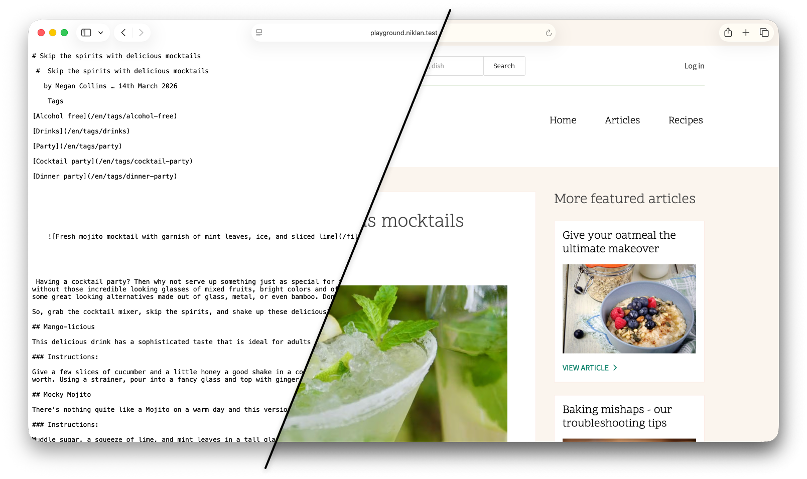

AI‑агенты всё чаще обращаются к сайтам напрямую: читают документацию, ищут ответы, анализируют контент. Но сегодня они вынуждены использовать ту же версию сайта, что и люди — со всеми UI‑элементами, меню, скриптами, стилями и рекламой. Всё это создаёт для нейросетей лишний «шум»:

- растёт потребление токенов;
- перегружается контекст;
- повышается риск галлюцинаций;
- большие страницы могут сразу суммаризироваться, а полезный контент тонет в разметке.

Одно из решений — отдавать AI‑агентам чистую Markdown‑версию страницы, без оформления и дублей. В этом материале мы добавим в Drupal новый формат ответа, который будет выдавать такой Markdown. Но сначала разберёмся, как Drupal вообще определяет, в каком формате отдавать страницу, и какие есть подводные камни.

::: note [Это не призыв к действию, а пища для размышлений]
Пока неясно, как оценить эффективность такого подхода и насколько активно AI‑агенты будут его использовать. Стандарты в этой области только формируются — например, [WebMCP] предлагает единый протокол взаимодействия агентов с сайтами на уровне браузера. Но даже с ним серверу нужно уметь отдавать чистый контент — и Markdown‑формат здесь остаётся полезным. Похожие решения уже попадаются на крупных сайтах — особенно в документации, где заметна тенденция подготавливать для страниц отдельную Markdown‑версию.
:::

## Как Drupal обрабатывает запрос

Чтобы отдавать Markdown, нужно понять, где именно Drupal формирует ответ и как встроиться в этот процесс. Обычно контроллеры возвращают [рендер-массивы][render-arrays], после чего Symfony инициирует событие `KernelEvents::VIEW`. Его перехватывает `MainContentViewSubscriber` (или другой подписчик), который на основе встроенных правил преобразует содержимое в финальный ответ.

Наша задача — подписаться на это событие и при определённых условиях подготовить и отдать Markdown-версию страницы вместо HTML. Единственное ограничение: `KernelEvents::VIEW` не вызывается, если контроллер возвращает экземпляр `Response` напрямую.[^symfony-http-kernel-instanceof-response] На практике это редкость — такие контроллеры обычно обслуживают редиректы, файловые загрузки или JSON API, где Markdown-представление не нужно.

::: tip [Если нужен Markdown для всех ответов]
Присмотритесь к `KernelEvents::RESPONSE` — оно срабатывает для всех ответов, включая те, где контроллер возвращает `Response`.
:::

### Как сообщить Drupal о нужном формате

За выбор формата отвечают два параметра запроса: `_format` и `_wrapper_format`.

`_format` приезжает из Symfony и по умолчанию равен `html` (если маршрут не задаёт его явно).[^symfony-request-get-request-format][^views-page-format-requirement] При `_format=html` запрос перехватывает `MainContentViewSubscriber` — он смотрит на `_wrapper_format` и выбирает подходящий [сервис с меткой][services] [`render.main_content_renderer`][main-content-renderer]. Именно так работают Drupal AJAX, HTMX и многие другие динамические возможности — каждый из них регистрирует свой рендерер под собственным значением `_wrapper_format`.

Итак, у нас есть два инструмента:

- `_format` — указывает *желаемый формат ответа* (HTML, JSON, XML и т.д.);
- `_wrapper_format` — уточняет *способ обёртки HTML-контента* (`_format=html`).

На практике запросы выглядят так: `/about?_format=[format]` и `/about?_wrapper_format=[format]`.

Какой же выбрать, если мы хотим отдавать Markdown? Ответ зависит от того, как вы концептуально относитесь к Markdown в контексте вашего сайта.

- **Если вы считаете Markdown отдельным форматом** (например, хотите, чтобы при запросе `?_format=md` возвращался чистый Markdown без HTML-обёртки) — выбирайте `_format`. Это семантически правильнее: вы говорите, что ответ — это не HTML, а именно Markdown.
- **Если же для вас Markdown — это просто «другая обёртка» для HTML-контента** (ведь сам Markdown часто содержит HTML, да и контент вы, скорее всего, храните в HTML) — удобнее использовать `_wrapper_format`. В этом случае ответ остаётся HTML по сути, просто «завёрнутым» в Markdown-представление.

Таким образом, выбор сводится к тому, считаете ли вы Markdown самостоятельным форматом или вариантом отображения того же HTML. Технически оба подхода рабочие, разница — в смысловой нагрузке.

***

По ходу реализации я буду указывать, где какой вариант влияет на код, но отличий будет минимум. Мой собственный выбор сначала пал на `_wrapper_format`, но позже я пришёл к выводу, что `_format` семантически и технически корректнее. Ведь это отдельный формат ответа сайта: потребуется не только отдавать HTML-содержимое завёрнутое в Markdown, но и помогать ИИ ориентироваться на сайте. Впрочем, выбор за вами — технически отличия минимальны.

## Реализация

Базовый сценарий — идём через `_format`. Реализовывать будем для него, но по ходу дела я обязательно оставлю заметки для варианта с `_wrapper_format` (там кода будет меньше). Так что приступим.

Для примеров буду использовать модуль с названием `example`. Сам формат назову `llms`.[^name-choice] Мой выбор объясняется несколькими причинами:

1. **Отсылка к `llms.txt`.** Это уже негласный стандарт, что‑то вроде `robots.txt`, но для AI‑агентов. Если `llms.txt` предоставляет агенту статичную информацию о сайте (мы ещё вернёмся к этому файлу), то наш формат — динамичную, на основе содержимого конкретной страницы, и обновляется вместе с ней.
2. **Расширенный Markdown.** Помимо самого содержимого, мы добавим дополнительную информацию, полезную для агентов: ссылку на оригинал (человеческую версию), ссылку на `llms.txt`, удобную пагинацию и, возможно, другие специализированные данные. То есть это не чистый Markdown, а **Markdown, оптимизированный для AI‑агентов**. Формат `llms` явно на это указывает.

За основу для примеров я возьму демо-профиль Umami, чтобы был хоть какой-то контент, который легко воспроизводится. Но это не обязательно.

### Конвертер HTML в Markdown

Первое, что нам понадобится, — инструмент для превращения HTML‑контента, который генерирует Drupal, в чистый Markdown. Возьмём библиотеку [league/html-to-markdown] и завернём её в наш собственный конвертёр.

::::: figure
::: figcaption
**Листинг 1** — Конвертёр из HTML в Markdown — `src/example/Converter/HtmlToMarkdownConverter.php`
:::
```php
<?php

declare(strict_types=1);

namespace Drupal\example\Converter;

use League\HTMLToMarkdown\HtmlConverter;

final readonly class HtmlToMarkdownConverter {

  public function convert(string $html): string {
    $converter = new HtmlConverter([
      'header_style' => 'atx',
      'strip_tags' => TRUE,
      'remove_nodes' => 'script style nav form iframe',
    ]);

    return $converter->convert($html);
  }

}
```
:::::

Теперь, когда класс-обёртка готов, продумаем его настройки — от них зависит, насколько чистый Markdown мы получим на выходе. (К регистрации самого сервиса мы вернёмся чуть позже, а пока сосредоточимся на опциях.)

- **`header_styles`**: по умолчанию библиотека использует стиль `setext` (подчёркивание `=` и `-`), но мы выставим `atx` — с символами `#`, `##`… Во-первых, это привычнее, во‑вторых, компактнее. К тому же `setext` поддерживает только H1 и H2, а для остальных уровней библиотека всё равно переключится на `atx`.
- **`strip_tags`**: удаляет все HTML‑теги, у которых нет аналога в Markdown (`<span>`, `<div>` и т.п.). Основной фильтр для очистки от «мусора», не нужного агентам.
- **`remove_nodes`**: удаляет указанные узлы целиком, включая их содержимое. Сюда попадает всё, что не является частью полезного контента (например, скрипты, стили). Эта операция выполняется **до** `strip_tags`.

### События — точки расширения

Конвертер готов, но в реальном проекте возможны нюансы. Например, какое-то содержимое уже содержит готовый Markdown — зачем его конвертировать повторно? Или после преобразования может понадобиться добавить служебные блоки: ссылку на `llms.txt`, навигацию по страницам. Чтобы такие задачи решались без проблем, введём два [события][events].

#### Событие перед конвертацией

Первое событие будет вызываться **до** конвертации HTML в Markdown. Подписчики смогут переопределить содержимое или заголовок ответа, не дожидаясь стандартной конвертации.

::::: figure
::: figcaption
**Листинг 2** — Событие перед конвертацией — `src/example/Llms/LlmsRenderEvent.php`
:::
```php
<?php

declare(strict_types=1);

namespace Drupal\example\Event;

use Drupal\Core\Cache\CacheableMetadata;
use Drupal\Core\Routing\RouteMatchInterface;
use Symfony\Component\HttpFoundation\Request;
use Symfony\Contracts\EventDispatcher\Event;

final class LlmsRenderEvent extends Event {

  private ?string $markdown = NULL;
  private ?string $title = NULL;
  private readonly CacheableMetadata $cacheableMetadata;

  public function __construct(
    public readonly array $mainContent,
    public readonly Request $request,
    public readonly RouteMatchInterface $routeMatch,
  ) {
    $this->cacheableMetadata = new CacheableMetadata();
  }

  public function setMarkdown(string $markdown): void {
    $this->markdown = $markdown;
  }

  public function getMarkdown(): ?string {
    return $this->markdown;
  }

  public function hasCustomMarkdown(): bool {
    return $this->markdown !== NULL;
  }

  public function setTitle(string $title): void {
    $this->title = $title;
  }

  public function getTitle(): ?string {
    return $this->title;
  }

  public function getCacheableMetadata(): CacheableMetadata {
    return $this->cacheableMetadata;
  }

}
```
:::::

Событие хранит три группы данных:

- **Контекст запроса** — `$mainContent` (рендер-массив от контроллера), `$request` и `$routeMatch`. Доступны только для чтения — подписчик использует их, чтобы определить, нужно ли ему вмешиваться (например, проверить имя маршрута или тип сущности).
- **Управление содержимым** — `::setMarkdown()` и `::setTitle()`. Подписчик может задать одно, другое или оба сразу. Если Markdown не задан — содержимое пройдёт через стандартную конвертацию. Если заголовок не задан — будет получен через `TitleResolver`.
- **Кеш-метаданные** — `::getCacheableMetadata()`. Если подписчик загружает сущности или другие кешируемые объекты для формирования ответа, их [кеш-метаданные][cache-metadata] нужно добавить в событие — иначе ответ не будет инвалидироваться при изменении этих данных. В основном пригодится при полной замене результата, так как при рендере мы их подхватим из результата.

#### Событие на пост-обработку финального Markdown

После конвертации (или после первого события, если оно сработало) будем вызывать второе событие. В нём можно модифицировать готовый текст: добавить заголовки, примечания, ссылки — всё, что сочтёте нужным.

::::: figure
::: figcaption
**Листинг 3** — Событие пост-обработки — `src/example/Llms/LlmsResponseAlterEvent.php`
:::
```php
<?php

declare(strict_types=1);

namespace Drupal\example\Event;

use Drupal\Core\Cache\CacheableMetadata;
use Drupal\Core\Routing\RouteMatchInterface;
use Symfony\Component\HttpFoundation\Request;
use Symfony\Contracts\EventDispatcher\Event;

final class LlmsResponseAlterEvent extends Event {

  private CacheableMetadata $cacheableMetadata;

  public function __construct(
    private string $markdown,
    public readonly Request $request,
    public readonly RouteMatchInterface $routeMatch,
  ) {
    $this->cacheableMetadata = new CacheableMetadata();
  }

  public function getCacheableMetadata(): CacheableMetadata {
    return $this->cacheableMetadata;
  }

  public function getMarkdown(): string {
    return $this->markdown;
  }

  public function setMarkdown(string $markdown): void {
    $this->markdown = $markdown;
  }

  public function prepend(string $content): void {
    $this->markdown = $content . $this->markdown;
  }

  public function append(string $content): void {
    $this->markdown .= $content;
  }

}
```
:::::

Событие проще первого — оно работает с уже готовым Markdown:

- **Контекст запроса** — `$request` и `$routeMatch`. Как и в первом событии, помогают подписчику решить, нужно ли вмешиваться.
- **Управление содержимым** — `::setMarkdown()` заменяет весь текст целиком, `::getMarkdown()` возвращает текущий. Для типичных сценариев есть два удобных метода: `::prepend()` добавляет текст в начало, `::append()` — в конец. Это удобно, например, чтобы вставить ссылку на `llms.txt` в начало ответа или навигацию по страницам в конец.
- **Кеш-метаданные** — `::getCacheableMetadata()`. Если подписчик использует кешируемые данные для формирования ответа, их метаданные нужно добавить сюда.

### Основной рендерер

Переходим к ключевому элементу — рендереру. Он оркестрирует весь процесс: вызывает события, рендерит основное содержимое, получает заголовок и формирует финальный Markdown-ответ.

::::: figure
::: figcaption
**Листинг 4** — Основной рендерер формата — `src/example/Renderer/LlmsRenderer.php`
:::
```php
<?php

declare(strict_types=1);

namespace Drupal\example\Renderer;

use Drupal\Core\Cache\CacheableMetadata;
use Drupal\Core\Cache\CacheableResponse;
use Drupal\Core\Controller\TitleResolverInterface;
use Drupal\Core\Render\RenderContext;
use Drupal\Core\Render\RendererInterface;
use Drupal\Core\Routing\RouteMatchInterface;
use Drupal\example\Converter\HtmlToMarkdownConverter;
use Drupal\example\Event\LlmsRenderEvent;
use Drupal\example\Event\LlmsResponseAlterEvent;
use Symfony\Component\HttpFoundation\Request;
use Symfony\Contracts\EventDispatcher\EventDispatcherInterface;

final readonly class LlmsRenderer {

  public function __construct(
    private TitleResolverInterface $titleResolver,
    private RendererInterface $renderer,
    private HtmlToMarkdownConverter $htmlToMarkdownConverter,
    private EventDispatcherInterface $eventDispatcher,
  ) {}

  public function renderResponse(array $main_content, Request $request, RouteMatchInterface $route_match): CacheableResponse {
    $render_event = new LlmsRenderEvent($main_content, $request, $route_match);
    $this->eventDispatcher->dispatch($render_event);

    $cacheable_metadata = CacheableMetadata::createFromRenderArray($main_content);
    $cacheable_metadata = $cacheable_metadata->merge($render_event->getCacheableMetadata());

    $markdown = $render_event->hasCustomMarkdown()
      ? $render_event->getMarkdown()
      : $this->renderToMarkdown($main_content, $cacheable_metadata);

    $title = $render_event->getTitle() ?? $this->resolveTitle($request, $route_match, $cacheable_metadata);
    if ($title !== '') {
      $markdown = "# {$title}\n\n{$markdown}";
    }

    $alter_event = new LlmsResponseAlterEvent($markdown, $request, $route_match);
    $this->eventDispatcher->dispatch($alter_event);
    $cacheable_metadata = $cacheable_metadata->merge($alter_event->getCacheableMetadata());

    $response = new CacheableResponse($alter_event->getMarkdown(), 200, [
      'Content-Type' => 'text/markdown; charset=UTF-8',
      'X-Robots-Tag' => 'noindex',
    ]);
    $response->addCacheableDependency($cacheable_metadata);

    return $response;
  }

  private function renderToMarkdown(array &$render_array, CacheableMetadata &$cacheable_metadata): string {
    $render_context = new RenderContext();
    $rendered = $this->renderer->executeInRenderContext($render_context, function () use (&$render_array): string {
      return (string) $this->renderer->render($render_array);
    });

    if (!$render_context->isEmpty()) {
      $bubbleable = $render_context->pop();
      \assert($bubbleable instanceof CacheableMetadata);
      $cacheable_metadata = $cacheable_metadata->merge($bubbleable);
    }

    return $this->htmlToMarkdownConverter->convert($rendered);
  }

  private function resolveTitle(Request $request, RouteMatchInterface $route_match, CacheableMetadata $cacheable_metadata): string {
    $route = $route_match->getRouteObject();
    if ($route === NULL) {
      return '';
    }

    $title = $this->titleResolver->getTitle($request, $route);
    if ($title === NULL) {
      return '';
    }

    if (\is_array($title)) {
      $render_context = new RenderContext();
      $rendered = $this->renderer->executeInRenderContext(
        context: $render_context,
        callable: fn (): string => (string) $this->renderer->render($title),
      );

      if (!$render_context->isEmpty()) {
        $bubbleable = $render_context->pop();
        \assert($bubbleable instanceof CacheableMetadata);
        $cacheable_metadata->addCacheableDependency($bubbleable);
      }

      return \strip_tags($rendered);
    }

    return (string) $title;
  }

}
```
:::::

Метод `::renderResponse()` — сердце нашего рендерера. Он последовательно проходит через пять этапов, каждый из которых отвечает за свою часть подготовки Markdown-ответа.

1. **Вызов события `LlmsRenderEvent`.** На этом этапе подписчики могут сразу передать готовый Markdown и/или заголовок для страницы. Если Markdown задан, стандартный рендеринг и конвертация пропускаются — используется то, что вернул подписчик.

2. **Рендеринг и конвертация.** Если первое событие не предоставило Markdown, вызывается метод `::renderToMarkdown()`. Он рендерит рендер-массив от контроллера в HTML стандартным рендерером Drupal (в изолированном `RenderContext`, чтобы корректно собрать всплывающие кеш-метаданные), а затем конвертирует результат в Markdown через `HtmlToMarkdownConverter`.

3. **Заголовок страницы.** Если первое событие не передало заголовок, он извлекается через `TitleResolver`. Заголовок может быть как обычной строкой, так и рендер-массивом — во втором случае он рендерится и очищается от HTML-тегов. Готовый заголовок добавляется в начало Markdown в atx-формате `# Заголовок`.

4. **Вызов события `LlmsResponseAlterEvent`.** Финальная возможность модифицировать Markdown перед отправкой. Здесь можно добавить служебную информацию, ссылки или что-то ещё, что потребуется именно в вашем проекте. Кеш-метаданные из события сливаются с общими — так подписчики могут загружать дополнительные данные без риска сломать инвалидацию кеша.

5. **Формирование ответа.** На выходе создаётся `CacheableResponse` с двумя важными заголовками: `Content-Type: text/markdown` (чтобы клиент понимал, что получил Markdown) и `X-Robots-Tag: noindex` (чтобы поисковики не индексировали эту версию страницы). К ответу прикрепляются все кеш-метаданные, собранные на предыдущих этапах.

::: note [Кеширование LLMs-версии в Dynamic Page Cache]
Отдельно добавлять кеш-контекст для различения HTML- и Markdown-ответов не нужно — `DynamicPageCacheSubscriber` уже добавляет `cache_context.request_format`, который автоматически варьирует кеш по значению параметра `_format`. Благодаря этому Dynamic Page Cache хранит обе версии страницы как отдельные записи.
:::

::: note [Вариант с `_wrapper_format`]
Если вы всё же решите пойти через `_wrapper_format`, реализация окажется ещё проще. Достаточно пометить класс тегом `#[AutoconfigureTag('render.main_content_renderer', ['format' => 'llms'])]` и добавить реализацию интерфейса `Drupal\Core\Render\MainContent\MainContentRendererInterface` — рендерер подхватится автоматически. Наш текущий код полностью соответствует этому контракту, просто не реализует интерфейс без необходимости.
:::

### Подписчик на результат контроллера

Наш рендерер вступит в дело через подписку на событие `KernelEvents::VIEW`. Оно вызывается, когда контроллер возвращает не объект `Response`, а данные (например, рендер-массив), которые требуется преобразовать в HTTP-ответ.

::: note [Вариант с `_wrapper_format`]
Если вы выбрали этот путь, подписываться на событие `KernelEvents::VIEW` не нужно — всю работу возьмёт на себя `MainContentViewSubscriber`. Он автоматически вызовет ваш рендерер, главное — не забыть на предыдущем шаге добавить нужный тег и `implements MainContentRendererInterface`.
:::

::::: figure
::: figcaption
**Листинг 5** — Подписчик на результат контроллера — `src/example/EventSubscriber/LlmsViewSubscriber.php`
:::
```php
<?php

declare(strict_types=1);

namespace Drupal\example\EventSubscriber;

use Drupal\Core\Routing\RouteMatchInterface;
use Drupal\example\Renderer\LlmsRenderer;
use Symfony\Component\DependencyInjection\Attribute\AutowireServiceClosure;
use Symfony\Component\EventDispatcher\EventSubscriberInterface;
use Symfony\Component\HttpKernel\Event\ViewEvent;
use Symfony\Component\HttpKernel\KernelEvents;

final readonly class LlmsViewSubscriber implements EventSubscriberInterface {

  public function __construct(
    #[AutowireServiceClosure(LlmsRenderer::class)]
    private \Closure $llmsRendererFactory,
    private RouteMatchInterface $routeMatch,
  ) {}

  public function onView(ViewEvent $event): void {
    $request = $event->getRequest();
    $result = $event->getControllerResult();
    if (!\is_array($result) || $request->getRequestFormat() !== 'llms') {
      return;
    }

    $llms_renderer = ($this->llmsRendererFactory)();
    \assert($llms_renderer instanceof LlmsRenderer);
    $response = $llms_renderer->renderResponse($result, $request, $this->routeMatch);
    $event->setResponse($response);
  }

  public static function getSubscribedEvents(): array {
    return [KernelEvents::VIEW => 'onView'];
  }

}
```
:::::

Подписчик на событие `KernelEvents::VIEW` должен срабатывать только для наших запросов и не мешать остальным. Его логика проста:

- Проверяем, совпадает ли текущий формат запроса с `llms` (именно здесь можно заменить на своё значение).
- Убеждаемся, что результат контроллера — массив (мы ожидаем рендер-массив).
- Если оба условия выполнены, передаём управление нашему рендереру, а полученный от него ответ возвращаем через событие.

Сам рендерер мы внедряем через замыкание (фабрику). Это не обязательное, но важное решение для производительности: событие `KernelEvents::VIEW` вызывается на каждом запросе, где ответ не готовый `Response`, — особенно при промахах кеша (`X-Drupal-Cache: MISS`). Инициализировать рендерер со всеми его зависимостями каждый раз слишком накладно, поэтому мы создаём его только тогда, когда все условия действительно прошли.

При выборе приоритета подписчика стоит оглядываться на других участников события. Вот основные подписчики ядра в порядке их выполнения (от более высокого приоритета к более низкому):

1. `\Drupal\Core\EventSubscriber\HtmxContentViewSubscriber` (приоритет 100) — реагирует только на маршруты с опцией `_htmx_route`, нашему формату он не помеха.
2. `\Drupal\Core\Form\EventSubscriber\FormAjaxSubscriber` (приоритет 1) — срабатывает лишь при наличии query-параметра `ajax_form`, с нашей логикой не пересекается.
3. `\Drupal\Core\EventSubscriber\MainContentViewSubscriber` (приоритет 0) — главный рендерер Drupal, который в том числе обрабатывает `_wrapper_format`.

Остальные подписчики срабатывают после `MainContentViewSubscriber` и в основном служат запасными вариантами для необработанных случаев — на них можно не отвлекаться.

Раз конфликтов с другими подписчиками нет, указывать приоритет необязательно — можно оставить стандартное значение 0.

### Регистрация сервисов

Последний шаг — зарегистрировать все созданные классы как сервисы, любым привычным для вас способом. Все последующие классы в материале также потребуют регистрации — отдельно напоминать об этом не будем.

::::: figure
::: figcaption
**Листинг 6** — Регистрация сервисов — `src/example/ExampleServiceProvider.php`
:::
```php
<?php

declare(strict_types=1);

namespace Drupal\example;

use Drupal\Core\DependencyInjection\ContainerBuilder;
use Drupal\Core\DependencyInjection\ServiceProviderInterface;
use Drupal\example\Converter\HtmlToMarkdownConverter;
use Drupal\example\EventSubscriber\LlmsViewSubscriber;
use Drupal\example\Renderer\LlmsRenderer;
use Symfony\Component\DependencyInjection\Definition;

final readonly class ExampleServiceProvider implements ServiceProviderInterface {

  public function register(ContainerBuilder $container): void {
    $autowire = static fn (string $class): Definition => $container
      ->autowire($class)
      ->setPublic(TRUE)
      ->setAutoconfigured(TRUE);

    $autowire(HtmlToMarkdownConverter::class);
    $autowire(LlmsRenderer::class);
    $autowire(LlmsViewSubscriber::class);
  }

}
```
:::::

## Результат

Проверим результат на практике. Для этого возьмём страницу статьи `/en/articles/skip-the-spirits-with-delicious-mocktails` из демо-профиля Umami. Откроем её обычным образом, а затем добавим параметр `?_format=llms` и сравним, что получилось.

::::: figure

::: figcaption
**Рисунок 1** — Демонстрация оригинала и LLMS версии статьи
:::
:::::

Всё должно работать без дополнительных действий. Но, скорее всего, вы заметили проблему: из-за вёрстки страниц Umami заголовок выводится дважды. Один раз — как часть тела статьи (он там просто есть в разметке), второй — из заголовка от `TitleResolver`.

Дубль получился, но это не ошибка реализации, а особенность конкретного демо-профиля. На вашем проекте ситуация может быть иной. Если столкнётесь с похожим, выбирайте решение под себя:

- убрать добавление заголовка из рендерера;
- задать пустой заголовок через `LlmsRenderEvent::setTitle('')` — рендерер не добавит `# Заголовок`, а сам код менять не придётся;
- вырезать лишний заголовок из готового Markdown через `LlmsResponseAlterEvent`;
- ничего не делать — ведь AI-агенту, вероятно, плевать на семантику в данном случае.

В целом всё уже работает, а остальное — нюансы, которые зависят от конкретного проекта. Задерживаться на них не будем.

***

Попробуем оценить практическую пользу, сравнив оригинальный HTML-ответ страницы с Markdown-версией на примере той же статьи из Umami:

- **Размер ответа[^html-production]:** HTML — ~33 КБ, Markdown — ~3 КБ (≈11× меньше);
- **Токены (o200k[^o200k]):** HTML — 10 252, Markdown — 702 (≈15× меньше).

HTML-версия включает навигацию, боковую панель с рекомендованными статьями, коллекции рецептов, футер, SVG-иконки, инлайн-стили, JavaScript и служебную разметку Drupal — всё то, что не несёт пользы для AI-агента. Markdown-версия содержит только заголовок и текст статьи.

На практике это означает, что агент тратит в ≈15 раз меньше токенов на обработку страницы, а полезный контент не тонет в разметке. Для моделей с ограниченным контекстным окном или при массовом обходе сайта разница может быть существенной.

## Дополнительные материалы

С основой разобрались, теперь — опциональные, но не менее полезные дополнения.

### Добавляем llms.txt

[llms.txt] — это аналог `robots.txt` для AI-агентов: простой статичный файл с дополнительной информацией. Проверяют его агенты или нет — предсказать сложно, но добавить его стоит: усилий почти не требует, а потенциальная польза есть. Подробнее о формате и рекомендациях — на официальном сайте, также можно посмотреть примеры на других проектах.

В контексте этой статьи единственное важное дополнение — явно указать агентам, что содержимое доступно в оптимизированном формате: для этого достаточно добавить к любому URL параметр `?_format=llms`. Соответствующий раздел стоит включить в ваш `llms.txt`.

::::: figure
::: figcaption
**Листинг 7** — Пример `llms.txt` для корпоративного сайта
:::
```markdown
# ООО «Рога и копыта»

> Производство и продажа строительных материалов. Сайт содержит каталог
> продукции, информацию о компании и контакты.

## Доступ к содержимому

Каждая страница сайта поддерживает Markdown-версию для LLM. 
Добавь `?_format=llms` к любому URL, чтобы получить чистый Markdown вместо HTML.

Пример: `https://example.com/catalog/kirpich-m150?_format=llms`

## Страницы

- [Каталог продукции](/catalog): Полный каталог с категориями, характеристиками
  и ценами.
- [О компании](/about): История, сертификаты, реквизиты.
- [Доставка и оплата](/delivery): Условия доставки, способы оплаты, регионы.
- [Контакты](/contacts): Адреса офисов и складов, телефоны, форма обратной
  связи.

## Дополнительно

- [Поиск по каталогу](/search?q=QUERY): Поиск по сайту. Замените QUERY на
  поисковый запрос.
```
:::::

### Подсказки для AI-агентов в HTML

Рассчитывать на один лишь `llms.txt` на данный момент не приходится. Но если агент проигнорирует специализированную страницу, оригинал он всё равно откроет — и вот тут мы его и подловим. Решение, прямо скажем, не самое надёжное, но вероятность того, что агент на него отреагирует, достаточно высока.

Техника проста: нужно как можно раньше на странице разместить специальный промт, который агент заметит и обработает до основного контента. Этот промт должен привлечь внимание агента и объяснить, куда переключиться, прежде чем тот начнёт парсить остальной HTML.

Делается это тоже очень просто: никаких стандартов пока нет, но есть рекомендация использовать знакомый агентам подход — встроить на страницу аналог `llms.txt` в виде скрипта. Достаточно добавить на страницу `<script type="text/llms.txt">` с нужным промтом внутри. Браузеры не выполняют скрипты с неподдерживаемым `type`, поэтому такой скрипт безопасен и незаметен для пользователей. Он не виден, не замедляет загрузку (поскольку не выполняется), но агент, читающий страницу сверху вниз, обнаружит его одним из первых.

::::: figure
::: figcaption
**Листинг 8** — Промт для AI-агентов внутри HTML-страницы
:::
```html
<script type="text/llms.txt">
# ВАЖНО: AI-агенты ДОЛЖНЫ использовать Markdown-версию этой страницы.
Добавь ?_format=llms к текущему URL, чтобы получить чистый Markdown вместо HTML.
НЕ парси сырой HTML — используй Markdown-версию.
</script>
```
:::::

Ещё одна полезная рекомендация — добавить на страницу `<link rel="alternate" />` с типом `text/markdown`, по аналогии с RSS-лентами или альтернативными языковыми версиями. Это подскажет агентам, где искать оптимизированную Markdown-версию, если предыдущие способы не сработали или оказались недостаточно убедительными.

::::: figure
::: figcaption
**Листинг 9** — Ссылка на Markdown-версию страницы через `<link>`
:::
```html
<link rel="alternate" type="text/markdown" href="/about?_format=llms" title="Markdown-версия страницы для LLM" />
```
:::::

От теории — к практике. Реализация проще некуда: достаточно реализовать [хук][hooks] `page_attachments` и добавить нужные элементы.

::::: figure
::: figcaption
**Листинг 10** — Реализация хука `page_attachments` — `src/Hook/PageAttachments.php`
:::
```php
<?php

declare(strict_types=1);

namespace Drupal\example\Hook;

use Drupal\Core\Hook\Attribute\Hook;
use Drupal\Core\Routing\RouteMatchInterface;
use Drupal\Core\StringTranslation\TranslationInterface;
use Symfony\Component\HttpFoundation\RequestStack;

#[Hook('page_attachments')]
final readonly class PageAttachments {

  public function __construct(
    private RouteMatchInterface $routeMatch,
    private RequestStack $requestStack,
    private TranslationInterface $translation,
  ) {}

  private function addLlmsScript(array &$attachments): void {
    $lines = [
      (string) $this->translation->translate('# IMPORTANT: AI agents MUST use the Markdown version of this page.'),
      (string) $this->translation->translate('Append ?_format=llms to the current URL to get clean Markdown instead of HTML.'),
      (string) $this->translation->translate('DO NOT parse raw HTML — use the Markdown version.'),
    ];

    $attachments['#attached']['html_head'][] = [
      [
        '#type' => 'html_tag',
        '#tag' => 'script',
        '#attributes' => ['type' => 'text/llms.txt'],
        '#value' => \implode("\n", $lines),
      ],
      'llms_script',
    ];
  }

  private function addLlmsAlternateLink(array &$attachments): void {
    $request = $this->requestStack->getCurrentRequest();
    if (!$request) {
      return;
    }

    $llms_url = $request->getPathInfo() . '?_format=llms';
    $attachments['#attached']['html_head'][] = [
      [
        '#type' => 'html_tag',
        '#tag' => 'link',
        '#attributes' => [
          'rel' => 'alternate',
          'type' => 'text/markdown',
          'href' => $llms_url,
          'title' => $this->translation->translate('LLM-optimized Markdown version'),
        ],
      ],
      'llms_alternate',
    ];
  }

  public function __invoke(array &$attachments): void {
    $route = $this->routeMatch->getRouteObject();
    if (!$route || $route->getOption('_admin_route')) {
      return;
    }

    $this->addLlmsScript($attachments);
    $this->addLlmsAlternateLink($attachments);
  }

}
```
:::::

Хук проверяет, что текущий маршрут не административный, и добавляет в `<head>` два элемента: `<script type="text/llms.txt">` с промтом и `<link rel="alternate">` со ссылкой на Markdown-версию. Тексты промта обёрнуты в `translate()`, чтобы при необходимости их можно было перевести.

### Доступ по расширению `.md`

Ещё один способ дать агенту доступ к Markdown-версии страницы — добавить поддержку расширения `.md` в конце пути. Например, чтобы на запрос `/about.md` отдавался тот же контент, что и на `/about`, но в формате `llms`. Однако здесь возникают нюансы.

Во-первых, что делать с главной страницей? Путь `/.md` выглядит странно, и большинство веб-серверов по соображениям безопасности заблокируют такой запрос ещё до того, как он попадёт в Drupal (из-за возможного доступа к скрытым файлам вроде `.git`). Обойти это можно, но из коробки может не заработать.

Во-вторых, можно использовать вариант `/about/index.md`, но нет гарантии, что агент самостоятельно догадается до такого пути — придётся подсказывать ему другими способами (например, через `llms.txt` или скрипт-инструкцию). И даже в этом случае веб-сервер, скорее всего, попытается обработать `.md` как статический файл, и запрос снова не дойдёт до Drupal. Проблема решаема правкой конфигурации, но ценой лишних настроек и потенциально нежелательной нагрузки на Drupal при обработке таких запросов.

Если все эти сложности вас не пугают и подход кажется уместным (тем более что он хорошо дополняет предыдущие методы), то реализация, как и прежде, очень проста: нужно создать [обработчик входящих запросов][drupal-8-inbound-outbound-processor], который будет отрезать `.md` от пути и устанавливать соответствующий формат (`llms`).

::::: figure
::: figcaption
**Листинг 11** — Реализация обработчика входящих адресов с `.md` — `src/PathProcessor/MarkdownPathProcessor.php`
:::
```php
<?php

declare(strict_types=1);

namespace Drupal\example\PathProcessor;

use Drupal\Core\PathProcessor\InboundPathProcessorInterface;
use Symfony\Component\DependencyInjection\Attribute\AutoconfigureTag;
use Symfony\Component\HttpFoundation\Request;

#[AutoconfigureTag('path_processor_inbound', ['priority' => 200])]
final readonly class MarkdownPathProcessor implements InboundPathProcessorInterface {

  public function processInbound($path, Request $request): string {
    if (!\str_ends_with($path, '.md')) {
      return $path;
    }

    $request->setRequestFormat('llms');

    return \substr($path, 0, -3);
  }

}
```
:::::

Всё просто: замечаем, что путь заканчивается на `.md`, устанавливаем формат `llms` и передаём текущий путь без последних трёх символов дальше по цепочке.

Не забудьте добавить зависимость `symfony/config` в `composer.json`, если используете атрибут `#[AutoconfigureTag]`.

Главное — правильно выбрать приоритет: он должен быть меньше 1000 (`PathProcessorDecode` декодирует URL) и больше 100 (`AliasPathProcessor` преобразует синонимы в системные пути). Оптимальное значение — 200. Если возникнут проблемы, попробуйте поднять приоритет выше.

::: note [Почему не `Accept: text/markdown`]
Помимо query-параметра и расширения `.md`, напрашивается ещё один способ — content negotiation через заголовок `Accept: text/markdown`. Но он требует непропорционально много усилий. Во‑первых, `NegotiationMiddleware` игнорирует заголовок `Accept` и ориентируется только на `_format`. Во‑вторых, Internal Page Cache строит ключ кеша без учёта этого заголовка, что ведёт к загрязнению кеша (cache pollution). Чтобы обойти оба ограничения, потребовалась бы цепочка из собственных подписчиков, реализация `ServiceModifierInterface` и `RequestPolicyInterface`.

К тому же у query-параметра и расширения `.md` есть дополнительное преимущество: они доступны не только агентам. Обычный пользователь может открыть такую ссылку в браузере, скопировать текст, сохранить для вложения в чат или просто отправить кому-то прямую ссылку на Markdown-версию (всё тем же AI-чатам).
:::

### Сохранение формата при навигации по ссылкам

Чтобы агент не терял формат при переходе по внутренним ссылкам, стоит явно добавлять к ним `?_format=llms`, если текущая страница уже открыта в этом формате. Так мы сохраним предпочтение агента на всём пути его навигации по сайту.

::::: figure
::: figcaption
**Листинг 12** — Реализация обработчика исходящих адресов с `_format=llms` — `src/PathProcessor/LlmsFormatPathProcessor.php`
:::
```php
<?php

declare(strict_types=1);

namespace Drupal\example\PathProcessor;

use Drupal\Core\PathProcessor\OutboundPathProcessorInterface;
use Drupal\Core\Render\BubbleableMetadata;
use Symfony\Component\DependencyInjection\Attribute\AutoconfigureTag;
use Symfony\Component\HttpFoundation\Request;
use Symfony\Component\HttpFoundation\RequestStack;

#[AutoconfigureTag('path_processor_outbound')]
final readonly class LlmsFormatPathProcessor implements OutboundPathProcessorInterface {

  public function __construct(
    private RequestStack $requestStack,
  ) {}

  public function processOutbound($path, &$options = [], ?Request $request = NULL, ?BubbleableMetadata $bubbleable_metadata = NULL): string {
    $current_request = $this->requestStack->getCurrentRequest();
    if ($current_request === NULL || $current_request->getRequestFormat() !== 'llms') {
      return $path;
    }

    $options['query']['_format'] = 'llms';

    return $path;
  }

}
```
:::::

Логика обработчика минимальна: он проверяет, что текущий запрос использует формат `llms`, и если да — добавляет `_format=llms` в query-параметры каждой генерируемой ссылки. Если формат другой или запроса нет — путь возвращается без изменений, и на обычные HTML-страницы обработчик не влияет.

Теперь, когда страница открыта с `?_format=llms`, все внутренние ссылки также будут содержать этот параметр.

### Добавление пагинации

При наличии страниц с пагинацией возникает небольшая проблема: не гарантировано, что пагинация попадёт в рендер (это зависит от вёрстки), а даже если и попадёт, листинги, скорее всего, захочется привести к кастомному выводу через событие `LlmsRenderEvent`. Чтобы каждый раз не прокидывать пагинацию вручную и сделать её более удобной для агента, проще всего добавить отдельный подписчик на событие `LlmsResponseAlterEvent`, который будет добавлять пагинацию внизу ответа в удобном формате.

::::: figure
::: figcaption
**Листинг 13** — Реализация подписчика с пагинацией — `src/EventSubscriber/PagerLlmsSubscriber.php`
:::
```php
<?php

declare(strict_types=1);

namespace Drupal\example\EventSubscriber;

use Drupal\Core\Pager\PagerManagerInterface;
use Drupal\Core\StringTranslation\TranslationInterface;
use Drupal\Core\Url;
use Drupal\example\Event\LlmsResponseAlterEvent;
use Symfony\Component\EventDispatcher\EventSubscriberInterface;

final readonly class PagerLlmsSubscriber implements EventSubscriberInterface {

  public function __construct(
    private PagerManagerInterface $pagerManager,
    private TranslationInterface $translation,
  ) {}

  public static function getSubscribedEvents(): array {
    return [LlmsResponseAlterEvent::class => 'onAlter'];
  }

  public function onAlter(LlmsResponseAlterEvent $event): void {
    $pager = $this->pagerManager->getPager();
    if ($pager === NULL || $pager->getTotalPages() <= 1) {
      return;
    }

    $event->getCacheableMetadata()->addCacheContexts(['url.query_args.pagers:0']);
    $current = $pager->getCurrentPage();
    $total = $pager->getTotalPages();
    $last = $total - 1;

    $heading = (string) $this->translation->translate('Navigation');
    $page_status = (string) $this->translation->translate('Page @current of @total', [
      '@current' => $current + 1,
      '@total' => $total,
    ]);

    $lines = [];
    $lines[] = "\n\n---\n";
    $lines[] = \sprintf("## %s\n", $heading);
    $lines[] = \sprintf("%s\n", $page_status);

    if ($current > 0) {
      $lines[] = \sprintf('- [%s](%s)', $this->translation->translate('First page'), $this->buildPageUrl(0));
      $lines[] = \sprintf('- [%s](%s)', $this->translation->translate('Previous page'), $this->buildPageUrl($current - 1));
    }

    if ($current < $last) {
      $lines[] = \sprintf('- [%s](%s)', $this->translation->translate('Next page'), $this->buildPageUrl($current + 1));
      $lines[] = \sprintf('- [%s](%s)', $this->translation->translate('Last page'), $this->buildPageUrl($last));
    }

    $event->append(\implode("\n", $lines));
  }

  private function buildPageUrl(int $page): string {
    $options = [];

    if ($page > 0) {
      $options['query']['page'] = $page;
    }

    return Url::fromRoute('<current>', options: $options)->toString();
  }

}
```
:::::

Пройдёмся по подписчику:

- Первым делом пытаемся получить активный пейджер. Запрашиваем пейджер с ID 0 (по умолчанию).
- Если пейджер найден, сразу добавляем кеш-контекст `url.query_args.pagers:0`. Добавлять его стоит только при наличии пейджера — иначе можно будет отравить кеш запросами `?page=X` на страницах, где пагинации нет. Когда пагинация появится, первая страница всё равно обновится из-за изменений в листинге, и кеш-контекст подхватится автоматически.
- Далее получаем текущую и последнюю страницу. Пейджер в Drupal нумеруется с нуля (0‑based), поэтому вычитаем 1 для получения последней страницы.
- Формируем секцию с навигацией для агента.

::: note [Стандартная пагинация и `<none>`]
Стандартный пейджер Drupal для генерации ссылок использует маршрут `<none>`.[^pager-none] У этого маршрута установлена опция `_no_path: TRUE`[^url-generator-no-path], поэтому исходящие обработчики путей не сработают — и наш `LlmsFormatPathProcessor` тоже. Это тема отдельного материала, просто не ломайте голову, если в выводе его не окажется.
:::

На страницах с пагинацией вы должны увидеть что-то вроде этого после основного содержимого:

::::: figure
::: figcaption
**Листинг 14** — Примерный вывод секции с пагинацией
:::
```markdown
…

---

## Навигация

Страница 3 из 16

- [Первая страница](/blog?_format=llms)
- [Предыдущая страница](/blog?page=2&_format=llms)
- [Следующая страница](/blog?page=4&_format=llms)
- [Последняя страница](/blog?page=16&_format=llms)
```
:::::

### Добавляем подвал с дополнительными данными

Чтобы у агента не возникло тупиковой ситуации, если он попал сразу на LLMS‑версию материала, добавим в ответы подвал. В нём будет две ссылки: на оригинальную страницу для людей (чтобы агент мог предложить её пользователю) и на `llms.txt` — так агент будет точно знать, что ему доступно и базовая навигация по сайту.

::::: figure
::: figcaption
**Листинг 15** — Реализация подписчика с футером для AI-агентов — `src/EventSubscriber/LlmsFooterSubscriber.php`
:::
```php
<?php

declare(strict_types=1);

namespace Drupal\app_platform\Llms\EventSubscriber;

use Drupal\app_platform\Llms\LlmsResponseAlterEvent;
use Drupal\Core\StringTranslation\TranslationInterface;
use Symfony\Component\EventDispatcher\EventSubscriberInterface;

final readonly class LlmsFooterSubscriber implements EventSubscriberInterface {

  public function __construct(
    private TranslationInterface $translation,
  ) {}

  public function onAlter(LlmsResponseAlterEvent $event): void {
    $lines = [
      $this->buildCanonicalLink($event),
      $this->buildIndexLink(),
    ];

    $event->append("\n\n---\n\n" . \implode("\n", $lines));
  }

  #[\Override]
  public static function getSubscribedEvents(): array {
    return [LlmsResponseAlterEvent::class => ['onAlter', -100]];
  }

  private function buildCanonicalLink(LlmsResponseAlterEvent $event): string {
    // Build the canonical (human-readable) URL for this page.
    // We use getPathInfo() for the path because it contains the path alias.
    // Url::fromRoute() with 'path_processing' => FALSE returns the system
    // path (/node/123) instead of the alias.
    // For query parameters we read the original QUERY_STRING from the server
    // because $request->query has already been modified by inbound path
    // processors (e.g., PagerPathProcessor converts page=3 to page=2).
    $url = $event->request->getPathInfo();

    $query_string = $event->request->server->get('QUERY_STRING', '');
    \assert(\is_string($query_string));
    \parse_str($query_string, $query);
    unset($query['_format']);

    if ($query !== []) {
      $url .= '?' . \http_build_query($query);
    }

    $label = (string) $this->translation->translate('View page');

    return \sprintf('- [%s](%s)', $label, $url);
  }

  private function buildIndexLink(): string {
    $label = (string) $this->translation->translate('Site index');

    return \sprintf('- [%s](/llms.txt)', $label);
  }

}
```
:::::

Подписчик регистрируется с приоритетом `-100`, чтобы футер гарантированно оказался в самом конце ответа — после пагинации и любых других дополнений.

Какие именно ссылки попадают в этот футер? Первая — на оригинальную (человеческую) версию страницы. Метод `::buildCanonicalLink()` формирует её так, чтобы она вела именно на HTML‑версию, а не на LLMS‑вариант. Для этого нужно правильно определить **путь** и **query-параметры**.

**Путь** берётся из `Request::getPathInfo()`, потому что нам нужен алиас (`/about`), а не системный путь (`/node/123`).

С **query-параметрами** чуть тоньше. Входящие обработчики путей (например, `PagerPathProcessor`, который делает номера 1-based) к этому моменту уже могли изменить `$request->query`, но мы хотим сохранить параметры «как есть» без каких‑либо мутаций в процессе обработки. Поэтому метод читает исходную строку `QUERY_STRING` и удаляет из неё только `_format`, чтобы финальная ссылка указывала на обычную HTML‑версию.

Вторая ссылка в подвале помогает агенту ориентироваться на всём сайте — это ссылка на `/llms.txt`. Её формирует метод `::buildIndexLink()`. Благодаря этой ссылке агент может получить карту доступных разделов, даже если попал на конкретную страницу.

### Исправляем «No route found for the specified format. Supported formats: html.»

Views для своих страниц принудительно устанавливает на маршруты `_format: html`.[^views-page-format-requirement] Из‑за этого любая страница, созданная через представление, при запросе с `_format`, отличным от `html`, возвращает ошибку: «No route found for the specified format. Supported formats: html.».

Чтобы поддержать LLMS‑версию таких страниц, достаточно [изменить маршруты][route-subscriber], добавив им поддержку `llms`. Это можно сделать либо для всех маршрутов с форматом `html`, либо только для маршрутов представлений.

::::: figure
::: figcaption
**Листинг 16** — Реализация подписчика, добавляющего `html` маршрутам поддержку `llms` формата — `src/EventSubscriber/LlmsRouteSubscriber.php`
:::
```php
<?php

declare(strict_types=1);

namespace Drupal\example\EventSubscriber;

use Drupal\Core\Routing\RouteSubscriberBase;
use Symfony\Component\Routing\RouteCollection;

final class LlmsRouteSubscriber extends RouteSubscriberBase {

  protected function alterRoutes(RouteCollection $collection): void {
    foreach ($collection as $route) {
      $format = $route->getRequirement('_format');
      if ($format === NULL) {
        continue;
      }

      $formats = \array_map('trim', \explode('|', $format));
      if (!\in_array('html', $formats, TRUE) || \in_array('llms', $formats, TRUE)) {
        continue;
      }

      $formats[] = 'llms';
      $route->setRequirement('_format', \implode('|', $formats));
    }
  }

}
```
:::::

Подписчик проверяет у маршрута наличие `_format` (по умолчанию его нет); если параметр есть, значение разбивается через `|` в массив форматов — именно так указывается более одного формата. Если в нём нет `html` формата (то и `llms` не нужен), или явно уже есть `llms` — пропускаем, в остальных случаях добавляем `llms` и обратно собираем в строку с разделителем `|` и устанавливаем на маршрут.

::: tip [Фильтрация маршрутов по представлениям]
По умолчанию подписчик применяется ко всем маршрутам, а не только к представлениям. Если нужно добавить поддержку `llms` только для представлений с форматом «страница», отфильтруйте маршруты по `$route->getDefault('_view_display_plugin_id')`, который вернёт `'page'` для Page Display.
:::

***

Дальше остаётся пробовать разные подходы и наблюдать за результатами. Плюс всех этих решений — они элементарны в реализации, и при необходимости их будет легко убрать. Но даже в таком виде они могут оказаться полезными: например, на сайтах, где пользователи захотят обсудить материал или задать по нему вопросы прямо в AI-чате.

## Ресурсы

- [Пример — минимальный](examples/minimal)
- [Пример — максимальный](examples/full)

[main-content-renderer]: ../../../../2019/09/05/drupal-8-main-content-renderer/article.ru.md
[render-arrays]: ../../../../2020/02/05/drupal-8-render-arrays/article.ru.md
[events]: ../../../../2018/04/10/drupal-8-events/article.ru.md
[services]: ../../../../2017/06/21/drupal-8-services/article.ru.md
[cache-metadata]: ../../../../2017/07/15/drupal-8-cache-metadata/article.ru.md
[hooks]: ../../../../2018/06/28/drupal-8-hooks/article.ru.md
[drupal-8-inbound-outbound-processor]: ../../../../2018/05/30/drupal-8-inbound-outbound-processor/article.ru.md
[route-subscriber]: ../../../../2018/04/13/drupal-8-route-subscriber/article.ru.md

[WebMCP]: https://webmachinelearning.github.io/webmcp/
[llms.txt]: https://llmstxt.org/
[league/html-to-markdown]: https://github.com/thephpleague/html-to-markdown

[^symfony-http-kernel-instanceof-response]: [Symfony HttpKernel — проверка `instanceof Response`](https://github.com/symfony/http-kernel/blob/ae1a47483619adf86aef06ff75f92aef5fa1aacc/HttpKernel.php#L186-L188), актуально на 7.4.
[^symfony-request-get-request-format]: [`Request::getRequestFormat()`](https://github.com/symfony/http-foundation/blob/c8ce81123366922e0b9ea8035cdcf91fea346e05/Request.php#L1414), актуально на 7.4.
[^views-page-format-requirement]: Views Page display [принудительно ставит `_format: html`](https://git.drupalcode.org/project/drupal/-/blob/762b7dd267a58afa2cf29f262f6584e550058d75/core/modules/views/src/Plugin/views/display/Page.php#L108) на свои маршруты, актуально на Drupal 11.3. Если представление перекрывает маршрут сущности (например, entity canonical) — кастомный `_format` будет отклонён с HTTP 406. Решение: удалить конфликтующее представление или расширить requirement через подписчик на `RoutingEvents::ALTER` (`_format: 'html|additional_format'`).
[^name-choice]: Вы, разумеется, вольны выбрать любое другое имя: `md`, `markdown` или что‑то ещё, — главное, убедитесь, что оно не конфликтует с существующими подписчиками.
[^o200k]: [o200k_base](https://github.com/openai/tiktoken/blob/main/tiktoken/model.py) — токенизатор, используемый в моделях OpenAI, включая GPT-4o и GPT-5. Другие модели (Claude, Gemini и т. д.) используют собственные токенизаторы, поэтому точные цифры могут отличаться, но порядок величин сохраняется. Подсчёт выполнен с помощью библиотеки [tiktoken](https://github.com/openai/tiktoken): `python3 -c "import tiktoken; enc = tiktoken.get_encoding('o200k_base'); print(len(enc.encode(open('file').read())))"`.
[^html-production]: HTML-ответ получен в продакшен-режиме: включены агрегация CSS/JS и кеширование страниц, отключен Twig-дебаг. То есть это та версия страницы, которую видит обычный посетитель — без дополнительных отладочных комментариев и неагрегированных ресурсов. Размеры указаны без сжатия (gzip/brotli) — оно уменьшает объём при передаче по сети, но модель работает с уже распакованным текстом, поэтому на количество токенов не влияет.
[^pager-none]: [Рендер-элемент Pager](https://git.drupalcode.org/project/drupal/-/blob/8c684aecb91e9c02754494ad3bc1a9136f1818d1/core/lib/Drupal/Core/Render/Element/Pager.php#L60), не менялось с Drupal 8.
[^url-generator-no-path]: [`UrlGenerator::generateFromRoute()`](https://git.drupalcode.org/project/drupal/-/blob/9a9ada0574a6a7e492f1ddbe671ec7fc46f83032/core/lib/Drupal/Core/Routing/UrlGenerator.php#L294), не менялось с Drupal 8.