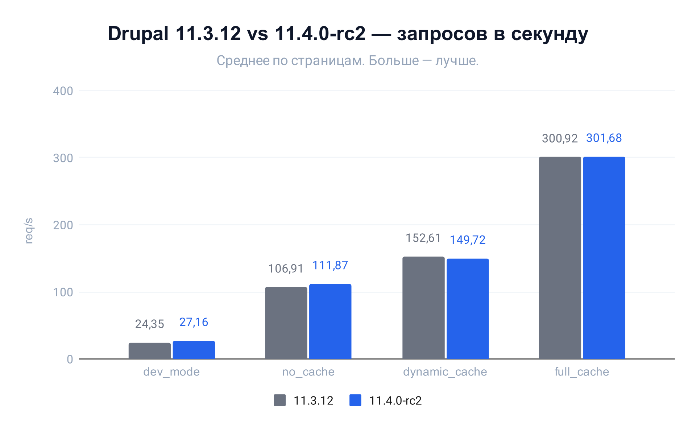
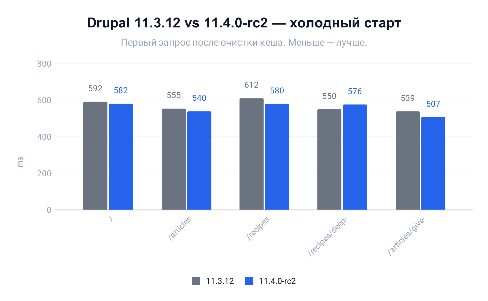

В этом обзоре я собрал изменения в Drupal 11.4, которые показались мне наиболее значимыми или просто интересными. Полный список обновлений вы найдёте на странице релиза[^drupal-11-4-release].

## Default Admin — новая административная тема на основе Gin

Контрибутная тема **Gin**[^gin-contrib] интегрирована в ядро под названием **Default Admin** (машинное имя `default_admin`).[^new-admin-theme][^merging-gin-as-admin-theme][^rename-gin-admin-theme] Тема имеет **экспериментальный** статус.[^admin-theme-experimental] **Claro** по-прежнему остаётся административной темой по умолчанию, но по первоначальному плану её удалят в Drupal 12 и сделают **Default Admin** новой стандартной темой. 

::::: figure
:: video [Default Admin Light/Dark](video/default-admin-light-dark.mp4){muted autoplay loop}
::: figcaption
**Видео 1.** Форма редактирования материала с демонстрацией светлой и тёмной темы оформления.
:::
:::::

Новая тема оформления предлагает значительно улучшенную версию Claro с новыми функциями.

- Выбор акцентного цвета;
- Поддержка светлой и тёмной цветовых схем с возможностью ручного выбора или автоматического определения на основе
  системных настроек;
- Поддержка режима высокой контрастности;
- Выбор цвета фокуса;
- Настройка плотности макета;
- Возможность расширять сайдбары форм редактирования сущностей, а также переключать их видимость.

## Добавлен экспериментальный модуль `mailer` для интеграции Symfony Mailer

Добавлен **экспериментальный** модуль `mailer` для интеграции **Symfony Mailer**[^symfony-mailer-docs] в Drupal.[^mailer-module] Он позволяет использовать современные транспорты (SMTP, Sendmail и другие), настраивать параметры отправки через DSN и перехватывать письма в тестах.

Знакомо, не правда ли? Ещё в 2023 году в **Drupal 10.2**[^drupal-10-2-is-available] добавили зависимость `symfony/mailer` и соответствующий `#[Mail]`-плагин.[^symfony-mailer-component] С тех пор компонент можно было использовать при необходимости, но его возможности были сильно ограничены.

Новый модуль расширяет возможности, предоставляя сервисы для отправки, модификации сообщений и кастомизации процессов:

- Для тестирования добавлен модуль `mailer_capture`, который перехватывает отправленные письма.[^mailer-capture]
- **Основные сервисы для работы с почтой:**
  - `Symfony\Component\Mailer\MailerInterface` — отправка сообщений.
  - Сервис `Symfony\Component\Mailer\Transport\TransportInterface` — прямая отправка в обход **Messenger**[^symfony-messenger-docs].
- **Кастомизация транспортов:**
  - Фабрика `Drupal\Core\Mailer\TransportServiceFactoryInterface` для замены или модификации транспортов.
  - Абстрактный сервис `Symfony\Component\Mailer\Transport\AbstractTransportFactory` для создания сторонних транспортов через [сервисы с метками][tagged-services] `mailer.transport_factory`.
- **События для обработки писем:**
  - `Symfony\Component\Mailer\Event\MessageEvent`[^symfony-mailer-message-event] — изменение содержимого сообщения перед отправкой.
  - `Symfony\Component\Mailer\Event\SentMessageEvent`[^symfony-mailer-sent-message-event] — получение данных об успешной отправке: оригинал сообщения, отладочная информация, идентификатор.
  - `Symfony\Component\Mailer\Event\FailedMessageEvent`[^symfony-mailer-failed-message-event] — обработка ошибок с информацией о сообщении и тексте ошибки.
- Новая настройка `mailer_sendmail_commands` ограничивает доступные команды `sendmail`. При попытке использовать неразрешённые команды система выбрасывает исключение о небезопасной отправке сообщения.

::::: figure
::: figcaption
**Листинг 1.** Пример отправки сообщения с использованием нового сервиса `Symfony\Component\Mailer\MailerInterface`.
:::
  ```php
  use Symfony\Component\Mailer\Exception\TransportExceptionInterface;
  use Symfony\Component\Mailer\MailerInterface;
  use Symfony\Component\Mime\Email;

  final readonly class Foo {

    public function __construct(private MailerInterface $mailer, private LoggerInterface $logger) {}

    public function doSomething(): void {
      // Прочая логика…
      try {
        $this->sendEmail();
      }
      catch (TransportExceptionInterface $exception) {
        $this->logger->error($exception->getMessage());
      }
    }

    private function sendEmail(): void {
      $email = new Email()
        ->subject('Hello, World!')
        ->from('webmaster@example.com')
        ->to('you@example.com')
        ->text('Hello, World! This is a test email.')
        ->attachFromPath('/path/to/file.pdf', 'file.pdf', 'application/pdf');

      $this->mailer->send($email);
    }

  }
  ```
:::::

Листинг 1 демонстрирует, что отправка сообщений существенно отличается от стандартных методов в Drupal. Это вызывает закономерные вопросы. Например, как перехватывать письма определённого модуля или типа? Модуль не даёт ответа на этот вопрос. Похоже, нас подталкивают к созданию собственных типизированных Email-классов. Пример:

```php
use Drupal\commerce_order\Entity\OrderInterface;
use Symfony\Component\Mime\Email;

final class CommerceOrderReceiptEmail extends Email {

  public function __construct(public OrderInterface $order) {}

}
```

Однако адаптация всех модулей под такую систему потребует много времени. На какое-то время в контрибах и проектах может возникнуть путаница. Но для этого и нужен **экспериментальный** модуль. Возможно, в него добавят промежуточные слои для текущей системы. Для собственных проектов это вполне подходящее решение, которое определённо удобнее и проще в настройке, чем метод из статьи про [отправку писем с использованием ООП и Dependency Injection][oop-and-di-mail].

К слову о событиях — приведу небольшой пример их использования:

::::: figure
::: figcaption
**Листинг 2.** Пример использования событий для обработки электронных писем.
:::
  ```php
  use Symfony\Component\EventDispatcher\EventSubscriberInterface;
  use Drupal\Core\Render\RendererInterface;
  use Psr\Log\LoggerInterface;
  use Symfony\Component\Mailer\Event\FailedMessageEvent;
  use Symfony\Component\Mailer\Event\MessageEvent;
  use Symfony\Component\Mailer\Event\SentMessageEvent;
  use Symfony\Component\Mime\Email;
  
  final readonly class EmailSubscriber implements EventSubscriberInterface {
  
    public function __construct(private RendererInterface $renderer, private LoggerInterface $logger) {}
  
    public static function getSubscribedEvents(): array {
      return [
        MessageEvent::class => 'onMessagePrepare',
        SentMessageEvent::class => 'onMessageSent',
        FailedMessageEvent::class => 'onMessageFailed',
      ];
    }
  
    public function onMessagePrepare(MessageEvent $event): void {
      $message = $event->getMessage();
      if (!$message instanceof Email) {
        return;
      }
  
      $email_wrapper = [
        '#theme' => 'email_wrapper',
        '#message' => $message,
      ];
      $email_html = $this->renderer->renderInIsolation($email_wrapper);
      $message->html($email_html);
    }
  
    public function onMessageSent(SentMessageEvent $event): void {
      if (!$event->getMessage()->getOriginalMessage() instanceof Email) {
        return;
      }
  
      $this->logger->info('Email was successfully sent.', ['message_id' => $event->getMessage()->getMessageId()]);
    }
  
    public function onMessageFailed(FailedMessageEvent $event): void {
      if (!$event->getMessage() instanceof Email) {
        return;
      }
  
      $this->logger->error('Email was not sent.', [
        'message' => $event->getMessage(),
        'error' => $event->getError()->getMessage(),
      ]);
    }
  
  }
```
:::::

Пример с HTML-обёрткой в **листинге 2** отправит HTML «как есть» — без инъекции inline-стилей и других преобразований. Для этого потребуются сторонние решения и зависимости[^twig-inline-css].[^symfony-mailer-html-css]

## Поддержка `#[MapQueryParameter]` для маппинга query-параметров в контроллерах

Добавлена поддержка атрибута Symfony `#[MapQueryParameter]`,[^map-query-parameters] который упрощает работу с query-параметрами в контроллерах. Теперь не нужно вручную извлекать параметры из объекта `Request` — достаточно объявить типизированные аргументы метода, и Symfony автоматически выполнит маппинг и приведение типов.

Рассмотрим практический пример — контроллер каталога товаров с фильтрацией. URL может выглядеть так: `/catalog?min_price=1000&sort=price_asc`.

::::: figure
::: figcaption
**Листинг 3.** Традиционный способ получения query-параметров через объект `Request`.
:::
```php
use Symfony\Component\HttpFoundation\Request;
use Symfony\Component\HttpFoundation\JsonResponse;

public function catalog(Request $request): JsonResponse {
  $min_price = $request->query->get('min_price');
  $max_price = $request->query->get('max_price');
  $sort = $request->query->get('sort', 'name_asc');

  // Ручная валидация параметров.
  if ($min_price !== null && !is_numeric($min_price)) {
    throw new \InvalidArgumentException('Invalid min_price value');
  }

  // Загрузка и фильтрация товаров…
  $products = $this->loadProducts((int) $min_price, (int) $max_price, $sort);

  return new JsonResponse(['products' => $products]);
}
```
:::::

::::: figure
::: figcaption
**Листинг 4.** Новый способ — каждый query-параметр объявляется отдельным типизированным аргументом через `#[MapQueryParameter]`.
:::
```php
use Symfony\Component\HttpFoundation\JsonResponse;
use Symfony\Component\HttpKernel\Attribute\MapQueryParameter;

public function catalog(
  #[MapQueryParameter] ?int $min_price = NULL,
  #[MapQueryParameter] ?int $max_price = NULL,
  #[MapQueryParameter] string $sort = 'name_asc',
): JsonResponse {
  // Загрузка и фильтрация товаров…
  $products = $this->loadProducts($min_price, $max_price, $sort);

  return new JsonResponse(['products' => $products]);
}
```
:::::

Атрибут берёт имя параметра запроса из имени аргумента метода. Если нужно использовать другое имя — его можно задать явно: `#[MapQueryParameter('min_price')]`. Приведение типов выполняется через `filter_var()`, что позволяет безопасно конвертировать строки в `int`, `float` и `bool`.

::: note
Drupal регистрирует только `QueryParameterValueResolver`, поэтому из всего семейства маппинг-атрибутов Symfony поддерживается лишь `#[MapQueryParameter]` — `#[MapQueryString]`, `#[MapRequestPayload]` и `#[MapUploadedFile]` недоступны.
:::

## Сеттер‑инъекция через `#[Required]` в `AutowireTrait`

`AutowireTrait` и `AutowiredInstanceTrait` получили поддержку сеттер‑инъекции с помощью атрибута `#[Required]`.[^autowire-trait-setter-injection] Теперь не нужно переопределять конструкторы в подклассах плагинов и контроллеров.

Типичная ситуация: базовый класс плагина принимает несколько зависимостей через конструктор, а подклассу нужна дополнительная зависимость.

::::: figure
::: figcaption
**Листинг 5.** Традиционный подход: подкласс повторяет параметры конструктора родителя, реализует `::create()` и вручную извлекает сервисы из контейнера.
:::
```php
use Drupal\Core\Plugin\ContainerFactoryPluginInterface;
use Symfony\Component\DependencyInjection\ContainerInterface;

class ExamplePlugin extends PluginBase implements ContainerFactoryPluginInterface {

  public function __construct(
    array $configuration,
    $plugin_id,
    $plugin_definition,
    private readonly Service1Interface $service1,
    private readonly Service2Interface $service2,
  ) {
    parent::__construct($configuration, $plugin_id, $plugin_definition);
  }

  public static function create(ContainerInterface $container, array $configuration, $plugin_id, $plugin_definition): self {
    return new self(
      $configuration, $plugin_id, $plugin_definition,
      $container->get(Service1Interface::class),
      $container->get(Service2Interface::class),
    );
  }

}
```
:::::

С каждой новой зависимостью конструктор и `::create()` растут синхронно. Сеттер‑инъекция помогает решить эту проблему:

::::: figure
::: figcaption
**Листинг 6.** Новый подход: зависимости добавляются через сеттер‑методы с атрибутом `#[Required]`, без переопределения конструктора и без `::create()`.
:::
```php
use Drupal\Core\DependencyInjection\AutowireTrait;
use Symfony\Contracts\Service\Attribute\Required;

class ExamplePlugin extends PluginBase {

  use AutowireTrait;

  protected Service1Interface $service1;
  protected Service2Interface $service2;

  #[Required]
  public function setService1(Service1Interface $service1): void {
    $this->service1 = $service1;
  }

  #[Required]
  public function setService2(Service2Interface $service2): void {
    $this->service2 = $service2;
  }

}
```
:::::

Зависимости в сеттер‑методах разрешаются так же, как в конструкторе — по типу параметра или с помощью атрибута `#[Autowire]`. В одном классе можно использовать несколько `#[Required]`‑методов. Методы обязательно должны быть `public` — трейт обходит только публичные методы.

Ещё одно преимущество такого подхода, особенно в контексте плагинов, — изменения конструктора родительского класса не потребуют рефакторинга вашего кода.

Кроме того, стоит напомнить: конструкторы сервисов, контроллеров (которые тоже лучше регистрировать как сервисы[^autowire-trait-controller-replacement]) и плагинов — это внутренний API, их не должны переопределять подклассы.[^bc-policy-constructors]

::: tip
Если сервис зарегистрирован с `autowire: true`, сеттер‑инъекция через `#[Required]` работает и без `AutowireTrait` — `Symfony\Component\DependencyInjection\Compiler\AutowireRequiredMethodsPass` обрабатывает такие методы на этапе компиляции контейнера.
:::

## Атрибут `#[Bundle]` для регистрации бандл-классов сущностей

Бандл-класс — это PHP-класс, назначенный конкретному бандлу сущности. Он позволяет добавлять специфичные для бандла методы и свойства прямо в классе, а не рассыпать логику по хукам и сервисам.

Появился PHP-атрибут `#[Bundle]`, который позволяет связать бандл-класс с бандлом прямо в коде.[^bundle-attribute-entity] Для типов сущностей с `bundle_entity_type` (node, media и другие) атрибут назначает PHP-класс уже существующему бандлу — вместо `hook_entity_bundle_info_alter()`. Раньше для этого требовался хук:

::::: figure
::: figcaption
**Листинг 7.** Традиционный способ назначения бандл-класса через `hook_entity_bundle_info_alter()`.
:::
```php
#[Hook('entity_bundle_info_alter')]
public function entityBundleInfoAlter(array &$bundles): void {
  $bundles['node']['article']['class'] = Article::class;
}
```
:::::

Теперь достаточно добавить атрибут `#[Bundle]` непосредственно к классу:

::::: figure
::: figcaption
**Листинг 8.** Назначение бандл-класса через атрибут `#[Bundle]` — хук больше не нужен.
:::
```php
use Drupal\Core\Entity\Attribute\Bundle;
use Drupal\node\Entity\Node;

#[Bundle(
  entityType: 'node',
  bundle: 'article',
)]
class Article extends Node {}
```
:::::

Для типов сущностей без `bundle_entity_type` атрибут также позволяет объявить сам бандл — достаточно указать параметр `label`. Это заменяет `hook_entity_bundle_info()`: определение бандла и его класс оказываются в одном файле:

::::: figure
::: figcaption
**Листинг 9.** Объявление бандла и бандл-класса через `#[Bundle]` для типа сущности без `bundle_entity_type` — вместо `hook_entity_bundle_info()`.
:::
```php
use Drupal\Core\Entity\Attribute\Bundle;
use Drupal\Core\StringTranslation\TranslatableMarkup;
use Drupal\my_module\Entity\MyEntity;

#[Bundle(
  entityType: 'my_entity',
  bundle: 'foo',
  label: new TranslatableMarkup('Foo'),
)]
class Foo extends MyEntity {}
```
:::::

Для автоматического обнаружения класс должен находиться в пространстве имён `\Entity` модуля и иметь атрибут `#[Bundle]`.

## Маршруты через PHP-атрибуты

Добавлена поддержка определения маршрутов прямо в классах контроллеров с помощью PHP-атрибута `#[Route]`.[^route-php-attributes] Это стандартный подход из Symfony, и больше не нужно дублировать информацию между YAML-файлом и PHP-кодом.

Drupal автоматически обнаруживает классы в пространстве имён `Controller` каждого модуля (например, `Drupal\example\Controller`) и регистрирует маршруты из их атрибутов. YAML-маршрутизация (`*.routing.yml`) продолжает работать — атрибутный подход дополняет существующую систему.

Рассмотрим пример. Раньше маршрут описывался в YAML-файле:

::::: figure
::: figcaption
**Листинг 10.** Определение маршрута в `example.routing.yml`.
:::
```yaml
example.hello:
  path: '/example/hello'
  defaults:
    _controller: '\Drupal\example\Controller\ExampleController::hello'
    _title: 'Hello'
  requirements:
    _permission: 'access content'
```
:::::

Теперь тот же маршрут можно задать атрибутом непосредственно на методе контроллера, а YAML-файл — удалить:

::::: figure
::: figcaption
**Листинг 11.** Определение маршрута через атрибут `#[Route]` на методе контроллера.
:::
```php
namespace Drupal\example\Controller;

use Drupal\Core\Controller\ControllerBase;
use Symfony\Component\Routing\Attribute\Route;

class ExampleController extends ControllerBase {

  #[Route(
    path: '/example/hello',
    name: 'example.hello',
    requirements: ['_permission' => 'access content'],
    defaults: ['_title' => 'Hello'],
  )]
  public function hello(): array {
    return ['#markup' => $this->t('Hello, World!')];
  }

}
```
:::::

Атрибут можно разместить и на уровне класса — он задаёт общий префикс имени и параметры, которые наследуют все методы. Это удобно, когда контроллер содержит несколько маршрутов с общими настройками:

::::: figure
::: figcaption
**Листинг 12.** Атрибут `#[Route]` на классе задаёт общий префикс имени и требования для всех методов.
:::
```php
namespace Drupal\example\Controller;

use Drupal\Core\Controller\ControllerBase;
use Symfony\Component\Routing\Attribute\Route;

#[Route(
  name: 'example.',
  requirements: ['_permission' => 'access content'],
)]
class ExampleController extends ControllerBase {

  #[Route(path: '/example/hello', name: 'hello', defaults: ['_title' => 'Hello'])]
  public function hello(): array {
    return ['#markup' => $this->t('Hello, World!')];
  }

  #[Route(path: '/example/goodbye', name: 'goodbye', defaults: ['_title' => 'Goodbye'])]
  public function goodbye(): array {
    return ['#markup' => $this->t('Goodbye, World!')];
  }

}
```
:::::

В **листинге 12** атрибут класса задаёт префикс `example.` и общее требование `_permission` для обоих методов. Каждый метод дополняет их своим путём и суффиксом имени — в итоге регистрируются маршруты `example.hello` и `example.goodbye`.

Если контроллер реализует единственное действие, можно использовать метод `__invoke()`. Атрибут на классе задаёт общие настройки, атрибут на методе — суффикс имени маршрута. `_controller` устанавливается автоматически как имя класса, без `::__invoke`:

::::: figure
::: figcaption
**Листинг 13.** Контроллер с единственным действием с `__invoke()`.
:::
```php
namespace Drupal\example\Controller;

use Drupal\Core\Controller\ControllerBase;
use Symfony\Component\Routing\Attribute\Route;

#[Route(
  path: '/example/hello',
  name: 'example.',
  requirements: ['_permission' => 'access content'],
  defaults: ['_title' => 'Hello'],
)]
class HelloController extends ControllerBase {

  #[Route(name: 'hello')]
  public function __invoke(): array {
    return ['#markup' => $this->t('Hello, World!')];
  }

}
```
:::::

::: note
В официальном Change Record[^route-php-attributes] приведён пример, где `#[Route]` размещён только на классе, а `::__invoke()` — без атрибута. Но работать оно не будет из-за бага в `AttributeRouteDiscovery`[^route-discovery-invoke-bug]: условие `$class->hasMethod('__invoke') === 0` всегда `FALSE`, поскольку `hasMethod()` возвращает `bool`, а не `int`. Атрибут на методе обязателен, пока баг не будет исправлен ([раз](https://www.drupal.org/project/drupal/issues/3593939), [два](https://www.drupal.org/project/drupal/issues/3584793#comment-16553783)), впрочем, это уже другая история.
:::

## Поддержка предзагрузки шрифтов в библиотеках

В библиотеках (`.libraries.yml`) добавлена поддержка ключа `fonts` для предзагрузки шрифтов.[^library-fonts-preload] Ранее для этого требовалось вручную добавлять ссылки в шаблоны или использовать хуки, теперь же шрифты можно объявлять наравне с CSS и JavaScript.

::::: figure
::: figcaption
**Листинг 14.** Пример объявления предзагружаемого шрифта в библиотеке.
:::
```yaml
global-styling:
  version: VERSION
  css:
    theme:
      css/global.css: {}
  fonts:
    fonts/metropolis/Metropolis-Regular.woff2:
      preload: true
```
:::::

Для каждого шрифта с `preload: true` Drupal добавляет в `<head>` страницы `<link>`-тег со всеми необходимыми атрибутами:

::::: figure
::: figcaption
**Листинг 15.** Сгенерированный `<link>`-тег для предзагрузки шрифта.
:::
```html
<link href="/themes/custom/mytheme/fonts/metropolis/Metropolis-Regular.woff2"
      rel="preload" as="font" type="font/woff2" crossorigin="anonymous" />
```
:::::

`type` определяется автоматически по расширению файла. `crossorigin="anonymous"` добавляется всегда — без него браузер выполнит два отдельных запроса на один и тот же шрифт: один для preload, второй — при применении CSS-правила `@font-face`.

::: note
Если `preload: true` не указан, шрифт не добавляется в HTML вовсе. Ключ `fonts` без `preload: true` ничего не делает.
:::

Аналогичная поддержка ключа `fonts` добавлена в `libraryOverrides` внутри определений SDC-компонентов (`*.component.yml`).[^sdc-library-overrides-fonts-preload]

::::: figure
::: figcaption
**Листинг 16.** Предзагрузка шрифта через переопределение библиотеки в SDC-компоненте.
:::
```yaml
libraryOverrides:
  fonts:
    component-font.woff2:
      preload: true
```
:::::

## Поддержка сжатия Brotli для агрегированных ассетов

Drupal получил поддержку сжатия **Brotli** для агрегированных CSS- и JS-файлов.[^brotli-assets-compression] Brotli сжимает на 15–25 % лучше, чем gzip — меньше данных, быстрее загрузка в поддерживающих его браузерах.

Теперь при включении сжатия агрегатор генерирует сразу оба формата — `.gz` (gzip) и `.br` (Brotli). Сервер отдаёт браузеру наиболее подходящий вариант, при отсутствии поддержки — возвращаясь к gzip.

**Требования к серверу:**

- Расширение PHP `ext-brotli` должно быть установлено для генерации `.br`-файлов.
- Для **Apache** достаточно обновлённого файла `.htaccess` — специальные модули не требуются, так как файлы предварительно сжаты.
- Для **Nginx** необходим модуль `ngx_brotli` и ручная настройка location-блоков.

В конфигурации `system.performance` ключи `css.gzip` и `js.gzip` объявлены устаревшими. Вместо них введены единые boolean-значения:

- `css.compress`;
- `js.compress`.

При обновлении сайта пост-апдейт хук `system_post_update_migrate_compress_setting()` автоматически мигрирует существующие значения: если gzip был включён — сжатие останется включённым, если отключён — отключится.

Если ваш модуль или профиль программно управляет сжатием ассетов, обновите код:

::::: figure
::: figcaption
**Листинг 17.** Устаревший способ включения сжатия через настройки `gzip`.
:::
```php
$config->set('css.gzip', TRUE);
$config->set('js.gzip', TRUE);
```
:::::

::::: figure
::: figcaption
**Листинг 18.** Новый способ включения сжатия через единые настройки `compress`.
:::
```php
$config->set('css.compress', TRUE);
$config->set('js.compress', TRUE);
```
:::::

Для Nginx добавьте в конфигурацию сервера location-блоки с директивой `brotli_static`:

::::: figure
::: figcaption
**Листинг 19.** Пример настройки Nginx для раздачи предварительно сжатых Brotli- и gzip-файлов.
:::
```nginx
location ~ ^/sites/.*/files/css/(.*)\.css$ {
    gzip_static on;
    brotli_static on;
    try_files $uri.br $uri.gz $uri =404;
}

location ~ ^/sites/.*/files/js/(.*)\.js$ {
    gzip_static on;
    brotli_static on;
    try_files $uri.br $uri.gz $uri =404;
}
```
:::::

::: note [Brotli не заменяет gzip]
Gzip-файлы продолжают генерироваться параллельно. Браузеры без поддержки Brotli автоматически получают gzip-версию. Отключение сжатия отключает оба формата одновременно.
:::

## Новый CLI `dr` с поддержкой команд из модулей

В ядро добавлен новый инструмент командной строки `vendor/bin/dr` — полноценная замена скрипту `core/scripts/drupal`, который поддерживал только встроенные команды ядра.[^dr-cli]

Главное отличие: теперь модули и темы могут регистрировать собственные консольные команды, и `dr` обнаружит их автоматически. Чтобы команда была обнаружена, её класс должен находиться в пространстве имён `Command`: `src/Command/` внутри модуля или темы. Команды реализуются как классы Symfony Console с атрибутом `#[AsCommand]`, а зависимости разрешаются через автосвязывание.

Если размещение в `src/Command/` неудобно, зарегистрируйте команду в контейнере сервисов с меткой `console.command` — она станет доступна наравне с остальными.

Минимальный пример — команда, которая читает название сайта через `ConfigFactoryInterface` и выводит приветствие:

::::: figure
::: figcaption
**Листинг 20.** Команда `example:hello` — простейший пример регистрации пользовательской команды через `#[AsCommand]`.
:::
  ```php
  <?php

  declare(strict_types=1);

  namespace Drupal\my_module\Command;

  use Drupal\Core\Config\ConfigFactoryInterface;
  use Symfony\Component\Console\Attribute\AsCommand;
  use Symfony\Component\Console\Command\Command;
  use Symfony\Component\Console\Input\InputInterface;
  use Symfony\Component\Console\Output\OutputInterface;
  use Symfony\Component\Console\Style\SymfonyStyle;

  #[AsCommand(
    name: 'example:hello',
    description: 'Greets the site by its name.',
  )]
  final class HelloCommand extends Command {

    public function __construct(
      private readonly ConfigFactoryInterface $configFactory,
    ) {
      parent::__construct();
    }

    protected function execute(InputInterface $input, OutputInterface $output): int {
      $io = new SymfonyStyle($input, $output);
      $site_name = $this->configFactory->get('system.site')->get('name');
      $io->success("Hello from $site_name!");

      return Command::SUCCESS;
    }

  }
  ```
:::::

Для более сложных сценариев доступен весь арсенал `SymfonyStyle`: прогресс-бары, таблицы, интерактивные вопросы и цветной вывод.

::::: figure
::: figcaption
**Листинг 21.** Команда `example:progress` — прогресс-бар и таблица с помощью `SymfonyStyle`.
:::
  ```php
  <?php

  declare(strict_types=1);

  namespace Drupal\my_module\Command;

  use Drupal\Core\Entity\EntityTypeManagerInterface;
  use Symfony\Component\Console\Attribute\AsCommand;
  use Symfony\Component\Console\Command\Command;
  use Symfony\Component\Console\Input\InputInterface;
  use Symfony\Component\Console\Output\OutputInterface;
  use Symfony\Component\Console\Style\SymfonyStyle;

  #[AsCommand(
    name: 'example:progress',
    description: 'Lists all content types with a progress bar.',
  )]
  final class ProgressCommand extends Command {

    public function __construct(
      private readonly EntityTypeManagerInterface $entityTypeManager,
    ) {
      parent::__construct();
    }

    protected function execute(InputInterface $input, OutputInterface $output): int {
      $io = new SymfonyStyle($input, $output);

      $types = $this->entityTypeManager->getStorage('node_type')->loadMultiple();
      if (!$types) {
        $io->warning('No content types found.');
        return Command::SUCCESS;
      }

      $io->progressStart(count($types));

      $rows = [];
      foreach ($types as $type) {
        $rows[] = [$type->id(), $type->label()];
        $io->progressAdvance();
      }

      $io->progressFinish();
      $io->table(['Machine name', 'Label'], $rows);

      return Command::SUCCESS;
    }

  }
  ```
:::::

Разобравшись, как регистрируются собственные команды, посмотрим на встроенный набор, доступный в ядре на момент релиза:

- `completion` — генерирует скрипт автодополнения команд для bash, zsh или fish;
- `generate-theme` — создаёт новую тему на основе стандартных шаблонов ядра;
- `help` — справка по команде;
- `install` — установка Drupal через профиль или рецепт;
- `list` — список всех команд;
- `quick-start` — установка сайта и запуск локального веб-сервера;
- `server` — запуск встроенного веб-сервера;
- `cache:rebuild` (псевдонимы: `cr`, `rebuild`) — сброс всех кешей;
- `content:export` — экспорт контентных сущностей в формат YAML;
- `recipe:apply` (псевдоним: `recipe`) — применение рецепта к сайту;
- `recipe:info` — информация о рецепте;
- `system:cron` (псевдонимы: `cron`, `core:cron`) — запуск cron;
- `system:status` (псевдоним: `status`) — статус системы.

Обратите внимание: сейчас отсутствуют команды для экспорта и импорта конфигураций, а также для запуска `hook_update_N()` и `hook_post_update_NAME()`. Вероятно, они появятся в будущих релизах или через сторонние модули. Пока `dr` — не замена Drush, но в перспективе должен ею стать.

## Производительность 11.3 vs 11.4

Теперь сравним производительность **Drupal 11.3.12** и **11.4.0-rc2**. Вот условия теста:

- Установочный профиль: Demo Umami — он уже наполнен контентом и имеет готовую вёрстку. Это не просто сайт-пустышка, а вполне себе неплохой референс для тестов.
- Тестируемые страницы (одинаковы для всех сценариев):
  - `/` — главная
  - `/articles` — список статей
  - `/articles/give-your-oatmeal-the-ultimate-makeover` — страница статьи
  - `/recipes` — список рецептов
  - `/recipes/deep-mediterranean-quiche` — страница рецепта
- Нагрузочный тест: siege 4.1.7, `siege -c5 -r100 --no-parser [URL]` — 5 потоков по 100 запросов каждый. Перед запуском делается 5 запросов на прогрев каждой из страниц. Сценарии:
  - `dev_mode` — режим разработки: `drush theme:dev on` отключает все кеши и включает отладку Twig шаблонов и тем-хуков.
  - `no_cache` — `page_cache` и `dynamic_page_cache` отключены.
  - `dynamic_cache` — включён только `dynamic_page_cache`.
  - `full_cache` — включены `page_cache` и `dynamic_page_cache`.
- Холодный старт — первый запрос сразу после полной очистки кеша (`drush cr`). 5 повторений (каждое после очистки) на каждую страницу.
- Окружение: Docker-контейнеры на локальной машине.
  - База данных: MariaDB 11.8.8
  - Веб-сервер: Nginx 1.31.2
  - PHP: 8.5.7 с OPcache

Эти тесты не про абсолютную производительность Drupal — нас интересует только то, как изменились цифры между версиями на одном железе с идентичным окружением, чтобы видеть прогресс.

::::: figure
  
  ::: figcaption
    **Рисунок 1.** Среднее количество запросов в секунду по сценариям кеширования. Больше — лучше.
  :::
:::::

- `dev_mode` — 24,35 → 27,16 req/s (+11,53%)
- `no_cache` — 106,91 → 111,87 req/s (+4,63%)
- `dynamic_cache` — 152,61 → 149,72 req/s (−1,90%)
- `full_cache` — 300,92 → 301,68 req/s (+0,25%)

По нагрузочному тестированию ярко выражено улучшение в сценариях `dev_mode` и `no_cache`, что вполне ожидаемо: основная масса улучшений производительности была направлена именно на то, как и что загружает Drupal, если данных ещё нет в кеше. Остальные показатели, я бы сказал, на уровне погрешности — хоть `dynamic_cache` и просел на -1,90%, я бы, наверное, отнёс это к шуму измерений, так как никаких явных изменений в этом направлении в 11.4 не припоминаю.

::::: figure
  
  ::: figcaption
    **Рисунок 2.** Время первого запроса после полной очистки кеша (`drush cr`), мс. Меньше — лучше.
  :::
:::::

- `/` — 592 → 582 мс (−1,78%)
- `/recipes` — 612 → 580 мс (−5,11%)
- `/recipes/deep-mediterranean-quiche` — 550 → 576 мс (+4,63%)
- `/articles` — 555 → 540 мс (−2,64%)
- `/articles/give-your-oatmeal-the-ultimate-makeover` — 539 → 507 мс (−5,84%)
- Среднее: -2,15%

Для холодного старта результаты в целом ожидаемы: стабильное снижение времени первого запроса в среднем на 2–3%. Исключение — `/recipes/deep-mediterranean-quiche`, где 11.4.0-rc2 показал незначительную деградацию (+4,63%), но откуда она — непонятно: в остальных сценариях страница показывает стабильные улучшения.

В общем, что 11.4 стал чуточку быстрее, чем 11.3, особенно в сценариях, когда кеш ещё недоступен. Это приятно — сайты будут оживать быстрее после деплоя. Но не стоит ожидать прорыва — достойное минорное улучшение для минорного релиза, не более.

## Дополнительные улучшения и изменения

### API и разработка

- Объявлен устаревшим метод `Drupal\Core\Theme\Registry::getBaseHook()`, который не имеет замены из-за отсутствия реальных случаев использования.[^registry-base-hook-deprecated]
- Объявлены устаревшими константа (`\Drupal\Core\Field\Plugin\Field\FieldFormatter\EntityReferenceEntityFormatter::RECURSIVE_RENDER_LIMIT`) и свойство (`$recursiveRenderDepth`), ограничивающие рекурсивный рендеринг, поскольку введён новый механизм защиты от бесконечных циклов на основе отслеживания состояния рендеринга.[^recursive-rendering-improved]
- Добавлен новый метод `::getSummary()` в интерфейс `FieldTypeCategoryInterface`, позволяющий отображать развёрнутые описания категорий полей в административном интерфейсе.[^field-type-category-description]
- AJAX page state теперь передаётся как атрибут запроса вместо query-параметра, что требует обновления кода для его получения.[^ajax-page-state]
- Добавлены параметры `$page_top` и `$page_bottom` к методу `HtmlRenderer::buildPageTopAndBottom()` для управления соответствующими переменными страницы.[^page-top-and-bottom-html-renderer]
- Добавлена возможность встраивать содержимое в верхнюю и нижнюю часть страницы через атрибут `#attached` в контроллере, как альтернатива хукам.[^page-top-and-bottom-attached]
- Объявлены устаревшими все функции в файле `locale.translations.inc`. Их функциональность перенесена в новые сервисы.[^local-translations-deprecated]
- Объявлены устаревшими функции работы с файлами локализации из `locale.bulk.inc` и `locale.batch.inc`. Их функциональность перенесена в VO `LocaleFile` и сервис `LocaleFileManager`.[^locale-file-manager]
- Объявлены устаревшими все функции в файле `locale.fetch.inc`. Их функциональность перенесена в сервис `LocaleFetch`.[^locale-fetch-deprecated]
- Добавлен метод `EntityTypeInterface::hasIntegerId()`, который определяет, является ли ID сущности целочисленным. Объявлены устаревшими `DefaultHtmlRouteProvider::getEntityTypeIdKeyType()`, `CommentTypeForm::entityTypeSupportsComments()` и `_comment_entity_uses_integer_id()`.[^has-integer-id]
- Реализации методов `::getSortedDefinitions()` и `::getGroupedDefinitions()` интерфейса `CategorizingPluginManagerInterface` теперь требуют аргумент `$label_key`.[^categorizing-plugin-manager-label-key]
- Реализации метода `ExecutableInterface::execute()` теперь требуют аргумент `$object`.[^executable-interface-execute-object]
- Метод `ConfigManager::findConfigEntityDependenciesAsEntities()` теперь возвращает конфигурационные сущности без применения переопределений (overrides), используя `::loadMultipleOverrideFree()` вместо `::loadMultiple()`.[^config-manager-override-free]
- Добавлен метод `SelectInterface::getRange()`, позволяющий получить текущие параметры диапазона (`start` и `length`) из объекта Select-запроса.[^select-query-get-range]
- Изменён порядок поиска временной директории в `FileSystem::getOsTemporaryDirectory()`: результат `sys_get_temp_dir()` теперь проверяется раньше `/tmp`, что может изменить расположение временных файлов.[^filesystem-temp-directory-order]
- Метод `::hasRole()` перенесён из `UserInterface` в `AccountInterface`, что делает его доступным на уровне базового интерфейса сессий.[^has-role-account-interface]
- [Outbound path processor][inbound-outbound-processor] теперь получают `route_name` и `route_parameters` в массиве `$options`.[^outbound-route-name]
- Плагины хранилищ секций Layout Builder теперь должны реализовывать интерфейс `SupportAwareSectionStorageInterface`.[^layout-builder-support-aware]
- `FormBase` теперь включает `AutowireTrait`, предоставляя автоматический метод `::create()` с разрешением зависимостей по типам. Это позволяет убрать шаблонный `::create()` из форм.[^form-base-autowire][^autowire-trait-controller-replacement]
- Метод `Url::createFromRequest()` теперь автоматически сохраняет query-параметры из запроса, что устраняет необходимость в ручном вызове `::setOption('query', ...)`.[^url-create-from-request-query]
- `AutowireTrait` и `AutowiredInstanceTrait` теперь поддерживают передачу параметров контейнера в конструкторы классов, реализующих `ContainerInjectionInterface` и `ContainerFactoryPluginInterface`.[^autowire-trait-container-parameters][^autowire-trait-controller-replacement]
- Добавлен сервис `\Drupal\Core\Field\FieldPurger` для очистки данных полей. Функции `field_purge_batch()`, `field_purge_field()` и `field_purge_field_storage()` объявлены устаревшими.[^field-purger-service]
- Метод `::setMultiple()` хранилища ключ-значение на базе БД теперь выполняется в транзакции, что гарантирует атомарность операции — все значения сохраняются либо целиком, либо не сохраняются вовсе.[^kv-set-multiple-transaction]
- В интерфейс `KeyValueStoreInterface` добавлен метод `::getAllKeys()`, позволяющий получить все ключи коллекции без загрузки самих значений, что снижает потребление памяти при работе с большими коллекциями.[^kv-get-all-keys]
- Добавлен пакет `symfony/polyfill-php86`, который делает доступными возможности PHP 8.6 — функцию `clamp()`, константу `ARRAY_FILTER_USE_VALUE` и перечисляемый тип `SortDirection` — при работе на более ранних версиях PHP.[^symfony-polyfill-php86]
- В метод `ExtensionList::getList()` добавлен необязательный аргумент `$skip_cache = FALSE`. При передаче `TRUE` обходится как постоянный, так и статический кеш, и список расширений пересчитывается из файловой системы без обновления кеша. Это замена паттерна `->reset()->getList()`, который инвалидировал `cache_bootstrap` на каждом admin-запросе.[^extension-list-get-list-skip-cache]

### Производительность и кеширование

- Поля сущностей, у которых разрешён только один элемент значения (лимит = 1), теперь загружаются из базы данных одним запросом — раньше для каждого такого поля выполнялся отдельный запрос.[^single-cardinality-sql]
- Теперь загрузка полей с множественным значением стала эффективнее: вместо отдельных запросов для каждого поля формируется один SQL‑запрос.[^multiple-cardinality-field-performance]
- Улучшена производительность сортировки ленивой коллекции плагинов за счёт исключения ненужного создания экземпляров плагинов.[^lazy-plugin-collection-instances]
- Оптимизированы операции записи в БД при изменении статуса ревизий контента.[^revision-save-optimiziation]
- Улучшена производительность перестроения меню за счёт сокращения количества запросов к базе данных: добавлена предзагрузка всех существующих ссылок одним запросом вместо индивидуальных SELECT-запросов для каждой ссылки.[^menu-preload]
- Добавлена новая настройка (`$settings['asset_gc_threshold']`) — она позволяет управлять сроком хранения агрегированных файлов ассетов.[^asset-gc-threshold] По умолчанию этот срок составляет 45 дней.
- Добавлен статический кеш для определений хранилищ полей (field definitions).[^field-definitions-static-cache] Это позволяет сократить количество обращений к кеш‑бэкенду и повысить производительность.
- Добавлено статическое кеширование для конфигурационных сущностей стилей изображений, что уменьшает количество запросов к кешу и базе данных.[^image-style-static-cache]
- Улучшено кеширование определений полей для типов сущностей: теперь определения для всех бандлов одного типа сущности кешируются одной операцией, что уменьшает количество обращений к кеш-бэкенду.[^field-definition-per-bundle-cache]
- JSON:API больше не проверяет каждый ответ на соответствие схеме по умолчанию. Валидация перенесена в тестовый модуль `jsonapi_response_validator`, что повышает производительность.[^jsonapi-response-validation]
- Нормализация JSON:API теперь пропускает кеширование для `ResourceObject` с `max-age: 0`, что позволяет избежать накладных расходов на запись и чтение кеша при обработке больших коллекций сущностей.[^jsonapi-normalization-skip-cache]
- Метаданные кеширования вычисляемых полей (computed) теперь корректно передаются в ответы JSON:API, если класс списка элементов поля реализует `CacheableDependencyInterface`.[^jsonapi-computed-fields-cache-metadata]
- Оптимизировано количество вызовов `FieldDefinition::getColumns()` при загрузке сущностей: результаты теперь кешируются в локальные массивы перед обработкой записей из базы данных.[^reduce-get-columns-calls]
- Оптимизирован метод `CacheTagsChecksumTrait::calculateChecksum()`: замена `array_diff()` и `array_keys()` на цикл с `isset()` сокращает количество вызовов при загрузке большого числа сущностей с холодным кешем.[^cache-tags-checksum-optimized]
- Из сборщика кеша активного пути меню (`ActiveTrailCacheCollector`) убрана блокировка при записи, что снижает накладные расходы при параллельных запросах.[^active-trail-cache-no-lock]
- Исправлено значение заголовка `X-Drupal-Dynamic-Cache` для 4xx и 5xx ответов: вместо вводящего в заблуждение `UNCACHEABLE (poor cacheability)` теперь возвращается `UNCACHEABLE (XXX)`, где `XXX` — фактический HTTP-статус (например, `UNCACHEABLE (403)` или `UNCACHEABLE (404, sub-request: HIT)`).[^x-drupal-dynamic-cache-header]
- Улучшена производительность проверки доступа к теме (`ThemeAccessCheck`). Теперь используется список тем из контейнера вместо загрузки всех данных темы, что сокращает количество обращений к кешу.[^theme-access-check-speed]
- Ответы 404 теперь кешируемые: `Router::matchRequest()` выбрасывает `CacheableResourceNotFoundException` вместо `ResourceNotFoundException`, что позволяет кешировать 404-ответы с корректными метаданными.[^cacheable-404]
- Добавлено статическое кеширование результата `EntityDataDefinition::getDataType()`, что сокращает количество вызовов при пакетной обработке сущностей.[^entity-data-definition-static-cache]
- Оптимизировано кеширование прототипов в `TypedDataManager`: ссылка на родительский объект больше не включается в прототип — она присваивается при использовании, что устраняет утечки памяти и повышает эффективность LRU-кеша сущностей.[^typed-data-manager-prototype-context]
- Удалена ненужная очистка CSS-кеша при установке тем, поскольку кеш CSS не зависит от темы.[^css-cache-theme-install]
- `MainContentViewSubscriber` переведён на использование `#[AutowireLocator]`, что позволяет инстанцировать только нужный рендерер контента вместо загрузки всех доступных.[^main-content-view-subscriber-service-locator]
- Метод `EntityRepository::loadEntityByUuid()` теперь использует статический кеш для хранения пар UUID–ID в памяти, что позволяет избежать повторных SQL-запросов при многократных обращениях к одной и той же сущности в рамках одного запроса.[^load-entity-by-uuid-static-cache]
- Свойство `EntityBase::$typedData` теперь хранится как `WeakReference`, что устраняет циклическую ссылку и снижает потребление памяти (~3 КБ на сущность).[^entity-base-typed-data-weak-reference]
- Добавлен новый [кеш-контекст][d8-cache-metadata] `exception_status_code` для условия видимости блоков на страницах с HTTP-исключениями (403, 404). Ранее использовался `url.path`, что приводило к низкому hit rate кеша блоков — теперь кеш варьируется только по коду статуса, а не по полному URL.[^exception-status-code-cache-context]
- Устранено избыточное сканирование файловой системы для локальных po-файлов в модуле `locale`.[^avoid-scanning-local-po-files]
- Устранена загрузка форматов дат из конфигурации при получении информации об элементах (element info), что сокращает два лишних обращения к конфигурационным сущностям и кешу на каждый запрос с холодным кешем.[^avoid-loading-date-formats-element-info]
- Добавлен новый кеш-бин `cache.file_parsing` для постоянного кеширования результатов разбора файлов. В отличие от стандартных бинов, он не имеет тега `cache.bin` и не очищается при `drush cr` или `drupal_flush_all_caches()`, что сохраняет кеш между деплоями. Добавлен базовый класс `FileParsingCacheCollectorBase` с валидацией по mtime; новый `YamlCacheCollector` уже использует этот бин для разбора `libraries.yml` и `routing.yaml`.[^cache-file-parsing-bin]

### Устаревшая функциональность и изменения в обратной совместимости

- Объявлены устаревшими модули Migrate Drupal (инструменты миграции с Drupal 6 и 7)[^drupal-migrate-deprecated], History[^history-deprecation] и Contact[^contact-deprecated].
- Плагин поиска `node_search` перемещён из модуля `node` в новый подмодуль `search_node` модуля `search`. Классы, расширяющие `NodeSearch`, необходимо обновить для расширения `\Drupal\search_node\Plugin\Search\SearchNode`.[^search-node-submodule]
- Объявлены устаревшими batch-функции из файлов `locale.batch.inc`, `locale.bulk.inc` и `locale.compare.inc`. Их функциональность перенесена в методы сервиса `LocaleFetch`.[^locale-batch-bulk-compare-deprecated]
- Объявлены устаревшими процедурные функции из `locale.compare.inc` — `locale_translation_flush_projects()`, `locale_translation_build_projects()`, `locale_translation_check_projects()`, `locale_translation_check_projects_local()` и другие — а также сервис `locale.project` и интерфейс `LocaleProjectStorageInterface`. Их функциональность перенесена в новые сервисы `LocaleProjectRepository` и `LocaleProjectChecker`.[^locale-compare-inc-deprecated]
- Объявлены устаревшими функции `locale_translation_get_file_history()`, `locale_translation_update_file_history()` и `locale_translation_file_history_delete()`. Их функциональность перенесена в новый сервис `CurrentImportStateStorage` и value object `CurrentImportState`.[^locale-file-history-deprecated]
- Объявлены устаревшими функции статуса переводов локализации: `locale_translation_get_status()`, `locale_translation_status_save()`, `locale_translation_status_delete_languages()`, `locale_translation_status_delete_projects()` и `locale_translation_clear_status()`. Вместо них следует использовать сервис `LocaleSource` с методами `::loadSources()` и `::loadSource()`.[^locale-translation-status-deprecated]
- Объявлены устаревшими функции с префиксом `_` из `editor.module`, их функциональность перемещена в методы класса `EditorHooks`.[^editor-underscore-function-deprecation]
- Объявлены устаревшими функция `editor_image_upload_settings_form()` и файл `editor.admin.inc`. Логика перенесена в сервис `EditorImageUploadSettings` и его метод `::getForm()`.[^editor-image-upload-settings-deprecated]
- Объявлена устаревшей функция `editor_filter_xss()`. Её функциональность перенесена в метод `Element::filters()`.[^editor-filter-xss-deprecated]
- Объявлены устаревшими статические методы `Views::pluginManager()` и `Views::handlerManager()` в пользу Dependency Injection или Service Locator.[^views-static-plugin-manager-deprecated]
- Файл `views_ui/admin.inc` объявлен устаревшим. Процедурные функции перенесены в трейты `ViewsFormAjaxHelperTrait` и `ViewsFormHelperTrait`.[^views-ui-admin-inc-deprecated]
- Объявлен устаревшим метод `CachePluginBase::getRowCacheKeys()` и удалено дублирующее кеширование отдельных строк представлений для улучшения производительности.[^views-row-cache-deprecated]
- Объявлен устаревшим метод `CachePluginBase::cacheExpire()` модуля Views, поскольку система кеширования уже предотвращает возврат просроченных результатов.[^views-cache-expire-deprecated]
- Объявлены устаревшими функции `views_ui_contextual_links_suppress()`, `views_ui_contextual_links_suppress_push()` и `views_ui_contextual_links_suppress_pop()` без замены, так как их функциональность давно не работала корректно.[^views-ui-contextual-links-deprecated]
- Метод `ViewExecutable::getHandler()` переименован в `ViewExecutable::getHandlerConfiguration()` — старое название вводило в заблуждение, так как метод возвращает конфигурацию обработчика, а не его экземпляр. Старый метод объявлен устаревшим и будет удалён в Drupal 13.[^views-get-handler-deprecated]
- Функция `comment_preview()` объявлена устаревшей — её логика перемещена в метод `CommentForm::preview()`.[^comment-preview-deprecated]
- Константы для настроек обратной связи анонимных пользователей в `CommentInterface` объявлены устаревшими. Вместо них добавлен перечисляемый тип `AnonymousContact`.[^anonymous-contact-enum]
- Объявлены устаревшими константы `CommentItemInterface::FORM_SEPARATE_PAGE` и `FORM_BELOW`. Вместо них следует использовать перечисляемый тип `FormLocation` со значениями `SeparatePage` и `Below`.[^comment-form-location-enum]
- Объявлено устаревшим недокументированное свойство `User::$password`.[^user-password-property]
- Функции `user_cookie_save()` и `user_cookie_delete()` объявлены устаревшими. Вместо них следует использовать методы `::setCookie()` и `::clearCookie()` объекта Symfony `Response`.[^user-cookie-deprecated]
- Функция `user_form_process_password_confirm()` объявлена устаревшей. Вместо неё следует использовать `UserThemeHooks::processPasswordConfirm()`.[^user-form-process-password-confirm-deprecated]
- Объявлены устаревшими функции однократной аутентификации пользователей: `user_pass_rehash()`, `user_cancel_url()`, `user_mail_tokens()` и `user_pass_reset_url()`. Их функциональность перенесена в новый сервис `OneTimeAuthentication` с методами `::generateHmac()`, `::generateCancelConfirmUrl()`, `::tokens()` и другими.[^user-one-time-auth-deprecated]
- Функция `node_access_grants()` объявлена устаревшей. Вместо неё следует использовать сервис `NodeGrantsHelper` и его метод `::nodeAccessGrants()`. Классы `NodeAccessGrantsCacheContext` и `NodeGrantDatabaseStorage` теперь требуют `NodeGrantsHelper` в качестве аргумента конструктора.[^node-access-grants-deprecated]
- Функции `node_access_rebuild()` и `node_access_needs_rebuild()` объявлены устаревшими. Вместо них следует использовать сервис `NodeAccessRebuild` с методами `::rebuild()`, `::needsRebuild()` и `::setNeedsRebuild()`.[^node-access-rebuild-deprecated]
- Объявлен устаревшим класс `\Drupal\node\Controller\NodeViewController`. Он функционально идентичен `EntityViewController`, и вместо него следует использовать `\Drupal\Core\Entity\Controller\EntityViewController`.[^node-view-controller-deprecated]
- Объявлена устаревшей библиотека `node/form` и файл `node.module.css`, содержавший неиспользуемые стили.[^node-form-library-deprecated]
- Объявлено устаревшим использование длинного формата подсказок фильтров текста и страницы для их отображения.[^filter-tips-deprecated]
- Добавлен новый сервис `FilterFormatRepositoryInterface` для работы с форматами фильтров. Функции `filter_formats()`, `filter_formats_reset()`, `filter_get_formats_by_role()`, `filter_default_format()` и `filter_fallback_format()` объявлены устаревшими.[^filter-format-repository]
- Функция `check_markup()` объявлена устаревшей без прямой замены. Вместо неё рекомендуется возвращать рендер-массив с типом `#type => 'processed_text'`, который сохраняет метаданные кеширования.[^check-markup-deprecated]
- Функция `text_summary()` объявлена устаревшей. Её функциональность перенесена в сервис `TextSummary`, метод `::generate()` которого принимает те же аргументы.[^text-summary-deprecated]
- Класс `InstallerRouteBuilder` удалён без замены — он стал ненужным после введения обнаружения маршрутов через PHP-атрибуты.[^installer-route-builder-removed]
- Module handler и controller resolver исключены из конструктора `RouteBuilder`: PHP-атрибуты для определения маршрутов устранили необходимость в них.[^route-builder-constructor-changed]
- Объявлены устаревшими плагины обработки миграций `LinkOptions`, `LinkUri`, `Timezone` и `UserLangcode` из модулей `menu_link_content`, `system` и `user`. Их функциональность перенесена в аналогичные классы модуля `migrate`.[^migrate-process-plugins-moved]
- Объявлены устаревшими процедурные функции `_contextual_links_to_id()` и `_contextual_id_to_links()` и добавлен новый сервис `ContextualLinksSerializer` для их замены.[^contextual-procedural-code-deprecation]
- Объявлены устаревшими конструкторы ограничений (констрейнов) с массивом опций и введена поддержка именованных аргументов для улучшения типобезопасности API.[^constraint-named-arguments]
- Множество процедурных функций отправки форм, валидации и AJAX‑функций обратного вызова объявлены устаревшими.[^form-procedural-functions-deprecations]
- Объявлено устаревшим использование свойства `#item_attributes` в [тем-хуках][theme-hook] `image_formatter` и `responsive_image_formatter`.[^item-attributes-deprecated] Теперь следует использовать стандартное свойство `#attributes`.
- Добавлена настройка для блоков системных меню, позволяющая управлять добавлением CSS-класса текущей страницы.[^active-menu-trail-class]
- Объявлен устаревшим класс `WebDriverCurlService`.[^web-driver-curl-deprecated]
- Метод `LinkWidget::validateTitleElement()` объявлен устаревшим. Валидация перенесена в `LinkTitleRequiredConstraintValidator` на уровне плагина поля `LinkItem`.[^link-widget-validate-title-element]
- Передача `NULL` в качестве параметра `$deserialization_target_class` конструктора `ResourceType` объявлена устаревшей. Вместо этого следует использовать `stdClass::class`.[^resource-type-null-deprecated]
- Ключ `uri_callback` в аннотации типа сущности объявлен устаревшим. Вместо него следует использовать link templates или [outbound path processor][inbound-outbound-processor].[^uri-callback-deprecated]
- Удалена функция `_update_cron_notify()`. Её логика перенесена в `UpdateCronHooks`, а отправка почты — в сервис `MailHandler` модуля Update.[^update-cron-notify-removed]
- Адреса электронной почты в устаревших форматах (например, с пробелом перед символом `@`) теперь не проходят валидацию форм. Ранее такие адреса принимались, но почтовые серверы обычно отвергали их при отправке.[^deprecated-email-validation]
- Объявлено устаревшим обращение к глобальной переменной `$autoload` / `$GLOBALS['autoload']` для получения Composer-автозагрузчика. Вместо этого следует явно подключать автозагрузчик через `require '/vendor/autoload.php'`.[^autoload-global-deprecated]
- Объявлены устаревшими функции `hide()` и `show()`. Вместо них следует напрямую управлять свойством `#printed` рендер-массива: `$element['#printed'] = TRUE` для скрытия и `$element['#printed'] = FALSE` для отображения.[^hide-show-deprecated]
- Объявлены устаревшими все процедурные функции из `menu_ui.module`. Их функциональность перенесена в сервис `MenuUiHelper` и методы класса `MenuUiHooks`.[^menu-ui-module-deprecated]
- Объявлен устаревшим трейт `ToStringTrait`. Вместо него метод `__toString()` следует реализовывать напрямую, а класс — объявлять реализующим интерфейс `\Stringable`.[^to-string-trait-deprecated]
- Объявлены устаревшими аргументы смещения курсора и ориентации в методе `StatementInterface::fetch()`. Они не тестировались и, вероятно, не работали корректно — в Drupal 12 будут удалены.[^statement-fetch-cursor-deprecated]
- Объявлен устаревшим защищённый метод `SqlContentEntityStorage::loadFromSharedTables()` без замены. Его логика объединена с `::loadFromDedicatedTables()`.[^sql-storage-load-shared-deprecated]
- Использование значений, отличных от булевого типа или объекта `AccessResultInterface` для ключа `#access` в [рендер массивах][render-arrays], объявлено устаревшим.[^access-property-types]
- Объявлены устаревшими функции `dblog_filters` и `_dblog_get_message_types`, а также файл `dblog.admin.inc`. Вместо них следует использовать сервис DbLogFilters.
- Объявлена устаревшей функция `block_theme_initialize()`. Логика перенесена в защищённый метод класса `BlockHooks` без публичной замены.[^block-theme-initialize-deprecated]
- Объявлен устаревшим метод `SessionManager::delete()`. Вместо него следует использовать `UserSessionRepository::deleteAll()`.[^session-manager-delete-deprecated]
- Объявлена устаревшей концепция «доверенных данных» (trusted data) в конфигурации: метод `ConfigEntityInterface::trustData()` и параметр `$has_trusted_data` в `Config::save()`. Теперь валидация [схемы конфигурации][config-schema], приведение типов и сортировка ключей применяются ко всем сохранениям конфигурации автоматически.[^trusted-data-deprecated]
- Уточнены типы возвращаемых значений метода `::normalize()` в классах нормализаторов сериализации: `ComplexDataNormalizer`, `ConfigEntityNormalizer`, `ContentEntityNormalizer`, `EntityReferenceFieldItemNormalizer`, `ListNormalizer`, `TimestampItemNormalizer` теперь возвращают `array`, `MarkupNormalizer` — `string`, `NullNormalizer` — `null`.[^jsonapi-normalizer-return-types][^jsonapi-normalizer-return-types-2]
- Объявлены устаревшими функции `file_get_file_references()` и `file_field_find_file_reference_column()`. Вместо первой следует использовать сервис `FileReferenceResolver` и его метод `::getReferences()`; вторая не имеет замены.[^file-get-file-references-deprecated]
- Объявлен устаревшим параметр `$sql_query` метода `Query::getTables()` — объект запроса теперь определяется из самого entity query, и передавать его явно больше не нужно. Кроме того, `Query::condition()` больше не принимает объект `Condition`, созданный в контексте другого entity query; в Drupal 13 это будет явно запрещено.[^entity-query-sql-query-deprecated]
- Объявлена устаревшей валидация CSRF-токенов по ключу `'rest'` в `CsrfRequestHeaderAccessCheck`. Этот запасной ключ сохранялся с Drupal 8 для совместимости с сессиями, созданными до обновления до Drupal 9, — теперь такие сессии не поддерживаются. В Drupal 12 валидация по ключу `'rest'` удалена полностью.[^csrf-rest-key-deprecated]

### Пользовательский интерфейс и UX

- Улучшена валидация ссылок в виджете `LinkWidget`: теперь сообщения об ошибках адаптированы под тип ссылки, делая их более понятными для пользователей.[^link-widget-error-messages]
- Виджеты и форматеры поля основного текста в стандартном профиле и рецептах изменены: теперь используется `text_long` вместо `text_with_summary`.[^text-long-body]
- При ручном создании учётной записи уведомление по электронной почте с инструкциями по установке пароля теперь включено по умолчанию.[^user-password-instructions]
- Форма настройки информации о сайте теперь сохраняет пути к главной странице, 403 и 404 страницам в том виде, в котором их ввёл пользователь, включая неразрешённые псевдонимы, а не преобразует их во внутренние пути.[^raw-front-404-403-paths]
- Добавлена поддержка полноэкранного режима редактирования в CKEditor 5.[^ckeditor5-fullscreen]
- Виджет поля Link теперь поддерживает формат `route:{$route_name}`, сохраняя префикс `route:` при повторном сохранении содержимого.[^link-widget-route-support]
- Из модуля Navigation удалены жёстко заданные ссылки на создание пользователей, а также медиа-сущностей «Изображение» и «Документ» из меню «Содержимое». При необходимости ссылки можно добавить обратно вручную через `/admin/structure/menu/manage/content`.[^navigation-create-links-removed]
- Модуль Navigation добавлен в стандартный профиль установки и рецепт, заменяя Toolbar в качестве навигации по умолчанию.[^navigation-standard-profile]
- При удалении темы через интерфейс теперь отображается страница подтверждения с перечнем конфигураций, которые будут удалены или изменены. Это позволяет отменить удаление до применения изменений.[^theme-uninstall-confirmation]
- Форматтер строковых полей теперь поддерживает ссылку не только на страницу просмотра сущности (`canonical`), но и на форму её редактирования. Тип ссылки выбирается в настройках форматтера.[^string-formatter-edit-form-link]
- HTML5-валидация форм отключена по умолчанию из-за проблем с доступностью. Добавлена настройка `enable_html5_validation` в `settings.php` для управления поведением, а также предупреждение на странице отчёта о состоянии.[^html5-validation-disable]
- Отключённые ссылки меню теперь игнорируются при построении активного пути (active trail), что устраняет некорректное назначение CSS-класса «active» родительским элементам меню.[^disabled-links-active-trail]
- Вкладка «Управление отображением» теперь ведёт на новую обзорную страницу режимов отображения `/admin/structure/types/manage/{bundle}/display` вместо формы редактирования режима по умолчанию. Страница отображает все режимы отображения бандла со статусом и позволяет включать или отключать их напрямую.[^manage-display-overview-page]

### Темы и фронтенд

- Вместо собственных CSS-правил Views (`views-align-*`) для выравнивания содержимого столбцов таблиц теперь используются классы из модуля `system` (`align-left`, `align-center`, `align-right`), обеспечивающие идентичное поведение.[^views-align]
- Обновлены стандартные иконки типов файлов: созданы новые высококачественные SVG-файлы, заменяющие устаревшие растровые PNG для улучшенного отображения на экранах с высоким разрешением.[^file-type-svg-icons]
- Удалены избыточные WAI-ARIA `role`-атрибуты из шаблонов, дублирующие семантику современных HTML5-элементов, для улучшения соответствия стандартам.[^redundant-wai-aria]
- Добавлена поддержка Twig-функции `html_cva()` из пакета `twig/html-extra` для реализации паттерна Class Variance Authority (CVA), упрощающего условное управление CSS-классами в шаблонах. Помимо `html_cva()`, стали доступны функции `html_attr()` и `html_classes()`.[^twig-cva-support]
- Из темы Default Admin удалены шаблоны для модулей Book и Forum, ранее вынесенных из ядра.[^default-admin-book-forum-removed]
- Ссылки, создаваемые Twig-функциями `help_route_link()` и `help_topic_link()`, больше не формируются абсолютными по умолчанию. Для получения абсолютных URL следует явно передать `$options['absolute'] = TRUE`.[^help-topic-link-not-absolute]
- Добавлен объект расширения темы с методами `::listAllRegions()`, `::listVisibleRegions()` и `::getDefaultRegion()` для работы с регионами темы. Объявлены устаревшими функции `system_region_list()` и `system_default_region()`, а также константы `REGIONS_VISIBLE` и `REGIONS_ALL`.[^theme-extension-object]
- SDC-компоненты теперь можно использовать как элементы форм. `ComponentElement` реализует `FormElementInterface` и зарегистрирован как `#[FormElement('component')]`, что позволяет использовать `#type: component` с поддержкой валидации и значений по умолчанию (но без `#ajax`, `#process` и других PHP-only свойств).[^sdc-form-element]
- Для слотов SDC-компонентов добавлена возможность объявлять ожидаемые дочерние компоненты (`expected` — по ID или тегу) и ограничивать их количество (`minItems`, `maxItems`) в `*.component.yml`.[^sdc-slots-expectations-cardinality]
- [Тем-хук][theme-hook] `navigation__message` удалён — компонент сообщений модуля Navigation переведён на SDC.[^navigation-message-sdc]
- Изменено поведение атрибутов блока: ключ `#attributes` в рендер-массиве содержимого блока теперь применяется к обёртке содержимого (`.content`), а не к внешней обёртке блока. Для применения атрибутов ко всему блоку следует использовать `#wrapper_attributes`.[^block-content-attributes-wrapper]
- Свойство `#url` в тем-элементе `responsive_image_formatter` теперь является объектом `Url` вместо строки. В Twig-шаблоне `responsive-image-formatter.html.twig` для получения строки URL следует использовать `url.toString()`.[^responsive-image-url-object]

### Модули и расширяемость

- Добавлена поддержка автосвязывания (autowiring) для плагинов `ImageToolkit` и `ImageToolkitOperation`.[^image-toolkit-autowire]

### Конфигурация и развёртывание

- Удалён модуль **history** из стандартного профиля установки и рецепта, подготовка к его переносу в сторонний модуль.[^history-removed-from-profiles]
- Модуль Shortcut удалён из стандартного профиля установки и рецепта, в рамках подготовки к переносу в контрибутный модуль.[^shortcut-removed-from-profiles]
- Типы контента «Статья» и «Страница» больше не устанавливаются при использовании стандартного профиля установки или рецепта. Новые сайты должны самостоятельно настраивать необходимые типы контента.[^standard-profile-content-types-removed]
- Шаблон проекта `drupal/legacy-project` объявлен заброшенным (abandoned). Рекомендуется использовать `drupal/recommended-project`.[^legacy-project-abandoned]
- Метапакет `drupal/core-dev-pinned` объявлен устаревшим. Вместо него рекомендуется использовать `drupal/core-dev`.[^core-dev-pinned-deprecated]
- Добавлена новая конфигурационная операция (`core.menu.static_menu_link_overrides:overrideMenuLinks`).[^receipt-override-menu-links] Она позволяет переопределять статические ссылки меню — например, изменять их свойства (вес и состояние) с помощью рецептов.
- Модуль Locale теперь использует хеш файла (xxh128) вместо времени модификации (`filemtime()`) для обнаружения изменений в локальных файлах переводов, что повышает надёжность в современных средах развёртывания (например, Docker, где `COPY` не сохраняет временные метки файлов).[^locale-file-hash]
- Значение `version` в файлах `.info.yml` теперь должно быть строкой. Числовые значения вроде `1.0` приводили к проблемам парсинга (например, `1.0` упрощалось до `1`).[^info-yml-version-string]
- Библиотека `justinrainbow/json-schema` теперь считается полноценной зависимостью, а не только зависимостью для разработки.[^justinrainbow-json-schema]
- В стандартный `robots.txt` добавлены правила блокировки индексации страниц поиска с query-параметрами (`/search?`, `/index.php/search?`), что предотвращает индексацию динамически генерируемых страниц поисковых результатов.[^robots-txt-search-query]
- Импорт содержимого по умолчанию (default content) теперь поддерживает формат JSON наряду с YAML.[^default-content-json-import]
- Drupal перешёл на компонент `symfony/runtime` для разделения логики начальной загрузки и обработки запросов. Фронт-контроллеры (`index.php`, `update.php`) обновлены под новый паттерн с классом `DrupalRuntime`. При запуске `composer update` может потребоваться добавить `symfony/runtime` в секцию `allow-plugins` файла `composer.json`.[^symfony-runtime-bootstrap]

### Тестирование и качество кода

- Drupal перешёл на использование W3C-совместимого веб-драйвера для тестирования.[^w3c-complaint-testing]
- Объявлен устаревшим метод `::expectDeprecation()` и трейт `ExpectDeprecationTrait`. Вместо них следует использовать нативные методы PHPUnit `::expectUserDeprecationMessage()` и `::expectUserDeprecationMessageMatches()`.[^expect-deprecation-deprecated]
- Добавлен кастомный `ErrorFormatter` для PHPStan, позволяющий объединить вывод нескольких форматов (JUnit, GitLab, таблица) в одном запуске вместо многократного выполнения анализа.[^phpstan-error-formatter]
- Добавлен трейт `HttpKernelUiHelperTrait` с методом `::drupalGet()` для ядерных (kernel) тестов, позволяющий выполнять HTTP-запросы и проверять содержимое ответа с помощью Mink. Это даёт возможность конвертировать многие браузерные тесты в значительно более быстрые kernel-тесты.[^kernel-test-drupal-get]
- Использование `uniqid()`, `md5()`, `sha1()`, `crc32()` и `hash()` со слабыми алгоритмами теперь запрещено и фиксируется PHPStan как ошибка. Для хеширования данных следует использовать `hash()` с быстрыми алгоритмами (например, `xxh128`), для генерации идентификаторов — `bin2hex(random_bytes())`.[^disallow-weak-hashes]
- Сокращено количество пересборок контейнера при выполнении функциональных тестов, что значительно ускоряет их прохождение.[^reduce-container-rebuilds-tests]
- Публичные методы `::testGet()`, `::testPost()`, `::testPatch()` и `::testDelete()` в `EntityResourceTestBase`
  переименованы в защищённые `::doTest*()` и объединены в один публичный метод `::testCrud()`.[^entity-resource-test-base-consolidated]

### Содержимое и структура данных

- Поле UUID теперь валидирует хранимое значение. Ранее проверялась только длина строки, что позволяло сохранять невалидные UUID.[^uuid-field-validation]
- В поле ссылки добавлено вычисляемое свойство `resolvable_uri`, содержащее готовый URL с учётом всех URL-опций (query, fragment и др.) — в отличие от `uri`, которое хранит сырой вид (`internal:/`, `entity:node/5`). Свойство доступно в Twig-шаблонах и через JSON:API/REST.[^link-resolvable-uri]

### Доступ и безопасность

- Добавлена новая операция контроля доступа `'view linked label'` для сущности пользователя, определяющая возможность отображения имени как ссылки на профиль.[^view-linked-label-permission]
- Объявлена устаревшей конфигурация `locale.settings:translation.path`. Вместо неё следует использовать настройку `$settings['locale_translation_path']` в `settings.php`.[^locale-translation-path-deprecated]
- Добавлена возможность настройки алгоритма и параметров хеширования паролей через параметры ядра `password.algorithm` и `password.options` в `services.yml`.[^password-hashing-configurable]
- В трейт `HttpKernelUiHelperTrait` добавлен метод `::clickLink()`, позволяющий имитировать клик по ссылке в kernel-тестах без необходимости использовать браузерные тесты.[^kernel-test-click-link]
- Методы `AccessResult::allowedIf()` и `AccessResult::forbiddenIf()` теперь принимают необязательный аргумент с причиной нейтрального результата доступа.[^access-result-neutral-reason]
- Маршруты HTTP-аутентификации `user.login.http`, `user.pass.http`, `user.login_status.http` и `user.logout.http` перенесены в модуль REST и переименованы (`rest.login`, `rest.pass`, `rest.login_status`, `rest.logout`). Контроллер `UserAuthenticationController` заменён на `RestAuthenticationController`.[^user-http-routes-to-rest]
- Добавлено новое разрешение `'view unpublished block content'`, позволяющее редакторам просматривать неопубликованные блок-контент-сущности без необходимости иметь разрешения «administer block content» или «access block library».[^view-unpublished-block-content-permission]

[oop-and-di-mail]: ../../../2020/05/29/drupal-8-9-sending-emails-using-oop-and-dependency-injection/article.ru.md
[render-arrays]: ../../../2020/02/05/drupal-8-render-arrays/article.ru.md
[theme-hook]: ../../../2017/06/26/drupal-8-hook-theme/article.ru.md
[inbound-outbound-processor]: ../../../2018/05/30/drupal-8-inbound-outbound-processor/article.ru.md
[config-schema]: ../../../2018/05/04/drupal-8-configuration-schema/article.ru.md
[tagged-services]: ../../../2019/05/05/drupal-8-tagged-services/article.ru.md
[d8-cache-metadata]: ../../../2017/07/15/drupal-8-cache-metadata/article.ru.md

[^justinrainbow-json-schema]: [Promote justinrainbow/json-schema from dev-dependency to full dependency](https://www.drupal.org/project/drupal/issues/3365985).
[^mailer-module]: [Experimental Symfony Mailer Module](https://www.drupal.org/node/3519253). _История изменений Drupal Core_. 2025-05-13.
[^symfony-mailer-component]: [Symfony mailer component added as a composer dependency](https://www.drupal.org/node/3369935). _История изменений Drupal Core_. 2023-10-20.
[^symfony-mailer-docs]: [Sending Emails with Mailer](https://symfony.com/doc/current/mailer.html). _Официальная документация компонента `symfony/mailer`._
[^symfony-mailer-message-event]: [MessageEvent](https://symfony.com/doc/current/mailer.html#messageevent). _Официальная документация компонента `symfony/mailer`._
[^symfony-mailer-sent-message-event]: [SentMessageEvent](https://symfony.com/doc/current/mailer.html#sentmessageevent). _Официальная документация компонента `symfony/mailer`._
[^symfony-mailer-failed-message-event]: [FailedMessageEvent](https://symfony.com/doc/current/mailer.html#failedmessageevent). _Официальная документация компонента `symfony/mailer`._
[^symfony-messenger-docs]: [Messenger: Sync & Queued Message Handling](https://symfony.com/doc/current/messenger.html). _Официальная документация компонента `symfony/messenger`._
[^drupal-10-2-is-available]: [Drupal 10.2 is now available](https://www.drupal.org/blog/drupal-10-2-0). _Блог разработчиков Drupal_. 2023-12-15.
[^symfony-mailer-html-css]: [Twig: HTML & CSS](https://symfony.com/doc/current/mailer.html#twig-html-css). _Официальная документация компонента `symfony/mailer`._
[^twig-inline-css]: [inline_css — Filters](https://twig.symfony.com/doc/3.x/filters/inline_css.html). _Документация Twig._
[^mailer-capture]: [Add a way to capture mails sent through the mailer transport service during tests](https://www.drupal.org/project/drupal/issues/3397420). _Задача на Drupal.org_. Дата обращения: 2025-12-02.
[^single-cardinality-sql]: [Single cardinality entity fields are now loaded from the database at once](https://www.drupal.org/node/3562172). _История изменений Drupal Core_. Дата обращения: 2025-12-18.
[^lazy-plugin-collection-instances]: [DefaultLazyPluginCollection unnecessarily instantiates plugins when sorting collection](https://www.drupal.org/project/drupal/issues/3520997). _Задача на Drupal.org_. Дата обращения: 2026-01-12.
[^drupal-migrate-deprecated]: [The Migrate Drupal module is deprecated](https://www.drupal.org/node/3566999). _История изменений Drupal Core_. Дата обращения: 2026-01-13.
[^link-widget-error-messages]: [Display meaningful error messages according to the link type](https://www.drupal.org/project/drupal/issues/2828556). _Задача на Drupal.org_. Дата обращения: 2026-01-13.
[^revision-save-optimiziation]: [Optimize database writes when re-saving a pending revision as the default one](https://www.drupal.org/project/drupal/issues/3554579). _Задача на Drupal.org_. Дата обращения: 2026-01-15.
[^registry-base-hook-deprecated]: [Deprecation of Drupal\Core\Theme\Registry::getBaseHook()](https://www.drupal.org/node/3567793). _История изменений Drupal Core_. Дата обращения: 2026-01-19.
[^history-removed-from-profiles]: [The history module has been removed from the standard profile and recipe](https://www.drupal.org/node/3568078). _История изменений Drupal Core_. Дата обращения: 2026-01-19.
[^recursive-rendering-improved]: [\Drupal\Core\Field\Plugin\Field\FieldFormatter\EntityReferenceEntityFormatter::RECURSIVE_RENDER_LIMIT and ::\$recursiveRenderDepth are deprecated](https://www.drupal.org/node/3316878). _История изменений Drupal Core_. Дата обращения: 2026-01-19.
[^views-align]: [Views table alignment style options now relies on core alignment classes](https://www.drupal.org/node/3515029). _История изменений Drupal Core_. Дата обращения: 2026-01-19.
[^file-type-svg-icons]: [Update Drupal's default file type icons to use SVG](https://www.drupal.org/project/drupal/issues/3521857). _Задача на Drupal.org_. Дата обращения: 2026-01-22.
[^image-toolkit-autowire]: [ImageToolkit and ImageToolkitOperation plugins are autowirable](https://www.drupal.org/node/3562304). _История изменений Drupal Core_. Дата обращения: 2026-01-22.
[^field-type-category-description]: [New method getSummary() added to Drupal\Core\Field\FieldTypeCategoryInterface](https://www.drupal.org/node/3526434). _История изменений Drupal Core_. Дата обращения: 2026-01-22.
[^menu-preload]: [Try to reduce the number of database queries in MenuTreeStorage::rebuild()](https://www.drupal.org/project/drupal/issues/3493290). _Задача на Drupal.org_. Дата обращения: 2026-01-26.
[^history-deprecation]: [The History module is deprecated](https://www.drupal.org/node/3567647). _Задача на Drupal.org_. Дата обращения: 2026-01-28.
[^comment-preview-deprecated]: [The comment_preview() function is deprecated and the logic has moved to CommentForm](https://www.drupal.org/node/3566882). _История изменений Drupal Core_. Дата обращения: 2026-01-28.
[^multiple-cardinality-field-performance]: [Combine multiple cardinality field loading into a single database query](https://www.drupal.org/project/drupal/issues/3564689). _Задача на Drupal.org_. Дата обращения: 2026-01-28.
[^anonymous-contact-enum]: [CommentInterface::ANONYMOUS_* constants are deprecated](https://www.drupal.org/node/3547352). _История изменений Drupal Core_. Дата обращения: 2026-01-29.
[^text-long-body]: [Standard profile and recipes no longer use text_with_summary widget](https://www.drupal.org/node/3569941). _История изменений Drupal Core_. Дата обращения: 2026-01-29.
[^access-property-types]: [Using a #access value other than a boolean or an AccessResultInterface object is deprecated](https://www.drupal.org/node/3549344). _История изменений Drupal Core_. Дата обращения: 2026-01-29.
[^asset-gc-threshold]: [New asset garbage collection threshold](https://www.drupal.org/node/3557835). _История изменений Drupal Core_. Дата обращения: 2026-01-30.
[^receipt-override-menu-links]: [New config action to override static menu links](https://www.drupal.org/node/3570506). _История изменений Drupal Core_. Дата обращения: 2026-01-30.
[^field-definitions-static-cache]: [Static cache field storage definitions](https://www.drupal.org/project/drupal/issues/3564969). _Задача на Drupal.org_. Дата обращения: 2026-01-30.
[^image-style-static-cache]: [Static cache image style config entities](https://www.drupal.org/project/drupal/issues/3564923). _Задача на Drupal.org_. Дата обращения: 2026-02-01.
[^contextual-procedural-code-deprecation]: [The _contextual_links_to_id() & _contextual_id_to_links() functions are deprecated](https://www.drupal.org/node/3568088). _История изменений Drupal Core_. Дата обращения: 2026-02-01.
[^ajax-page-state]: [AJAX page state is now a request attribute](https://www.drupal.org/node/3569876). _История изменений Drupal Core_. Дата обращения: 2026-02-02.
[^constraint-named-arguments]: [Constraint plugins must use named arguments instead of an options array](https://www.drupal.org/node/3554746). _История изменений Drupal Core_. Дата обращения: 2026-02-02.
[^field-definition-per-bundle-cache]: [EntityFieldManager::getFieldDefinitions() per-bundle caching can be expensive](https://www.drupal.org/project/drupal/issues/3537962). _Задача на Drupal.org_. Дата обращения: 2026-02-02.
[^views-static-plugin-manager-deprecated]: [Views::pluginManager() and Views::handlerManager() are deprecated](https://www.drupal.org/node/3566982). _История изменений Drupal Core_. Дата обращения: 2026-02-02.
[^form-procedural-functions-deprecations]: [Several procedural submit, validation, Ajax callbacks and other functions were converted to methods and deprecated](https://www.drupal.org/node/3566774). _История изменений Drupal Core_. Дата обращения: 2026-02-03.
[^item-attributes-deprecated]: [Using #item_attributes with image_formatter and responsive_image_formatter is deprecated](https://www.drupal.org/node/3554585). _История изменений Drupal Core_. Дата обращения: 2026-02-03.
[^filter-tips-deprecated]: [The long format 'filter tips' are deprecated](https://www.drupal.org/node/3567879). _История изменений Drupal Core_. Дата обращения: 2026-02-03.
[^view-linked-label-permission]: ['View linked label' operation added to user entity](https://www.drupal.org/node/3565758). _История изменений Drupal Core_. Дата обращения: 2026-02-03.
[^editor-underscore-function-deprecation]: [Underscore prefixed functions from editor.module are deprecated](https://www.drupal.org/node/3568136). _История изменений Drupal Core_. Дата обращения: 2026-02-03.
[^active-menu-trail-class]: [System menu blocks have configuration option for "Add a CSS class to ancestors of the current page"](https://www.drupal.org/node/3533514). _История изменений Drupal Core_. Дата обращения: 2026-02-03.
[^user-password-property]: [Undocumented User::\$password property is deprecated](https://www.drupal.org/node/3569185). _История изменений Drupal Core_. Дата обращения: 2026-02-03.
[^views-row-cache-deprecated]: [Views CachePluginBase::getRowCacheKeys() deprecated, row-level caching removed](https://www.drupal.org/node/3564958).
  _История изменений Drupal Core_. Дата обращения: 2026-03-09.
[^web-driver-curl-deprecated]: [\Drupal\FunctionalJavascriptTests\WebDriverCurlService is deprecated](https://www.drupal.org/node/3462152). _История изменений Drupal Core_. Дата обращения: 2026-02-03.
[^page-top-and-bottom-html-renderer]: [Drupal\Core\Render\MainContent\HtmlRenderer::buildPageTopAndBottom now has \$page_top and \$page_bottom parameters](https://www.drupal.org/node/3558617). _История изменений Drupal Core_. Дата обращения: 2026-02-04.
[^page-top-and-bottom-attached]: [page_top and page_bottom can now be added using attachments on a page's main content](https://www.drupal.org/node/3558616). _История изменений Drupal Core_. Дата обращения: 2026-02-04.
[^local-translations-deprecated]: [All code in locale.translations.inc has been deprecated.](https://www.drupal.org/node/3569330). _История изменений Drupal Core_. Дата обращения: 2026-02-09.
[^w3c-complaint-testing]: [W3C compliant testing](https://www.drupal.org/node/3460567). _История изменений Drupal Core_. Дата обращения: 2026-02-09.
[^map-query-parameters]: [Query parameters can be mapped directly to controller arguments](https://www.drupal.org/node/3567958). _История изменений Drupal Core_. Дата обращения: 2026-02-11.
[^user-password-instructions]: [Manual user creation now emails users by default](https://www.drupal.org/node/3569591). _История изменений Drupal Core_. Дата обращения: 2026-02-11.
[^raw-front-404-403-paths]: [Site information form now stores unresolved path aliases for front, 403, and 404 pages](https://www.drupal.org/node/3572707). _История изменений Drupal Core_. Дата обращения: 2026-02-11.
[^redundant-wai-aria]: [Redundant WAI-ARIA `role` attributes removed from templates](https://www.drupal.org/node/3566225). _История изменений Drupal Core_. Дата обращения: 2026-02-15.
[^contact-deprecated]: [The Contact module is deprecated](https://www.drupal.org/node/3571602). _История изменений Drupal Core_. Дата обращения: 2026-02-15.
[^ckeditor5-fullscreen]: [Support full-screen editing in CKEditor](https://www.drupal.org/project/drupal/issues/3331158). _Задача на Drupal.org_. Дата обращения: 2026-02-15.
[^has-integer-id]: [Entity type helper method to determine if the entity ID is integer](https://www.drupal.org/node/3566814). _История изменений Drupal Core_. Дата обращения: 2026-02-17.
[^expect-deprecation-deprecated]: [expectDeprecation() is deprecated](https://www.drupal.org/node/3545276). _История изменений Drupal Core_. Дата обращения: 2026-02-17.
[^legacy-project-abandoned]: [Mark drupal/legacy-project as abandoned](https://www.drupal.org/project/drupal/issues/3476725). _Задача на Drupal.org_. Дата обращения: 2026-02-24.
[^phpstan-error-formatter]: [[CI] Introduce our own PHPStan ErrorFormatter to avoid multiple PHPStan executions](https://www.drupal.org/project/drupal/issues/3568641). _Задача на Drupal.org_. Дата обращения: 2026-02-24.
[^shortcut-removed-from-profiles]: [The shortcut module has been removed from the standard profile and recipe](https://www.drupal.org/node/3575093). _История изменений Drupal Core_. 2026-02-24.
[^autowire-trait-setter-injection]: [AutowireTrait supports setter injection with the #[Required] attribute](https://www.drupal.org/node/3566688). _История изменений Drupal Core_. Дата обращения: 2026-02-24.
[^bc-policy-constructors]: [Constructors for service objects, plugins, and controllers](https://www.drupal.org/about/core/policies/core-change-policies/bc-policy#constructors). _Основные политики и практики разработки Drupal._ Дата обращения: 2026-02-24.
[^link-widget-validate-title-element]: [LinkWidget::validateTitleElement() is deprecated](https://www.drupal.org/node/3554139). _История изменений Drupal Core_. Дата обращения: 2026-02-26.
[^resource-type-null-deprecated]: [Passing null as $deserialization_target_class to ResourceType is deprecated](https://www.drupal.org/node/3558394). _История изменений Drupal Core_. Дата обращения: 2026-02-26.
[^jsonapi-response-validation]: [JSON:API no longer validates every response against schema by default](https://www.drupal.org/node/3478687). _История изменений Drupal Core_. Дата обращения: 2026-02-26.
[^link-widget-route-support]: [Link field widget supports route:{$route_name}](https://www.drupal.org/node/3367114). _История изменений Drupal Core_. Дата обращения: 2026-02-26.
[^categorizing-plugin-manager-label-key]: [Implementations of CategorizingPluginManagerInterface::getSortedDefinitions() and ::getGroupedDefinitions() require a $labelKey argument](https://www.drupal.org/node/3567811). _История изменений Drupal Core_. Дата обращения: 2026-02-26.
[^executable-interface-execute-object]: [Implementations of ExecutableInterface::execute() require an $object argument](https://www.drupal.org/node/3567812). _История изменений Drupal Core_. Дата обращения: 2026-02-26.
[^uri-callback-deprecated]: ['uri_callback' entity key is deprecated](https://www.drupal.org/node/3575062). _История изменений Drupal Core_. Дата обращения: 2026-02-26.
[^jsonapi-normalization-skip-cache]: [JSON:API normalisation not skips cacheing if a ResourceObject has max-age 0](https://www.drupal.org/node/3573370).
  _История изменений Drupal Core_. Дата обращения: 2026-03-03.
[^entity-data-definition-static-cache]: [Static cache EntityDataDefinition::getDataType()](https://www.drupal.org/project/drupal/issues/3572348).
  _Задача на Drupal.org_. Дата обращения: 2026-03-03.
[^block-theme-initialize-deprecated]: [block_theme_initialize had been deprecated](https://www.drupal.org/node/3566783).
  _История изменений Drupal Core_. Дата обращения: 2026-03-03.
[^merging-gin-as-admin-theme]: [Merging Gin as Admin theme](https://www.drupal.org/project/drupal/issues/3556948).
  _Задача на Drupal.org_. Дата обращения: 2026-03-03.
[^gin-contrib]: [Gin Admin Theme](https://www.drupal.org/project/gin). _Проект Gin на Drupal.org._
[^new-admin-theme]: [Drupal core will adopt Gin admin theme to replace Claro](https://www.drupal.org/about/core/blog/drupal-core-will-adopt-gin-admin-theme-to-replace-claro).
  _Блог разработчиков Drupal_. 2025-06-20.
[^admin-theme-experimental]: [Mark new admin theme as experimental](https://www.drupal.org/project/drupal/issues/3576431).
  _Задача на Drupal.org_. Дата обращения: 2026-03-03.
[^rename-gin-admin-theme]: [Rename Gin-based admin theme](https://www.drupal.org/project/drupal/issues/3576646).
  _Задача на Drupal.org_. Дата обращения: 2026-03-24.
[^navigation-standard-profile]: [Add Navigation to the Standard profile and recipes](https://www.drupal.org/project/drupal/issues/3575171).
  _Задача на Drupal.org_. Дата обращения: 2026-03-03.
[^has-role-account-interface]: [hasRole() has moved from UserInterface to AccountInterface](https://www.drupal.org/node/3283218).
  _История изменений Drupal Core_. Дата обращения: 2026-03-03.
[^locale-fetch-deprecated]: [All functions in locale.fetch.inc are deprecated](https://www.drupal.org/node/3572345).
  _История изменений Drupal Core_. Дата обращения: 2026-03-09.
[^outbound-route-name]: [Outbound path processors miss the route name and parameters](https://www.drupal.org/project/drupal/issues/3202329).
  _Задача на Drupal.org_. Дата обращения: 2026-03-09.
[^layout-builder-support-aware]: [Layout Builder storage plugins must implement SupportAwareSectionStorageInterface](https://www.drupal.org/node/3574738).
  _История изменений Drupal Core_. Дата обращения: 2026-03-09.
[^views-cache-expire-deprecated]: [CachePluginBase::cacheExpire in views module is deprecated](https://www.drupal.org/node/3576855).
  _История изменений Drupal Core_. Дата обращения: 2026-03-09.
[^session-manager-delete-deprecated]: [SessionManager::delete() is deprecated](https://www.drupal.org/node/3570851).
  _История изменений Drupal Core_. Дата обращения: 2026-03-09.
[^views-ui-contextual-links-deprecated]: [views_ui_contextual_links_suppress(), views_ui_contextual_links_suppress_push(), views_ui_contextual_links_suppress_pop() have been deprecated](https://www.drupal.org/node/3039250).
  _История изменений Drupal Core_. Дата обращения: 2026-03-09.
[^editor-filter-xss-deprecated]: [The editor_filter_xss() function is deprecated and functionality is moved to a service](https://www.drupal.org/node/3568146).
  _История изменений Drupal Core_. Дата обращения: 2026-03-09.
[^node-form-library-deprecated]: [The node/form library is deprecated](https://www.drupal.org/node/3566511).
  _История изменений Drupal Core_. Дата обращения: 2026-03-09.
[^disabled-links-active-trail]: [Disabled links are now ignored in active trail](https://www.drupal.org/node/3544512).
  _История изменений Drupal Core_. Дата обращения: 2026-03-11.
[^typed-data-manager-prototype-context]: [TypedDataManager prototypes should not include the parent context](https://www.drupal.org/project/drupal/issues/3574198).
  _Задача на Drupal.org_. Дата обращения: 2026-03-11.
[^css-cache-theme-install]: [Don't clear the CSS cache when installing themes](https://www.drupal.org/project/drupal/issues/2149631).
  _Задача на Drupal.org_. Дата обращения: 2026-03-11.
[^main-content-view-subscriber-service-locator]: [MainContentViewSubscriber should use a service locator](https://www.drupal.org/project/drupal/issues/3469143).
  _Задача на Drupal.org_. Дата обращения: 2026-03-11.
[^form-base-autowire]: [FormBase provides create() factory method with autowired parameters](https://www.drupal.org/node/3575184).
  _История изменений Drupal Core_. Дата обращения: 2026-03-11.
[^trusted-data-deprecated]: [The trusted data concept in Config and Config Entities is deprecated](https://www.drupal.org/node/3348180).
  _История изменений Drupal Core_. Дата обращения: 2026-03-11.
[^url-create-from-request-query]: [Url::createFromRequest does not ignore query parameters anymore](https://www.drupal.org/node/3522346).
  _История изменений Drupal Core_. Дата обращения: 2026-03-11.
[^reduce-container-rebuilds-tests]: [Reduce container rebuilds in functional tests](https://www.drupal.org/project/drupal/issues/3571994).
  _Задача на Drupal.org_. Дата обращения: 2026-03-12.
[^entity-base-typed-data-weak-reference]: [Use a weak reference for EntityBase::typedData](https://www.drupal.org/project/drupal/issues/3574230).
  _Задача на Drupal.org_. Дата обращения: 2026-03-12.
[^text-summary-deprecated]: [text_summary() is deprecated and moved to new TextSummary service](https://www.drupal.org/node/3568389).
  _История изменений Drupal Core_. Дата обращения: 2026-03-13.
[^robots-txt-search-query]: [robots.txt blocks search pages with query parameters](https://www.drupal.org/node/3567198).
  _История изменений Drupal Core_. Дата обращения: 2026-03-16.
[^editor-image-upload-settings-deprecated]: [The editor_image_upload_settings_form() is deprecated. Its logic is moved to a service](https://www.drupal.org/node/3570919).
  _История изменений Drupal Core_. Дата обращения: 2026-03-16.
[^entity-resource-test-base-consolidated]: [Test methods consolidated in EntityResourceTestBase](https://www.drupal.org/node/3578858).
  _История изменений Drupal Core_. Дата обращения: 2026-03-16.
[^default-content-json-import]: [Support importing default content in JSON format](https://www.drupal.org/project/drupal/issues/3532950).
  _Задача на Drupal.org_. Дата обращения: 2026-03-16.
[^autowire-trait-container-parameters]: [AutowireTrait and AutowiredInstanceTrait support container parameters](https://www.drupal.org/node/3575335).
  _История изменений Drupal Core_. Дата обращения: 2026-03-17.
[^jsonapi-computed-fields-cache-metadata]: [Cache metadata for computed fields is now bubbled for JSON:API responses](https://www.drupal.org/node/3570884).
  _История изменений Drupal Core_. Дата обращения: 2026-03-18.
[^core-dev-pinned-deprecated]: [The drupal/core-dev-pinned metapackage is deprecated](https://www.drupal.org/node/3566742).
  _История изменений Drupal Core_. Дата обращения: 2026-03-18.
[^reduce-get-columns-calls]: [Reduce calls to FieldDefinition::getColumns()](https://www.drupal.org/project/drupal/issues/3576129). _Задача на Drupal.org_. Дата обращения: 2026-03-22.
[^locale-file-hash]: [Locale now uses file hash instead of mtime to detect translation file changes](https://www.drupal.org/node/3576427). _История изменений Drupal Core_. Дата обращения: 2026-03-23.
[^twig-cva-support]: [Class Variance Authority (CVA) support added to Twig](https://www.drupal.org/node/3581193). _История изменений Drupal Core_. Дата обращения: 2026-03-24.
[^cache-tags-checksum-optimized]: [Optimise CacheTagsCheckSumTrait::calculateChecksum()](https://www.drupal.org/project/drupal/issues/3580109). _Задача на Drupal.org_. Дата обращения: 2026-03-25.
[^navigation-create-links-removed]: [User and Media Document and Image create links removed from navigation](https://www.drupal.org/node/3581445). _История изменений Drupal Core_. Дата обращения: 2026-03-30.
[^info-yml-version-string]: [The 'version' value in .info.yml files must be a string](https://www.drupal.org/node/3576311). _История изменений Drupal Core_. Дата обращения: 2026-03-30.
[^locale-translation-path-deprecated]: [locale.settings:translation.path config is deprecated in favor of locale_translation_path setting](https://www.drupal.org/node/3571594). _История изменений Drupal Core_. Дата обращения: 2026-03-30.
[^config-manager-override-free]: [ConfigManager::findConfigEntityDependenciesAsEntities() returns entities override free](https://www.drupal.org/node/3582108). _История изменений Drupal Core_. Дата обращения: 2026-03-30.
[^default-admin-book-forum-removed]: [Remove support for Book and Forum Module](https://www.drupal.org/project/drupal/issues/3581831). _Задача на Drupal.org_. Дата обращения: 2026-03-30.
[^kernel-test-drupal-get]: [Kernel tests can make HTTP requests with drupalGet()](https://www.drupal.org/node/3502609). _История изменений Drupal Core_. Дата обращения: 2026-03-30.
[^password-hashing-configurable]: [Password hashing is configurable using kernel parameters](https://www.drupal.org/node/3581980). _История изменений Drupal Core_. Дата обращения: 2026-03-31.
[^kernel-test-click-link]: [Add clickLink() to HttpKernelUiHelperTrait](https://www.drupal.org/project/drupal/issues/3582769). _Задача на Drupal.org_. Дата обращения: 2026-04-03.
[^help-topic-link-not-absolute]: [Inline links in help topics are no longer rendered as absolute](https://www.drupal.org/node/3582394). _История изменений Drupal Core_. Дата обращения: 2026-04-06.
[^filter-format-repository]: [New repository service for filter formats. filter_formats(), filter_formats_reset(), filter_get_formats_by_role(), filter_default_format() & filter_fallback_format() are deprecated](https://www.drupal.org/node/3035368). _История изменений Drupal Core_. Дата обращения: 2026-04-06.
[^user-form-process-password-confirm-deprecated]: [user_form_process_password_confirm() is deprecated](https://www.drupal.org/node/3582107). _История изменений Drupal Core_. Дата обращения: 2026-04-06.
[^deprecated-email-validation]: [Deprecated email addresses will no longer pass validation](https://www.drupal.org/node/3557004). _История изменений Drupal Core_. Дата обращения: 2026-04-06.
[^access-result-neutral-reason]: [AccessResult::allowedIf() and AccessResult::forbiddenIf() now accept a neutral reason](https://www.drupal.org/node/3579037). _История изменений Drupal Core_. Дата обращения: 2026-04-08.
[^theme-uninstall-confirmation]: [Uninstalling themes in the UI now have a confirmation step](https://www.drupal.org/node/3582449). _История изменений Drupal Core_. Дата обращения: 2026-04-12.
[^bundle-attribute-entity]: [Entity bundle classes can be defined and discovered using the Drupal\Core\Entity\Attribute\Bundle attribute](https://www.drupal.org/node/3574891). _История изменений Drupal Core_. Дата обращения: 2026-04-12.
[^select-query-get-range]: [Select query objects now provide getRange() method](https://www.drupal.org/node/3574425). _История изменений Drupal Core_. Дата обращения: 2026-04-13.
[^migrate-process-plugins-moved]: [Migration plugins link_options, link_uri, timezone, and user_langcode are moved to the Migrate module](https://www.drupal.org/node/3572239). _История изменений Drupal Core_. Дата обращения: 2026-04-13.
[^menu-ui-module-deprecated]: [Functions in menu_ui.module are deprecated and move to hooks](https://www.drupal.org/node/3571402). _История изменений Drupal Core_. Дата обращения: 2026-04-14.
[^installer-route-builder-removed]: [InstallerRouteBuilder is no longer needed](https://www.drupal.org/node/3324749). _История изменений Drupal Core_. Дата обращения: 2026-04-14.
[^route-builder-constructor-changed]: [RouteBuilder no longer needs the module handler and controller resolver injected](https://www.drupal.org/node/3324751). _История изменений Drupal Core_. Дата обращения: 2026-04-14.
[^route-php-attributes]: [PHP Attributes can be used for route definition and discovery](https://www.drupal.org/node/3324758). _История изменений Drupal Core_. Дата обращения: 2026-04-14.
[^active-trail-cache-no-lock]: [Don't lock on the active trail cache collector cache write](https://www.drupal.org/project/drupal/issues/3560670). _Задача на Drupal.org_. Дата обращения: 2026-04-14.
[^x-drupal-dynamic-cache-header]: [X-Drupal-Dynamic-Cache response header updated for 4xx and 5xx responses](https://www.drupal.org/node/3584640). _История изменений Drupal Core_. Дата обращения: 2026-04-16.
[^to-string-trait-deprecated]: [ToStringTrait is deprecated](https://www.drupal.org/node/3548961). _История изменений Drupal Core_. Дата обращения: 2026-04-20.
[^statement-fetch-cursor-deprecated]: [Cursor offset and orientation arguments in StatementInterface::fetch() are deprecated](https://www.drupal.org/node/3551924). _История изменений Drupal Core_. Дата обращения: 2026-04-20.
[^string-formatter-edit-form-link]: [String formatter can now also link to an entity's edit form](https://www.drupal.org/node/3585330). _История изменений Drupal Core_. Дата обращения: 2026-04-20.
[^theme-extension-object]: [There is a new Theme extension object. system_region_list() and system_default_region() and region related constants are deprecated](https://www.drupal.org/node/3015925). _История изменений Drupal Core_. Дата обращения: 2026-04-23.
[^theme-access-check-speed]: [Improve the speed of \Drupal\Core\Theme\ThemeAccessCheck](https://www.drupal.org/project/drupal/issues/2538970). _Задача на Drupal.org_. Дата обращения: 2026-04-23.
[^library-fonts-preload]: [Library definitions now support a fonts key for preloading](https://www.drupal.org/node/3585574). _История изменений Drupal Core_. Дата обращения: 2026-04-23.
[^sdc-library-overrides-fonts-preload]: [SDC library overrides now support a fonts key for preloading](https://www.drupal.org/node/3588509). _История изменений Drupal Core_. Дата обращения: 2026-05-18.
[^locale-file-manager]: [New LocaleFile and LocaleFileManager](https://www.drupal.org/node/3577675). _История изменений Drupal Core_. Дата обращения: 2026-04-28.
[^sdc-form-element]: [SDC components can now be used as form elements](https://www.drupal.org/node/3585881). _История изменений Drupal Core_. Дата обращения: 2026-04-28.
[^uuid-field-validation]: [UUIDs are now validated](https://www.drupal.org/node/3560109). _История изменений Drupal Core_. Дата обращения: 2026-04-28.
[^disallow-weak-hashes]: [Use of uniqid(), md5(), sha1(), crc32() and hash() with weak algorithms is disallowed in Drupal code](https://www.drupal.org/node/3581605). _История изменений Drupal Core_. Дата обращения: 2026-04-28.
[^comment-form-location-enum]: [CommentItemInterface constants FORM_SEPARATE_PAGE and FORM_BELOW are deprecated](https://www.drupal.org/node/3550055). _История изменений Drupal Core_. Дата обращения: 2026-04-28.
[^views-ui-admin-inc-deprecated]: [The core/modules/views_ui/admin.inc file is deprecated](https://www.drupal.org/node/3040111). _История изменений Drupal Core_. Дата обращения: 2026-04-28.
[^filesystem-temp-directory-order]: [\Drupal\Component\FileSystem\FileSystem::getOsTemporaryDirectory() checks the directory returned by sys_get_temp_dir() before /tmp and windows specific directories](https://www.drupal.org/node/3586712). _История изменений Drupal Core_. Дата обращения: 2026-04-28.
[^cacheable-404]: [404 responses are now a CacheableNotFoundHttpException (Router::matchRequest() throws CacheableResourceNotFoundException)](https://www.drupal.org/node/3581985). _История изменений Drupal Core_. Дата обращения: 2026-04-28.
[^html5-validation-disable]: [HTML5 validation will be disabled in Drupal 12](https://www.drupal.org/node/3537128). _История изменений Drupal Core_. Дата обращения: 2026-04-28.
[^sql-storage-load-shared-deprecated]: [SqlContentEntityStorage::loadFromSharedTables() is deprecated](https://www.drupal.org/node/3586362). _История изменений Drupal Core_. Дата обращения: 2026-04-28.
[^autowire-trait-controller-replacement]: Вместо того чтобы использовать `AutowireTrait` **для контроллеров и форм**, просто регистрируйте их как сервис. Так вы получите больше возможностей, сократите объём кода и повысите скорость работы.
[^brotli-assets-compression]: [Brotli compression support added for CSS and JavaScript aggregates](https://www.drupal.org/node/3526344). _История изменений Drupal Core_. Дата обращения: 2026-04-29.
[^field-purger-service]: [New service for purging field data](https://www.drupal.org/node/3494023). _История изменений Drupal Core_. Дата обращения: 2026-04-29.
[^navigation-message-sdc]: [navigation__message theme hook deleted](https://www.drupal.org/node/3559492). _История изменений Drupal Core_. Дата обращения: 2026-04-29.
[^sdc-slots-expectations-cardinality]: [SDCs can now declare expectations and cardinality for slots](https://www.drupal.org/node/3582722). _История изменений Drupal Core_. Дата обращения: 2026-05-04.
[^node-access-rebuild-deprecated]: [node_access_rebuild functions are deprecated](https://www.drupal.org/node/3534610). _История изменений Drupal Core_. Дата обращения: 2026-05-04.
[^user-http-routes-to-rest]: [user.pass.http, user.login.http, user.login_status.http and user.logout.http routes moved to the rest module](https://www.drupal.org/node/3552724). _История изменений Drupal Core_. Дата обращения: 2026-05-04.
[^jsonapi-normalizer-return-types]: [Return types have changed on some JSON:API Normalizer methods](https://www.drupal.org/node/3588046). _История изменений Drupal Core_. Дата обращения: 2026-05-04.
[^jsonapi-normalizer-return-types-2]: [Return types have changed on some JSON:API Normalizer methods](https://www.drupal.org/node/3588047). _История изменений Drupal Core_. Дата обращения: 2026-05-04.
[^node-access-grants-deprecated]: [node_access_grants has been deprecated](https://www.drupal.org/node/3578055). _История изменений Drupal Core_. Дата обращения: 2026-05-07.
[^route-discovery-invoke-bug]: Баг актуален на [11.4.0-rc2](https://git.drupalcode.org/project/drupal/-/blob/7f9478eabb77e89f09de1f85f5f3e1bf2551ad78/core/lib/Drupal/Core/Routing/AttributeRouteDiscovery.php#L122).
[^user-cookie-deprecated]: [user_cookie_save() and user_cookie_delete() are deprecated](https://www.drupal.org/node/3581570). _История изменений Drupal Core_. Дата обращения: 2026-05-07.
[^update-cron-notify-removed]: [The function _update_cron_notify() has been removed](https://www.drupal.org/node/3552870). _История изменений Drupal Core_. Дата обращения: 2026-05-07.
[^link-resolvable-uri]: [New 'resolvable_uri' property is added to link field](https://www.drupal.org/node/3143736). _История изменений Drupal Core_. Дата обращения: 2026-05-12.
[^hide-show-deprecated]: [Render control functions hide() and show() are deprecated](https://www.drupal.org/node/3261271). _История изменений Drupal Core_. Дата обращения: 2026-05-12.
[^kv-set-multiple-transaction]: [Add a transaction around the database key value store setMultiple()](https://www.drupal.org/project/drupal/issues/3588385). _Задача на Drupal.org_. Дата обращения: 2026-05-12.
[^kv-get-all-keys]: [New KeyValueStoreInterface::getAllKeys() method](https://www.drupal.org/node/3563733). _История изменений Drupal Core_. Дата обращения: 2026-05-12.
[^block-content-attributes-wrapper]: [Block content attributes are moved to the content wrapper](https://www.drupal.org/node/3525287). _История изменений Drupal Core_. Дата обращения: 2026-05-12.
[^symfony-runtime-bootstrap]: [Drupal now uses symfony/runtime for bootstrap separation](https://www.drupal.org/node/3553275). _История изменений Drupal Core_. Дата обращения: 2026-05-12.
[^autoload-global-deprecated]: [Accessing the autoload global is deprecated](https://www.drupal.org/node/3576336). _История изменений Drupal Core_. Дата обращения: 2026-05-12.
[^responsive-image-url-object]: [The '#url' property in the responsive_image_formatter theme element is now a Url object](https://www.drupal.org/node/3291487). _История изменений Drupal Core_. Дата обращения: 2026-05-12.
[^load-entity-by-uuid-static-cache]: [Add static cache for loadEntityByUuid function to store uuid-id pairs in memory](https://www.drupal.org/project/drupal/issues/3308877). _Задача на Drupal.org_. Дата обращения: 2026-05-12.
[^node-view-controller-deprecated]: [\Drupal\node\Controller\NodeViewController is deprecated](https://www.drupal.org/node/3589636). _История изменений Drupal Core_. Дата обращения: 2026-05-18.
[^check-markup-deprecated]: [The check_markup() function is deprecated](https://www.drupal.org/node/3588040). _История изменений Drupal Core_. Дата обращения: 2026-05-18.
[^locale-batch-bulk-compare-deprecated]: [All batch related functions in locale.batch.inc, locale.bulk.inc and locale.compare.inc have been deprecated](https://www.drupal.org/node/3589759). _История изменений Drupal Core_. Дата обращения: 2026-05-18.
[^exception-status-code-cache-context]: [New Exception status code cache context](https://www.drupal.org/node/3580452). _История изменений Drupal Core_. Дата обращения: 2026-05-18.
[^file-get-file-references-deprecated]: [file_get_file_references() is deprecated in favor of the FileReferenceResolver](https://www.drupal.org/node/3573884). _История изменений Drupal Core_. Дата обращения: 2026-05-18.
[^avoid-scanning-local-po-files]: [Avoid scanning the file system for local po files](https://www.drupal.org/project/drupal/issues/3586654). _Задача на Drupal.org_. Дата обращения: 2026-05-19.
[^symfony-polyfill-php86]: [Added symfony/polyfill-php86](https://www.drupal.org/node/3464803). _История изменений Drupal Core_. Дата обращения: 2026-06-01.
[^manage-display-overview-page]: ["Manage display" now defaults to a display-builder agnostic overview page](https://www.drupal.org/node/3574383). _История изменений Drupal Core_. Дата обращения: 2026-06-01.
[^locale-compare-inc-deprecated]: [Several functions in locale.compare.inc and LocaleProjectStorageInterface are deprecated](https://www.drupal.org/node/3037033). _История изменений Drupal Core_. Дата обращения: 2026-06-01.
[^avoid-loading-date-formats-element-info]: [Avoid loading date formats in element info](https://www.drupal.org/project/drupal/issues/3587601). _Задача на Drupal.org_. Дата обращения: 2026-05-07.
[^entity-query-sql-query-deprecated]: [Entity query methods no longer implicitly support passing different query objects](https://www.drupal.org/node/3585318). _История изменений Drupal Core_. Дата обращения: 2026-06-02.
[^search-node-submodule]: [Node search plugin node_search moved to sub-module Search Node in Search](https://www.drupal.org/node/3590298). _История изменений Drupal Core_. Дата обращения: 2026-06-02.
[^cache-file-parsing-bin]: [New cache.file_parsing bin and file parsing cache collector](https://www.drupal.org/node/3593451). _История изменений Drupal Core_. Дата обращения: 2026-06-02.
[^view-unpublished-block-content-permission]: [New permission available to view unpublished block content](https://www.drupal.org/node/3533073). _История изменений Drupal Core_. Дата обращения: 2026-06-02.
[^locale-file-history-deprecated]: [locale_translation_get_file_history(), locale_translation_update_file_history(), and locale_translation_file_history_delete() have been deprecated](https://www.drupal.org/node/3037162). _История изменений Drupal Core_. Дата обращения: 2026-06-10.
[^standard-profile-content-types-removed]: [The Article and Page content types are removed from the Standard profile and recipe](https://www.drupal.org/node/3590571). _История изменений Drupal Core_. Дата обращения: 2026-06-10.
[^locale-translation-status-deprecated]: [Locale translation status functions deprecated in favor of the LocaleSource service](https://www.drupal.org/node/3591660). _История изменений Drupal Core_. Дата обращения: 2026-06-10.
[^extension-list-get-list-skip-cache]: [ExtensionList::getList() now has an optional $skip_cache argument](https://www.drupal.org/node/3588598). _История изменений Drupal Core_. Дата обращения: 2026-06-10.
[^user-one-time-auth-deprecated]: [user_pass_rehash(), user_cancel_url(), user_mail_tokens(), and user_pass_reset_url() are deprecated](https://www.drupal.org/node/3581062). _История изменений Drupal Core_. Дата обращения: 2026-06-10.
[^dr-cli]: [dr - Drupal CLI capable of running commands from modules](https://www.drupal.org/node/3584928). _История изменений Drupal Core_. Дата обращения: 2026-06-10.
[^views-get-handler-deprecated]: [ViewExecutable::getHandler() is deprecated, use ViewExecutable::getHandlerConfiguration() instead](https://www.drupal.org/node/3598241). _История изменений Drupal Core_. Дата обращения: 2026-06-15.
[^csrf-rest-key-deprecated]: [CSRF token validation with the 'rest' key is deprecated in Drupal 11.4.0 and removed in Drupal 12.0.0](https://www.drupal.org/node/3591939). _История изменений Drupal Core_. Дата обращения: 2026-06-15.
[^drupal-11-4-release]: [Drupal 11.4.0](https://www.drupal.org/project/drupal/releases/11.4.0). _Релизы Drupal._ Не опубликовано на момент выхода материала.